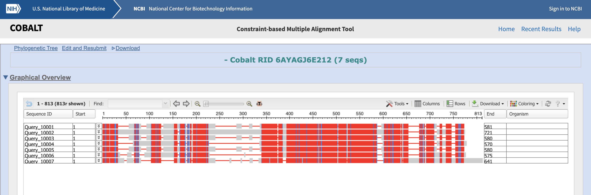
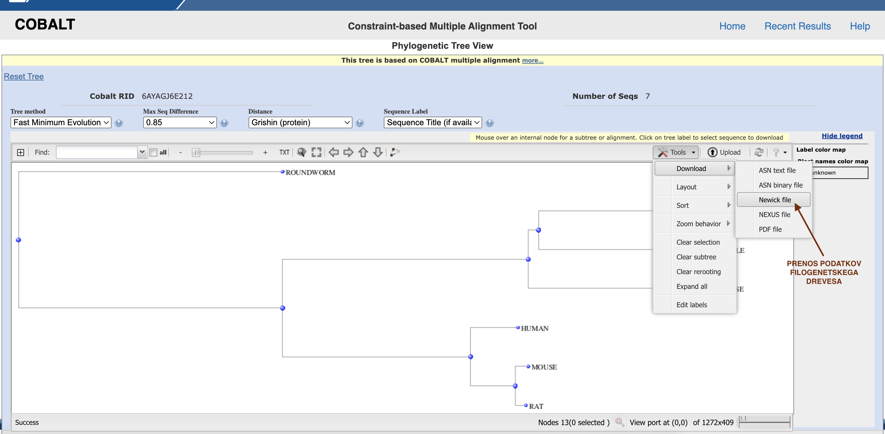

# COBALT

**Avtorja**: Petja Preml, Pia Mencin

**Datum predstavitve**: 2022-04-28 

---
## Namen vaje

Naučiti se uporabljati programom COBALT ter presoditi za katere vhodne podatke je uporaba programa primerna. 

---
## Program

Program: **[Papadopoulos JS and Agarwala R (2007) COBALT](https://www.ncbi.nlm.nih.gov/tools/cobalt/cobalt.cgi)**

Avtorji programa: Jason S. Papadopoulos, Richa Agarwala; National Center for Biotechnology Information (**[NCBI](https://www.ncbi.nlm.nih.gov/)**), National Institutes of Health (NIH), Department of Health and Human Services 

Reference: 
Papadopoulos JS, Agarwala R. (2007) **COBALT: constraint-based alignment tool for multiple protein sequences.** *Bioinformatics* 23, 1073–1079. [10.1093/bioinformatics/btm076](https://academic.oup.com/bioinformatics/article/23/9/1073/272774)

### Opis programa
COBALT omogoča poravnavo več aminokislinskih zaporedij. Temelji na iskanju ohranjenih proteinskih domen in lokalnih podobnostmi med vhodnimi zaporedji. 
V prvem koraku vsakemu izmed vhodnih zaporedij ustvari profil (PSSM), ki bo služil za nadaljnjo poravnavo. Začetni profil ustvari se na podlagi primerjave vsakega vhodnega zaporedja z: motivi v zbirki CDD, parnih lokalnih poravnav vhodnih zaporedij ter omejitev, ki jih vnese uporabnik. Kasneje v fazi izpopolnjevanja se izvede še iskanje motivov po zbirki PROSITE (izvedeno s PSI-BLAST). CDD je zbirka s profili, ki izhajajo iz poravnanih družin proteinoov. RPS-BLAST išče po CDD zbirki, in poda profil, ki se ujema s podanim zaporedjem. Nato se izvede parna lokalna poravnava vhodnih zaporedij s BLAST-P. 
Predhodno izračunane profile COBALT nato primerja v parih, čemur sledi izračun matrike razdalj na podlagi narejenih profilov iz prejšnjega koraka. Iz omenjene matrike se z metodo združevanja sosedov (neighbour-joining) naredi vodilno drevo. Sledi progresivna poravnava več zaporedij po navodilu vodilnega drevesa in nato še izpopolnjevanje.

Program nam ne vrne vedno najboljše poravnave. Primeren je za primerjavo podobnih zaporedij približno enake dolžine. Če se naša vhodna zaporedja zelo razlikujejo lahko spremenimo določene paramentre poravnave: zmanjšamo velikost primerjalnih k-terk, kazen za odpiranje vrzeli ali povišamo E vrednost (omejitev za delovanje BLAST-P pri parni lokalni poravnavi).

### Vhodni podatki

Kot vhodne podatke lahko v program vnesemo accession code iz UniProt-a ali FASTA zaporedja proteinov. 

---
## Navodila

### Vhodni podatki
Kot vhodne podatke v COBALT vstavite [fasta dokument](https://github.com/mpavsic/biokeminfo/blob/main/biokeminfo/seminar/s09-cobalt-vhod1.txt), ki vsebuje aminokislinska zaporedja proteina PINK1 iz sedmih različnih organizmov: človeka, vinske mušice, miši, riževega mokarja, podgane in bele uši.

### Postopek dela
1. Odpremo program, do katerega dostopamo na naslovu: [COBALT](https://www.ncbi.nlm.nih.gov/tools/cobalt/cobalt.cgi) ter vnesemo vhodne podatke. 

2. Na  glavni  strani  se  nahaja  okno,  kamor  se  vstavi  zaporedje  FASTA  (prilepimo  ali vstavimo datoteko), lahko pa vstavimo kode zapisa (accession code). 

3. Glede  na  to  kaj iščemo  oz.  kakšna  zaporedja  vstavimo  si  lahko  nastavimo  še  dodatne parametre, ampak jih v našem primeru niti ne potrebujemo. COBALT nam vrne poravnave zaporedij. Na dnu strani nam vrne rezultate, kje se nahaja poravnava aminokislinskih zaporedij. V osnovni nastavitvi so poravnave pobarvane glede na ohranjenost. Z nastavitvijo Identity se identične aminokisline obarvajo rdeče. 

Na vrhu pa je predstavljena še grafično.

5. Na   vrhu strani   pa   lahko   kliknemo   tudi   na Phylogenetic Tree, ki nam predstavi še filogenetsko drevo. 

6. Podatke filogenetskega drevesa si lahko prenesemo.

7. Pridobljeno filogenetsko drevo bomo primerjali s filogenetskim drevesom pridobljenim s programom MUSCLE. To pomo storili tako da bomo obe drevesi primerjali  s [Phylo.io](https://phylo.io/) Vanj vnesemo podatke obeh filogenetskih dreves. Da vam bo lažje so [tukaj](https://github.com/mpavsic/biokeminfo/blob/main/biokeminfo/seminar/s09-cobalt-tree.nwk) in [tukaj](https://github.com/mpavsic/biokeminfo/blob/main/biokeminfo/seminar/s09-muscle-tree.nwk) podatki filogenetskega drevesa narejenega v COBALTU in  podatki filogenetskega zaporedja istih zaporedij  v programu MUSCLE.

### Pričakovani rezultati in razlaga
Pričakujemo poravnavo, ki nam bo dala zadostne podatke, na osnovi katerih bomo naredili hipotezo o evolucijski zgodovini. Oceno pravilnosti bomo izvedli s primerjavo filogenetskega drevesa narejenega na podlagi programa MUSCLE. Za primerjavo smo si izbrali prav ta program, saj menimo, da nam bo njegov učinkovitejši algoritem zagotovil ustrezno primerjavo za analizo podatkov pridobljenih z našim programom. 
Če primerjamo filogenetski drevesi iz poravnav dobljenih s programoma COBALT in MUSCLE, ugotovimo, da je potek dreves enak, evolucijske razdalje med zaporedji pa se razlikujejo. Razdalje v filogenetskem drevesu osnovanem na podlagi podatkov pridobljenih s programom MUSCLE so veliko krajše, kar je bolj smiselno saj so podana zaporedja ortologna. 

Ob delu s programom COBALT smo prišli do zaključka, da je primeren za poravnavo podobnih zaporedij, saj le v tem primeru dobimo ustrezne rezultate. To smo sklepali na podlagi primerjave s programi s kompleksnejšimi algoritmi (npr. MUSCLE), ki nam dajo boljše rezultate, a vseeno niso absolutno merilo za učinkovitost poravnave.