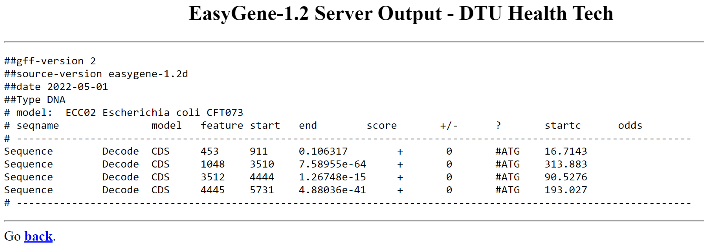

# EasyGene - napovedovanje prokariontskih genov

**Avtorja**: Nik Vidmar, Gašper Struna 

**Datum predstavitve**: 2022-5-4

---
## Namen vaje
Spoznati se s spletnim orodjem EasyGene. S pomočjo tega orodja napovedati gene v delu prokariontskega genoma.

---
## Program

Program: **[EasyGene 1.2](https://services.healthtech.dtu.dk/service.php?EasyGene-1.2)**

Avtorji programa: Thomas Schou Larsen, Anders Krogh; [Technical University of Denmark](https://www.dtu.dk/)

Reference:
- Nielsen P, Krogh A. **Large-scale prokaryotic gene prediction and comparison to genome annotation. Bioinformatics.** 2005;21: 4322–4329. [10.1093/bioinformatics/bti701](https://doi.org/10.1093/bioinformatics/bti701)
- Larsen TS, Krogh A. **EasyGene--a prokaryotic gene finder that ranks ORFs by statistical significance.** BMC Bioinformatics. 2003;4: 21. [10.1186/1471-2105-4-21](https://doi.org/10.1186/1471-2105-4-21)

### Opis programa

Vsak genom poleg pravih genov vsebuje tudi odprte bralne okvire (ORF), ki ne kodirajo ničesar. Prave gene moramo znati ločiti od naključnih ORF in eden izmed programov, ki ga lahko uporabljamo za napovedovanje genov pri prokariontih je EasyGene.

EasyGene uporablja skrite modele Markova (HMM) za določanje, identifikacijo genov. Program vsebuje set podatkov za genome 138 prokariontov, izmed the izberemo modelni organizem, ki je najbolj soroden ali pa kar identičen organizmu, iz katerega prihaja izbrano zaporedje. Na podlagi genoma izbranega organizma program oceni HMM. S to oceno potem ovrednoti najdene ORF v podanem zaporedju. Za vsak ORF izračuna R-vrednost. To je pričakovano število ORF, ki bi jih našli v 1 Mbp velikem naključnem zaporedju. Na koncu program poda le gene, ki imajo R-vrednost nižjo od te, ki smo jo izbrali. Izračuna pa tudi verjetnosti, da se nek gen začne pri določenem nukleotidu. Pri končnem izpisu upošteva le izhodišča z največjimi verjetnostmi.

EasyGene poda dobre rezultate (prave lokacije posameznih genov) pri prokariontih, če seveda izberemo pravi modelni genom. Ob nepravi izbiri so rezultati napačni, saj ocena HMM ni primerna zaradi napačne izbire modelnega genoma. Ker so med modelnimi organizmi le prokarionti program ni primeren za evkariontske organizme, saj ocena HMM ne bi bila ustrezna. Prednost tega programa je tudi, da za vsak nukleotid izračuna verjetnost, da se tam začne gen. S tem daje ustrezne rezultate tudi za genome, ki vsebujejo prekrivajoče se gene, kar se pri prokariontih pogosto pojavlja. Problem tega programa pri prokariontih so krajši geni (geni krajši od 100 nt). Pri ekstrakciji genov iz genomov modelnih organizmov, ki jih nato uporabi za oceno HMM in izračun R-vrednosti, so namreč upoštevali le ORF daljše od 120 baz.

### Vhodni podatki

Nukleotidno zaporedje v FASTA-zapisu.

---
## Navodila

### Vhodni podatki
Kot vhodne podatke uporabite:
-	nukleotidno zaporedje dela genoma bakterije *Escherichia coli* CFT073 (GenBank ID [AE014075.1](https://www.ncbi.nlm.nih.gov/nuccore/AE014075.1)) - od 1 do 5800 nt
- nukleotidno zaporedje dela genoma bakterije *Thermoanaerobacter tengcongensis* MB4 (GenBank ID [AE008691.1](https://www.ncbi.nlm.nih.gov/nuccore/AE008691.1)) - od 1 do 9700 nt

### Postopek dela

1.	Odpremo EasyGene - 1.2
2.	V okno prilepimo nukleotidno/a zaporedje/a v FASTA ali enočrkovnem formatu ali naložimo datoteko.
3.	Če izbrana zaporedja pripadajo prokariontskemu organizmu, si izberemo ustrezen orgnizem, da preprečimo iskanje tipov nukleotidnih zaporedij, ki jih pri teh organizmih ni. V primeru, da zaporedje ni prokariontsko in včasih v primeru, da nismo izbrali pravega organizma ne dobimo uporabnih rezultatov.
4.	Nato si izberemo R. Najbolje je, da je za krajša zaporedja manj od 2 in za dolga manj od 60. Lahko pa tudi obkljukamo polje **»Predict suboptimal gene starts«**, ki nam poda večje število rezultatov, vendar pa je njihova zanesljivost nižja.
5.	Potem zaženemo program s klikom gumba »submit« in počakamo na rezultate.

### Pričakovani rezultati in razlaga

Program nam izpiše rezultate v obliki tabele.
**Seqname** v tabeli nam pove ime vnosnega zaporedja, **model** pomeni kodo modela organizma, **feature** predstavlja predvideno funkcijo 'CDS' ali 'CDSsub' (alternativni začetek prevoda) **start** in **end** nam povesta položaja v zaporedju, kjer se gen začne in konča.
**score** je najpomembnejši del  tabele in je R-vrednost, ki kaže, kako verjetno je, da je fragment le nekodiran odprt bralni okvir in ne pravi gen (manjši kot je »**score** boljše je). **strand** je lahko '+' ali '-' (- je za gene, ki se nahajajo na drugi verigi, na komplementarnem zaporedju), **startc** napove predviden začetni kodon, **odds** pa večji kot je večja je verjetnost, da je izbrani start kodon res pravi. 

Najdeni geni za *Thermoanaerobacter tengcongensis* MB4 so glede na anotacije v zbirki pravilni. Zadnji trije geni se nahajajo na komplementarni verigi, 4. in 8. gen imata alternativna start kodona TTG oziroma GTG, start kodon na 7924. mestu in stop kodon s koncem na 7927. mestu se prekrivata.

*Escherichia coli* CFT073 vsebuje na mestih od 190 do 255 kratek gen, ki ga EasyGene sploh ne zapiše. Kljub upoštevanju alternativnih start kodonov, tudi Easy Gene v določenih primerih naredi napako in vseeno preferenčno izbere ATG. To vidimo pri prvem in drugem izpisanem genu, kjer je izbral napačno mesto začetka gena, napačen start kodon. Prvi gen se začne glede na anotacije v GenBanku na 534. mestom (start kodon GTG), drugi pa na 985. mestu (start kodon TTG). Preostala dva gena se skladata z označbo v GenBanku.