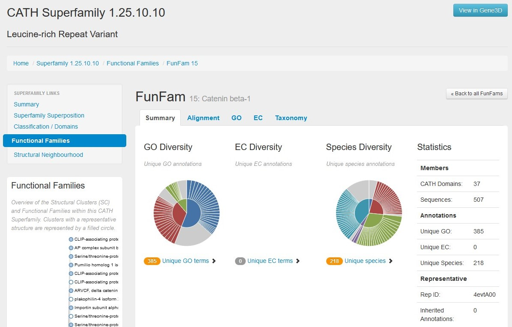

# CATH: Protein Structure Classification Database

**Avtorja**: Ivana Vukšinić, Zarja Weingerl

**Datum predstavitve**: 2022-05-11

---
## Namen vaje

Naučili se bomo uporabljati brskalnik CATH, ki na podlagi podatkov o aminokislinskem zaporedju in strukturi iskanega proteina, klasificira njegove domene in jih uvrsti v posamezne naddružine glede na njihovo evolucijsko sorodnost.

---
## Program

Program: **[CATH-Plus 4.3.0](https://www.cathdb.info/)**

Avtorji programa: I. Sillitoe, N. Dawson, T. Lewis, D. Lee, J. Lees, C. Orengo - [Orengo Group, UCL](https://www.ucl.ac.uk/orengo-group/) 

Reference:
- Sillitoe, I.; Bordin, N.; Dawson, N.; Waman, V.P.; Ashford, P.; Scholes, H.M.; Pang, C.S.M.; Woodridge, L.; Rauer, C.; Sen, N.; Abbasian, M.; Le Cornu, S.; Lam, S.D.; Berka, K.; Varekova, I.H.; Svobodova, R.; Lees, J.; Orengo, C.A. (2021) **CATH: increased structural coverage of functional space.** *Nucleic Acids Res.* [doi: 10.1093/nar/gkaa1079](https://academic.oup.com/nar/article/49/D1/D266/6006195?login=false)
- Lewis, T.E.; Sillitoe, I.; Dawson, N.; Lam, S.D.; Clarke, T.; Orengo, C.A.; Lees, J.G. (2018) **Gene3D: Extensive prediction of globular domains in proteins.** *Nucleic Acids Res.* [doi: 10.1093/nar/gkx1069](https://academic.oup.com/nar/article/46/D1/D435/4588111?login=false)

### Opis programa

Podatkovno zbirko CATH so ustvarili raziskovalci skupine Orengo na univerzi UCL, leta 1997. Ponuja informacije o evolucijskih odnosih med proteinskimi domenami.

Uporablja semi-avtomatski postopek, s katerim 3D strukture, pridobljene iz podatkovne zbirke PDB, razcepi na polipeptidne verige, znotraj teh pa nato identificira posamezne domene. Te klasificira po naslednji hierarhiji: 

- **C**: *Class* (razvrščanje na podlagi sekundarne strukture: pretežno α, pretežno β, α/β, malo sekundarne strukture)
- **A**: *Architecture* (razporeditev glede na orientacijo sekundarnih struktur v 3D prostoru)
- **T**: *Topology/fold* (sosledje elementov sekundarnih struktur)
- **H**: *Homologous superfamily* (razvrščanje glede na evolucijsko sorodnost).

Če najde iskani domeni evolucijsko sorodne (homologne) domene, jo uvrsti v ustrezno homologno naddružino.
Poleg tega klasificira tudi domene znotraj proteinskih zaporedij z do sedaj nepotrjeno 3D strukturo. Podatke o zaporedjih pridobi s pomočjo pomožnega programa Gene3D.

Z uporabo algoritma SSAP se za vsako naddružino izdela superpozicija vseh reprezentativnih proteinskih domen. Predstavniki iste naddružine si delijo ohranjeno strukturno jedro, kar pa ne pomeni, da opravljajo tudi enako funkcijo. Zato so razvili klasifikacijski protokol FunFams, ki dodatno razvršča naddružine v funkcionalno koherentne skupine. Predstavniki iste funkcionalne družine imajo podobno strukturo in funkcijo.

### Vhodni podatki

Ključne besede, PDB koda, GO termini, aminokislinsko zaporedje v FASTA formatu ali PDB datoteka. 

---
## Navodila

### Vhodni podatki

Kot vhodne podatke uporabite:
- aminokislinsko zaporedje ponovitve ARM leopardjega β-katenina z neznano strukturo (*β-catenin*, UniProt ID: [A0A6P4THW0](https://www.uniprot.org/blast/?about=A0A6P4THW0[151-191]&key=Repeat))
- aminokislinsko zaporedje domene SH3 človeškega Ras GTPazo aktivirajočega proteina 1 (*Ras GTPase-activating protein 1*, UniProt ID: [P20936](https://www.uniprot.org/blast/?about=P20936[279-341]&key=Domain))

### Postopek dela

1. Odpremo **[CATH-Plus 4.3.0](https://www.cathdb.info/)**.
2. Pritisnemo *Search*, nato pa izberemo *Search by Sequence*.
3. V okno prilepimo aminokislinsko zaporedje v FASTA formatu in poženemo iskanje. Program hkrati išče sorodne domene in pripadajoče funkcionalne družine (FunFams). 

### Pričakovani rezultati in razlaga

Najprej si poglejmo najdene domene (*Matching Domains*): te so razvrščene po naraščajoči E vrednosti (izberemo prvo domeno z najmanjšo E vrednostjo, ki se z našo domeno najbolj ujema). 

Pod *Summary* je prikazana klasifikacija naše domene. Vidimo, da jo je uvrstil v arhitekturo α-podkev, v naddružino proteinov s ponovitvami, bogatimi z levcini (1.25.10.10), kar se sklada s podatki iz UniProta. Prikaže se struktura sorodne domene, v tem primeru človeškega β-katenina. Na podlagi te domene se pod *Neighbourhood* izriše graf, ki prikazuje še druge domene iste naddružine, razporejene glede na podobnost v strukturi in zaporedju.

Pod rezultati iskanja *Matching FunFams* izberemo najbolj verjetno funkcionalno družino (15: Catenin beta-1). Prikaže se nam struktura njene reprezentativne domene, anotirani GO in EC termini ter taksonomija vseh znanih domen znotraj te funkcionalne družine.