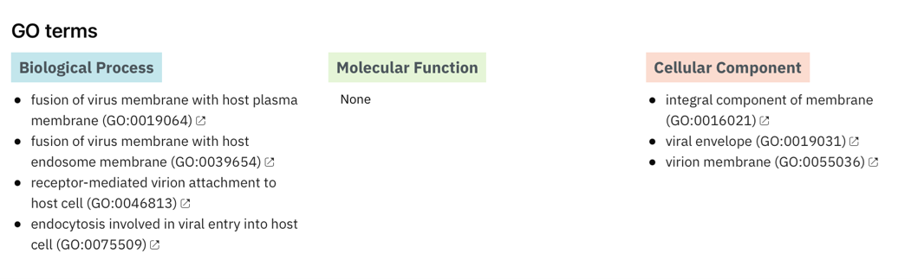

# Klasifikacija proteinov z InterPro

**Avtorja**: Neža Peternel, Pia Sotlar

**Datum predstavitve**: 2022-04-20

---
## Namen vaje
Namen vaje je spoznati osnove uporabe programa InterPro, ki se uporablja za klasifikacijo proteinov v družine in primerjavo različnih lastnosti, kot so domene, iz različnih podatkovnih baz. Pri vaji se bomo naučili interpretirati podatke, ki nam jih program vrne za iskani protein. Seznanili se bomo tudi s funkcijo obratnega iskanja proteinov po domenah in s tem preverili, koliko drugih proteinov vsebuje enake domene kot naš izhodni protein. 

---
## Program

Program: **[InterPro 88.0](https://www.ebi.ac.uk/interpro/)**

Avtorji programa: Alex Bateman, [European Bioinformatics Institute, Cambridge, UK](https://www.ebi.ac.uk/)

Reference:
- Blum, M.; Chang, H.; Chuguransky, S.; Grego, T.; Kandasaamy, S.; Mitchell, A.; Nuka, G.; Paysan-Lafosse, T.; Qureshi, M.; Raj, S.; Richardson, L.; Salazar, G.A.; Williams, L.; Bork, P.; Bridge, A.; Gough, J.; Haft, D.H.; Letunic, I.; Marchler-Bauer, A.; Mi, H.; Natale, D.A.; Necci, M.; Orengo, C.A.; Pandurangan, A.P.; Rivoire, C.; Sigrist, C.J.A.; Sillitoe, I.; Thanki, N.; Thomas, P.D.; Tosatto, S.C.E.; Wu, C.H.; Bateman, A. and Finn, R.D. (2020) **The InterPro protein families and domains database: 20 years on.** *Nucleic Acids Research.* [10.1093/nar/gkaa977](https://doi.org/10.1093/nar/gkaa977)

### Opis programa

InterPro je sekundarna podatkovna zbirka, ki zbira in obdeluje podatke iz trinajstih različnih podatkovnih baz (npr. CATH, PANTHER, PFAM). Ker pa večina od teh baz črpa podatke direktno iz primarnih podatkovnih baz (npr. UniProt), lahko rečemo, da je InterPro tudi terciarna podatkovna zbirka.
Na podlagi podatkov iz prej omenjenih podatkovnih baz InterPro analizira proteinska zaporedja. Ker vsaka se vsaka podatkovna baza osredotoča na določeno klasifikacijo, InterPro te podatke zbere in posamezne proteine razporeja v družine ter napoveduje domene in različna pomembna mesta v samem proteinu. Proces je prikazan na spodnji shemi:

Rezultate prikaže v shematski obliki, kjer so združeni podatki iz različnih dostopnih podatkovnih baz, kar omogoča neposredno primerjavo klasifikacije iskanega proteina. Med rezultati najdemo družine, domene, homologne superdružine, ponavljajoče regije, aktivna in vezavna mesta. Posebna prednost programa so tudi t.i. gensko ontološki termini, ki ponujajo hiter vpogled v samo funkcijo proteina, sodelovanje pri bioloških procesih in morebitno nahajanje v različnih celičnih organelih. Primer izpisa rezultatov je prikazan spodaj:

Pri nekaterih proteinih program ponuja tudi iskanje podobnih proteinov in s pomočjo programa AlphaFold izriše predvideno zvitje proteina. 

Program je primeren bolj ali manj za vsa aminokislinska zaporedja različnih organizmov, saj deluje na podlagi široke palete podatkovnih baz, ki vsebujejo podatke o najrazličnejših lastnostih proteinov.

### Vhodni podatki

Iskanje lahko poteka na več različnih načinov:
* z navedbo aminokislinskega zaporedja v FASTA formatu,
* preko kode za dostop določenega proteina,
* preko imena družine, domene, ali super družine,
* preko ključnih besed ali GO terminov,
* preko nahajanja domen.

---
## Navodila

### Vhodni podatki

Kot vhodne podatke uporabite:
- aminokislinsko zaporedje A verige govejega alfa-kristalina (UniProt ID [P02470](https://www.uniprot.org/uniprot/P02470)) 
- kodo za dostop človeške od ATP odvisne helikaze DHX30 (UniProt ID [Q7L2E3](https://www.uniprot.org/uniprot/Q7L2E3#family_and_domains))

### Postopek dela

Do programa InterPro dostopamo na naslovu: [https://www.ebi.ac.uk/interpro/](https://www.ebi.ac.uk/interpro/). Na glavni strani se nahaja okno za iskanje preko aminokislinskega zaporedja, kjer kopiramo zaporedje FASTA (oziroma okno za iskanje preko imen proteinov ali arhitekture domen). Za vhodne podatke, ki so navedeni zgoraj ugotovite:
1. Kakšne rezultate vrne program?
2. Iz koliko različnih podatkovnih baz je InterPro zbral podatke za informacije o družinah in domenah?
3. Kakšne funkcije ima določen protein?

Za prvi primer poišči še naslednje podatke:
1. Katere domene predalaga InterPro?
2. Koliko proteinov vsebuje te iste domene v enakem vrstnem redu in na enakih mestih nahajanja? (*Namig: izpiši kode za domene, ki jih predlaga InterPro in jih vnesi v polje za iskanje preko arhitekture domen - pazi na vrstni red in pravilne nastavitve*)

### Pričakovani rezultati in razlaga

Pričakujemo, da nam bo program vrnil podatke o družini, domenah, homolognih super družinah, itd. Če pa uporabimo funkcijo povratnega iskanja (vnesemo dane domene nazaj v iskanje pod zavihkom arhitektura domen) pa pričakujemo, da bo program vrnil vse proteine z vsebovanimi domenami, med katerimi bo tudi naš protein.

Ker program deluje na osnovi množice podatkovnih baz, so rezultati v veliki večini primerov pravilni. Včasih pa se vseeno zgodi, da v rezultatih družina ni napovedana, ampak jo lahko predvidimo iz podanih domen.

