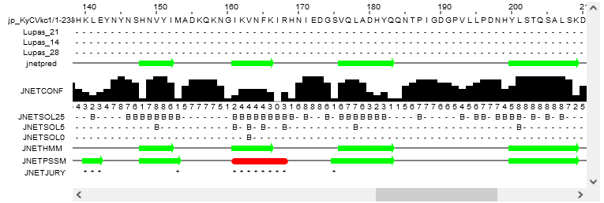

# Jpred4 - napovedovanje sekundarne strukture proteinov

**Avtorja**: Alliana Kolar, Lana Kores

**Datum predstavitve**: 2022-05-18

---
## Namen vaje
Spoznati program Jpred4, s katerim lahko napovemo sekundarno strukturo proteina, poleg tega pa tudi lahko predvidimo dostopnost topil in regije ovitih vijačnic. 

---
## Program

Program: **[Jpred v.4](https://www.compbio.dundee.ac.uk/jpred/)**

Avtorji programa: Drozdetskiy A., Cole C., Procter J., Barton G.J. - [University of Dundee](https://www.dundee.ac.uk/)

Reference:
- Drozdetskiy A.; Cole C.; Procter J.; Barton G.J. (2015) **JPred4: a protein secondary structure prediction server.** *Nucleic Acids Research.* Volume 43, Issue W1, W389–W394. [10.1093/nar/gkv332](https://academic.oup.com/nar/article/43/W1/W389/2467870?login=false)

### Opis programa

Jpred4 je najnovejša različica programa Jpred za napovedovanje sekundarne strukture, ta pa poleg tega napove tudi dostopnost topil, za določanje hidrofobnih regij, in regije ovitih vijačnic. To vse nam omogoča algoritem JNet 2.0, katerega napovedovanje temelji na delovanju nevronske mreže. Ta je bil usposobljen za izdelavo JNet 2.3.1, ki 7-krat navzkrižno potrdi zaporedje domene naddružine, ki jo predstavlja eno zaporedje. Zaporedja domen 1358 naddružin so pridobljene iz podatkovne zbirke SCOPe/ASTRAL v.2.04. 

V program lahko vnesemo neko aminokislinsko zaporedje, ta pa nam predvidi sekundarno strukturo, ki je prisotna v našem zaporedju, s pomočjo PSI-BLASTa, ki naredi poravnavo več homolognih zaporedij. Lahko pa vnesemo tudi poravnavo več zaporedij in s pomočjo le-teh napove sekundarno strukturo prvotnega zaporedja. Natančnost programa za napovedovanje sekundarne strukture je ocenjena kot 82,0 %, dostopnost topil pa od 78,1 % do 90,0 %, odvisno od meje dostopnosti topila.

Pozorni moramo biti na to, če želimo v program vnesti poravnavo več zaporedij, saj moramo zaporedja vnesti tako, da vanj naložimo datoteko (ne smemo vtipkati ločena aminokislinska zaporedja). V nasprotnem primeru se lahko program zmede. Če pa želimo vnesti eno aminokislinsko zaporedje, pa lahko preprosto prilepimo kopirano enočrkovno zaporedje. Program deluje dokaj hitro, vendar je vse odvisno od tega, ali smo vnesli več zaporedij in kako dolga so ta zaporedja. Vnesemo lahko minimalno 20 in maksimalno 800 aminokislinskih ostankov.

### Vhodni podatki

eno aminokislinsko zaporedje (FASTA, Batch mode)
poravnava več aminokislinskih zaporedij (FASTA, BLC, MSF)

---
## Navodila

### Vhodni podatki

Kot vhodne podatke bomo uporabili:
- aminokislinsko zaporedje zelenega fluorescenčnega proteina iz meduze Aequorea victoria (GFP, uniProt ID: [P42212](https://www.uniprot.org/uniprot/P42212.fasta))
- naključno generirano aminokislinsko zaporedje z uporabo ExPASy tool RandSeq:

ASQGKTIETPNSQVVSTLPFFGLKSKVVYFGDSLEDRRPAWATRINLIDNELSILKNKLK
RIHLARLRNVHLNVQPTFLELGEVKVEGCGDDSGTARLIWESYMDAEDPAFQCAAMMSLM
PFIHGVEKIGQAKRGAVYDQASPEGITLYT

### Postopek dela

1. Odpremo program [Jpred4](http://www.compbio.dundee.ac.uk/jpred4/index.html).
2. Kliknemo na gumb 'advanced options', da se nam pojavijo skrita polja. Za to vajo bomo uporabili privzete nastavitve, torej kot vhodne podatke izberemo Single Sequence v formatu Raw/Fasta.
3. V okno vnesemo izbrano aminokislinsko zaporedje in kliknemo na gumb 'Make Prediction'. (Če smo pri prejšnjem koraku izbrali Multiple Alignment ali pa format Batch Mode moramo vhodne podatke naložiti kot datoteto, pri Batch Mode pa moramo dodati še naš elektronski naslov).
4. Program najprej izvede PSI-BLAST in nam ponudi zadetke podobnih zaporedij v PDB z že znano sekundarno strukturo. Ker vseeno želimo napoved z Jpred, kliknemo na gumb 'continue'. Rezultate za kratka zaporedja ponavadi dobimo že v nekaj trenutkih.

### Pričakovani rezultati in razlaga

Končno napoved sekundarne strukture dobimo v vrstici jnetpred. Rdeča barva predstavlja helikse, zelena puščica pa beta ploskve.
Program je sicer zelo enostaven za uporabo, vendar sekundarne strukture ne določi 100% točno in zato ni najbolj primeren za aminokislinska zaporedja, za katera ne poznamo nobenih drugih homolognih zaporedij z znano sekundarno strukturo za primerjavo.
