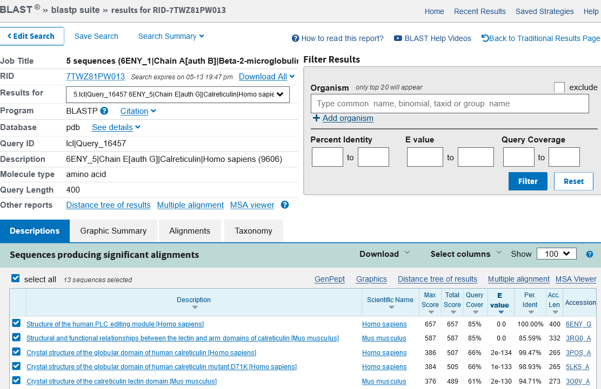

# VAST+ - iskanje podobnih makromolekulskih kompleksov

**Avtorja**: Ana Maučec, Gašper Možina

**Datum predstavitve**: 2022-05-18

---
## Namen vaje
Namen vaje je poiskati makromolekule s podobnimi 3D strukturami s programom VAST+ s poudarkom na podobni biološki enoti in rezultate primerjati z iskanjem zgolj z aminokislinskim zaporedjem z uporabo BLAST-a po zbirki pdb.

---
## Program

Program: **[VAST+](https://www.ncbi.nlm.nih.gov/Structure/vastplus/vastplus.cgi)**

Avtorji programa: Madej T, Lanczycki CJ, Zhang D, Thiessen PA, Geer RC, Marchler-Bauer A, Bryant SH, National Center for Biotechnology Information, U.S. National Library of Medicine, National Institutes of Health (https://www.ncbi.nlm.nih.gov/)  

Reference:
- Madej, T., Lanczycki, C. J., Zhang, D., Thiessen, P. A., Geer, R. C., Marchler-Bauer, A., & Bryant, S. H. (2014) **MMDB and VAST+: tracking structural similarities between macromolecular complexes.** *Nucleic acids research* 42, D297–D303. [10.1093/nar/gkt1208] (https://doi.org/10.1093/nar/gkt1208)
- Thomas Madej, Aron Marchler-Bauer, Christopher Lanczycki, Dachuan Zhang, Stephen H Bryant **Biological Assembly Comparison With VAST** *Methods Mol. Biol.* 2020(2112):175-186. [ 10.1007/978-1-0716-0270-6_13 ] (https://link.springer.com/protocol/10.1007/978-1-0716-0270-6_13)

### Opis programa

VAST+ (*Vector Alignment Search Tool Plus*) je programsko orodje namenjeno iskanju podobnih makromolekulskih kompleksov.  Podobnosti med strukturami se izračunajo izključno na podlagi geometrijskih meril brez upoštevanja aminokislinskih zaporedij, kar orodju VAST+ omogoča prepoznavanje oddaljenih homologov. Zgrajen je na podlagi orodja VAST (*Vector Alignment Search Tool*), ki je namenjen iskanju proteinov in posameznih domen s podobno 3D strukturo. VAST+ njegove zmožnosti razširja, saj je z njim možno določiti strukture, ki imajo podobno oblikovane biološke enote. VAST+ torej uporabljamo za določevanje proteinskih kompleksov z enako ali podobno oligomerno strukturo, za primerjanje komformacij istega oligomera v različnem stanju (npr. oxy- in deoxyhemoglobin) in za primerjavo vezavnih vmesnih površin.

Algoritem VAST+ gradi na razultatih algoritma VAST, lahko pa bi temeljil tudi na kakšnem drugem programu za primerjavo struktur proteinov. VAST najprej identificira posamezne elemente sekundarne strukture in jih predstavi kot vektorje ter primerja matrike koordinat vektorjev med vsemi strukturami v MMDB (Molecular Modeling Database). VAST+ nato identificira vse možne pare proteinov iz ene in druge strukture in ju primerja. Nato izračuna kakšni koti rotacije so potrebni za superpozicijo teh dveh struktur in združi v skupke pare proteinov s podobnim kotom rotacije. Poravnavo največjega skupka uporabi za to, da generira superpozicijo oligomerov. Zatem izračuna vrednost RMSD (koren povprečne vrednosti kvadratov razlik). Izračunan RMSD uporabi kot prag za identifikacijo aminokislinskih ostankov z najbolj podobno 3D pozicijo, jih poravna in na podlagi tega kriterija prikaže superpozicijo primerjanih makromolekulskih kompleksov.

To orodje nam ne da zadetkov, če v strukturi ni prisotne nobene proteinske molekule ali ima ta manj kot tri sekundarne strukture, če struktura nima definirane biološke enote ali pa v primeru, da za kakšne na novo dodane strukture še niso določena VAST+ "sosedja".

### Vhodni podatki

Kot vhodne podatke v program vnesemo idenetifikatorja Protein Data Bank (PDB) ID ali Molecular Modeling Databaste (MMDB) ID.

---
## Navodila

### Vhodni podatki

- kristalna struktura mačje mišične M1 piruvat kinaze (PDB ID [1PKM](10.2210/pdb1PKM/pdb)) 
- struktura človeškega PLC-urejevalnega modula, določena s krioelektronsko mikroskopijo (PDB ID [6ENY](https://www.rcsb.org/structure/6ENY))

### Postopek dela

Iskanje podobnih struktur preko aminokislinskega zaporedja s programom BLAST (blastp):
1. Odpremo program [BLAST](https://blast.ncbi.nlm.nih.gov/Blast.cgi) in izberemo možnost blastp.
2. V okence prilepimo aminokislinsko zaporedje proteina v FASTA formatu.
3. V okencu "Database" izberemo možnost Protein Data Bank proteins(pdb).
4. Kliknemo na gumb BLAST in začnemo iskanje.

Iskanje podobnih makromolekulskih kompleksov s programom VAST+:
1. V spletni iskalnik napišemo VAST+ ali odpremo [povezavo](https://www.ncbi.nlm.nih.gov/Structure/vastplus/vastplus.cgi)
2. V okence vpišemo želeno kodo PDB ID ali MMDB ID. Če nas zanima več o orodju in njegovi uporabi, lahko kliknemo na modro obarvan napis "more".
3. Kliknemo na gumb "Search".

### Pričakovani rezultati in razlaga

Zgoraj imamo prikazane informacije o strukturi poizvedbe. Proteini v kompleksu so poimenovani in predstavljeni z grafičnim prikazom in 3d vizualizacijo. Orodje nam poda dobljeno število podobnih struktur in ponudi možnost iskanja z osnovnim orodjem VAST. Izbiramo lahko tudi med različnima tipoma prostorske poravnave: "All matching molecules superposed" (prekrivajo se vse molekule) ali "Invariant substructure superposed" (prekrivajo se tiste AK z najbolj podobnim prostorskim položajem v obeh strukturah). VAST+ omogoča filtriranje rezultatov glede na število ujemajočih se proteinov in glede na taksonomijo. Izbor filtrov potrdimo s klikom na "Apply Filter Selection".

Spodnji seznam prikazuje strukture uvrščene glede na stopnjo podobnosti z biološko enoto naše poizvedbe. Kot kriterij razvrščanja rezultatov lahko izberemo:
    - število ujemajočih se proteinov,
    - RMSD (povprečna razdalja med aminokislinskimi ostanki poravnanih kompleksov)
    - število poravnanih aminokislinskih ostankov in
    - število poravnanih identičnih aminokislinskih ostankov.
Izbran kriterij je obarvan z zeleno, izberemo pa ga s klikom na puščici ob njegovem napisu. Če bi nas zanimala podobnost posameznega proteina/kompleksa z našim kompleksom, lahko uporabimo možnost **iskanja znotraj rezultatov** - vpišemo PDB ID/MMDB ID poljubnega proteina in če je le ta na seznamu, ga program avtomatsko prikaže. Ob želenem kompleksu kliknemo na znak "+".

Odpre se nam zavihek z grafičnima primerjavama našega in ujemajočega se oligomera. Vsak protein (prikaz s krogom) je poimenovan in označen s svojo oznako ter barvo. Če z miško kliknemo na posamezen protein, se ta obarva črno, s črno pa se obarva tudi ujemajoč protein pri drugem oligomeru. Za podrobnejši prikaz lahko izberemo vizualizacijo superpozicije primerjanih 3D struktur ali si ogledamo primerjavo poravnanih zaporedij. S klikom na "View aligned sequences" odpremo novo okno s prikazanima poravnanima aminokislinskima zaporedjema. Rdeče velike tiskane črke predstavljajo identične aminokislinske ostanke, modre velike tiskane črke prostorsko poravnane aminokisline, neujemajoče aminokisline pa so napisane z malimi tiskanimi črkami.

Vsak poravnan protein si lahko ogledamo tudi v 3D prostorski poravnavni (vse molekule/invariantne aminokisline), prikazani v programu iCn3D.

Pri iskanju podobnih struktur človeškemu PLC-urejevalnemu modulu z blastp po zbirki pdb najdemo proteine, ki se strukturno ujemajo s posameznimi proteini iz tega kompleksa.

S programom VAST+ pa lahko identificiramo makromolekulske komplekse, ki so po strukturi podobni naši iskani biološki enoti, ne samo njenim posameznim delom oz. proteinom. Glede na naš namen te vaje, nam uporaba tega orodja da bolj relevantne rezultate. Vidimo pa lahko, da v nasprotju s prvim primerom ne dobimo popolnih zadetkov (complete match)- ujemanja z vsemi proteini iz kompleksa. To se zgodi zato, ker eden izmed proteinov v tem kompleksu vsebuje premalo sekundarnih struktur (vsebovati mora vsaj 3) in ga zato program ignorira.

