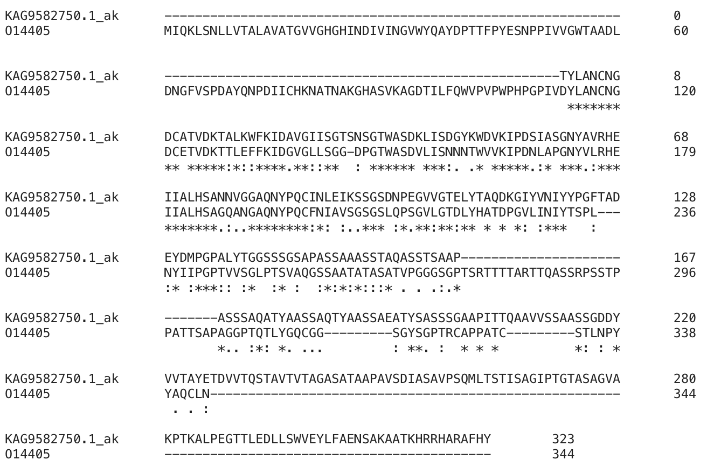

# S00

Spodaj prikazan primer seminarske naloge ne vsebuje odgovorov na vsa vprašanja, ki se nahajajo v predlogi, namen pa je prikazati obliko pričakovanih odgovorov, podkrepljenih z razlagami. Razlaga, zakaj lahko le za del zapisa identificiramo neko statistično signifikantno podobnost z zapisi iz zbirke, je sicer nekoliko bolj izčrpna, kot se od vas pričakuje.

- **Avtor**: Poskusni zajček
- **Datum izdelave**: 2023-05-10
- **Koda seminarja**: S00

---
## Vhodni podatek

Zaporedje:
```
TCGGGAACCAGCAACTCCGGTACTTGGGCTTCCGACAAGCTGATCTCTGATGGCTACAA
GTGGGACGTCAAGATCCCTGACAGCATTGCTTCTGGTAACTACGCTGTTCGTCACGAGA
TCATTGCCCTCCACAGCGCCAACAACGTCGGTGGTGCCCAGAACTACCCTCAATGCATC
AACCTCGAGGTCAAGAGCTCCGGCTCCGACAACCCTGAGGGTGTTGTTGGCACTGAGCT
GTACACTGCCCAGGACAAGGGTATTTACGTCAACATCTACTACCCCGGCTTCACTGCCG
ACGAGTATGACATGCCCGGCCCTGCTCTCTACACCGGTGGCTCTGGCTCTGGCTCTGCT
CCTGCTTCGTCCGCCTCTGCTTCCTCGACTGCCCAGGCCAGTTCGACCTCCGCTGCATC
TGCTTACTCGTCCGCCGCTTCGTCTGCTCAGACCACTTATGCCGCTTCGTCCGCCGAGG
CCTACTCTGCCTCTTCGTCCACTGCTGCTCCCGTCACCACCCAGGCTGCCGTTG
```

---
## Rezultati analiz

### Identifikacija

**Protein**: endoglukanaza (endoglucanase)

**Organizem**: [*Aureobasidium melanogenum*](https://en.wikipedia.org/wiki/Aureobasidium_melanogenum); gre za glivo iz skupine črnim kvasovkam podobnih gliv


**Potencialna funkcija proteina**: cepitev polimera glukoze v sredini polimerne verige

Identifikacija je bila narejena z uporabo NCBI BLAST, varianta blastx (zbirka nr). Značilna podobnost je bila najdena le za približno prvi dve tretjini zaporedja (61 %) in sicer je v tem delu prevedeno zaporedje podobno zaporedju predpostavljene endoglukanaze (99–100 % identičnost, E vrednost < 1e-70).

Tabelarični prikaz zadetkov:


Koda zapisa z BLAST identificiranega proteina: GenBank [KAG9582750.1](https://www.ncbi.nlm.nih.gov/protein/KAG9582750.1); gre za delno zaporedje (*putative endoglucanase, partial*).

Aminokislinsko zaporedje:
```
>KAG9582750.1_ak
TYLANCNGDCATVDKTALKWFKIDAVGIISGTSNSGTWASDKLISDGYKWDVKIPDSIASGNYAVRH
EIIALHSANNVGGAQNYPQCINLEIKSSGSDNPEGVVGTELYTAQDKGIYVNIYYPGFTADEYDMPG
PALYTGGSSSGSAPASSAAASSTAQASSTSAAPASSSAQATYAASSAQTYAASSAEATYSASSSGAA
PITTQAAVVSSAASSGDDYVVTAYETDVVTQSTAVTVTAGASATAAPAVSDIASAVPSQMLTSTISA
GIPTGTASAGVAKPTKALPEGTTLEDLLSWVEYLFAENSAKAATKHRRHARAFHY
```

### Splošna karakterizacija
Za zapis GenBank [KAG9582750.1](https://www.ncbi.nlm.nih.gov/protein/KAG9582750.1) ni na voljo pripisov glede značilnosti proteinskega produkta. V pomoč so lahko dobro anotirana zaporedja proteinov z aminokislinskim zaporedjem, podobnim aminokislinskemu zaporedju identificiranega proteina.

#### Lokalizacija in post-translacijske modifikacije
Z iskanjem z blastp (privzete nastavitve) po zbirki Uniprot/SwissProt (dobro anotirani zapisi) z zaporedjem KAG9582750.1_ak lahko identificiramo 13 proteinov, gre za endoglukanaze oz. endo-beta-1,4-glukanaze:


Zadetki pokrivajo začetni del iskalnega aminokislinskega zaporedja:


Najbolj podobno (skoraj 60 % identičnost v poravnanem delu, ki obsega 43 % iskalnega zaporedja) je zaporedje v zapisu Uniprot [O14405](https://www.uniprot.org/uniprotkb/O14405); gre za endoglukanazo-4 (endoglucanase-4) iz organizma [*Hypocrea jecorina*](https://en.wikipedia.org/wiki/Trichoderma_reesei) (*Trichoderma reesei*). Za ta protein, ki je dejansko celulaza, je pripisano, da se nahaja v zunajceličnem okolju, kar se sklada s celulolitično aktivnostjo. Skupaj s signalnim peptidom obsega 344 aminokislinskih ostankov.

Na osnovi relativno visoke podobnosti z iskalnim zaporedjem lahko sklepam, da je protein z zaporedjem KAG9582750.1_ak **celulaza, ki se nahaja v zunajceličnem okolju**. V zaporedju KAG9582750.1_ak sicer ni prisoten signalni peptid, ki pa se nahaja v aminokislinskem zaporedju [O14405](https://www.uniprot.org/uniprotkb/O14405) (v Uniprot je anotiran signalni peptid, ki obsega ostanke 1-21), kar je razvidno iz poravnave, pripravljene z orodjem Clustal Omega:



Očitno je, da le del aminokislinskega zaporedja predstavlja celulazo. Ker ponovno iskanje z blastx (pa tudi ne z blastn) po zbirki nr z delom nukleotidnega zaporedja, ki obsega zadnjo tretjino podanega zaporedja, ne da zadetkov s statistično značilno podobnostjo, je med drugim možno, da:
- je pri pripravi konstrukta za sekvenciranje prišlo do napake in se je del zaporedja za endoglukanazo spojil z nekim unikatnim zaporedjem,
- predstavlja dano zaporedje eksonski+intronski del,
- ali pa podano zaporedje predstavlja nek fukcijsko neaktiven genomski del, nastal z duplikacijo dela zapisa za endoglukanazo in spojitvijo z nekim drugim unikatnim genomskim zaporedjem.

Za celovito primerjavo zaporedja našega encima z dobro anotiranimi zaporedji iz zbirke moramo pridobiti celotno aminokislinsko zaporedje našega encima. Do slednjega poizkusimo priti tako, da s prevodom KAG9582750.1_ak iščemo po zbirki Uniprot z blastp (iskanje izvedemo preko [BLAST@UniProt](https://www.uniprot.org/blast)). Tako najdemo več zadetkov:
- nekaj s statistično značilno podobnostjo čez celotno zaporedje, a pribl. 78 % identičnostjo; zaporedja endoglukanaz iz *Aureobasidium pullulans*, npr. [A0A4S9CAG0](https://www.uniprot.org/uniprotkb/A0A4S9CAG0) dolžine 435 ak ostankov), pa tudi
- [zaporedje A0A074VJ02 iz *Aureobasidium melanogenum* CBS 110374](https://www.uniprot.org/uniprotkb/A0A074VJ02/entry) (99 % identičnost, podobnost zgolj v prvem delu).

Dodatek obojih ter še dodatnih zadetkov z iskanjem po delu zbirke SwissProt (dobro anotirana zaporedja) v poravnavo (orodje Clustal Omega) omogoča identifikacijo potencialno ohranjenih mest post-translacijskih modifikacij. Že začetni pregled zapisov za podobne proteine v SwissProt pokaže, da je pri njih prisotna le N-glikozilacija, druge post-translacijske modifikacije pa niso zabeležene.

Iz poravnave s prikazanimi N-glikozilacijskimi mesti v nekaterih anotiranih zaporedjih (črn kvadrat) je razvidno, da v zaporedju A0A074VJ02 ta mesta niso ohranjena, kar sicer ne izključuje N-glikozilacije katerih drugih asparaginskih ostankov v tem zaporedju. Spodaj je prikazan del poravnave v delu, ki vsebuje anotacije N-glikozilacijskih mest:


#### Izražanje proteina v rekombinantni obliki
Glede na to, da gre za zunajcelični evkariontski protein (iz gliv), bi lahko bil primeren eskpresijski sistem za izražanje osnovan na kvasovkah kot gostiteljskem organizmu, saj omogočajo N-glikozilacijo proteinov.

Glede na to, da pa gre za relativno majhen protein, bi se ga morda dalo izraziti tudi v bakterijskem ekspresijskem sistemu, sploh z ozirom na to, da glede na obstoječe anotacije podobnih proteinov naj druge post-translacijske modifikacije ne bi bile prisotne (npr. disulfidne vezi). Lastnosti neglikoziliranega proteina, pripravljenega v bakterijskem sistemu, bi se sicer verjetno razlikovale od glikozilirane oblike, npr. v stabilnosti in odpornosti na proteaze.

...

---

Zanimajo nas odgovori na naslednja vprašanja:
- Kje v izvornem organizmu/celici se protein nahaja?
- Katere post-translacijske modifikacije ima?
- Če želimo pripraviti protein v rekombinantni obliki, kateri gostiteljski organizem je najbolj smiselno izbrati in kateri del proteina bi izražali?
- So znani kakšni homologi (ortologi, paralogi)? Kaj je znanega o njih (funkcija, modifikacije, regulacija, aktivno mesto, ...)?
- Predstavlja naš protein encim ali gre za kak drug protein?
  - Če gre za encim – ali je aktivno mesto v primerjavi z aktivnimi homologi ohranjeno?
- Kaj so najbolj ohranjene regije v skupini, ki jo predstavlja ta protein in njegovi homologi?
- So v zaporedju kakšne ponavljajoče se regije oz. motivi?
- S katerimi proteini ali drugimi molekulami bi lahko ta protein potencialno interagiral?

Rezultate karakterizacije predstavite na smiseln način in podkrepite s prilogami (slike)!

### Strukturna katakterizacija
Zanimajo nas odgovori na naslednja vprašanja:
- Je znana struktura tega proteina ali njegovega dela?
- Je znana struktura homologov? Katerih?
- Pripravite model proteina oz. njegovega dela, ki bi predstavljal funkcionalen topen protein.
- Primerjajte model oz. eksperimentalno strukturo z eksperimentalno strukturo homologa, osredotočite se na funkcijsko pomembne regije.

Rezultate karakterizacije predstavite na smiseln način in podkrepite s prilogami (slike)!