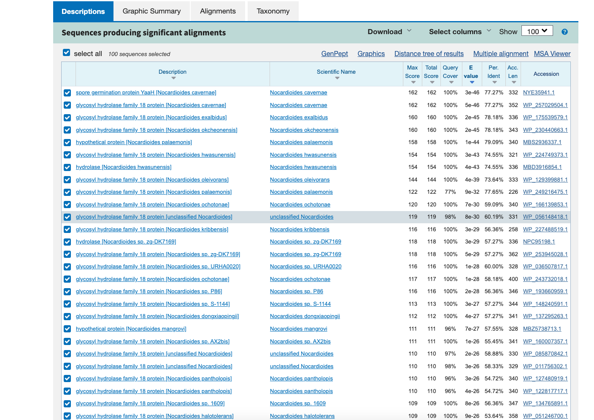
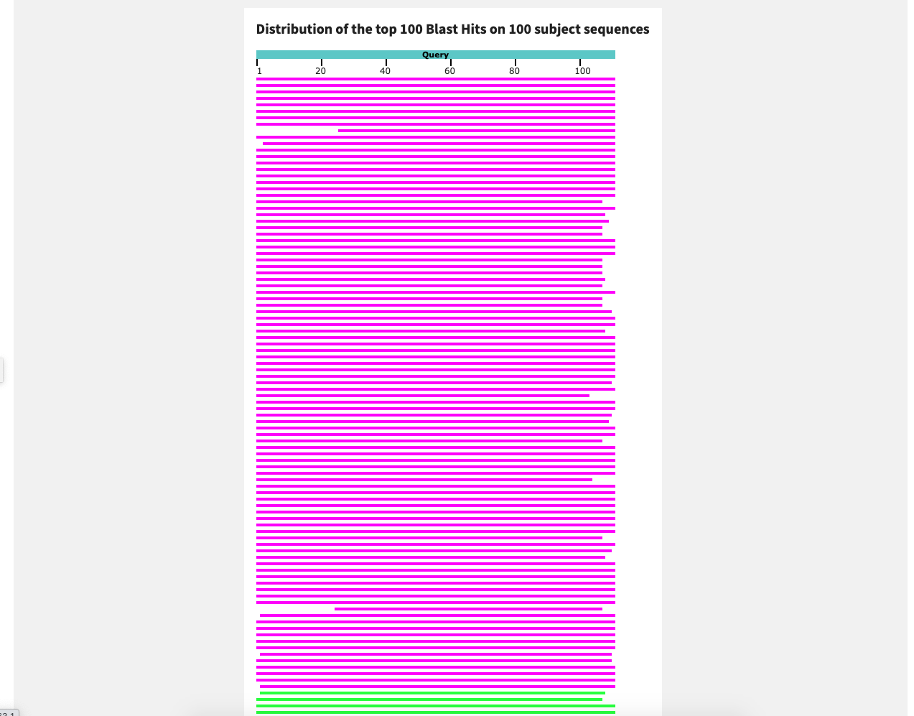
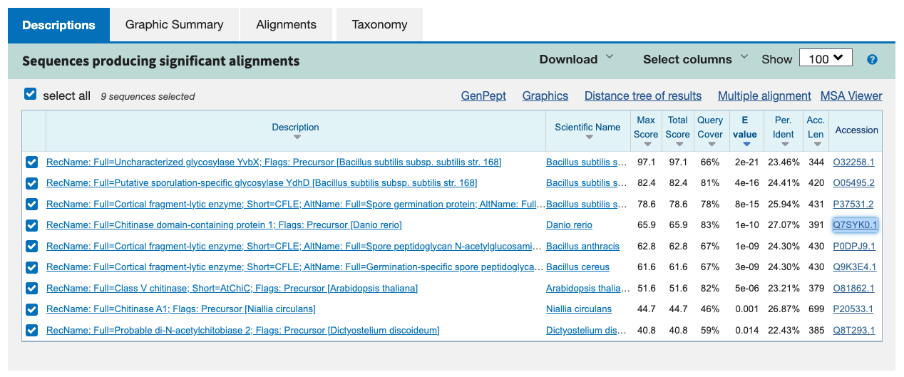
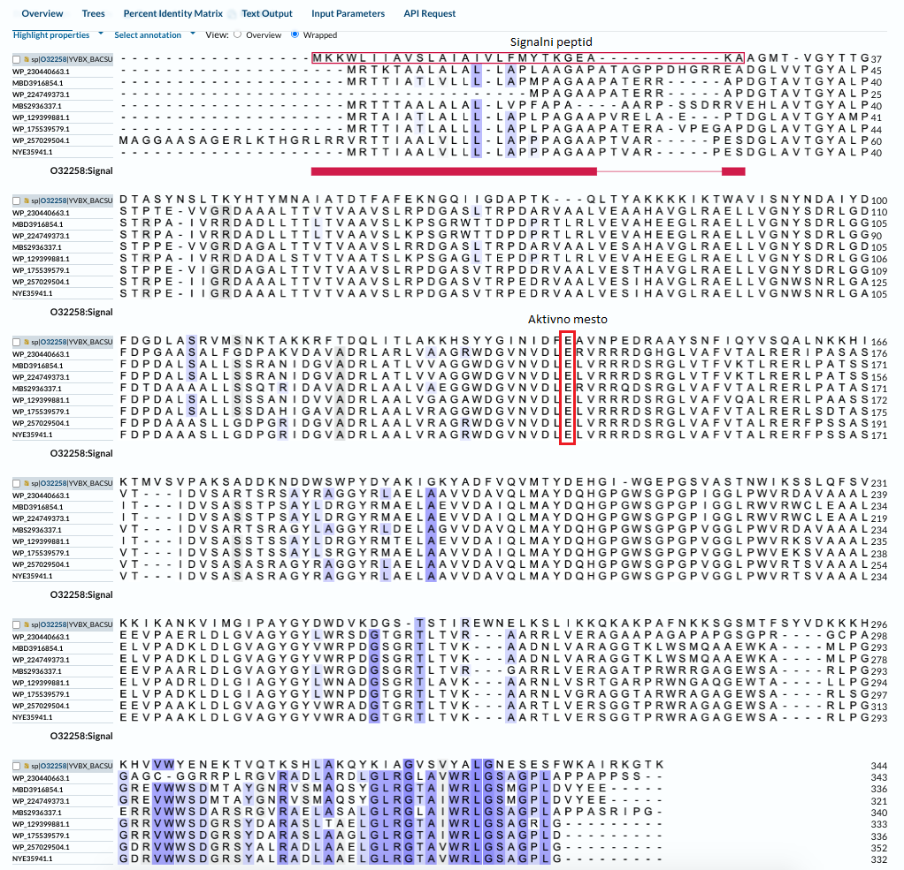
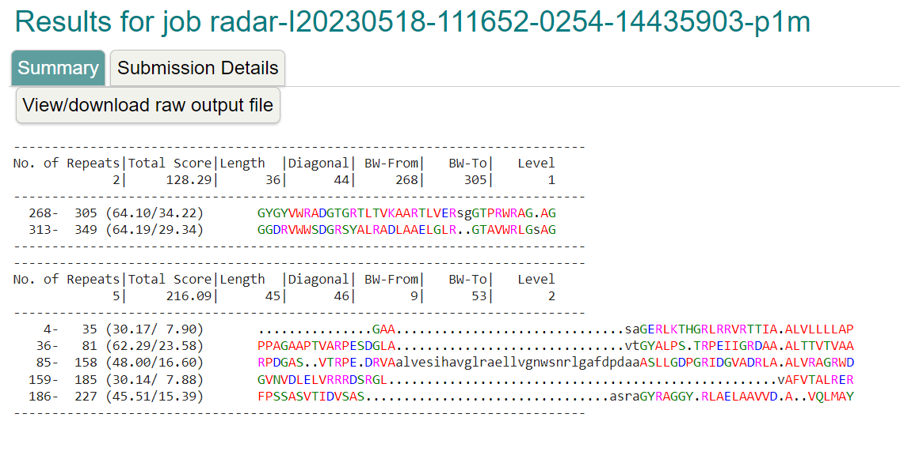
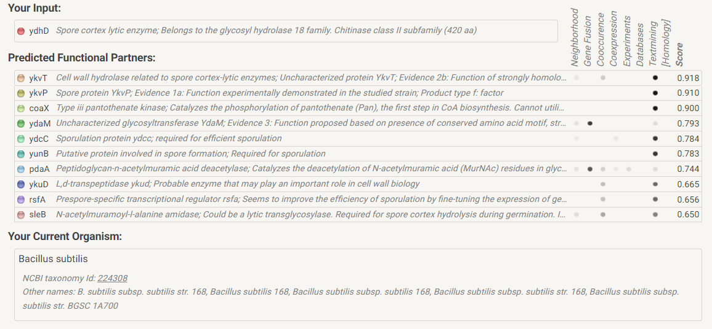

# S01

- **Avtor**: Tim David Agrež
- **Datum izdelave**: 2023-05-12
- **Koda seminarja**: S01

---
## Vhodni podatek

Zaporedje: >S01
LRAELLVGNWSDRLGGFDPDAASHLLSDGDHITAVADQLTGLVASGGWDGVNVDLELVRR
RDSRGLVAFVTALRERLPATASITIDVSARTSATAYRAGGYRLAELAAVV

---
## Rezultati analiz

### Identifikacija

**Protein**: [Hitinaza družine 18 glikozil hidrolaz](https://www.ncbi.nlm.nih.gov/protein/WP_257029504.1?report=genbank&log$=prottop&blast_rank=2&RID=6BVFM2JK016)

**Organizem**: 	[Nocardioides cavernae](https://en.wikipedia.org/wiki/Nocardioides_cavernae)

**Potencialna funkcija proteina**: Kot hitinaza moj protein cepi beta-1-4-glikozidno vez med enotami N-acetil-D-glukozamina v hitinu. 
[Vir](https://pubmed.ncbi.nlm.nih.gov/7704527/)

Identifikacija je bila narejena z uporabo NCBI BLAST, varianta blastp (v zbirki nr). Identičnost nad 50% je bila zaznana v mnogih zaporedjih (večinoma hidrolazah iz družine 18) najboljše ujemanje pa je bilo v primeru proteina iz družine 18 glikozil hidrolaz iz Nocardioides cavernae, z ujemanjem 77.27% na dolžini 352 aminokislin in e vrednostjo 5e-46. 

### Splošna karakterizacija 
Za zapis GenBank [WP_257029504](https://www.ncbi.nlm.nih.gov/protein/WP_257029504.1?report=genbank&log$=prottop&blast_rank=2&RID=6BVFM2JK016) ni na voljo pripisov glede značilnosti proteinskega produkta, zato sem uporabil dobro anotirana zaporedja proteinov z aminokislinskim zaporedjem, podobnim aminokislinskemu zaporedju identificiranega proteina.
Za pridobitev le teh sem izvedel blast po UniprotKB/Swiss-Prot zbirki s proteinom kot vhodni podatek in na podlagi podobnosti sklepal o lastnostih mojega proteina.

Zanimajo nas odgovori na naslednja vprašanja:
- Kje v izvornem organizmu/celici se protein nahaja?

V Nocardioides cavernae se moj protein nahaja v steni spor, izločajo pa ga tudi v okolico.
- Katere post-translacijske modifikacije ima?

Moj protein ne vsebuje posttranslacijskih modifikacij, se pa sintetizira s signalnim peptidom.
- Če želimo pripraviti protein v rekombinantni obliki, kateri gostiteljski organizem je najbolj smiselno izbrati in kateri del proteina bi izražali?

Najbolj smiselno se mi zdi izbrati kar celice E.Coli, saj so najcenejše, izražal pa bi celoten protein.
- So znani kakšni homologi (ortologi, paralogi)? Kaj je znanega o njih (funkcija, modifikacije, regulacija, aktivno mesto, ...)?

Da. Njegovi homologi spadajo v hidrolaze družine 18 in cepijo glikozidne vezi, pri bakterijah pa pomagajo tudi pri tvorbi sten bakterijskih spor. 

- Predstavlja naš protein encim ali gre za kak drug protein? Če gre za encim – ali je aktivno mesto v primerjavi z aktivnimi homologi ohranjeno?

Moj protein je encim, njegovo aktivno mesto pa je ohranjeno tudi v aktivnih homologih:

- Kaj so najbolj ohranjene regije v skupini, ki jo predstavlja ta protein in njegovi homologi?

V mojem proteinu sta glede na homologe najbolje ohranjeni C-terminalna domena in aktivno mesto.

- So v zaporedju kakšne ponavljajoče se regije oz. motivi?

Za ugotavljanje ponavljajočih regij s svojem proteinu sem uporabil EMBL-EBI orodje RADAR. Ponavljajoče regije v mojem proteinu so:

- S katerimi proteini ali drugimi molekulami bi lahko ta protein potencialno interagiral?

Na podlagi homologa iz Bacillus subtilis (strain 168) sem v Stringu pripravil shemo interakcij:

Interakcije mojega proteina niso najbolje raziskane, a iz tega kar je znano lahko sklepam, da moj protein interagira z nekaterimi proteini za lizo celične stene in korteksa stene spor:

### Strukturna katakterizacija
Zanimajo nas odgovori na naslednja vprašanja:
- Je znana struktura tega proteina ali njegovega dela?

Struktura proteina ali njegovega dela še ni znana.
- Je znana struktura homologov? Katerih?

Da. Poznane so strukture nekaterih hitinaz:

Te se v glavnem ujemajo v zadnjem delu zaporedja (kar je logično, saj je na začetku zaporedja signalni peptid):

- Pripravite model proteina oz. njegovega dela, ki bi predstavljal funkcionalen topen protein.

S pomočjo AlphaFolda sem pripravil strukturo svojega proteina, z odstranjenim nepomembnim delom na N-terminalni regiji:

- Primerjajte model oz. eksperimentalno strukturo z eksperimentalno strukturo homologa, osredotočite se na funkcijsko pomembne regije.

V Chimeri sem naredil poravnavo Alphafold modela in strukture 5jh8 - strukture poznanega homologa. Na sliki je vidna stranska glutamatna skupina, ki je aktivno mesto encima. Na sliki se dobro vidi, da se strukturi dobro prekrivata:

---