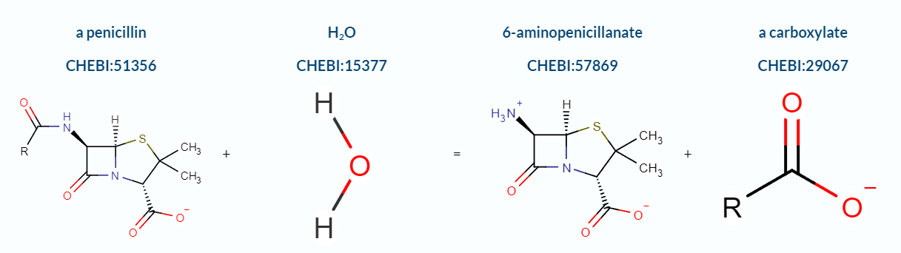
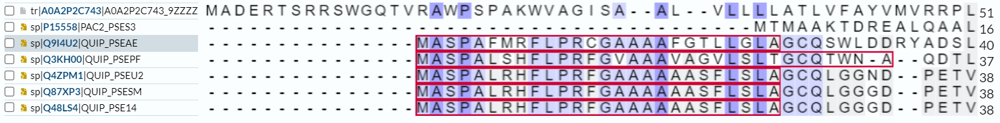
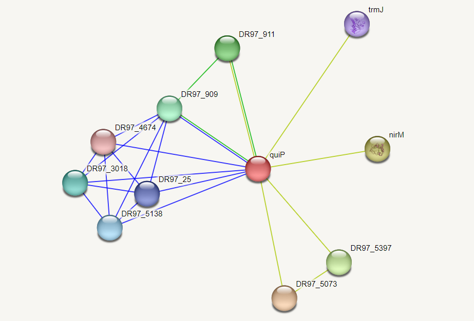
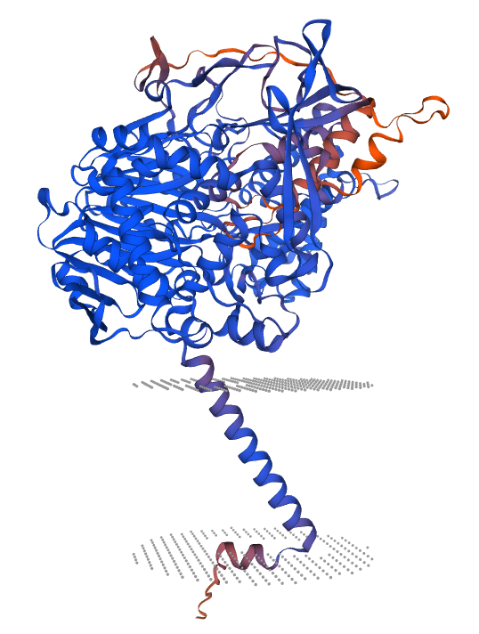
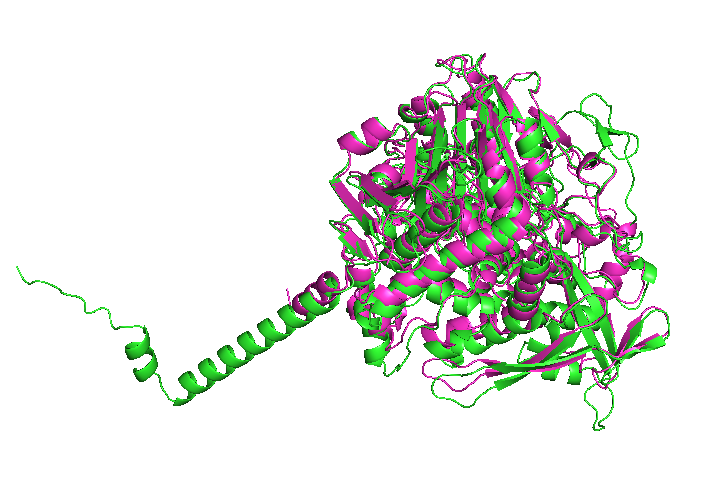

# S05

- **Avtor**: Nika Frelih
- **Datum izdelave**: 2022-05-12
- **Koda seminarja**: S05

---
## Vhodni podatek

Zaporedje: VSMPGIWSQVGLHCRTVGADCPFEVSGFSFAGVPGVVIGHNADVAWGFTNLGPDVTDLYL
EKIRGERWLYDGAYRPLSIRKEVIKVRGGDDFDLTVRSTKHGPLLSDVST

---
## Rezultati analiz

### Identifikacija

**Protein**: Penicilin amidaza (*Penicillin amidase*)

Identificirano s pomočjo NCBI BLAST, in sicer blastp, kjer je bilo iskano po zbirki metagenomskih proteinov. Prvi zadetek kaže na 100% identičnost in 100% Query coverage. Koda zapisa v GenBank: [CUR57814.1](https://www.ncbi.nlm.nih.gov/protein/CUR57814.1?report=genbank&log$=prottop&blast_rank=1&RID=6155NY48013)

**Organizem**: Zaporedje je metagenomsko, najverjetneje pa so podobni proteini iz bakterije rodu *Norcadiodes*. Ti proteini so bili najdeni s pomočjo blastp po non-redundant zbirki, imajo visok odstotek identičnosti z iskanim zaporedjem proteina Pencilin amidaze in so tudi približno enako dolgi, zato je Query coverage skoraj 100%.

**Potencialna funkcija proteina**: Hidrolazna aktivnost oz. penicilin amidazna aktivnost, cepi amidno vez v penicilinu, tako da nastane 6-aminopenicilat in karboksilat.

---

### Splošna karakterizacija

Iskanemu proteinu (GenBank: [CUR57814.1](https://www.ncbi.nlm.nih.gov/protein/CUR57814.1?report=genbank&log$=prottop&blast_rank=1&RID=6155NY48013)) ustreza UniprotID: [A0A2P2C743](https://www.uniprot.org/uniprotkb/A0A2P2C743/entry), vendar tam
ni zapisov glede značilnosti proteina, zato so bila za splošno karatkterizacijo uporabljena zaporedja podobnih proteinov, najdenih s pomočjo blastp. Iskanje po zbirki UniProt/SwissProt poda 15 podobnih proteinov, ki so acilaze. Najbolj podoben iskanemu proteinu je Acil homoserin lakton acilaza quip (UniprotID: [Q9I4U2](https://www.uniprot.org/uniprotkb/Q9I4U2/entry))  s samo 31% identičnostjo, a je Query coverage zelo visok. 

#### Lokalizacija
Najverjetneje se protein nahaja v periplazmi ali v membrani, kar se sklada z njegovo funkcijo, saj hidrolizira penicilin, še preden ta vstopi v celico. Model proteina zgrajen v SwissProt predvidi tudi eno transmembransko regijo.

#### Post-translacijske modifikacije
V Uniprotu ni anotiranih post-translacijskih modifikacij, ne moremo pa sklepati, da jih protein zagotovo nima.

#### Izražanje proteina v rekombinantni obliki
Glede na to, da protein najverjetneje nima post- translacijskih modifikacij, bi lahko za organizem izbrali kar bakterije.

#### Homologi
Homologi iskanega proteina so proteini iz rodu Penicilin acilaze a vsi ti proteini niso anotirani, zato ne moremo sklepati na njihovo funkcijo in modifikacije. Najbolj podoben protein, ki je anotiran, pa je Acil homoserin lakton acilaza in lahko sklepamo da je eden izmed homologov, glede na ohranjenost aktivnega mesta, ter ujemanja poravnav zaporedij. Drugi homolg bi lahko bil tudi Penicilin acilaza 2 proencim (UniprotID: [P15558](https://www.uniprot.org/uniprotkb/P15558/entry)), ki ga BLAST, izveden na spletni trani Uniprot, navede kot drugega najbolj podobnega Penicilin amidazi. Tudi filogenetsko drevo v Clustal Omega kaže na homolognost proteinov.

Na sliki vse oznake z AHL predstavljajo acil homoserin lakton acilaze iz rodu *Pseudomonas* različnih vrst.

#### Vrsta proteina in njegove regije
Iskani protein je encim, v aktivnem mestu proteina se nahaja aminokislinski ostanek serin. V primerjavi z njegovimi homologi je aktivno mesto ohranjeno. 

Pri homolgih, acil homoserin lakton acilazi, so v poravanavi vidni signalni peptidi, ki pa niso poravnani z iskanim proteinom, zato ne moremo sklepati, da ima ta protein tudi signalni peptid. 

Poleg tega ni sledu o drugih anotiranih pomembnih regijah, tudi analiza na InterPro pokaže celotno zaporedje kot le eno domeno, ki ima hidrolazno aktivnost.

#### Interakcije

Interakcije prikazane na programu String niso eksperimentalno določene, kot tudi niso iz anotiranih zbirk zato ne moremo goviriti o zanesljevih protein-protein interakcijah. String pokaže, da bi protein in njegovi homologi lahko potencialno interagirali z tRNA metiltransferazo TrmJ, tokrom c-551 prekurzorjem na podlagi tega, da so v člankih omenjeni skupaj. Prav tako pa predvidi določene interakcije z drugimi proteini glede na bližino njihovih zapisov v genomu. 

---

### Strukturna katakterizacija

Struktura proteina in njegovega dela ni eksperimentalno določena, prav tako ni znana struktura homologov lakton acilaze ali Penicilin acilaze 2. 

Na spodnji sliki je prikazan model proteina, pripravljen s programom SwissModel. Program označi potencialno transmembransko regijo, ki predstavlja eno samo alfa vijačnico.

V Pymolu pa je bila še narejena primerjava struktur Penicilin amidaze z njenimi homologi. Na prvi sliki je z zeleno označen iskani protein, z modro pa homolog Acil homoserin lakton acilaza. Večina sekundarnih struktur je prostorsko enako razporejenih in se strukturno ujemajo. Ne ujema se potencialni transmembranski del, ki pa je pri modeliranju najmanj zanseljivo določen. 

Na drugi sliki pa je še poravnava Penicilin amidaze (zeleno) z Penicilin acilaza 2 proencimom (rožnato). Tudi tukaj se večina sekundarnih struktur ujema, potencialnatransmembranska vijačnica pa acilazi manjka.

