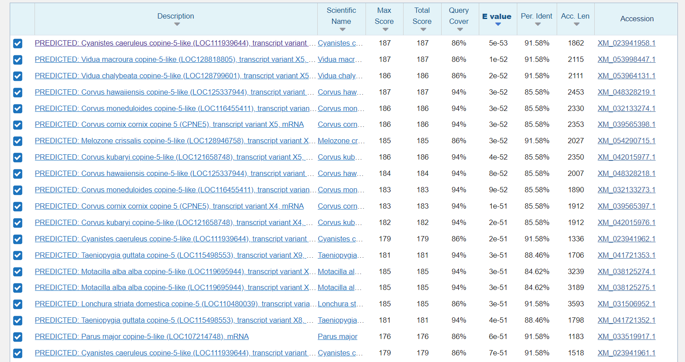
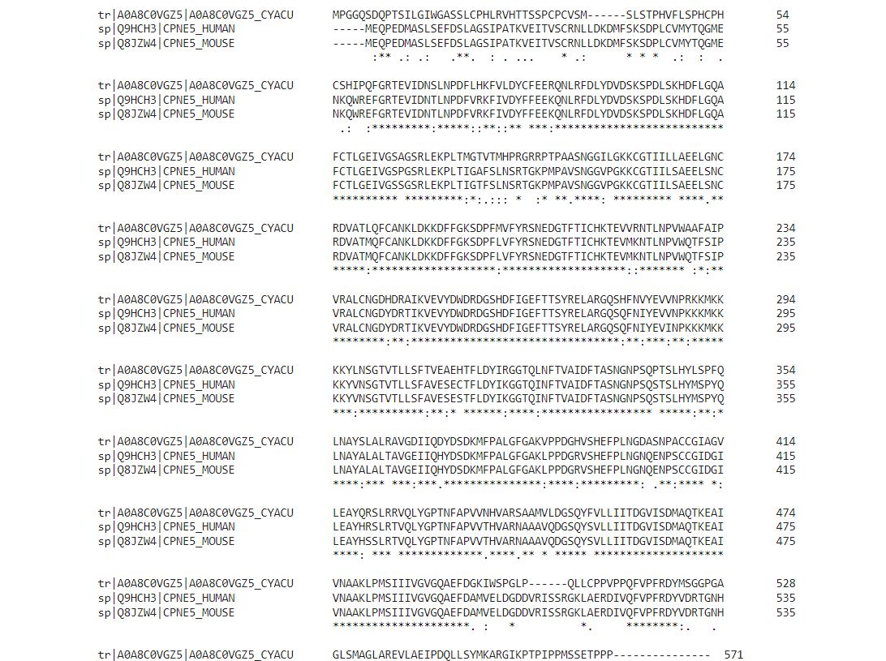
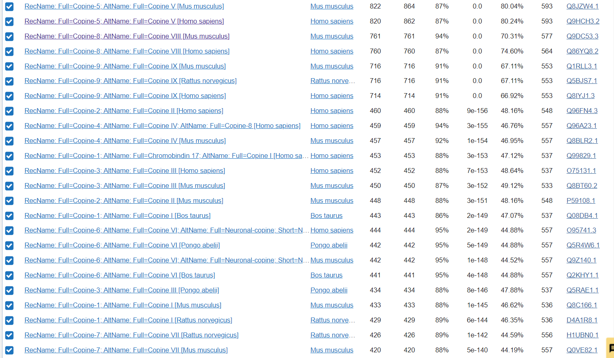
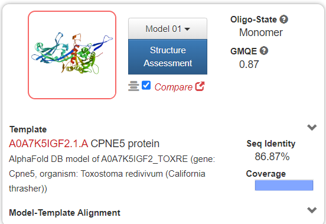

# S10

> V naslovu zgoraj besedilo "Predloga za skupino A" nadomestite s kodo vašega seminarja (npr. S05), ki je navedena ob vašem imenu v [tabeli z vhodnimi podatki](seminar.md); znak za oblikovanje kot naslov (# oz. "lojtra") seveda pustite, med njim in kodo seminarja mora biti presledek. Ta odstavek, ki se začne z znakom >, izbrišite, v ustrezna polja v nadaljevanju pa vnesite rezultate zahtevanih analiz, obvezno ustrezne opise/razlago/argumentacijo, dodajte pa tudi povezave do pravilno poimenovanih slik (glejte [navodila](navodila.md)).

- **Avtor**: Naja Pečovnik Wutt
- **Datum izdelave**: 2023-05-12
- **Koda seminarja**: S10

---
## Vhodni podatek

Zaporedje: 
RAIKVEVYDWDRNGSHDFIGEFTTSYRELARGQSHFNVYEVVNPRKKMKKKKYLNSGTVT
LLSFTVEAEHTFLDYIRGGTQLNFTVAIDFTASNGEWQLCPPGVFIWGSC

---
## Rezultati analiz

### Identifikacija
Identifikacija se nanaša na protein, ki ga kodira gen, katerega del predstavlja  [zaporedje](#vhodni-podatek).

Ugotovitev se nanaša na podatke pridobljene s tblastn, kjer se  izhodno zaporedje z 91,58% identičnostjo in vrednostjo e 5e-53 ujema s proteinom Copine-5 iz organizma Cyanistes Caeruleus (ptica Plavček). S 100% ne moremo trditi, da je to ta isti protein, saj nimamo popolne identičnosti. 

**Protein**: Copine-5

**Organizem**: Cyanistes Caeruleus; ptica Plavček

**Potencialna funkcija proteina**: vezava fosfolifidov v odvisosti od kalcija 

 Identificirali smo protein z NBCI Blast, kjer smo s tblastn ugotovili visoko identičnost s proteinom copine-5 v organizmu Cyanistes Caeruleus. 

 

Koda zapisa z BLAST identificiranega proteina: NCBI Reference Sequence: XM_023941958.1

aminokislinsko zaporedje celotnega idetificiranega proteina:

MGTVTMHPRGRRPTPAASNGGILGKKCGTIILLAEELGNCRDVA
TLQFCANKLDKKDFFGKSDPFMVFYRSNEDGTFTICHKTEVVRNTLNPVWAAFAIPVR
ALCNGDHDRAIKVEVYDWDRDGSHDFIGEFTTSYRELARGQSHFNVYEVVNPRKKMKK
KKYLNSGTVTLLSFTVEAEHTFLDYIRGGTQLNFTVAIDFTASNGNPSQPTSLHYLSP
FQLNAYSLALRAVGDIIQDYDSDKMFPALGFGAKVPPDGHVSHEFPLGLSHCQNGDAS
NPACCGIAGVLEAYQRSLRRVQLYGPTNFAPVVNHVARSAAMVLDGSQYFVLLIITDG
VISDMAQTKEAIVNAAKLPMSIIIVGVGQAEFDAMVELDGDDIRISSRGKVAERDIVQ
PTPPGCPIISLKRGPALAVCVTSPCVTLPSCVTPPRTVTTPLLSYVTPCLQLCPLPPS
SAPS

### Splošna karakterizacija
V Uiprotu je ta protein zelo slabo anotiran, zato smo za pomoč pri iskanju lastnosti tega proteina uporabili dobro anotirane  proteine s podobnim aminokislinskim zaporedjem.
S tblastn smo ugotovili visoko identičnost s proteinom copine-5 v organizmu Cyanistes Caeruleus, nato smo z blastp v swissprot bazi našli protein Copine-5 v človeku (Uniprot: [Q9HCH3](https://www.uniprot.org/uniprotkb/Q9HCH3/entry#subcellular_location))(e = 0 in identičnost = 80,04%) in miši (Uniprot: [Q8JZW4]  (https://www.uniprot.org/uniprotkb/Q8JZW4/entry#subcellular_location)) (e = 0 in identičnost = 80,24%).

- Kje v izvornem organizmu/celici se protein nahaja?
Glede na podobnost z zgoraj omenjenima proteinoma lahko sklepamo, da se tudi ta protein nahaja v perikarjonu ali drugih delih nevronske celice. 

- Katere post-translacijske modifikacije ima? 
Za iskanje post-translacijskih modifikacij smo naredili poravnavo z orodjem Clustal Omega. S pomočjo primerjave smo odkrili modificiran aminokislinski ostanek na mestu 102 v izvornem proteinu, saj se na tem mestu ujema v poravnavi z modifikacijo, ki je prisotna tudi na anotiranih proteinih. Ostale modifikacije na anotiranih proteinih so za izvoren protein nesignifikantne.

Poravnava:

- Če želimo pripraviti protein v rekombinantni obliki, kateri gostiteljski organizem je najbolj smiselno izbrati in kateri del proteina bi izražali?
Ker niso prisotne post-translacijske modifikacije, ki bi zahtevale posebno okolje, bi lahko protein pripravli v bakterijskem ekspresijskem sistemu.

- So znani kakšni homologi (ortologi, paralogi)? Kaj je znanega o njih (funkcija, modifikacije, regulacija, aktivno mesto, ...)? - Kaj so najbolj ohranjene regije v skupini, ki jo predstavlja ta protein in njegovi homologi?
S pomočjo celotenega proteina, ki vsebuje izhodo sekvenco, najdemo s pomočjo blastp homologe v različnih organizmih, iskali smo med dobro anotiranimi zaporedji. Največja podobnost je bila z zgoraj omenjenima proteinoma, ki sta služila kot pomoč pri identifikaciji izhodnega zaporedja. Prav tako smo našli različne copine proteine v različnih organizmih:

Nato smo naredili poravnavo homolognih zaporedij z organizmom izvornega organizmom. Ugotovili smo, da imajo vsi proteini enako funkcijo in enaka vezavna mesta za kalcij.

- Predstavlja naš protein encim ali gre za kak drug protein?
Za proteine copine še ni bilo zaznane ecimske aktivnosti. Gre za protein s funkcijo povezovanja fosfolipidov. Z poravnavo smo prepoznali ujemanje mesta za vezavo kalcija, ki je ključen za delovanje proteina.

 

- So v zaporedju kakšne ponavljajoče se regije oz. motivi?
Protein nima signifikantnih ponavljajočih se regij.

- S katerimi proteini ali drugimi molekulami bi lahko ta protein potencialno interagiral?
Protein za opravljanje svoje funkcije potrebuje vezan kalcij.

### Strukturna katakterizacija

- Je znana struktura tega proteina ali njegovega dela?
Za iskan protein struktura še ni znana. Prav tako ni znana struktura njegovih homologov, do sedaj so samo predvidevanja in eksperimentalno postavljene sheme narejene z Alphafold.

- Pripravite model proteina oz. njegovega dela, ki bi predstavljal funkcionalen topen protein.
Model proteina smo pripravili s programom Swiss-model, ki nam je glede na izhodno zaporedje pripravil shemo proteina po modelu [A0A7K5IGF2](https://www.uniprot.org/uniprotkb/A0A7K5IGF2/entry) 
Pripravljen protein:
[protein](https://swissmodel.expasy.org/interactive/7JfgVG/models/)

Podatki modela:

- Primerjajte model oz. eksperimentalno strukturo z eksperimentalno strukturo homologa, osredotočite se na funkcijsko pomembne regije.
Pri primerjavi pridobljenega modela s Swiss-model in predvidevano strukturo proteina Copine-5 miši je prišlo do delnega ujemanja v sami strukturi obeh proteinov, ki je bila opravljena s programom Chimera.
Slika poravnanih struktur:
Struktura bež barve predstavlja znano strukturo homolognega proteina, modra struktura pa je model našega izhodnega proteina.

