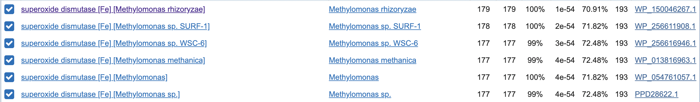
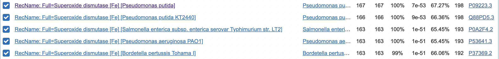
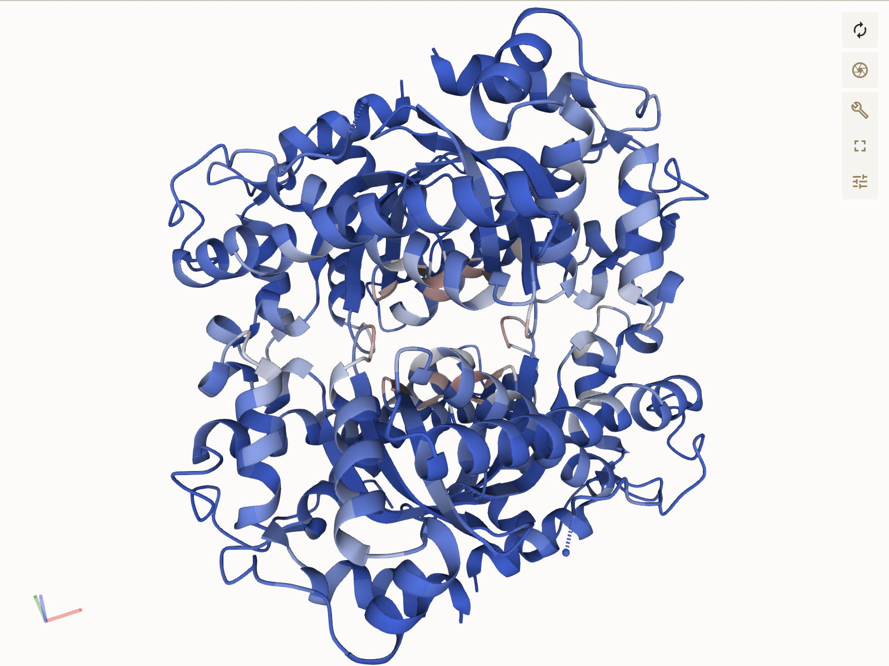
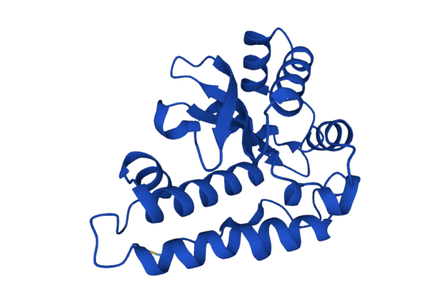

# Predloga za skupino A

> V naslovu zgoraj besedilo "Predloga za skupino A" nadomestite s kodo vašega seminarja (npr. S05), ki je navedena ob vašem imenu v [tabeli z vhodnimi podatki](seminar.md); znak za oblikovanje kot naslov (# oz. "lojtra") seveda pustite, med njim in kodo seminarja mora biti presledek. Ta odstavek, ki se začne z znakom >, izbrišite, v ustrezna polja v nadaljevanju pa vnesite rezultate zahtevanih analiz, obvezno ustrezne opise/razlago/argumentacijo, dodajte pa tudi povezave do pravilno poimenovanih slik (glejte [navodila](navodila.md)).

- **Avtor**: Samo Pucihar
- **Datum izdelave**: 2023-05-12
- **Koda seminarja**: S13

---
## Vhodni podatek

Zaporedje: 
>S13
MIYQLSTLPYGNDALEPHISRETIEFHYGRHHQAYVANLNNLVPGTEFEGLALEEVVKQA
SGAIFNNSAQIWNHTFYWNCLAPSGGGEPDGDLAQAIADVFGSFEVFKEK

---
## Rezultati analiz

### Identifikacija
Identifikacija se nanaša na protein, ki ga kodira gen, katerega del predstavlja  [zaporedje](MIYQLSTLPYGNDALEPHISRETIEFHYGRHHQAYVANLNNLVPGTEFEGLALEEVVKQASGAIFNNSAQIWNHTFYWNCLAPSGGGEPDGDLAQAIADVFGSFEVFKEK).

**Protein**: Superoksid-dezmutaza [Fe]

**Organizem**: Methylomonas sp. (sklepam, da "sp." pomeni, da vrsta še ni bila klasificirana)

**Potencialna funkcija proteina**: Uničevanje superoksidnih ionov, ki so toksični za celico.

### Splošna karakterizacija
Zanimajo nas odgovori na naslednja vprašanja:
- Kje v izvornem organizmu/celici se protein nahaja?  
_Protein se verjetno nahaja v citoplazmi, namreč če pogledamo najbolje "Blastani" anotiran protein [UniProt](https://www.uniprot.org/uniprotkb/P09223/entry) vidimo, da subcelična lokacija še ni določena. Vseeno pa sem šel na UniProt gledat Superoksid dezmutazo [E. Coli](https://www.uniprot.org/uniprotkb/P0AGD3/entry) tam piše, da se nahaja v citoplazmi in celični membrani. Prisotnost dezmutaze je iz biokemijskega stališča logično v citoplazmi, medtem ko njena prisotnost ni smiselna. Vseeno sem za radovednost šel določevat proteinsko interakcijo v [PeSTo](https://pesto.epfl.ch/), ki pa lipidnih interakcij ni našel - torej verjetno ni usidran v membrano._  

- Katere post-translacijske modifikacije ima?  
_Če pogledamo UniProt profil najboljšega anotiranega blastanega proteina ne najdemo post-translacijskih modifikacij, zato jih verjetno nima._
- Če želimo pripraviti protein v rekombinantni obliki, kateri gostiteljski organizem je najbolj smiselno izbrati in kateri del proteina bi izražali?  
_Izbrali bi organizem Pseudomonas putida, saj je bil to prvi zadetek pri anotiranjem "blastanju". Poleg tega je to organizem, ki je dobro okarakteriziran in se pogosto uporablja raziskavah, bioremediaciji in biosintezi [Wiki](https://en.wikipedia.org/wiki/Pseudomonas_putida) - glej prvi odstavek._ 
- So znani kakšni homologi (ortologi, paralogi)? Kaj je znanega o njih (funkcija, modifikacije, regulacija, aktivno mesto, ...)?  
_Prilagam screenshot blastanja neanotiranih zaporedij:_  

_Problem je, da so vsa zgornja zaporedja neanotirana, zato težko določim funkcijo, modifikacije..._  
_zato bom priložil še screenshot anotiranih blastov:_

_Ker gre za homologe, bodo posledično njihove lastnosti dokaj podobne:  Funkcija: Razgradnja O2(-) iona,_  
- Predstavlja naš protein encim ali gre za kak drug protein?  
_Protein je encim, saj opravlja encimsko funkcijo._
  - Če gre za encim – ali je aktivno mesto v primerjavi z aktivnimi homologi ohranjeno?  
  _Aktivnega mesta ("active site") v [UniProt](https://www.uniprot.org/uniprotkb/P09223/entry) profilu najbojle anotiranega proteina ni zaslediti, ampak so pa podani tisti ak ostanki, ki vežejo Fe3+ ion v strukturo. Glede na to, da obravnavamo protein, ki razgrajuje superoksidni ion in ga posledično more biti sposoben vezati sklepam, da so vezavna mesta za ta ion pomembna. Anotiran protein ima štiri vezavna mesta (27., 74., 157. in 161. ostanek). Ko primerjam identičnost teh štirih mest z vhodnim podatkm vidim, da so prvi trije ostanki ohranjeni, četrti pa ne._
- Kaj so najbolj ohranjene regije v skupini, ki jo predstavlja ta protein in njegovi homologi?

_Nisem točno prepričan, kaj naj bi pomenila "skupina, ki jo predstavlja ta protein". Načeloma protein spada v skupino superoksidnih dismutaz, tako da predvidevam, da so potemtakem najbolj ohranjeni tisti ak ostanki, ki predstavljajo vezavno mesto za Fe3+ ion, kar je sicer malo kontradiktorno s prejšnjo ugotovitvijo - 4. ak ostanek ni bil v vseh primerih ohranjen._

- So v zaporedju kakšne ponavljajoče se regije oz. motivi?

_V zaporedju ni moč zaslediti ponavljajočih regij oz. motivov. Zaporedje sem pregledal sam (na roko), tako da verjamem, da obstaja kaka boljša metoda za ugotavljanje takih regij._
- S katerimi proteini ali drugimi molekulami bi lahko ta protein potencialno interagiral?

_No, tukaj sem z velikim veseljem uporabil PeSTo, ki sem ga zadnjič predstavljal na seminarjih. Program zahteva koordinate atomov (torej že rešeno strukturo), zato točno mojega zaporedja nisem mogel uporabiti, sem si pa pomagal s strukturo dismutaze bakterije Mycobacterium tuberculosis (PDB: 1IDS). Program ni zaznal interakcij s proteini, DNA/RNA ali lipidi, je pa zaznal interakcijo z ligandi in ioni (seveda, če pa vsebuje Fe3+ ion)._

_Napoved interakcije z ligandi (kar ni modro predstavlja potencialno interakcijo):_

_Napoved interakcije z ioni:_

### Strukturna katakterizacija
Zanimajo nas odgovori na naslednja vprašanja:
- Je znana struktura tega proteina ali njegovega dela?

_Protein, katerega sekvenca mi je bila podana, nima znane strukture, lahko pa jo napovemo z AlphaFold-om:_

- Je znana struktura homologov? Katerih?

_Homolog, kateremu sem namenil največ pozornosti, saj je imel najboljši rezultat pri anotiranem blasu, je [ta](https://www.uniprot.org/uniprotkb/P09223/entry) in ima rešeno strukturo. Strukture večine ostalih homologov niso znane - niso anotirane._
- Pripravite model proteina oz. njegovega dela, ki bi predstavljal funkcionalen topen protein.

_Ideja je, da skopiramo FASTA format proteina in ga damo v AlphaFold. Problem je, ker mi stran za AlphaFold ne dela (izpiše mi nek ERROR, ki ga ne znam popraviti). Isto se mi je že zgodilo na vajah biokemijske informatike._

- Primerjajte model oz. eksperimentalno strukturo z eksperimentalno strukturo homologa, osredotočite se na funkcijsko pomembne regije.

_(gl. prejšnji odgovor)_