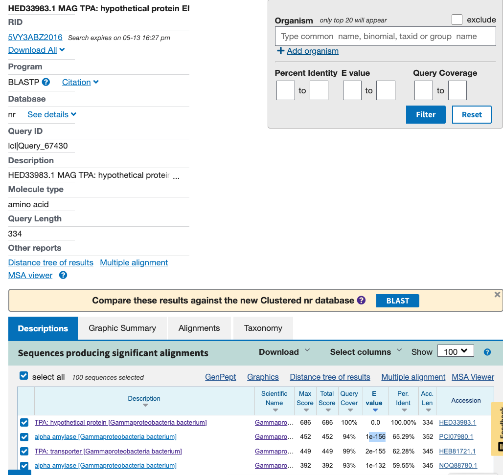
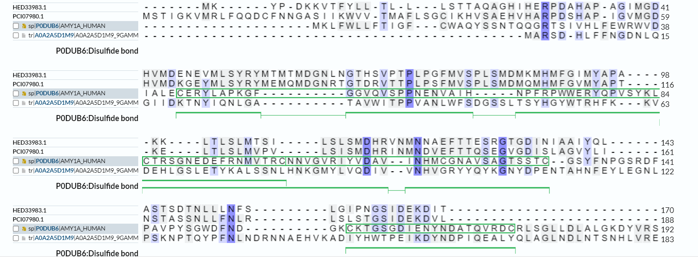
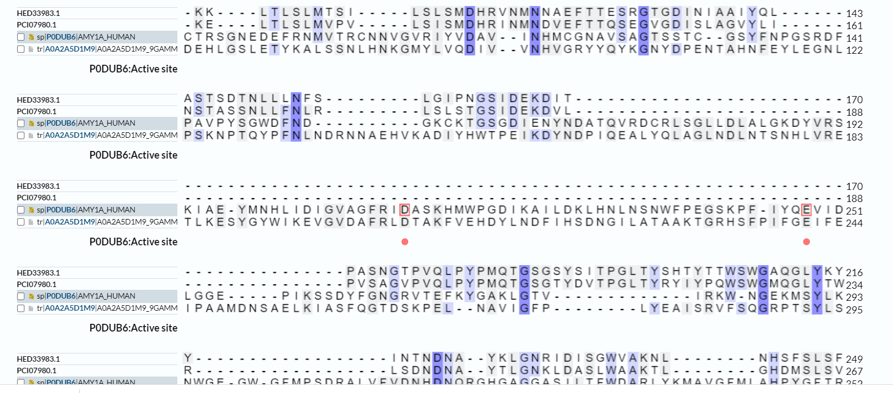
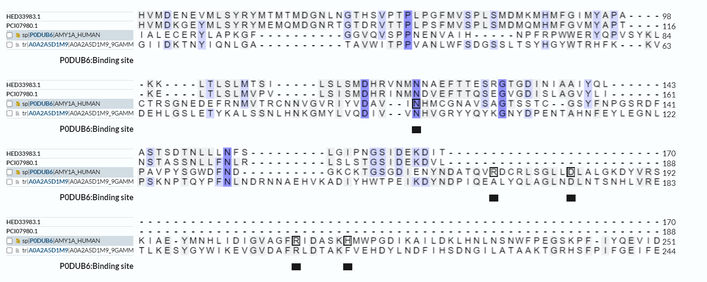
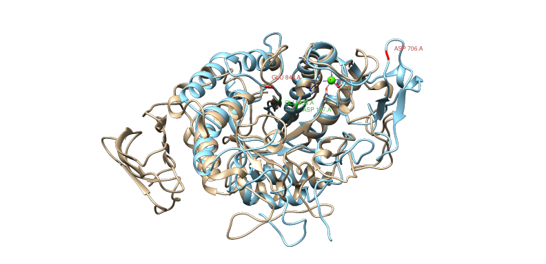
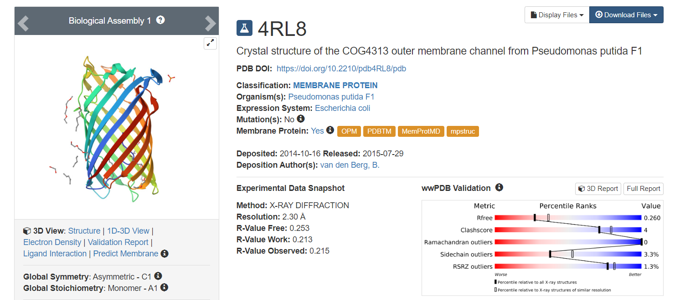
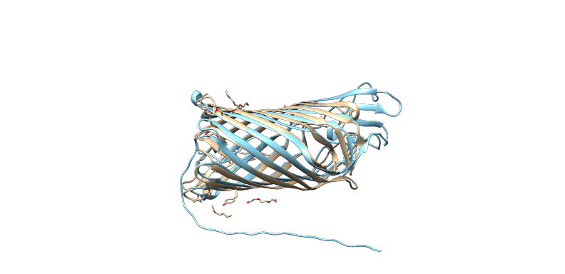

# S14

- **Avtor**: Lara Rajterič
- **Datum izdelave**: 2003-05-12
- **Koda seminarja**: S14

---
## Vhodni podatek

Zaporedje: 

MKYPDKKITAYLLTLLLSTTAQASHNHQRPDSHAPAGIMGDHIMDKDEVMLSYRYMAMTM
DGNLNGTNSIPTPLPGFMVSPLNMDMKMHMSGIMYAPTEKLTLSLMTSIL

---
## Rezultati analiz

### Identifikacija

**Protein**: hipotetični protein ENJ08_07165

**Organizem**: Gammaproteobacteria bacterium

**Potencialna funkcija proteina**: hidroliza (1-->4)-α-D-glikozidne vezi v polisaharidih 

Identifikacija je bila narejena z uporabo NCBI Blast, varianta blastp (zbirka nr). Značilna podobnost z hipotetičnim proteinom ENJ08_07165 je bila najdena za celotno zaporedje (100%) - to je celotno zaporedje iz katerega prihaja dani odsek (GenBank ID: HED33983). Ta hipoteitični protein se zelo dobro ujema z neatotirano alfa amilazo (GenBank ID: PCI07980, 65.29% identičnost, E vrednost je e-156), na podlagi česar sem sklepala, da je tudi preučevan protein alfa amilaza.

Z iskanje po blastu z identificirano alfa amilazo nisem prišla do nobenih anotiranih zadetkov, zato sem se lotila iskanja s pomočjo UniProta, kjer sem s pomočjo blasta s svojim zaporedjem prišla do več neanotiraih zadetkov. Ker z blastom nikakor nisem odkrila nobenih anotiranih ujemanj, sem se lotila iskanja s pomočjo Uniprota. Poiskala sem 10 anotiranih alfa amilaz in nato izvedla poravnavo z mojim zaporedjem. Najvišji procent ujemanja je imel moj protein s človeško alfa amilazo (41.67%), UniProt ID: P0DUB6. Neanotirana alfa amilaza (GenBank ID: PCI07980) je imela s človeško 33.33% ujemanje.

Ker za zapis GenBank HED33983 ni na voljo pripisov glede značilnosti proteinskega produkta, sem na lastnosti proteina sklepala glede na informacije dostopne o dobro anotirani človeški alfa amilazi (UniProt ID: P0DUB6), v poravnavo pa sem vključila tudi eno izmed neanotiranih zaporedij za alfa amilazo pri Gammaproteobacteria bacterium (UniProt ID: A0A2A5D1M), ki sem ga našla v Uniprotu.

### Splošna karakterizacija
####Lokacija

Protein se najverjetneje nahaja izven celice.

####Post-translacijske modifikacije

Glede na podatke dostopne o anotiranem homologu in poravnavi le tega s preučevanim proteinom, ta najverjetneje vsebuje. 

Anotirana alfa amilaze vsebuje tudi glikozilirane AK ostanke, vendar glede na poravnavo ta posttranslacijska modifikacija v nobenem izmed prtoeinov v poravnavi ni prisotna.

####Gostiteljski organizem

Najbolje bi bilo izbrati bakterijske celice, saj tudi protein prihaja iz bakterij, edina morebitna postranslacijska modifikacija pa so disulfidne vezi.

####Encimska fukcija

Najverjetneje gre za encim, saj ima protein visoko podobnost z alfa amilazo.

####Ohranjenost aktivnega mesta

Glede na primerjavo z anotirano človeško alfa amilazo (UniProt ID: P0DUB6) o ohranjenosti aktivnega mesta v preučevanem proteinu ne morem z gotovostjo sklepati. Je pa aktivno mesto ohranjeno v zaporedju za alfa amilazo, ki ima zapis v UniProtu. Sestavljata ga asparagin na mestu 212 v anotiranem oz. mestu 105 v neanotiranem proteinu in glutaminska kislina na mestu 248 v anotiranem (UniProt ID: P0DUB6) oz. mestu 241 v neanotiranem proteinu (UniProt ID: A0A2A5D1M).

####Ohranjene regije
 
Glede na poravnavo z aktivnim anotiranim homologom je ohranjeno tudi eno izmed vezavnih mest:
za Ca2+ ione: v anotiranem proteinu je to 115 AK ostanke, v preučevanem proteinu 121. AK ostanek in v neanotirani alfa amilazi istega organizma (UniProt ID: A0A2A5D1M) je to 94. AK ostanek. V tej alfa amilazi je ohranjeno še eno vezavno mesto za Ca2+ ione (anotirano zaporedje: 182, neanotirano: 173)  in eno mesto za kloridne ione (anotirano zaporedje: 210, neanotirano: 102 ).

Slabo je ohranjeno signalno zaporedje.

####Ponavljajoče regije:

V aminokislinskem zaporedju danega proteina nisem opazila nobenih ponavljajočih regij.

####Interakcija z drugimi proteini/molekulami 

Glede na informacije, ki jih o anotiranem proteinu najdemo na Uniprotu, ni nobenih znanih interakcij z drugimi proteini/molekulami. Seveda pa glede na encimsko funkcijo preučevanega proteina, ta interagira z substratom ob cepitvi vezi v njem.

### Strukturna katakterizacija
Zanimajo nas odgovori na naslednja vprašanja:
- Je znana struktura tega proteina ali njegovega dela?
- Je znana struktura homologov? Katerih?
- Pripravite model proteina oz. njegovega dela, ki bi predstavljal funkcionalen topen protein.
- Primerjajte model oz. eksperimentalno strukturo z eksperimentalno strukturo homologa, osredotočite se na funkcijsko pomembne regije.

####Struktura proteina

Za izbran protein še ni znane proteinske strukture.

####Struktura homologov

Znana je struktura dobro anotirane človeške alfa amilaze (UniProt ID: P0DUB6), na podlagi katere sem sklepala na lastnosti mojega proteina in so jo določili z rentgensko difrakcijo.

####Model proteina

####Primerjava s strukturo homologa 

Izvedla sem poravnano modela mojega proteina s strukturo človeške anotirane alfa amilaze (pdb: 1c8q). 

Izvedla sem tudi poravnavno modela (AlphaFold) neanotirane alfa amilaze (UniProt ID: A0A2A5D1M) s strukturo anotirane (UniProt ID: P0DUB6) in enako poravnavo z označenimi AK ostanki aktivnega mesta.

Nazadnje sem izvedla še isjankje s pomočjo serverja Dali, kjer sem identificirali proteine s strukturo, podobno mojemu preučevanemu proteinu.

Največjo strukturno podobnost ima preučevani protein z membranskim proteinom COG4313 iz Pseudomonas putida F1, kar je razvidno tudi iz poravnave obeh molekul v chimeri.

