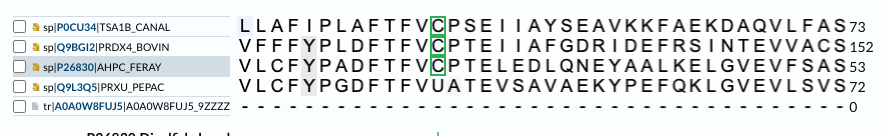
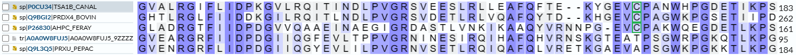
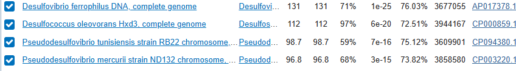

# S18

> V naslovu zgoraj besedilo "Predloga za skupino A" nadomestite s kodo vašega seminarja (npr. S05), ki je navedena ob vašem imenu v [tabeli z vhodnimi podatki](seminar.md); znak za oblikovanje kot naslov (# oz. "lojtra") seveda pustite, med njim in kodo seminarja mora biti presledek. Ta odstavek, ki se začne z znakom >, izbrišite, v ustrezna polja v nadaljevanju pa vnesite rezultate zahtevanih analiz, obvezno ustrezne opise/razlago/argumentacijo, dodajte pa tudi povezave do pravilno poimenovanih slik (glejte [navodila](navodila.md)).

- **Avtor**: Marcel Tušek
- **Datum izdelave**: 2023-05-12
- **Koda seminarja**: S18

---
## Vhodni podatek
>S18
MVKGGVPFPMLSDGGGKVGSVFGVYLEDAGVEARGRFIIDPDGIIQGFEVLTPPVGRNIN
ESIRQIHAFQHVRNSKGTEATPSGWRPGKQTLKPGPDLVGKVWEVWKTKM

---
## Rezultati analiz

### Identifikacija
Identifikacija se nanaša na protein, ki ga kodira gen, katerega del predstavlja  [zaporedje](#Vhodni podatek).

**Protein**: alkil hidroperoksidazni reduktazni protein c

**Organizem**: ogljikovodikov metagenom, saj organizem ni znan. Najverjetneje glede na homolognost je Gram+ bakterija (Peptoclostridium acidaminophilum)

**Potencialna funkcija proteina**: najverjetnjeje je od NADH odvisna peroksdiredoksinska aktivnost

### Splošna karakterizacija
Zanimajo nas odgovori na naslednja vprašanja:
- **Kje v izvornem organizmu/celici se protein nahaja?**
    Najverjetneje se nahaja znotraj celice v citoplazmi, saj potrebuje NADH za delovanje.
    
- **Katere post-translacijske modifikacije ima?**
    V mojem metagenomu, ki je najverjetneje samo del proteina psttranslacijskih modifikacij nima. Pri poravnavi z drugimi jih ima večina disulfidno vez, razen tisti protein, ki mu je najbolj podoben in ima selenocistein . S tem sklepam, da je na tem mestu zagotovo cistein je pa velika verjetnost, da je cistein modificiran in da do disulfidne vezi ne pride. Druga disulfidna vez pa se ni ohranila, saj opazimo v sliki, da je cistein ostal na manj podobnih, na mojem zaporedju in najbolj podobnemu pa ne .
    
- **Če želimo pripraviti protein v rekombinantni obliki, kateri gostiteljski organizem je najbolj smiselno izbrati in kateri del proteina bi izražali?**
    Izbral bi insektni ekspresijski sistem, saj je moj protein najverjetneje bakterija, ki trenutno nima posttranslacijskih modifikacij. Če bi imel na voljo celoten protein bi izral, kar celotnega, saj protebujemo aktivno mesto in domeno, ki jo ima. Problem bi mogoče nastal, če ima disulfidno vez, pri katerem bi potem bil manj stabilen. 
    
    
- **So znani kakšni homologi (ortologi, paralogi)? Kaj je znanega o njih (funkcija, modifikacije, regulacija, aktivno mesto, ...)?**
    Ortologov nima. Paraloge pa ima 
    
- **Predstavlja naš protein encim ali gre za kak drug protein? Če gre za encim – ali je aktivno mesto v primerjavi z aktivnimi homologi ohranjeno?**
      Najverjetneje manjka del proteina, ki bi pokazal njegovo aktivno mesto. Glede na poravnavo več anotiranih zaporedij sklepam, da ima na aktivnem mestu aminokislino cistein oz. modificirano aminokislino selenocistein. . 
      
- **Kaj so najbolj ohranjene regije v skupini, ki jo predstavlja ta protein in njegovi homologi?**
     Najbolj ohranjene regija je neorganizirana , kar pomeni, da je zelo fleksibilna in ne more biti točno določena
    
- **So v zaporedju kakšne ponavljajoče se regije oz. motivi?**
    v zaporedju ni ponavljajočih se regij in motivov.
    
- **S katerimi proteini ali drugimi molekulami bi lahko ta protein potencialno interagiral?**
    Reagiral bo s substratom ter z NADH, drugimi pa potencialno ne bi smel, saj menim, da je holoencim

Rezultate karakterizacije predstavite na smiseln način in podkrepite s prilogami (slike)!

### Strukturna katakterizacija
Zanimajo nas odgovori na naslednja vprašanja:
- **Je znana struktura tega proteina ali njegovega dela?**
    Struktura ni znana, je pa bila narejena predvidena struktura s pomočjo Alphafold-a 
    
- **Je znana struktura homologov? Katerih?**
    Nimajo nobene znane strukture, samo predvidene.
    
- **Pripravite model proteina oz. njegovega dela, ki bi predstavljal funkcionalen topen protein.**
    S pomočjo Protein-sol  sem preveril celotno topnost proteina. Izračun je pokazal, da je predvidena vrednost topnosti proteina 60 %. S tem menim, da je protein dovolj topen, brez da bi jaz posegal vanj.
    
- **Primerjajte model oz. eksperimentalno strukturo z eksperimentalno strukturo homologa, osredotočite se na funkcijsko pomembne regije.**
    Tega ni mogoče narediti, saj nima noben homolog določene strukture. Vsi imajo samo predvidene

Rezultate karakterizacije predstavite na smiseln način in podkrepite s prilogami (slike)!