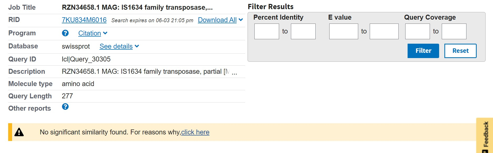
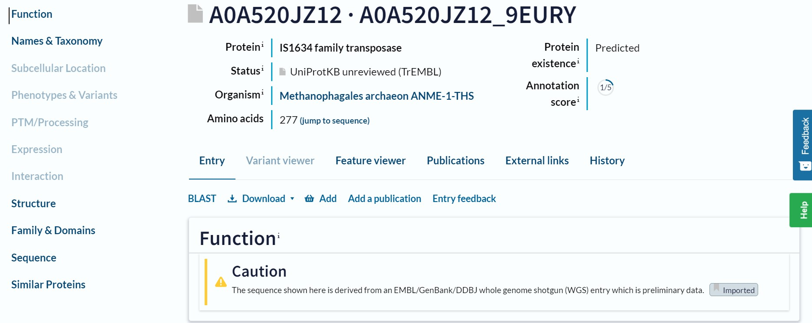
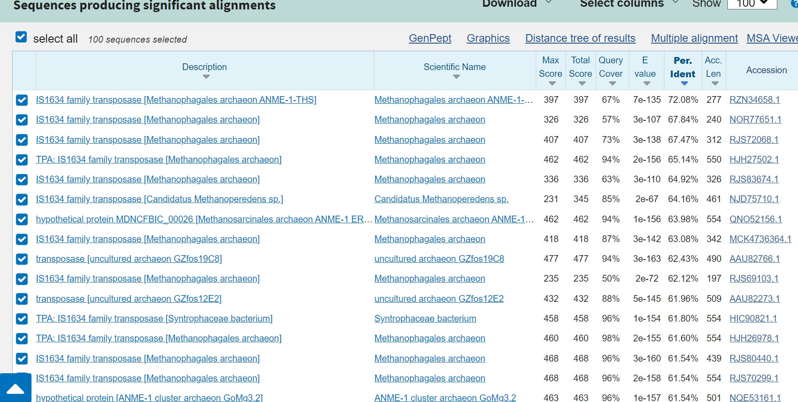
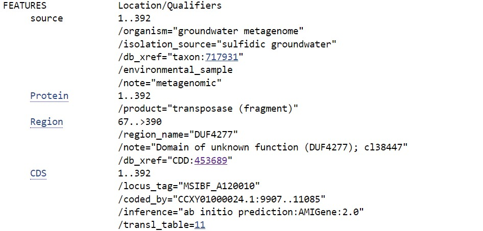
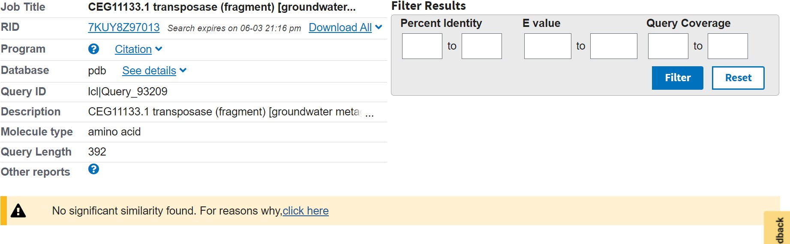

# S20

- **Avtor**: Tea Amidović
- **Datum izdelave**: 2023-26-05
- **Koda seminarja**: (s20)

---
## Vhodni podatek

Zaporedje: 
>S20
VYSHGPETIFMSVSASAYEKYKNGFFRFFHSDTTTISVEGEYEHEEGDLDERSIEITYGH
SKQGRSDLKQFIISSVMCGGAPAFIKALSGNTSDKNHFREIAKQYGAQLK

---
## Rezultati analiz

### Identifikacija

**Protein**: transpozaza

**Organizem**: Methanophagales archaeon (Euryarchaeota)

**Potencialna funkcija proteina**: protein ima verjetno encimsko aktivnost; omogoča genomske preureditve in podvojitve genov

### Splošna karakterizacija
Zanimajo nas odgovori na naslednja vprašanja:

- Kje v izvornem organizmu/celici se protein nahaja?
Glede na to da arheje nimajo jedra, na osnovi same funkcije proteina (encima) lahko sklepamo da se najbrž nahaja v citoplazmi, kjer se pri arhejah nahaja genetski material.

- Katere post-translacijske modifikacije ima?
Proučevani protein (in tudi njegovi homologi) nimaju anotiranih post-translacijskih modifikacij.

- Če želimo pripraviti protein v rekombinantni obliki, kateri gostiteljski organizem je najbolj smiselno izbrati in kateri del proteina bi izražali?
Glede na homologe, verjetno bi bilo smisleno uporabiti bakterijski organizem, kot je Syntrophaceae bacterium; verjetno bi izražali DUF4277 (ak ostanki 19-124), vendar gre za domeno, katere funkcija še vedno ni določena.

- So znani kakšni homologi (ortologi, paralogi)? Kaj je znanega o njih (funkcija, modifikacije, regulacija, aktivno mesto, ...)?
So znani homologi, ampak so tudi slabo anotirani, post translacijskih modifikacij v UniProt-u ni. Znani ortologi so izraženi v bakterijah (Candidatus Methanoperedens sp., Syntrophaceae bacterium ). Funkcija, aktivno mesto in regulacija niso znani.

- Predstavlja naš protein encim ali gre za kak drug protein?
je encim

  - Če gre za encim – ali je aktivno mesto v primerjavi z aktivnimi homologi ohranjeno?
Aktivno mesto ni označeno.

- Kaj so najbolj ohranjene regije v skupini, ki jo predstavlja ta protein in njegovi homologi?
Ohranjena je ena domena ( domena z neokarakterizirano funkcijo DUF4277); ista domena je ohranjena pri homologih.

- So v zaporedju kakšne ponavljajoče se regije oz. motivi?
Ne.

- S katerimi proteini ali drugimi molekulami bi lahko ta protein potencialno interagiral?
Ni znanih interakcij.

### Strukturna katakterizacija
Zanimajo nas odgovori na naslednja vprašanja:

- Je znana struktura tega proteina ali njegovega dela?
Ni eksperimentalno določene strukture. Obstaja AlphaFold predvideni model.

- Je znana struktura homologov? Katerih?
Ni znane strukture homologov.

- Pripravite model proteina oz. njegovega dela, ki bi predstavljal funkcionalen topen protein.

- Primerjajte model oz. eksperimentalno strukturo z eksperimentalno strukturo homologa, osredotočite se na funkcijsko pomembne regije.
Funkcijsko pomembnih regij ni; ne moremo jih primerjati med sabo.

