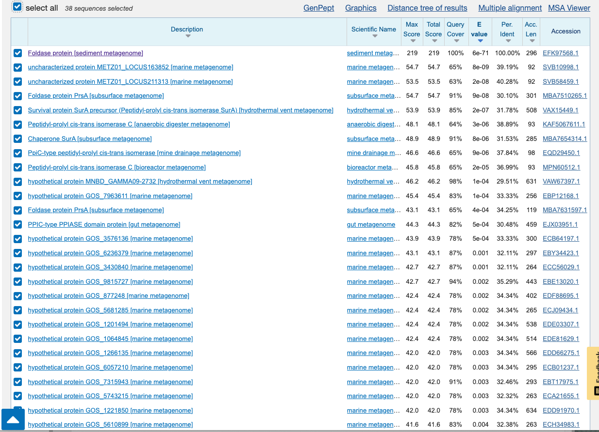
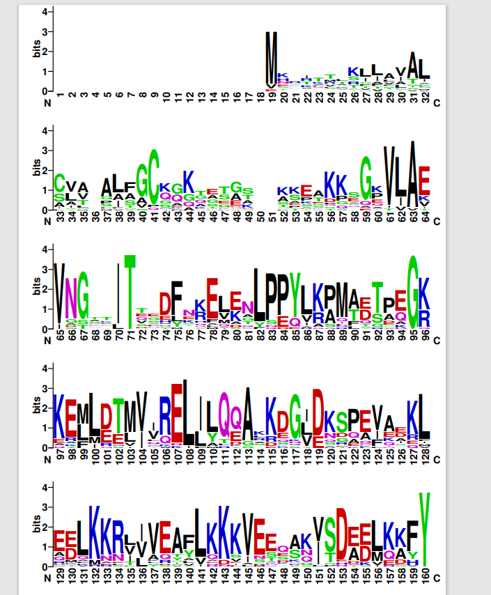
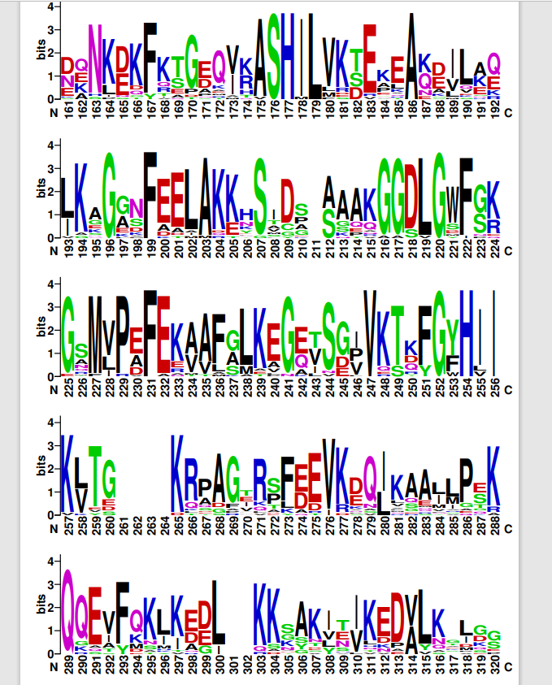
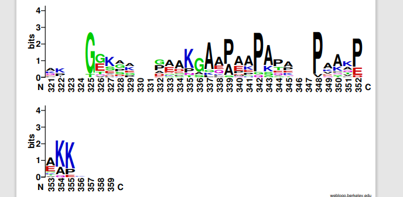
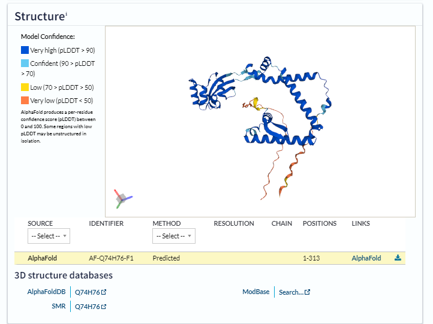

# S26

- **Avtor**: Karidia Kolbl
- **Datum izdelave**: 2023-05-26
- **Koda seminarja**: S26

---
## Vhodni podatek

Zaporedje: 

```
SILLEALLADVASKSPSLTDESLRAVYNASPEQFRTGPRVKVSHMLFRDRARAEEMLRRI
GEGEPFEALMKETGAYEGEVAADLGDIGRGNFVREFEAAAFGAKAGQVVG

```
## Rezultati analiz

### Identifikacija

**Protein**: Foldaza (Foldase protein)

**Organizem**: Gre za sedimentni metagenom in glede na najdene homologe z metodo blastp (zbirka nr) sklepam, da bi se hipotetično lahko nahajal v organizmu *Deltaproteobacteria bacterium* ali kakšni drugi bakteriji.

**Potencialna funkcija proteina**: peptidil-prolil cis-trans izomeraza

Identifikacija je bila narejena z uporabo NCBI BLAST, metoda blastp (v zbirki env_nr), pri čemer je bil najden en zadetek s 100% ujemanjem in 100% query cover-jem.

Tabela zadetkov:



Koda zapisa z BLAST identificiranega proteina: GenBank [EFK97568.1](https://www.ncbi.nlm.nih.gov/protein/EFK97568.1?report=genbank&log$=prottop&blast_rank=1&RID=71NRF1NT016); podano je celotno zaporedje

Aminokislinsko zaporedje:

```
MRFEEKRPMRRLLIFGMILAVAASACGEGPGKGKQGKILAIVDGEAITEEMLHREAEGLPPYVRPILDTS
AGRARFLESVITRDLLLREALRRGIDRRPEVAIQLSMKRKSILLEALLADVASKSPSLTDESLRAVYNAS
PEQFRTGPRVKVSHMLFRDRARAEEMLRRIGEGEPFEALMKETGAYEGEVAADLGDIGRGNFVREFEAAA
FGAKAGQVVGPVKTTYGFHLIKVYSKRPGGIRSFEEVKPQLLEEQRETAQREAFETLVAGLRKASTVHVL
VEPGGGGKDAPAAPG

```

### Splošna karakterizacija

#### Lokalizacija proteina in post-translacijske modifikacije

Tabela najdenih homologov:


Z iskanjem homologov z blastp po zbirki UniProtKB/Swiss-Prot ne dobimo dovolj velike podobnosti. Če iščemo v zbirki non-reduntant protein sequences pa le najdemo homologijo, kar tudi lahko vidimo na zgornji sliki. 

Zadetki, ki jih dobimo, pokrivajo celotno iskalno aminokislinsko zaporedje.


Naredila sem blastp tudi v samem UniProtu, kjer pa dobimo sicer manjše procentno ujemanje, pa vendar še gre za homologijo. Ti proteini so že bolje anotirani, lahko identificiramo signalno zaporedje in preostalo sekvenco.


V Genbank za izhodni protein ni podatka o tem, kje naj bi se nahajal, vendar bi glede na njegovo funckijo sklepala, da v citoplazmi.

Zapisa o post-translacijskih modifikacijah pri izhodnem proteinu ni.

Za pripravo proteina v rekombinantni obliki bi uporabila kot gostiteljski orgaizem bskterijske celice ter zaporedje od aminokislinskega ostanka na 26 mestu, saj sem iz poravnave sklepala, da signalni peptid poteka od 1. do 25. ak. ostanka.


Naredila sem poravnavo nekaj naključnih homolognih zaporedij vključno z izhodnim proteinom kar v UniProtu, kar je možno videti na priloženi sliki. Nato sem aminokislinsko zaporedje svojega proteina vstavila v program SignalP-6.0 in dobila takšen rezultat:


Opazila sem M kot začetno aminokislino, ki je kot vemo značilna za signalni peptid ter predvideno, ter da verjetno poteka nekje do 25. aminokisline, kjer se nahaja A (Ala).

Homologi, ki sem jih dobila pri iskanju z blastp so večinoma peptidil-prolil cis-trans izomeraze. Pod PTM/Processing lahko pri nekaterih opazimo, da so se v procesu modificiranja nanj pritrdile lipidne molekule oz. maščobne kisline, tako da gre za lipoproteine. Njihovi signalni peptidi so zaporedja nekje prvih 20-tih aminokislinskih ostankov, ki se prav tako začnejo z Met, torej predviden signalni peptid mojega proteina nekako sovpada z tistimi pri homologih. Aktivna mesta homologov niso posebej izpostavljena. 

Izhodni protein je encim, ki pretvarja molekule iz ene izomerne oblike v drugo. Njegovo aktivno mesto prav tako ni posebej izpostavljeno. Lahko pa v poranvnavi proteina s homologi iz UniProta vidimo domeno od 148. do 237. aminokislinskega ostanka, ki je precej ohranjena ter podobna med samimi homologi, prav tako je tukaj visoka podobnost z mojim proteinom.
Če pogledamo to domeno pri vsakem izmed homologov posebej, lahko opazimo, da je zanjo značilna izomerazna dejavnost, natančneje je označena kot domena PpiC. 

Ohranjenih regij med samimi homologi je precej, se pa v veliko aminokislinskih ostankih z njimi ujema tudi moj protein. Izbrala sem nekaj naključnih homologov in svoj protein, izvozila fasta format vseh teh zaporedij ter to vstavila v program COBALT NCBI, shranila poravnavo ter uporabila program Weblogo: 





Glede na to, da je moj protein foldaza, interagira z raznimi (razzličnimi) proteini.

### Strukturna karakterizacija

Protein lahko poiščemo v UniProtu-u z isto kodo kot v GenBank, ki sem jo podala zgoraj. Poznana je struktura celotnega proteina, narejena s programom AlphaFold:


Prav tako so znane strukture večine homologov, prilagam sliki proteinov s kodama Q39PS1 in Q74H76:



