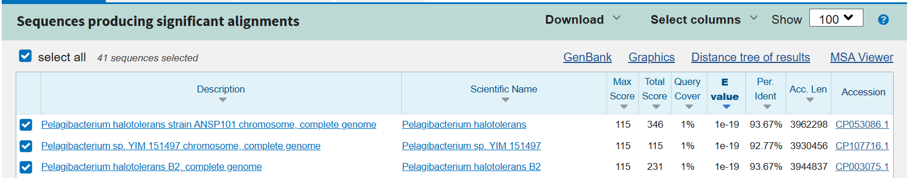
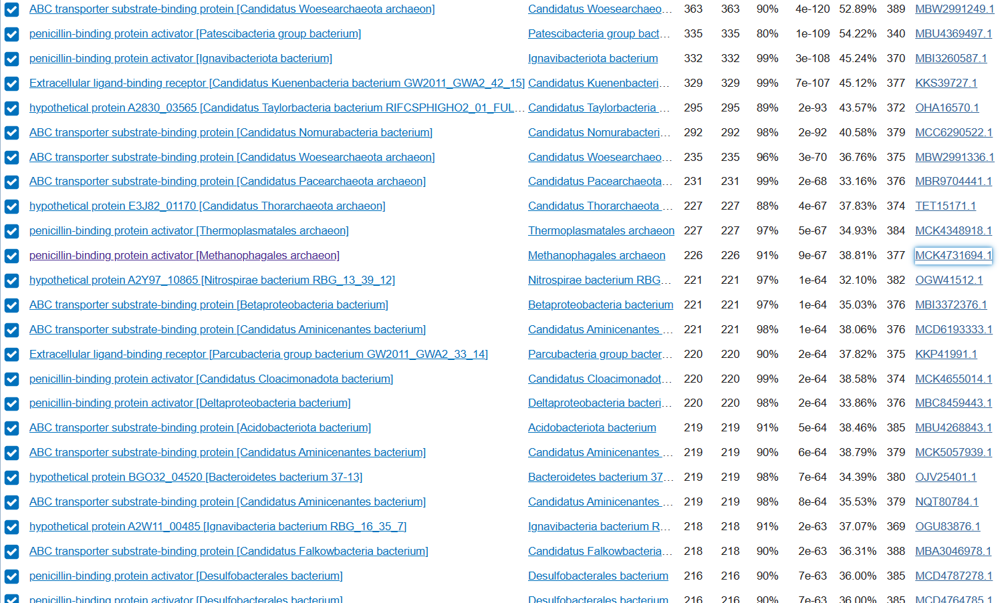
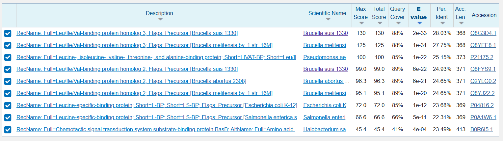
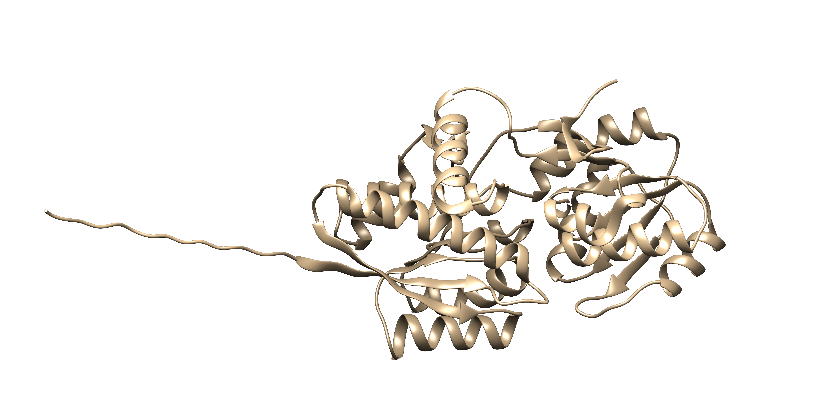
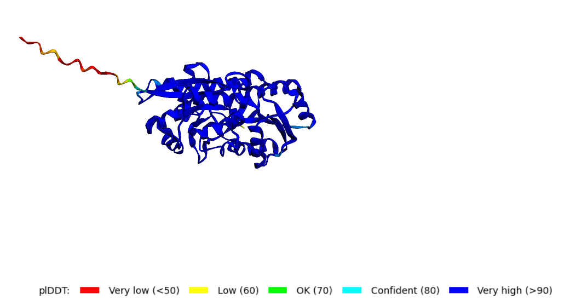
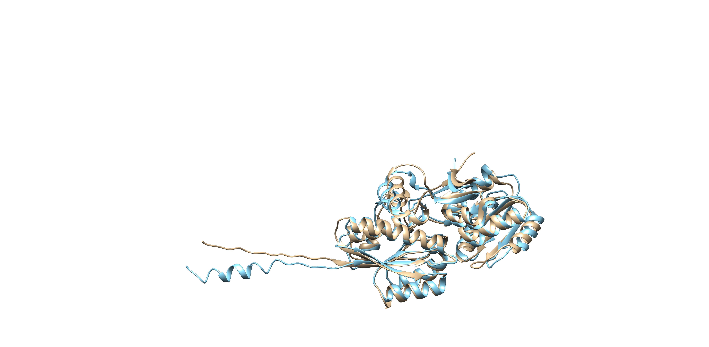

# S27

- **Avtor**: Žiga Koren
- **Datum izdelave**: 2023-05-26
- **Koda seminarja**: S27

---

## Vhodni podatek

Zaporedje:

```
PQSSSVALAMAPVVEENKVILMSTGAQSDTISDAGDYIFRVQTNTKQEAEFFAEYIHDQT
DHEKIDLLVMNTAYANSLIDAFVRQGIYFNQIEKFDSKETDFRTHLNRIK
```

---
## Rezultati analiz

### Identifikacija
Identifikacija se nanaša na protein, ki ga kodira gen, katerega del predstavlja  [zaporedje](#vhodni-podatek).

**Protein**: Ekstracelularni ligand-vezavni receptor

**Organizem**: Sedimentni metagenom. Vzorec je bil najden v bližini Laguna de Carrizo, v osrednji Španiji. Po uporabi blastn, bi ugibal, da je najbližji zadetek Pelagibacterium halotolerans, saj ima visok percent identity, čeprav E vrednost ni idealna.  



**Potencialna funkcija proteina**: Receptor za ligande, najverjetneje ABC transporter

### Splošna karakterizacija

Da bi protein identificiral iz danega zaporedja, sem uporabil blastp z uporabljenimi privzetimi nastavitvami, iskal sem po zbirki metagenomskih proteinov (env_nr) in našel zadetek s 100% identičnostjo in z E-vrednostjo 9e-74.


Koda zapisa: [EFK97722.1](https://www.ncbi.nlm.nih.gov/protein/EFK97722.1?report=genbank&log$=prottop&blast_rank=1&RID=79B88W5V013)


- Kje v izvornem organizmu/celici se protein nahaja?

Izven celice, lokacijo predlaga že samo ime najdenega proteina (ekstracelularni protein)

- Katere post-translacijske modifikacije ima?

Protein najverjetneje nima post-translacijskih modifikacij. To sem določil po dveh poteh:

a) Protein sem dal v blastp in kot bazo podatkov uporabil Swiss-Prot, nato sem preveril tri proteine z največjimi ujemanji, pri nobenem od njih nisem v anotaciji zasledil PTM.

b) Uporabil sem [Expasy FindMod](https://web.expasy.org/findmod/) in program ni našel možnih mest, kjer bi potekle PTM. 


- Če želimo pripraviti protein v rekombinantni obliki, kateri gostiteljski organizem je najbolj smiselno izbrati in kateri del proteina bi izražali?

Glede na to, da protein nima PTM, bi uporabil bakterijski ekspresijski sistem, saj bi bil najcenejši.
Izrazil bi del proteina, ki ne vsebuje signalnega peptida. Z uporabo orodja [SignalP](https://services.healthtech.dtu.dk/services/SignalP-6.0/) sem z 98.99% zagotovostjo določil cepitveno mesto med 20.in 21. aminokislinskim ostankom, tako da bi izrazil protein od vključno 21. aminokislinskega ostanka dalje.


- So znani kakšni homologi (ortologi, paralogi)? Kaj je znanega o njih (funkcija, modifikacije, regulacija, aktivno mesto, ...)?

Homologe sem iskal z blastp, po zbirki nr (non-redundant). Za določitev homolognosti sem uporabil dva kriterija:
a) 20%< Percent identity < 35% (cona somraka) oz. >35%: najverjetneje homologa 
b) E value < 0.01
Kar vrne ogromno zadetkov, od drugih proteinov, ki vežejo razne ligande, do aktivatorjej le-teh. To je smiseln rezultat, saj lahko pričakujemo, da bo veliko organizmov rabilo proteine za vezavo raznih ligandov.



Postopek kasneje ponovim z iskanjem po zbirki SwissProt, da lahko najdem bolje anotirane homologe. 

Za homologe v zbirki nr ni znano pretirano dosti, za tiste v SwissProt pa tudi ne preveč, večina jih ima samo napovedano strukturo.

Z iskanjem po blastp in po predlaganem organizmu nisem našel nobenih zadetkov, zato sklepam, da protein nima paralogov. Z uporabo orodja OrthoDB tudi nisem našel nobenega ortologa. 

- Predstavlja naš protein encim ali gre za kak drug protein?

Naš protein ne predstavlja encima, ampak zunajcelični receptor, na katerega se lahko vežejo ligandi. Najverjetneje gre za transportni sistem tipa ABC, odgovoren za vnos amino kislin, peptidov in anorganskih ionov.
  
- Kaj so najbolj ohranjene regije v skupini, ki jo predstavlja ta protein in njegovi homologi?

Da bi ugotovil, katere so najbolj ohranjene regije, sem protein pognal skozi UniProt blast, nato pa naredil alignment, kar v orodju UniProt, da bi videl, katere regije so najbolj ohranjene.


Največ ohranjenih ak ostankov je v začetnih delih proteina, takoj za signalnim peptidom.


V osrednjem delu zaporedja pride do dosti manj ujemanj, čeprav so še vedno prisotna.


V končnem delu zaporedja je spet poravnav nekoliko več.


Zelo težko bi govoril o kakršnihkoli signifikantnih ujemanjih, vsaj na nivoju regij in ne samo aminokislinskih ostankov. Če so ti proteini homologi, bom verjetno pričakoval večje ujemanje na območju sekundarne strukture, če ga še ne vidim pri zaporedju.


- So v zaporedju kakšne ponavljajoče se regije oz. motivi?

Motivi:
Analiza z orodjem [MOTIF search](https://www.genome.jp/tools/motif/) ni pokazala motivov, ki bi se v proteinu ponavljali. 


Regije:
Analiza z orodjem [RADAR](https://www.ebi.ac.uk/Tools/pfa/radar/) prav tako ni našla nobenih ponovljenih regij.


- S katerimi proteini ali drugimi molekulami bi lahko ta protein potencialno interagiral?

Že pred podrobnejšo analizo lahko sklepam, da bo protein interagiral z drugimi molekulami, saj ima napovedano vlogo transporterja, specifično ABC transporterja, torej mora priti do nekih interakcij z drugimi peptidi. 

Za analizo sem uporabil orodje IntAct. V interaktomu za predlagan organizem nisem našel ABC transporterja, zato sem preizkusil organizem Brucella suis, kjer se skriva moj najbolje anotiran homolog. Tudi to iskanje ni vrnilo ničesar bolj tehtnega. Preizkušal sem z več smiselnimi organizmi, a nikjer nisem našel specifičnega proteina, ki sem ga iskal. 


### Strukturna katakterizacija

Zanimajo nas odgovori na naslednja vprašanja:

- Je znana struktura tega proteina ali njegovega dela?

Ne, protein nima znane strukture.

- Je znana struktura homologov? Katerih?

Da bi našel strukture homologov, sem te šel iskati z uporabo blastp, iskal sem po zbirki SwissProt, da bi se dokopal do bolje anotiranih homologov. Za identifikacijo homologov sem uporabil iste kriterije kot pri iskanju po zbirki nr, torej E vrednost manjo od 0.01 in percent identity višji od 20%. 



Iskanje vrne devet zadetkov, s klikom na zgornjega lahko pridem do njegove kode dostopa za UniProt, kjer najdem tudi njegovo strukturo. Struktura je samo nepovedana, ne pa eksperimentalno določena. 


- Pripravite model proteina oz. njegovega dela, ki bi predstavljal funkcionalen topen protein.

Za pripravo modela proteina sem uporabil [AlphaFold2_mmseq2](https://colab.research.google.com/github/sokrypton/ColabFold/blob/main/AlphaFold2.ipynb). 



Repek z nizko verjetnostjo sem najprej pripisal signalnemu peptidu,  zato sem zaporedje proteina ponovno pognal skozi AlphaFold, tokrat brez signalnega peptida. Rezultati niso bili pretirano različni, torej sklepam, da pomanjkljivost v strukturi izhaja iz C-končne domene in ni povezana z vključitvijo signalnega peptida.



Za nadaljnjo primerjavo sem uporabil model brez signalnega peptida. 

- Primerjajte model oz. eksperimentalno strukturo z eksperimentalno strukturo homologa, osredotočite se na funkcijsko pomembne regije.

Na priloženi sliki sem v programu Chimera naredil poravnavo med svojim proteinom in najboljše anotiranim homologom. Iz CDS svojega proteina sem razbral, da je ključna vezavna regija, ki jo gradijo aminokislinski ostanki 40-318. Zatem sem naredil poravnavo proteinov z UniProtom in ugotovil, da za primerjavo regij moram obravnavati homologove ostanke 26-310.


Moj protein je obarvan bež, homolog pa s svetlo modro barvo.



Ustrezne regije sem nato tudi obarval (pri svojem proteinu z rožnato, pri homologu z rumeno) in ju ponovno poravnal. Rezultati so na spodnji sliki.


Večinoma se strukturi med seboj skladata, tudi v funkcionalni pomembni regiji, zato lahko še bolj potrdim homolognost med njima. 