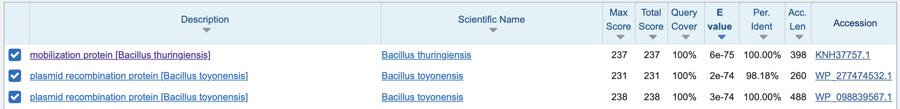
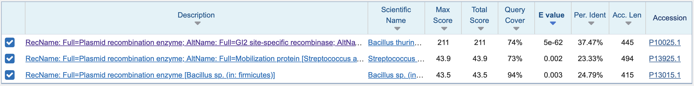
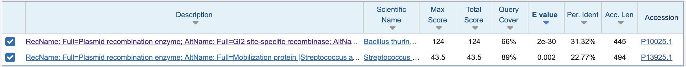
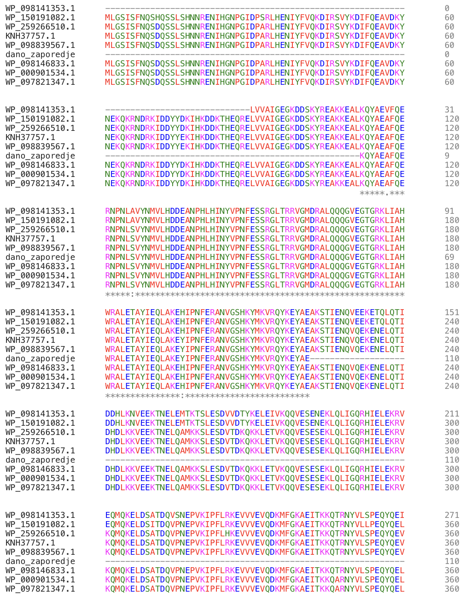
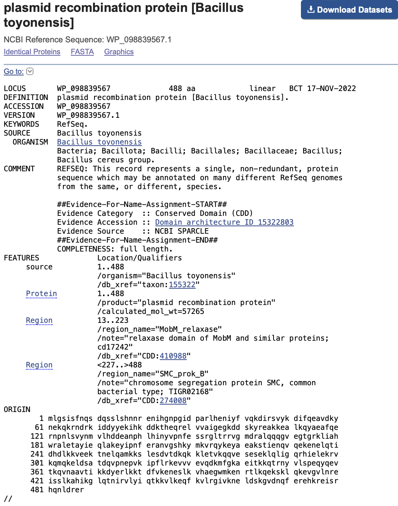
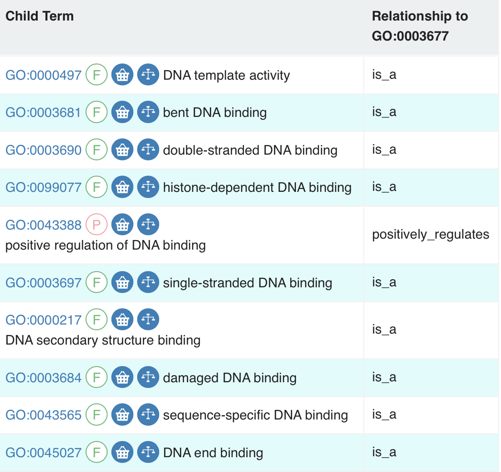
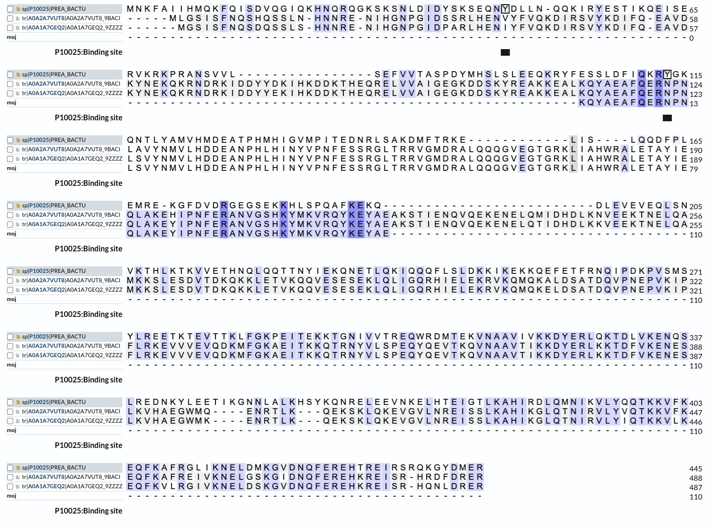
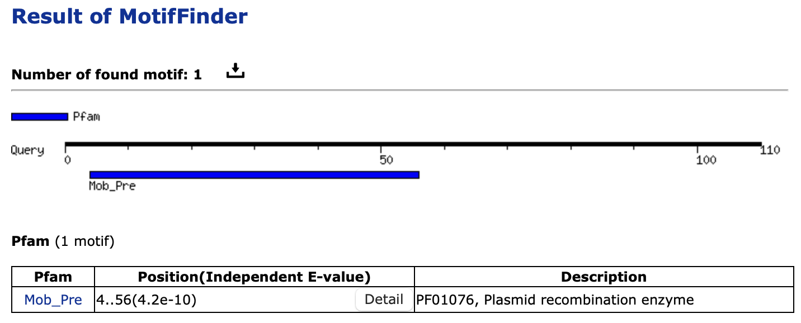
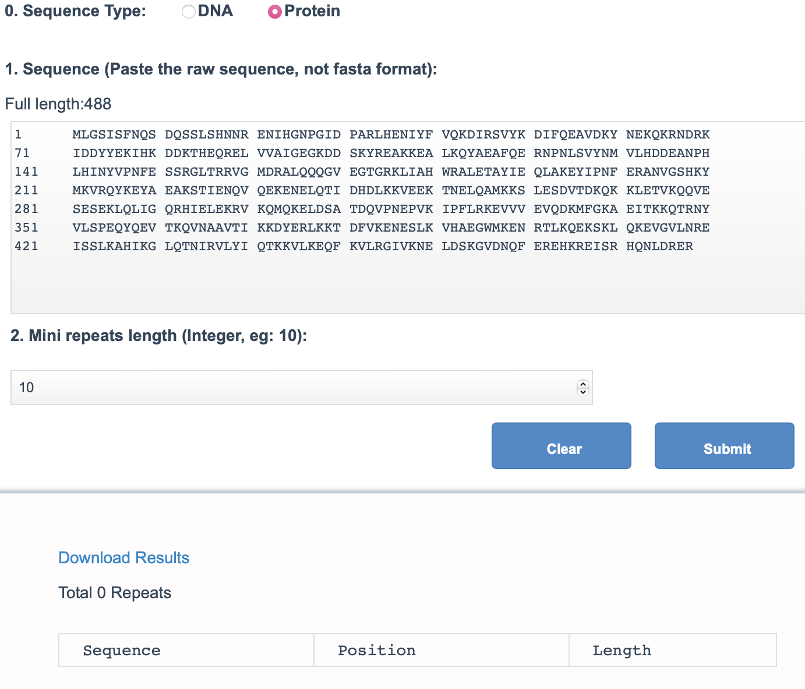
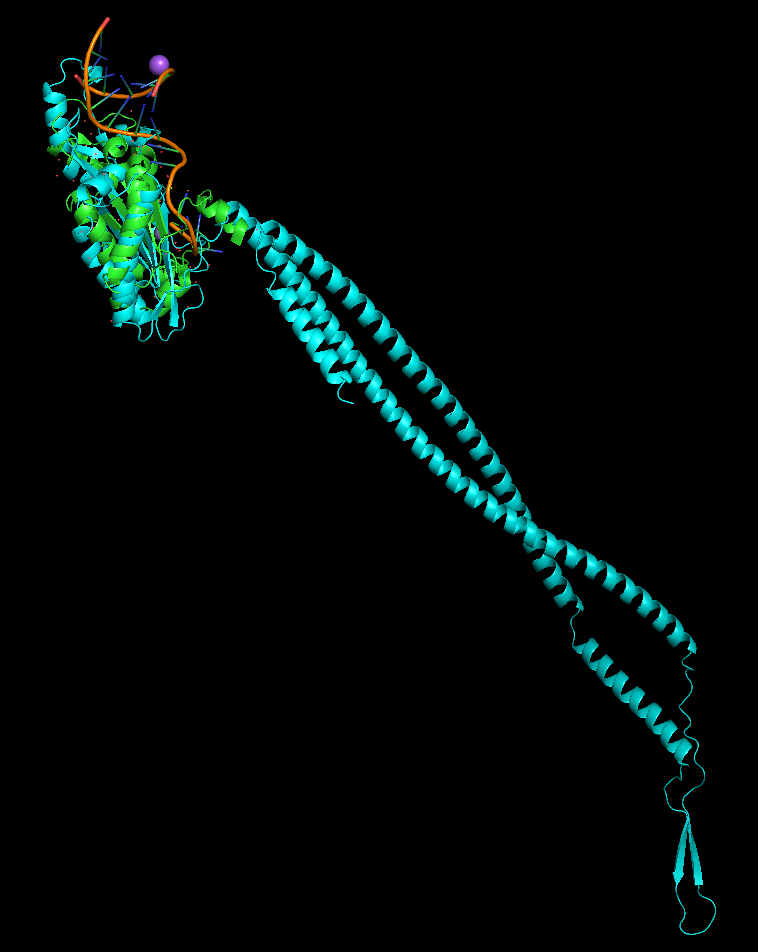

# S28

- **Avtor**: Tinkara Korošec
- **Datum izdelave**: 2023-05-25
- **Koda seminarja**: S28

---
## Vhodni podatek

Zaporedje: 
```
KQYAEAFQERNPNLSVYNMVLHDDEANPHLHINYVPNFESSRGLTRRVGMDRALQQQGVEGTGRKLIAHWRALETAYIEQLAKEYIPNFERANVGSHKYMKVRQYKEYAE
```
---
## Rezultati analiz

### Identifikacija

* Postopek identifikacije

Za identifikacijo sem najprej izvedla blastp iskanje nr podatkovne zbirke, z uporabo vhodne aminokislinske sekvence.



Nato sem proteina s 100% ujemanjem in najnižjo E vrednostjo uporabila za blastp iskanje UniProt/SwissProt podatkovne zbirke. 




Oba imata največje ujemanje z istim anotiranim proteinom [P10025](https://www.uniprot.org/uniprotkb/P10025/entry#ptm_processing).
Nato sem proteina s 100% ujemanjem in še nekaj drugih iz prvega blastp iskanja skupaj z vhodnim zaporedjem poravnala z orodjem Clustal Omega. 




Najdaljšo poravnavo, brez verzeli in ujemanjem z našim zaporedjem predstavlja protein [WP_098839567.1](https://www.ncbi.nlm.nih.gov/protein/WP_098839567.1?report=genbank&log$=prottop&blast_rank=3&RID=6XZ7VW05013), ki je tudi eden izmed proteinov z 100% ujemanjem in najmanjšo E vrednostjo. Prav tako se njegova sekvenca začne z metioninom, vendar z orodjem SignalP dobimo podatek, da je verjetnost signalnega peptida zelo nizka.




* Zaključki identifikacije

**Protein**: plazmidni rekombinacijski encim ali mobilizacijski protein

**Organizem**: *Bacillus toyonensis*

**Potencialna funkcija proteina**: rekombinacija DNA

### Splošna karakterizacija
1. **Lokacija v celici:**

V bakteriji se encim nahaja v citoplazmi. 

2. **Posttranslacijske modifikacije in izražanje:**

PTM-jev ni. Protein bi bilo najbolj smiselno izražati v bakteriji, saj drugi organizmi načeloma plazmidov ne nosijo, izražali bi protein brez začetnega signalnega peptida. 

3. **Homologi:**

Znani homologi so bakterije *Bacillus sp.* bolj natančno *Bacillus thuringiensis*, ki je preko recipročnega blasta potrjen ortolog. 
Tako protein, ki se z našim v največji meri ujema in njegov ortolog imata največje ujemanje z anotiranim proteinom [P10025](https://www.uniprot.org/uniprotkb/P10025/entry#ptm_processing) iz bakterije *Bacillus cereus*. Ta navedenih PTMjev ne vsebuje, kar je smiselno, saj je protein bakterijski in se nahaja v citoplazmi.

4. **Regije in delovanje proteina:**

Protein vsebuje dve regije glede na označbe v GenBanku. Del za signalnim peptidom kodira MobM relaksazo, ki je zadolžen za zareze na eni od verig v denaturirani dsDNA, spada v razred mobilizacijskih relaksaz. Sledi mu protein za segregacijo kromosomov SMC. Ti so esencialni za uspešen prenos kromosoma med replikacijo in segregacijo genoma. Regiji sta smiselni glede na funkcijo, ki jo protein izvaja - integracija ali izrezovanje plazmida iz genoma gostiteljske celice. 


Protein [P10025](https://www.uniprot.org/uniprotkb/P10025/entry#ptm_processing) ima anotirano molekulsko funkcijo, da encim pozitivno regulira vezavo DNA. 



Po izvedbi BLAST iskanja preko UniProt-a sem poravnala zaporedja neanotiranih proteinov z največjim ujemanjem z [WP_098839567.1](https://www.ncbi.nlm.nih.gov/protein/WP_098839567.1?report=genbank&log$=prottop&blast_rank=3&RID=6XZ7VW05013), anotiranega [P10025](https://www.uniprot.org/uniprotkb/P10025/entry#ptm_processing) in vhodnega zaporedja.

Vezavno mesto v anotiranem ortologu označuje tirozinski aminokislinski ostanek na mestih 45 in 113. Le to pa v našem proteinu ni ohranjeno, prav tako v neanotiranih homolognih proteinih. Vezavno mesto Y45 v nobeni iteraciji ni ohranjeno, medtem ko se Y113 pri ostalih izmenja z asparaginom. 



5. **Ohranjene regije:**

Najbolj ohranjena regija je ovita vijačnica. Kar je smiselno, saj ta regija stabilizira protein in omogoča združenje domen proteina. To je pomembno, saj mora biti protein sposoben prepoznati in interagirati s specifičnimi DNA zaporedji, da lahko integrira ali izreže plazmide iz gostiteljevega genoma.


6. **Ponavljajoče se regije in motivi:**

Sekvenca vsebuje motiv Mob_Pre. To je plazmidni rekombinacijski encim (Pre), znan tudi kot mobilizacijski protein konjugacije (Mob). Tako vhodno zaporedje kot [WP_098839567.1](https://www.ncbi.nlm.nih.gov/protein/WP_098839567.1?report=genbank&log$=prottop&blast_rank=3&RID=6XZ7VW05013) ne vsebujeta ponovitev. 





8. **Interakcije proteina z drugimi proteini in molekulami:**

Protein interagira s plazmidno DNA.

### Strukturna katakterizacija
1. **Struktura:**

Struktura za protein v RCSB PDB pri bakteriji *Bacillus toyonensis* ni znana, je pa znana struktura homologov MobM relaksazne domene pri bakteriji *Streptococcus agalactiae*.

2. **Model proteina:**

Model [WP_098839567.1](https://www.ncbi.nlm.nih.gov/protein/WP_098839567.1?report=genbank&log$=prottop&blast_rank=3&RID=6XZ7VW05013) ustvarjen z uporabo orodja AlphaFold2_mmseq2 in prikazan v PyMOL-u.


3. **Primerjava s homologom:**

Model [WP_098839567.1](https://www.ncbi.nlm.nih.gov/protein/WP_098839567.1?report=genbank&log$=prottop&blast_rank=3&RID=6XZ7VW05013) in homolognega proteina [4LVK](https://www.rcsb.org/structure/4LVK), prikazan in poravnan v PyMOL-u.



