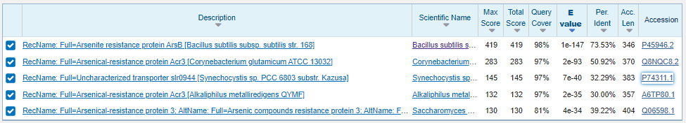
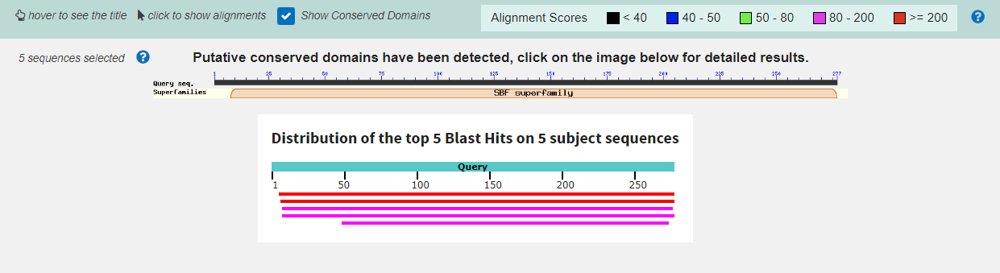
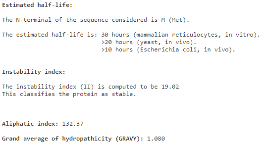
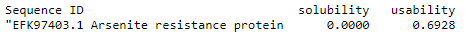
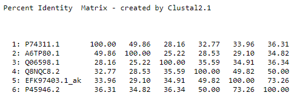
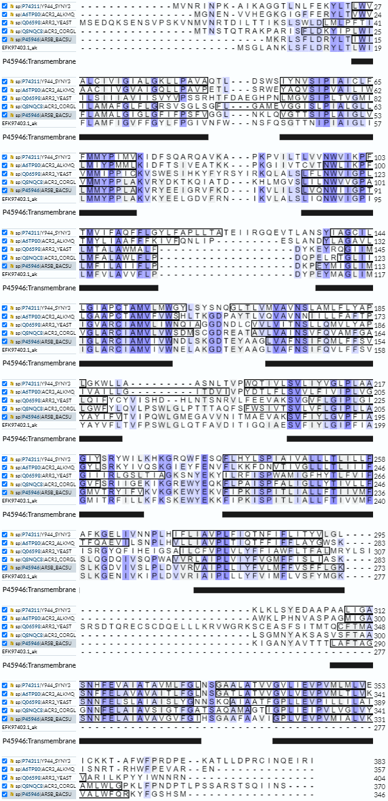
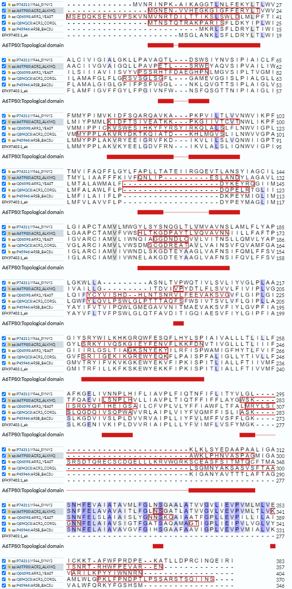
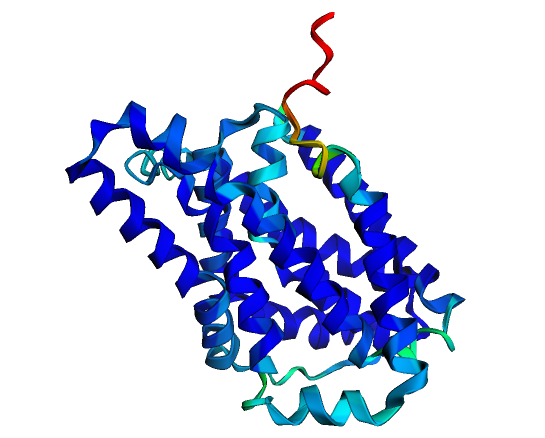

# S30

---
- **Avtor**: Deni Krašna
- **Datum izdelave**: 2023-05-26
- **Koda seminarja**: S30

---
## Vhodni podatek

```
YMAGLIMIGLARCIAMVIVWNELAKGDTEYAAGLVAFNSIFQVLFFSVYAYVFLTVFPSW
LGLQTFAVDITIGQIAESVFIYLGIPFIAGMITRFILLKFKSKEWYEKKF
```
---
## Rezultati analiz

### Identifikacija
Identifikacija se nanaša na protein iz sekvence metagenoma, katerega del predstavlja [zaporedje](#vhodni-podatek).

**Protein**: Arsenite resistance protein ArsB

**Organizem**: [*Bacillus subtilis*](https://en.wikipedia.org/wiki/Bacillus_subtilis)

Iskanje nam ponudi celo podatek o podvrsti [*subtilis str. 168*](https://www.genome.jp/kegg-bin/show_organism?org=bsu). Ta podatek je mogoče manj uporaben, saj je ujemanje med zaporedjema le okoli 75%, kar pomeni, da obstaja možnost da podvrsta ni tista, v kateri bi našli [zaporedje](#vhodni-podatek).

**Potencialna funkcija proteina**: Arzenatna črpalka, oziroma njen del.

**Identifikacija** je bila narejena z uporabo NCBI BLAST, natančneje z blastp (zbirka env_nr). Zaporedje je bilo zajeto  v celoti v več kot dvakrat daljšem zaporedju. Ti dve zaporedji sta si v celoti podobni. Pohvalita se lahko z kar 100,0% ujemanjem in E vrednostjo < 1e-72.

Tabelarični prikaz zadetkov:


Koda zapisa z BLAST identificiranega proteina: NCBI Protein: [EFK97403.1](https://www.ncbi.nlm.nih.gov/protein/EFK97403.1). Gre za delno zaporedje (Arsenite resistance protein, partial (sediment metagenome).

**Aminokislinsko zaporedje:**
```
>EFK97403.1_ak
MSGLANKLSFLDRYLTLWIFLAMFIGVFFGYLFPGIVNFWNSFQSGTTNIPIAIGLILMMYPPLAKVKYE
ELGDVFRNIKVLALSLIQNWVIGPILMFVLAVVFLPDYPEYMAGLIMIGLARCIAMVIVWNELAKGDTEY
AAGLVAFNSIFQVLFFSVYAYVFLTVFPSWLGLQTFAVDITIGQIAESVFIYLGIPFIAGMITRFILLKF
KSKEWYEKKFIPKISPITLIALLFTIVVMFSLKGENIVKIPLDVVRIAIPLLLYFVIMFLVSFYMGK
```
### Splošna karakterizacija

Za zapis NCBI Protein [EFK97403.1](https://www.ncbi.nlm.nih.gov/protein/EFK97403.1) ni na voljo pripisov o značilnostih proteina. Za nadaljnjo analizo zato uporabimo dobro anotirana zaporedja proteinov z aminokislinskim zaporedjem, podobnim aminokislinskemu zaporedju identificiranega proteina. Zato z iskanjem z blastp (privzete nastavitve) po zbirki Uniprot/SwissProt, ki vsebuje dobro anotirane zapise, poiščemo [EFK97403.1](https://www.ncbi.nlm.nih.gov/protein/EFK97403.1)-u podobna zaporedja. Izkaže se, da takim kriterijem bolj ali manj ustreza 5 zaporedji, vse izmed katerih so okarakterizirane kot arzenatni transporter. 



Vsa zaporedja, z izjemo [Q06598.1](https://www.uniprot.org/uniprotkb/Q06598/entry), (taksnonomsko) spadajo v isti [Klad](https://sl.wikipedia.org/wiki/Klad) z imenom [*Terrabacteria*](https://en.wikipedia.org/wiki/Terrabacteria).
[Q06598.1](https://www.uniprot.org/uniprotkb/Q06598/entry) je evkariontskega (glivnega izvora).
Zadetki celovito pokrivajo iskalno aminokislinsko zaporedje, z manjšim odstopanjem na začetnem delu. Najbolj odstopa evkariontsko zaporedje [Q06598.1](https://www.uniprot.org/uniprotkb/Q06598/entry). 



Najbolj podobno zaporedje, s 73.53% identičnostjo na kar 98% velikem intervalu je [P45946.2](https://www.uniprot.org/uniprotkb/P45946/entry). Gre za (del) arzenatne črpalke iz organizma [*Bacillus subtilis*](https://en.wikipedia.org/wiki/Bacillus_subtilis).
Nahaja se v celični membrani, ki jo večkrat prebode in tvori sodčkasto strukturo, kar sovpada z njeno funkcijo transporterja oziroma črpalke. Obsega 346 aminokislinskih ostankov. Protein nima anotiranih post-translacijskih modifikacij, najbrž zato, ker je prokariontski, za katere je značilno, da nimajo niti signalnega peptida, niti N-glikozilacije, ki je s slednjim tesno povezana. To drži tudi za naš protein. 
Če se želimo še dodatno prepričati, lahko uporabimo [SignalP-6.0](https://services.healthtech.dtu.dk/services/SignalP-6.0/), ki nam napove signalni peptid. Kot je razvidno iz spodnjih slik nobeno izmed iskanih zaporedji nima predvidenega signalnega peptida.


> **_Opomba:_** *Liklehood* je vrednost med nič in ena, kjer ena zaznamuje 100 % verjetnost. *Other* pa, da morebitni signalni peptid ne spada v katerega od okarakteriziranih razredov, torej najverjetneje ne obstaja.

Dodam lahko še, da ima evkariontska različica, dve N-glikozilaciji, ki se ne pojavijo v nobeni izmed ostalih različic, in ju torej lahko smatramo kot neko evolucijsko prigodo. 


Razvidno je torej, da mesta N-glikozilacije (obkrožena s črno) zares niso ohranjena, kar je več, [BLOSUM62](https://en.wikipedia.org/wiki/BLOSUM) pravi, da je taka zamenjava izjemno neugodna.


Na tej točki lahko po logičnem sosledju trdimo, da [EFK97403.1](https://www.ncbi.nlm.nih.gov/protein/EFK97403.1) predstavlja del zaporedja arzenatne črpalke, klade bakterij, ki jih najdemo v zemlji. Potemtakem je tudi naš [vhodni podatek](#vhodni-podatek) (sicer še manjši) odsek tega transportnega proteina.

Glede na to, da imamo bakterijski protein, bi bilo smiselno uporabiti bakterijski ekspresijski sistem. Protein temelji na usidranosti v membrani, kjer skriva svojo aktivnost, zato bi bilo smiselno izraziti celotno zaporedje. Pri tem se je potrebno zavedati, da je metagenomsko zaporedje nepopolno in zato izrazimo zaporedje pridobljeno po BLAST-u. Glede na to, da je naš protein izrazito hidrofoben moramo še posebej paziti na agregacijo. Kljub temu, da je protein velik, je strukturno zaključen, zato  mislim, da exspresija lahko potekala tudi in vitro. [ProtParam](https://web.expasy.org/protparam/) se strinja. 


Protein je večinsko sestavljen iz nepolarnih aminokislinskih ostankov. Vsebuje pa tudi nekaj nabitih, ti so najbrž funkcijsko pomembni. Ker vsebuje le en cistein ni potrebno preveč paziti na redukcijsko okolje, zavedati se moramo le to, da se v oksidativnem matriksu lahko tvorijo dimeri. Glede na pI, se najoptimalneje odločimo za alkalno, vendar reduktivno okolje. Uporabimo lahko tudi kar [*E.coli*](https://sl.wikipedia.org/wiki/Escherichia_coli), kot so to celo storili raziskovalci, ko so izražali sorodne proteine. Uporabili bi seveda lahko kakšen organizem iz [Klada](https://sl.wikipedia.org/wiki/Klad)[*Terrabacteria*](https://en.wikipedia.org/wiki/Terrabacteria), a so ti najbrž manj priročni od [*E.coli*](https://sl.wikipedia.org/wiki/Escherichia_coli). Ravno tako bi lahko uporabili evkariontske ekspresijske sisteme, še posebej glivne. Ti so seveda bolj potratni, tako časovno kot denarno. Menim tudi, da zaradi domenske nekompleksnosti, različna raba kodonov (v različnih organizmih) ne bi povzročala prevelikih preglavic.



[ProtParam](https://web.expasy.org/protparam/) nam razkrije celo stabilnost proteina v različnih ekspresijskih sistemih. Napove pa nam tudi hidrofilno naravo (GRAVY > 0) tega proteina. 

Boljši vpogled dosežemo z uporabo [NetSolP-1.0](https://services.healthtech.dtu.dk/services/NetSolP-1.0/)(privzete nastavitve), ki nam izračuna topnost in uporabnost proteina izraženega v [*E.coli*](https://sl.wikipedia.org/wiki/Escherichia_coli).



Uporabnost ni ravno blešča, po vsej verjetnosti, zaradi ničelne topnosti. 

> **_Opomba:_** V uporabnost je zajeta zmožnost čiščenja in izražanja, ki sta obe tesno povezani z topnostjo. 


Še lažje si ta fenomen predstavimo z orodjem [ProtScale](https://web.expasy.org/protscale/), ki nam izriše graf povprečne hidrofobnosti določene (izbrane) regije. To regijo žargonsko imenujemo **drseče okno**. Uporabil sem skalo po Kyte-Doolitle, pri čemur sem velikost drsečega okna spremenil na 19, saj je to ravno število aminoskislinskih ostankov potrebnih za posamezen prehod membrane.

 

Že na prvo žogo opazimo da se krivulja giblje pretežno v hidrofobnem področju. Opazimo 8 večjih pertrubacij v hidrofobno smer. Vsako  lahko pripišemo vijačnici, ki je zakopana v membrani. Kar od tega izrazito odstopa so zavoji, ki so izpostavljeni topilu.


Znanih in anotiranih je 5 proteinov, ki bi vse lahko imenovali homologi, natančneje ortologi, saj se vsi pojavljajo v različnih organizmih.



Prag, da proteina imenujemo kot homologa je sicer 30%, vendar so te meje bile le vodilo. Vse poravnave z [EFK97403.1](https://www.ncbi.nlm.nih.gov/protein/EFK97403.1) tega praga ne dosegajo, pa vseeno vidimo povezavo (visok procent identičnosti, glede na [Clustal Omega](https://www.ebi.ac.uk/Tools/msa/clustalo/)) med njimi pa sekvencami, ki prag dodobra presežejo.

> **_Opomba:_** V nekateri literaturi lahko zasledimo celo, da je prag 35 %. Homologe delimo na paraloge in ortologe. Slednji imajo navadno ohranjeno funkcijo in jih najdemo v različnih organizmih.

Le eden izmed homologov ima postranslacijskike modifikacije, ostali ne, najbrž ker gre za prokariontski proteom. Tega, kot že omenjeno prej, najbrž lahko smatramo za evolucijsko mlajšega in zato kompleksnejšega. Ortologe jih zato predvsem imenujemo, saj imajo vsi isto funkcijo, kot arzenatni transporter. Ker ni encim sicer ne moremo govoriti o aktivnem mestu, zavedati pa se moramo, da še vedno vsebuje neke funkcijsko pomembne aminokislinske ostanke. Ti pri nobenem izmed homologov niso anotirani. Izjemnega pomena za pravilno delovanje proteina, pa so tako transmembranske regije (te so anotirane pri vseh homologih), ter topološke domene (te v UniProtu niso anotirane pri vseh, niti niso razčlenjene na citoplazemske oziroma ekstracelularne).



Vidimo da se lepo poravnajo vse regije ki prebadajo membrano, še dodaten znak homologije.



Tiste topološke regije, ki so anotirane, se nam lepo poklopijo, torej lahko sklepamo na homolognost proteinov.

Ker alfa-vijačnice večkrat prebodejo membrano, da se zaključijo v sodček, se transmembranske regije večkrat ponovijo. Pri našem delno poznanem proteinu je to le 8 krat, pri homologih se to zgodi 10 krat. Med dvema vijačnicama pa mora biti neka povezovalna zanka. Te so lahko citolazemske ali ekstracelularne, imenujemo jih topološke domene. Izkaže se, da je ekstracelularnih navadno pet, pri našem proteinu le 4. Med citoplazemske topološke domene pa štejemo še konca polipeptidne verige, ki sta tako orientirana, da oba kažeta v protoplazmo. Vseh jih je tako 6, razen pri našem nepopolnem proteinu kjer je citosolnih regij le 5. Izjema je seveda evkariontski homolog [Q06598.1](https://www.uniprot.org/uniprotkb/Q06598/entry), ki ima 9 ponavljajočih transmembranskih regij, 5 ekstracelularnih topoloških domen, ena izmed katerih je C-konec, ravno toliko je tudi citoplazemskih domen, med katere je vštet tudi N-konec. Tej podatki so pridobljeni iz [InterPro](https://www.ebi.ac.uk/interpro/).

Regulacija je znana le pri evkariontskem homologu [Q06598.1](https://www.uniprot.org/uniprotkb/Q06598/entry), kjer poteka predvsem na nivoju transkripcije, ki se poveča s koncentracijo arzenitov in antimonitov. 

> **_Opomba:_** Protein, ki niti ne proizvaja produkta, niti nima zmožnosti, da se dokoplje do dednega materiala, saj je vsidran v membrano, bi težko vplival na transkripcijo.

Naš protein mora zato, interagirati vsaj s transkripcijskimi faktorji. 

Isto nam razodene tudi [STRING](https://string-db.org/cgi/input?sessionId=bTx40roPTIln&input_page_show_search=on), ki to nalogo pripiše arsR in aseR. Na [grafu](https://string-db.org/cgi/network?taskId=b0aCHjedpreW&sessionId=b3MclInkMzro), pa opazimo tudi potencialno interakcijo s podobnim transporterjem (ydfA), vendar je ta v manjšini. Pomembnejše interakcije so najbrž tiste z [oksidoreduktazami](http://wiki.fkkt.uni-lj.si/index.php/Oksidoreduktaze), ki predstavljajo vse ostale interakcije na grafu. Med njimi je mnogo nespecifičnih, ki najbrž skrbijo za zmanjševanje oksidativnega stresa, ter tudi ena specifična [arsC](https://www.uniprot.org/uniprotkb/P45947/entry), ki je najbrž pomembna za efektivni transport črpalke.


> **_Opomba:_** Debelina črt predstavlja le sigurnost v interakcije in nima biološkega pomena. Tanjše so tiste, ki bi jim koristla še kakšna dodatna raziskava. 

### Strukturna katakterizacija

Struktura našega proteina sicer ni znana, modeli na podlagi homologije, ustvarjeni s SWISS-MODEL pa nam orišejo tako sliko: 

 

Precej podobno pa tudi modeli na podlagi homologije ustvarjeni s AlphaFold2: 



> **_Opomba:_** Modra barva predstavlja večjo gotovost v pravilno napovedano strukturo, rdeča pa najnižjo. Črtkane črte pri prvi strukturi predstavljajo membrano.

Vsi homologi imajo strukturo napovedano le z AlphaFold-om in ne empirično določene. Zaznamuje jih pa izjemna suverenost v določeno strukturo. Še posebno za tisti, jederni del, ki ga nosi zapisanega tudi naša sekvenca. Iz primerjave računalniško pridobljenih modelov je opazno, da so si strukture izjemno podobne.


> **_Opomba:_** Zelene barve je struktura anotiranega najpodobnejšega homologa (P45946), roza tistega pridobljenega z AlphaFold2 in rumene model zgeneriran z uporabo SWISS-MODEL. Spodnja slika prikazuje superpozicijo vseh treh.

Ker funkcijsko pomembnih aminokislin ne poznamo, imenujemo za funkcijsko pomembno kar celo strukturo, ki tvori transporter skozi katerega lahko specifično prehaja ta toksin. 
Ker je protein transportni protein in je skoraj v celoti ujet v membrano, ter njegova funkcija temelji na povečanju permeabilnosti le te, je nemogoče pripraviti v vodi topen protein. Skratka, če bi protein bil topen, ne bi več bil funkcionalen!
