# S34

- **Avtor**: Ula Mikoš
- **Datum izdelave**: 2023-05-26
- **Koda seminarja**: S34


---
## Vhodni podatek

Zaporedje:
```
IDQAMARLGHNVDFFLTHNRSIVNRCDDSVIRDGYIIRLSRGLAPKRTPLDLGGRTILGV
GPELNANITIYRDGFATTSPHIGNVRNPGTFAYLKETIATIGGLLGAEYD
```

---
## Rezultati analiz

### Identifikacija

**Protein**: karbamoil transferaza

**Organizem**: Organizem ni znan. Vzorec je bil vzet iz okolja - jarek, ki je vseboval oziroma je bil kontaminiran z ogljikovodiki (hydrocarbon metagenome). V takem okolju uspevajo organizmi, ki lahko te ogljikovodike razgrajujejo in s tem pridobivajo potrebno energijo. Sem sodijo tudi [*Methanocalculus*](https://en.wikipedia.org/wiki/Methanocalculus) arheje.

**Potencialna funkcija proteina**: prenos karboksamidne skupine 

Identifikacija je bila narejena z uporabo NCBI BLAST, varianta blastp (env_nr). Podobnosti med zaporedji so bila najdena po celotni dolžini naporedja (Query cover >80 %). Prevedeno zaporedje je verjetno protein za sestavljanje metalocentra hidrogenaz (hydrogenase metallocenter assembly protein) (100 % identičnost, E vrednost < 2e-69). 

\*ugotovljeno kasneje (pripis pri homologu proteina iz *E. coli*): v odsotnosti substratov deluje kot karbamoilfosfat fosfataza (acilfosfatazna domena).

Slika prikazuje tabelo zadetkov blastp.


<br/>

Do potencialne funkcije proteina sem prišla po treh poteh. 

1. Z uporabo NCBI BLAST, varianta blastp (nr). Zadetki so imeli signifikantno podobnost po celotnem zaporedju in ti so bili v večini karbamoil transferaze.


<br/>

2. [KUG14427.1](https://www.ncbi.nlm.nih.gov/protein/KUG14427.1?report=genbank&log$=prottop&blast_rank=1&RID=70ND0RA5013) je koda zapisa na GenBanku 100 % ujemajočega zaporedja, kjer je pod 'features>source' zapisana opomba '*Methanocalculus*'. Pripis tudi vsebuje podatek, da zaporedje kodira protein, ki sestavlja metalocenter hidrogenaz in vsebuje regijo HypF, ki je faktor zorenja hidrogenaz oziroma po funkciji karbamoil transferaza.
---
    Aminokislinsko zaporedje:
```
MRQSGRIIIRGIVQGVGFRPFVYARAQEYGMSGWVKNLGSEVEICAKGKLFEEFLAAVRAGPPLARIDHL
AVTPWDGPIPDDFAILPSGSGTLSGMIPPDIATCEQCLGDITCTGERYDGYWATSCVNCGPRYSIIRNLP
YDREHTSMDQFRVCPDCGREYSDPSCRRHHAQTIACALCGPRLRLLDPKGNTMDCSDVIQETAHLLDSGS
IVAIRGIGGFHIACIEESAGVLKGRLGRSEQPFAVMIRPGHIDRIASVSAAERLLLEGPWRPIVAVVKRD
PTAHAAISNLHTIGCMFPYTGLHHLLFSHLSHPLLVMTSANMPGYPMITEIDQAMARLGHNVDFFLTHNR
SIVNRCDDSVIRDGYIIRLSRGLAPKRTPLDLGGRTILGVGPELNANITIYRDGFATTSPHIGNVRNPGT
FAYLKETIATIGGLLGAEYDIIAHDAHPQFLSTRYARELAEAGDATLVPVQHHRAHIAAATADPCIGITI
DGVGYGDDSTAWGGEVFAGQVPDYERTAHLEVVPMPGGDLATTYPERMLFGILPGAEVQDLLLSRGWTDM
ELAVLETQLAKSLNVAKTSSTGRVLDAVSALLGICREKTYDGEPAMKLESAAAIGRPQPWDLAYTREGSC
EVLSTRLLCKKALREYVSQGGAEEGRIADIAASFQYNLARGIAGLAIHAALDRDYQLVVLSGGVAYNRMI
RETIACEVQQAGLDLLINAEFPLGDGCISFGQCRYAGVLADR
```
---
3. Z uporabo NCBI BLAST, varianta blastp (swissprot), kjer sem vnesla aminokislinsko zaporedje zgornjega zadetka, sem dobila podobna anotirana zaporedja. Zgornjih osem zadetkov je bilo približno enake dolžine (Query cover > 97 %), ostali pa so le pokrivali nekaj začetnih in/ali končnih aminokislin. Preko kode zapisa prvega zadetka sem preko Genbanka prišla na Uniprot [Q58123](https://www.uniprot.org/uniprotkb/Q58123/entry), kjer je bila zapisana funkcija tega proteina in sicer je ta bila karbamoil transferaza.


### Splošna karakterizacija

Za določanje splošnih karakterizacij sem uporabila podatke [Q58123](https://www.uniprot.org/uniprotkb/Q58123/entry) proteina v UniProtu, saj je delno anotiran. [Q58123](https://www.uniprot.org/uniprotkb/Q58123/entry)  je najverjetneje karbamoil transferaza HypF iz organizma *Methanocaldococcus jannaschii*, ki sodi v isto domeno (*Euryarchaeota*), kot rod *Methanocalculus*.

Da sem preverila ali lahko to storim, sem naredila poravnavo zaporedij [Q58123](https://www.uniprot.org/uniprotkb/Q58123/entry) (Query_10001), ki je torej anotirano in zaporedja [KUG14427.1](https://www.ncbi.nlm.nih.gov/protein/KUG14427.1?report=genbank&log$=prottop&blast_rank=1&RID=70ND0RA5013) (Query_10002), ki je najverjetneje celotno zaporedje, ki vključuje moj vhodni podatek. Za poravnavo sem uporabila orodje Cobalt alignment, ki je pokazal, da se zaporedji ne razlikujeta veliko. Razlika v dolžini 24 aminokislin je posledica nekaj kratkih vrinjenih aminokislin in ne mankajoče domene ali signalnega peptida. Da nobeno od zaporedij ne vsebuje signalnega peptida sem preverila z orodjem SignalP 6.0, kar prikazuje druga slika.

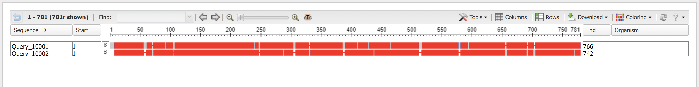

<br/>
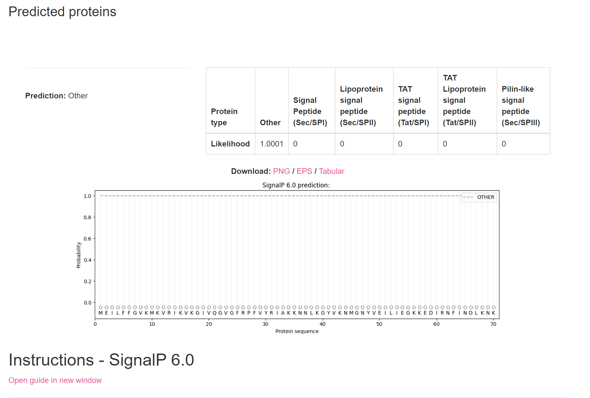


##### Kje v izvornem organizmu/celici se protein nahaja?

Žal niti protein [Q58123](https://www.uniprot.org/uniprotkb/Q58123/entry) niti ostali proteini s podobnim zaporedjem, niso imeli anotirano, kje se encim nahaja. 

##### Katere post-translacijske modifikacije ima?
   
Anotiran protein [Q58123](https://www.uniprot.org/uniprotkb/Q58123/entry) tega podatka žal ni imel navedenega. V zapisu ([KUG14427.1](https://www.ncbi.nlm.nih.gov/protein/KUG14427.1?report=genbank&log$=prottop&blast_rank=1&RID=70ND0RA5013)) na GenBank poleg funkcije proteina (karbamoil transferaza) piše '*posttranslational modification*'. Zapis si razlagam, kot da protein ima neke post-tranlacijske modifikacije ali bolj verjetno, da jih katalizira. 

##### Če želimo pripraviti protein v rekombinantni obliki, kateri gostiteljski organizem je najbolj smiselno izbrati in kateri del proteina bi izražali?
    
Najbolj smiselno bi bilo uporabiti *Methanocalculus* arheje, saj je bil protein najverjetneje izoliran iz njih. [*Methampcaldococcus jannaschii*](https://en.wikipedia.org/wiki/Methanocaldococcus_jannaschii), ki sicer ne sodi v isti razred, je vzorčni organizem za *in vivo* genetske študije, torej je dobro poznan.Prav tako pa uspeva v okoljih z visokim deležem oglijkovodikov. Glede na nevednost vrste in količine post-translacijskih modifikacij proteina je težko napovedati ali bi izražanje z bakterjskim ekspresijskim sistemom zadostovalo za izoliranje proteina. (Kasneje je bilo ugotovljeno, da bakterije (*E. coli*) tudi vsebujejo homolog HypF proteina, vendar tudi tu niso znane post-translacijske modifikacije.)
    
##### So znani kakšni homologi (ortologi, paralogi)? Kaj je znanega o njih (funkcija, modifikacije, regulacija, aktivno mesto, ...)?

Z uporabo NCBI BLAST, varianta blastp (nr), sem iskala homologe celotnega proteinskega zaporedja proteina HypF. Vseh 100 zadetkov je imela E vrednost enako 0, Query Cover nad 90 % in identičnost med 58 in 96 %. Večina zaporedij je bilo izoliranih iz arhej, ki sodijo v deblo *Methanomicrobia* (kamor sodi tudi rod *Methanocalculus*). Zastopanih je več rodov znotraj debla, vendar večina vrst arhej ni bila indentificirana. Zadetki so predstavljali karbamoil transferaze in acilfosfataze, drugih pripisov pa ni bilo.


    
##### Predstavlja naš protein encim ali gre za kak drug protein?

Protein predtavlja encim, ki katalizira prenos karboskamidne skupine. Za to encim potrebuje ATP, vodo in vir karboksamidne skupine, ki je karbamoil fosfat. Skupina se prenese na cistein nekega proteina (hidrogenaza), poleg nastaneta tudi AMP, difosfat in H<sup>+</sup>. 

##### Če gre za encim – ali je aktivno mesto v primerjavi z aktivnimi homologi ohranjeno?
  
Aktivno mesto ni bilo v nobenem primeru anotirano, ne pri [Q58123](https://www.uniprot.org/uniprotkb/Q58123/entry), niti pri nobenem homologu. Zato sem s pomočjo NCBI BLAST, varianta blastp (swissprot), poiskala ali je kakšen homolog mojega celotnega zaporedja anotiran. Od 100 zadetkov je 8 signifikantnih, saj imajo približno enako dolžino zaporedja (Query Cover > 80 %), E vrednost je dovolj nizka in delež identičnosti je višji od 32 %. Teh 8 zadetkov sem pregledala v UniProtu, da bi raziskala ali je pri vsaj enem anotirano aktivno mesto. Žal ni bilo, niti pri karbamoil transferazi HypF izolirani iz *Escherichia coli*. 

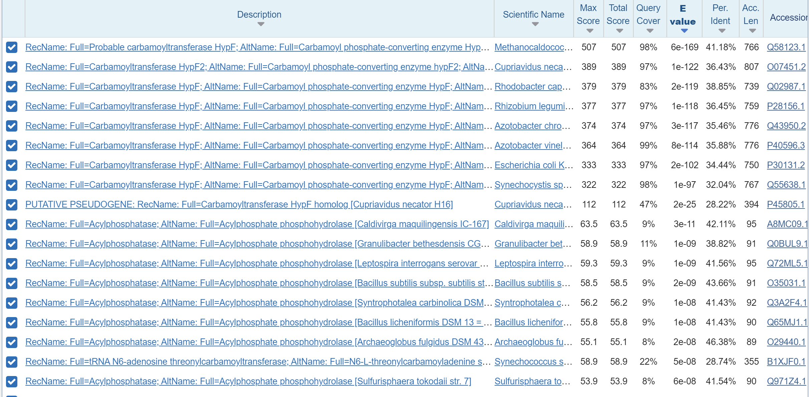

    
##### Kaj so najbolj ohranjene regije v skupini, ki jo predstavlja ta protein in njegovi homologi?

Da bi raziskala najbolj ohranjene regije sem naredila poravnavo osmih homologov in mojega zaporedja s Cobalt alignment in poravnavo v UniProtu brez mojega zaporedja, da sem te regije lahko identificirala. Zaporedja so si med sabo zelo podobna in imajo več dobro ohranjenih regij. Ker je eden iz med homologov protein *E. coli* (Query_10007), ki je bolje anotiran kakor ostali, sem odkrila vezavno mesto svojega proteina (Query_10009). Ta regija je zelo močno ohranjena pri vseh homologih: GVG[FM]R. Po matriki zamenjav BLOSUM62 ima zamenjava F v M vrednost 0. 

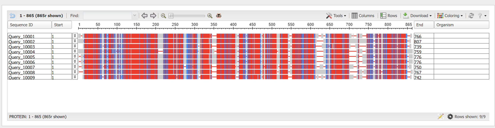

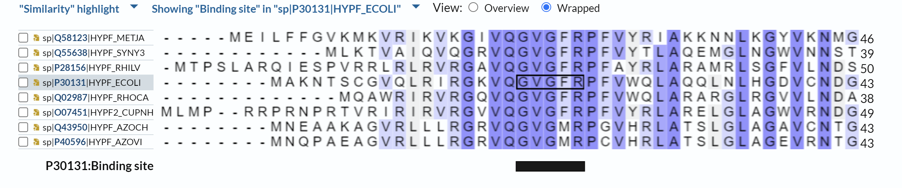


##### So v zaporedju kakšne ponavljajoče se regije oz. motivi?

Med najbolj ohranjene regije sodita tudi dve ponovitvi motiva cinkovega prsta, kamor se seveda vežeta cinkova iona. Poravnava v Cobalt aligmnet je potrdila, da ima tudi moje zaporedje dobro ohranjena motiva. Vsi proteini imajo v obeh cinkovih prstih prisotne štiri cisteine. 

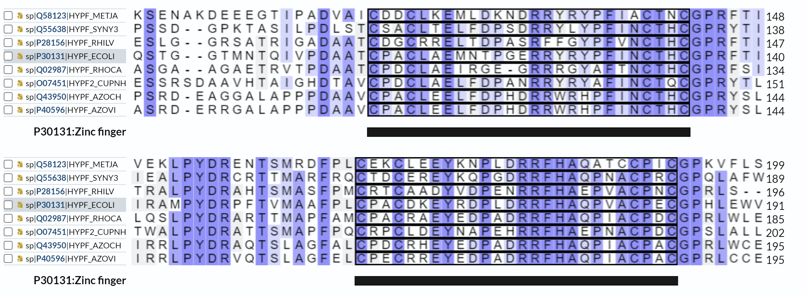

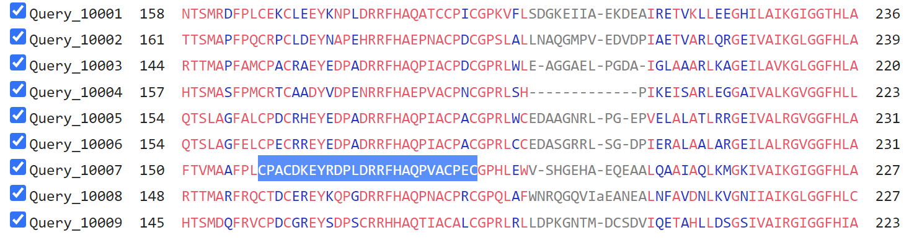


##### S katerimi proteini ali drugimi molekulami bi lahko ta protein potencialno interagiral?

Aktivni protein interagira z molekulami potrebnimi za uspešen prenos karboksamidne skupine. To so molekule ATP, H<sub>2</sub>O, karbamoil fosfat in protein, ki ga modificira. Iteragira tudi z molekulami, ki so stranski produkti reakcije in sicer to so AMP, difosfat in H<sup>+</sup>. Da apoencim postane aktiven, potrebuje dva Zn<sup>2+</sup>, torej interagira tudi z njima.

Koda zapisa karbamoil transferaze HypF iz *E. coli* na UniProtu je [P30131](https://www.uniprot.org/uniprotkb/P30131/entry). Zapisano je, da ta protein tvori kompleks s HypE. Da bi preverila, ali obstajajo kakšni homologi HypE v organizmih iz debla *Methanomicrobia*, sem aminokislinsko zaporedje HypE vnesla v NCBI BLAST, varianta blastp (nr), kjer se iskala le v organizmih *Methanococci* (taxid:183939). Eden iz med 50 zadetkov je bil tudi protein ekspresije/tvorbe hidrogenaz HypE iz *Methanocaldococcus jannaschii*, ki je organizem, iz katerega je bil tudi izražen homolog mojega HypF proteina. V GenBanku pod kodo zapisa [WP_010870181.1](https://www.ncbi.nlm.nih.gov/protein/WP_010870181.1?report=genbank&log$=prottop&blast_rank=7&RID=76M6HSEP013) piše, da je HypE vpleten v biosintezo Ni-Fe hidrogenaz in, da dehidrira lastno karbamoilno skupino. Te podatki sovpadajo z zapisom na UniProtu HypE proteina iz *E. coli* [P24193](https://www.uniprot.org/uniprotkb/P24193/entry), kjer piše, da HypE iteragira s HypF, ki mu doda karboksamidno skupino, katero nato HypE sam dehidrira. Če še preverim, katere interakcije s HypF proteinom (*Methanocaldococcus jannaschii*) so navedene v String, vidimo, da so navedeni funkcijsko in imensko enaki proteini, kot pri bakterijah. To so HypA, HypB, HypC (MJ_0200), HypD (MJ_0993) in HypE (MJ_0676). Najverjetneje z vsemi temi proteini direktno ne interagira. Vsi so povezani z zorenjem Ni-Fe dehidrogenaz vendar verjento to počnejo ločeno od HypF proteina.  

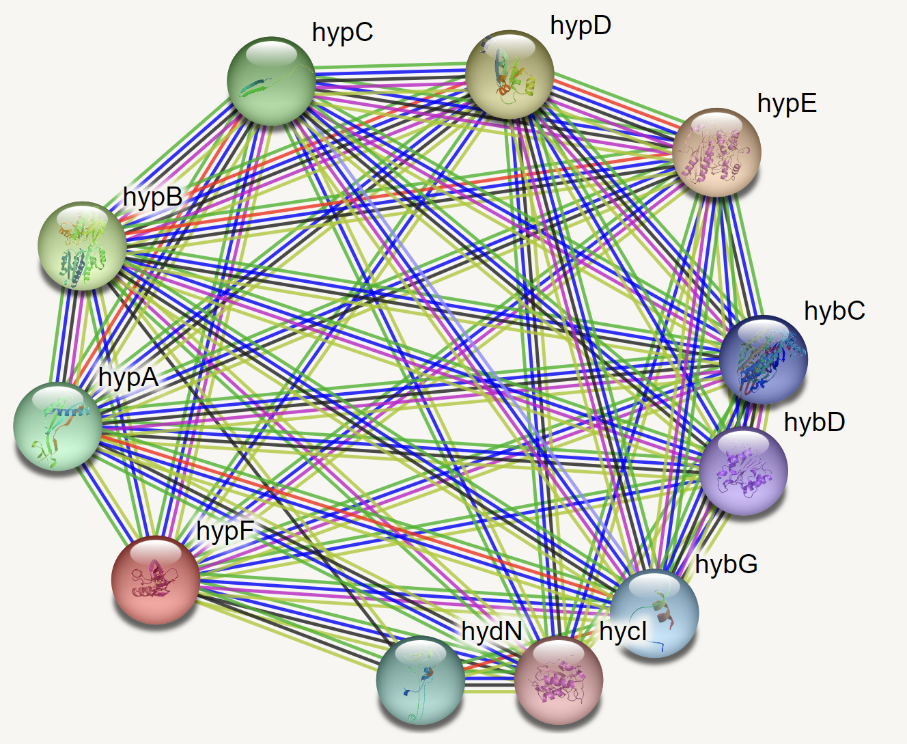
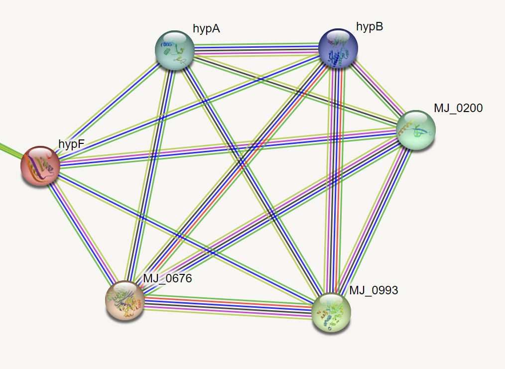

### Strukturna katakterizacija

##### Je znana struktura tega proteina ali njegovega dela?

Celotna ali delna struktura mojega protein HypF ni znana. 

##### Je znana struktura homologov? Katerih?

Z uporabo NCBI BLAST, varianta blastp (PDB), sem poiskala, ali je znana kakšna struktura homologov mojega HypF proteina. Izmed 20 zadetkov so prvi štirje primerljive dolžine. Znana je tako kristalna struktura HypF *E. coli* in kristalna struktura kompleksa z vezanim ATP in karbamoil fosfatom (Query Cover = 86 %). 


##### Pripravite model proteina oz. njegovega dela, ki bi predstavljal funkcionalen topen protein.

S pomočjo AlphaFold2 sem pripravila model HypF proteina. Program je modeliral 5 različnih struktur, prikazana je slika najboljše ocenjenega (rank 1). V ChimeriX so alfa vijačnice modela obarvane zeleno in beta ploskve roza. 


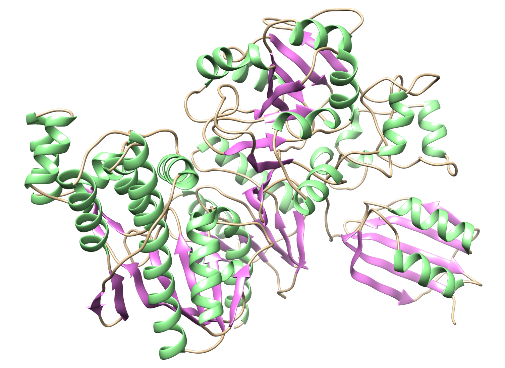

    
##### Primerjajte model oz. eksperimentalno strukturo z eksperimentalno strukturo homologa, osredotočite se na funkcijsko pomembne regije.
 
Poravnavo modela HypF in pa s kristalografijo določene strukture HypF iz *E. coli* sem naredila v ChimeriX, ki sicer res poravna strukturi na podlagi aminokislinskega zaporedja in ne strukture, vendar je to edino orodje, ki mi je bilo na voljo. Strukturi sta zelo dobro poravnani, saj se tudi njuno aminokislinsko zaporedje zelo dobro ujema (Cobalt alignment). Model AlfaFold2 je obarvan tan in kristalna struktura je obarvana modro. Opazi se, da ima model HypF dodatno strukturo na N-koncu proteina, ki je kristalna struktura nima. To je posledica tega, da raziskovalcem ni uspelo izolirati celotni protein (92 - 750.) Na desni sliki se vidi, da ima model HypF podobno strukturo pri vezavi cinkovih ionov. Tudi poravnava pokaže regiji z visokim deležom identičnosti. Pr kristalni strukturi pa je še eno vezavno mesto za Zn<sup>2+</sup> ion in sicer pri vezavi sodelujejo A475, H497, H502 in A727. V poravnavi z mojim zaporedjem sem odkrila, da so vsa ta štiri mesta prisotna tudi pri mojem proteinu, kar pomeni, da najverjetneje tudi on veže še tretji Zn<sup>2+</sup> ion.


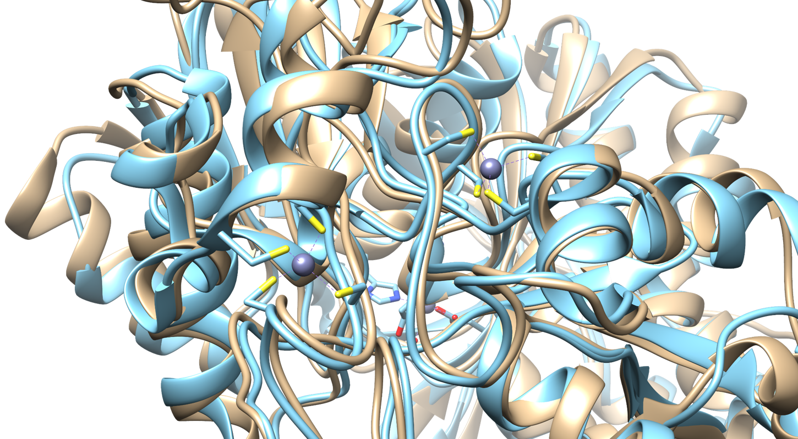
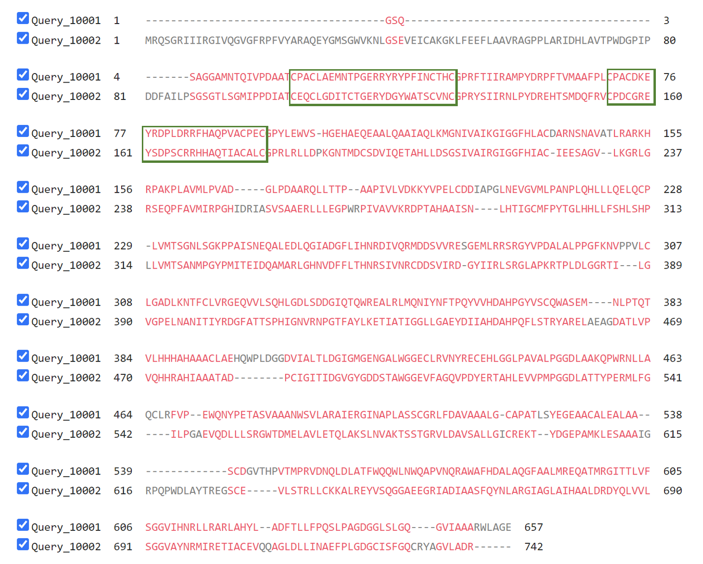
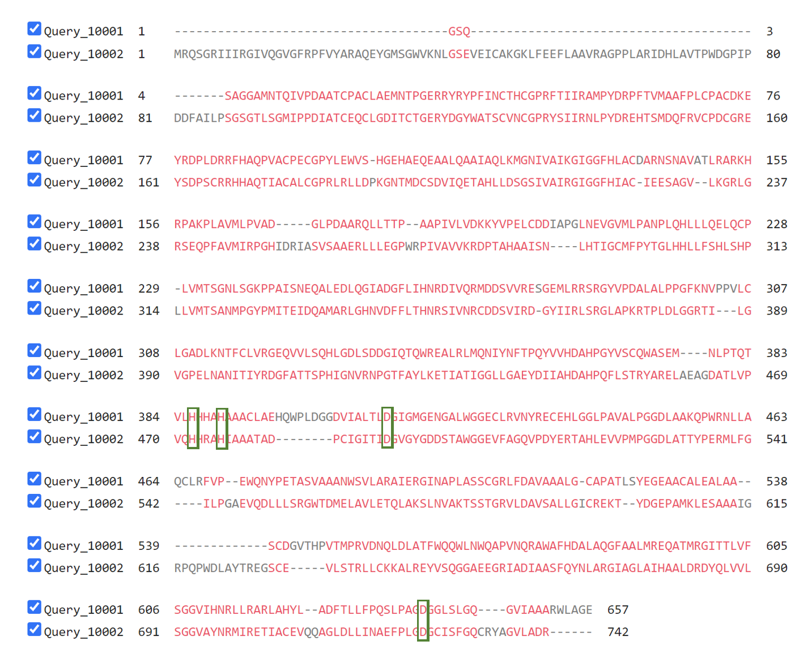
