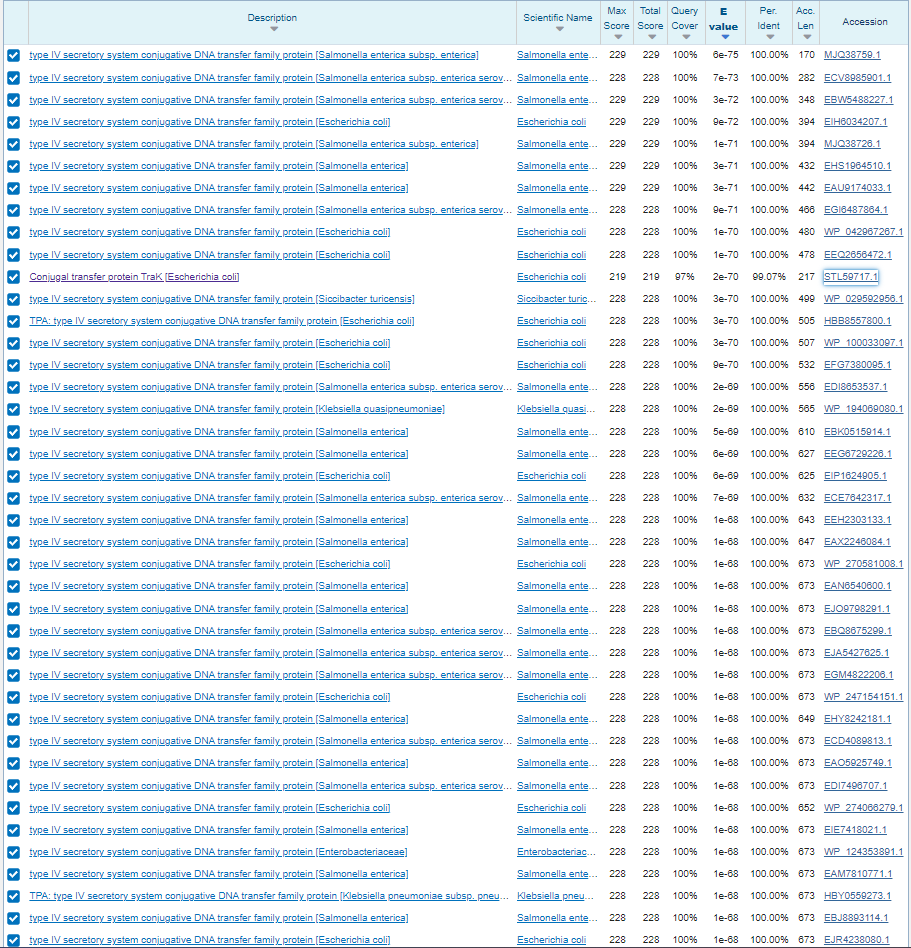
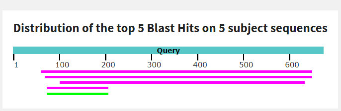
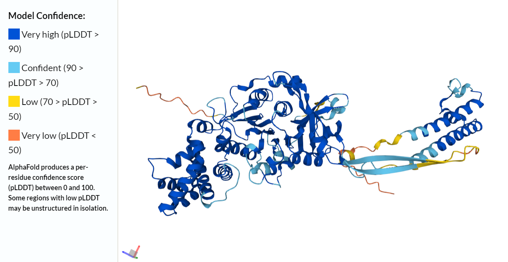
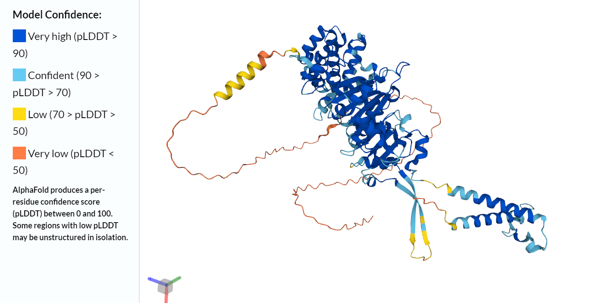

# S36


- **Avtor**: Filip Petrovič
- **Datum izdelave**: 2023-05-26
- **Koda seminarja**: S36

---
## Vhodni podatek

Zaporedje: 
```
LINLFFSQLVRVNTQTLPEHDKTLKYQCLLVLDEFTSMGRVGIIEKSIAFTAGYNIRYMI
IYQNDEQLESDDAYGKSGAFTLRKNLAVEVVYPPKDVDSTAERISKTFGK
```
---
## Rezultati analiz

### Identifikacija
Identifikacija se nanaša na protein, katerega del predstavlja  [zaporedje](#vhodni-podatek).

**Protein**: Type IV secretory system (T4SS) conjugative DNA transfer family protein

**Organizem**: *Salmonella enterica*, *Escherichia coli*, ... več različnih organizmov, ne moremo trditi da je zgolj pri enem

**Potencialna funkcija proteina**: Točna funkcija ni znana, saj imajo T4SS proteini veliko različnih funkcij, njihova splošna funkcija je prenos plazmidov med bakterijami s konjugacijo. (Vir: [T4SS](https://www.ncbi.nlm.nih.gov/pmc/articles/PMC3070162/))

Identifikacija je bila narejena z uporabo NCBI BLAST, varianta blastp, zbirka nr. Tako značilna podobnost kot identičnost zaporedja sta bili 100% enaki T4SS proteinu pri različnih organizmih - predvsem *Escherichia coli* in *Salmonella enterica*, pri prilagoditvi iskalnih pogojev blastp in izključitvi teh dveh 100% identičnost tudi T4SS proteinu nekaterih drugih organizmov. E vrednost < 1e-70. 

Tabelarični prikaz zadetkov:



Grafični prikaz zadetkov:


Koda zapisa z BLAST identificiranega proteina: GenBank [MJQ38759.1](https://www.ncbi.nlm.nih.gov/protein/MJQ38759.1?report=genbank&log$=prottop&blast_rank=1&RID=7J02725C013); gre za delno zaporedje. Ob poimenskem iskanju v zbirki UniProt najdemo zapis s kodo [A0A3U1AHI9](https://www.uniprot.org/uniprotkb/A0A3U1AHI9/entry#function), ki vsebuje celotno vhodno zaporedje. 

### Splošna karakterizacija

V GenBank zapisu ni na voljo pripisov glede splošnih ali strukturnih značilnostih proteina, nekaj teh je na voljo v UniProt zapisu. 

#### Lokalizacija in post-translacijske modifikacije
Protein je transmembranski, tako da se nahaja v membrani. Največji del proteina je intracelularni, torej se nahaja v notranjosti celice, ekstracelularni del pa je dolg le 26 aminokislinskih ostankov (od 673). Protein pa ima 2 helikalni transmembranski domeni. Identificirani protein post-translacijskih modifikacij nima ali pa te niso znane, ob izvedbi blastp po podatkovni zbirki swissprot pa dobimo 5 zadetkov - ti sicer predstavljajo 4 proteine. Najbolj se ujema s TraG proteinom iz *Escherichia coli* ([UniProt](https://www.uniprot.org/uniprotkb/Q00184/entry), [GenBank](https://www.ncbi.nlm.nih.gov/protein/Q00184.1?report=genbank&log$=prottop&blast_rank=1&RID=7J152SUC01N))- zanj tudi niso znane post-translacijske modifikacije, tako da o teh ne moremo trditi nič konkretnega.

Tabelarični prikaz zadetkov (iskanje po swissprot):


Grafični prikaz zadetkov (iskanje po swissprot): 



#### Izražanje proteina v rekombinantni obliki
Glede na to, da gre za bakterijski protein in da nima znanih post-translacijskih modifikacij, bi bile bakterijske celice (npr. *Escherichia coli*) primeren ekspresijski sistem.

#### Potencialni homologi
Kot že omenjeno, ob izvedbi blast p med anotiranimi zaporedji najdemo 5 zadetkov, ki predstavljajo 4 proteine. Pogoje za homologni protein izpolnjujeta 2 - TraG  iz *Escherichia coli* ([UniProt](https://www.uniprot.org/uniprotkb/Q00184/entry)) in VirD4 ([UniProt](https://www.uniprot.org/uniprotkb/P09817/entry)) iz *Agrobacterium tumefaciens* (Sliki pod točko Lokalizacija in post-translacijske modifikacije). Oba imata vlogo pri konjunkciji bakterijskih celic, ampak ker ne poznamo točne funkcije identificiranega proteina, ne moremo trditi, ali je ta encim in za kakšno vrsto homolognih proteinov gre. 

Poravnava zaporedij proteina in obeh homologov (orodje COBALT):


Protein in homologi imajo skupno značilnost v transmembranskih helikalnih strukturah, ki pa so pri identificiranemu proteinu daljše kot pri Vir4 in TraG, prav tako ima Vir4 3 transmembranske helikse, medtem ko imata identificirani protein in TraG po 2. 

Poravnava transmembranskih helikalnih struktur (orodje COBALT):


Prve 3 zaporedja predstavljajo helikase Vir4, 4. in 5. zaporedje predstavljata TraG, 6. in 7. pa identificiran T4SS protein.


### Strukturna katakterizacija

Struktura proteina ni znana, je zgolj napovedana. Struktura, narejena z brezplačno različico AlphaFolda:


Struktura homologa traG (dobljena iz UniProt zapisa):



Struktura homologa Vir4 (dobljena iz UniProt zapisa):



Strukturno gledano so si vsi 3 proteini precej podobni - velik intracelularni del, 2 transmembranski helikalni domeni in majhen ekstracelularni del. Zapis za Vir4 je malo nejasen - v razdelku Features so označeni 3 helikalne transmembranske domene, vendar sta na strukturi vidni samo 2. Tretja, za katero v razdelku Features piše, da obsega AK ostanke 153-173, se nahaja v središču intracelularnega dela in na prvi pogled ne izgleda, kot da bi to lahko bila transmembranska domena.