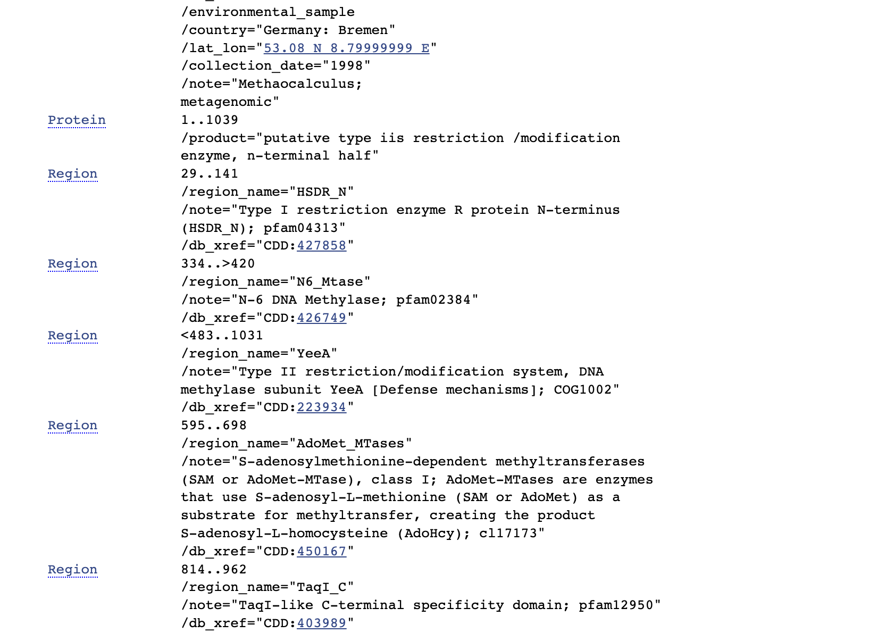
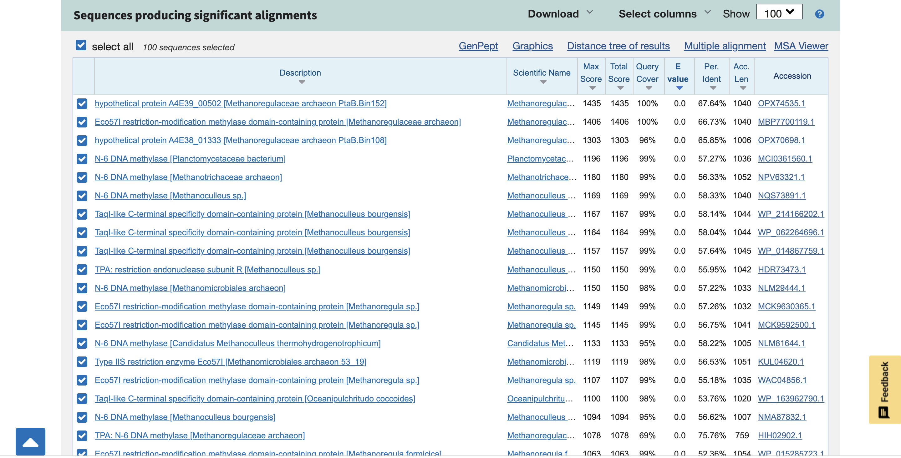
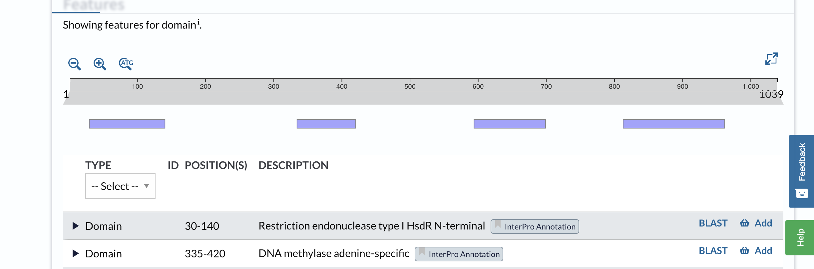
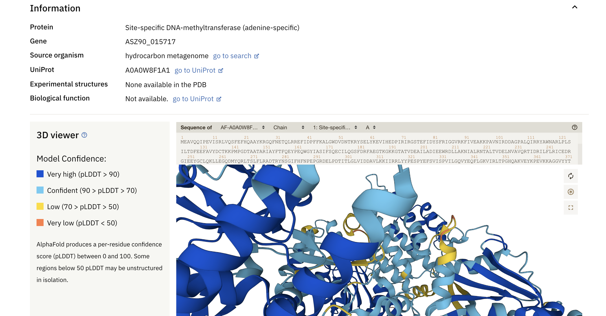
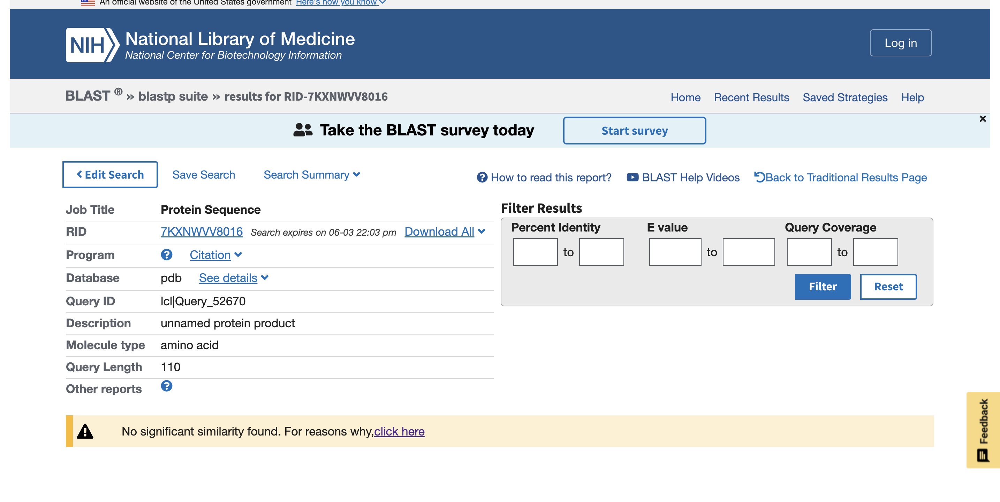

# S38

- **Avtor**: Sofija Stevanović
- **Datum izdelave**: 2023-05-26
- **Koda seminarja**: s38

---
## Vhodni podatek

Zaporedje:
>S38
PFFEGPKIIFPDIAKNVRFSLDEKGFFGSNTIYFIPKSDKYLLGLLNSKMGYYFFYHLCA
GLEGKNETYLRFFGQYLEHFPIRTINFSDPADKGRHDTMVALVERMLALH

---
## Rezultati analiz

### Identifikacija

**Protein**: Domnevni restrikcijski / modifikacijski encim tipa iis, n-terminalna polovica

**Organizem**: Methanoregulaceae archaeon 

**Potencialna funkcija proteina**: Katalitična aktivnost
Endonukleolitično cepljenje DNA, pri čemer nastanejo naključni dvoverižni fragmenti s končnimi 5'-fosfati, hkrati se hidrolizira ATP. 

### Splošna karakterizacija
Zanimajo nas odgovori na naslednja vprašanja:

- Kje v izvornem organizmu/celici se protein nahaja?
Glede na to da arheje nimajo jedra, na osnovi funkcije sklepamo da se protein (encim) nahaja v citoplazmi arhej, kamor je tudi pri arhejah lokaliziran genetski material.

- Katere post-translacijske modifikacije ima?
Protein (tudi homologi) najbrž nimajo anotiranih posttranslacijskih modifikacij.

- Če želimo pripraviti protein v rekombinantni obliki, kateri gostiteljski organizem je najbolj smiselno izbrati in kateri del proteina bi izražali?
Njbolj smisleno bi verjetno bilo uporabiti bakterije iz družine Planctomycetaceae, glede na homologijo. Med petimi določenimi regijami v GenBank-u, bi mogoče izrazili regiji "Restrikcijski encim tipa I R protein N-konec" in "Restrikcijski/modifikacijski sistem tipa II, DNA metilazna podenota".
 

- So znani kakšni homologi (ortologi, paralogi)? Kaj je znanega o njih (funkcija, modifikacije, regulacija, aktivno mesto, ...)?
Ortologi so znani vendar niso okarakterizirane njihove lastnosti. Znani ortologi so izraženi pri bakterijah iz družine Planctomycetaceae.Znani so ortologi tudi pri arheji Candidatus Methanoculleus thermohydrogenotrophicum.

- Predstavlja naš protein encim ali gre za kak drug protein?
Protein predstavlja encim.
 

- Če gre za encim – ali je aktivno mesto v primerjavi z aktivnimi homologi ohranjeno?
Pri proteinu tako kot pri homologih aktivno mesto ni označeno, zato ne moremo biti prepričani ali je ohranjeno.

- Kaj so najbolj ohranjene regije v skupini, ki jo predstavlja ta protein in njegovi homologi?
Najbolj ohranjena regije je verjetno (30-140), in sicer domena restrikcijske endonukleaze tipa I HsdR N-terminalni konec. Ohranjena je tudi tako domena (335-420) in sicer DNA metilazna domena, specifična za adenin.
 

- So v zaporedju kakšne ponavljajoče se regije oz. motivi?
V zaporedju niso prisotne ponavljajoče regije.

- S katerimi proteini ali drugimi molekulami bi lahko ta protein potencialno interagiral?
Razen DNA, interakcije proteina z drugimi molekulami niso znane.

### Strukturna katakterizacija
Zanimajo nas odgovori na naslednja vprašanja:
- Je znana struktura tega proteina ali njegovega dela?
Struktura ni eksperimentalno določena.
 

- Je znana struktura homologov? Katerih?
Tako pri homologih ni znanin struktur.

- Pripravite model proteina oz. njegovega dela, ki bi predstavljal funkcionalen topen protein.

- Primerjajte model oz. eksperimentalno strukturo z eksperimentalno strukturo homologa, osredotočite se na funkcijsko pomembne regije.
Glede na to, da eksperimentalno določene strukture homologov tudi ne obstajajo, ne moremo jih primerjati.

