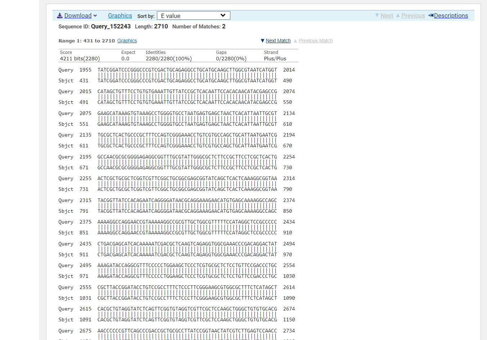
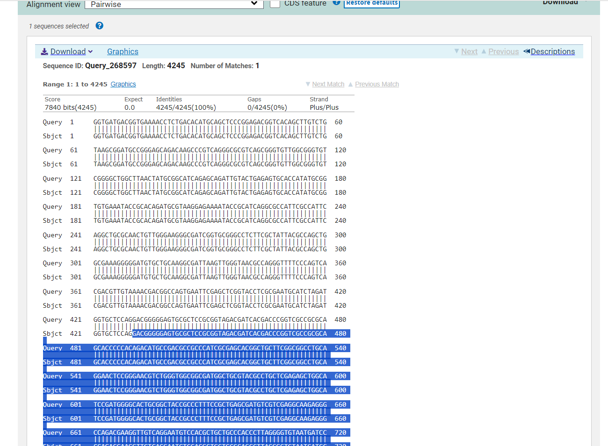
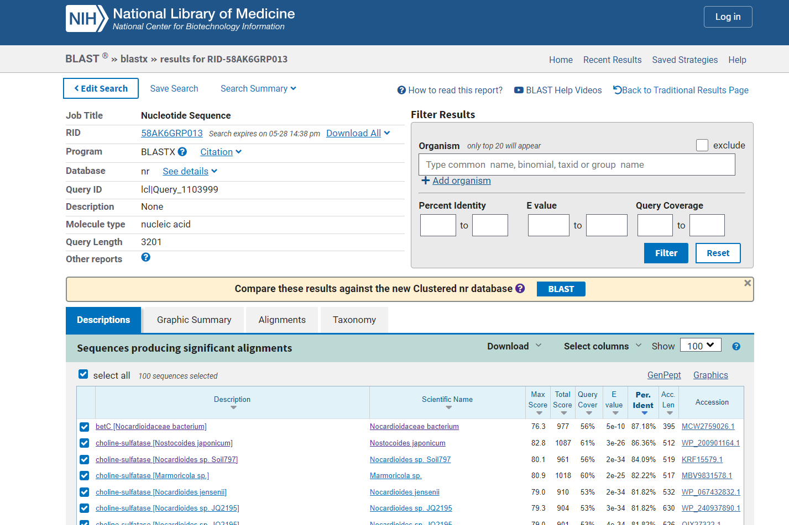
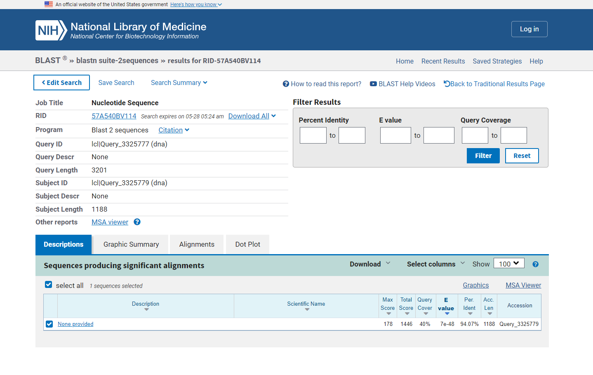
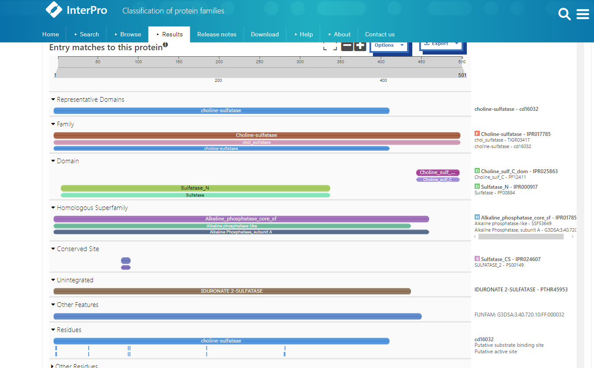
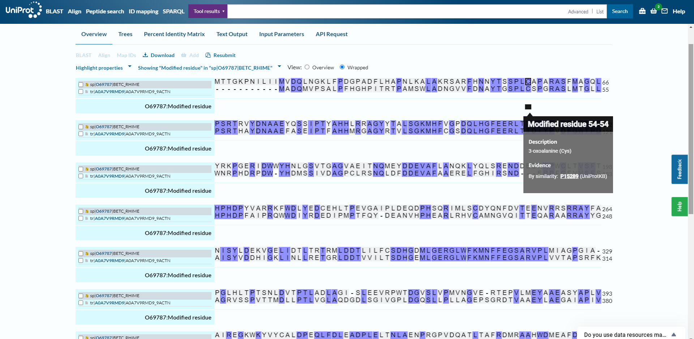
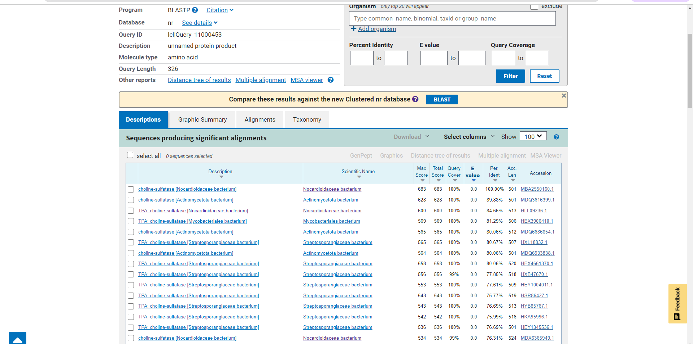
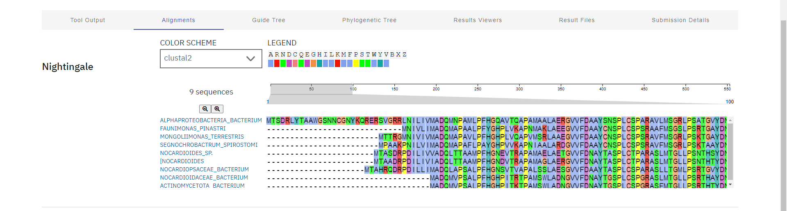
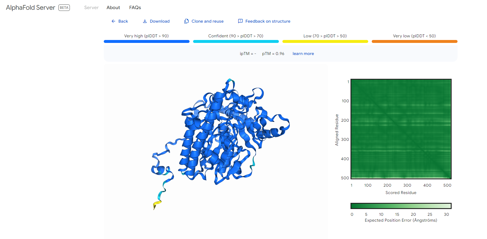

# S01

- **Avtor**: Lana Bajec
- **Datum izdelave**: 2024-05-26
- **Koda seminarja**: S01

---
## Vhodni podatek

Povezava do datoteke z vhodnim podatkom: [S01](naloge/s01-input.md)

---
## Rezultati analiz

### Identifikacija proteina
1. Poravnava nukleotidnega zaporedja plazmida pUC57 z dobljenim nukleotidni zaporedjem v blastn - del, ki se ne ujema, je zapis za iskan protein. 
2. Poravnava dobljenega zaporedja samega s sabo v blastn in kopiranje zaporedja od 431 do 1955 (neznan protein) 
3. Iskanje proteina z blastx - najboljše ujemnaje s holin sulfatazo. 
4. Primerjanje zaporedja iskanega proteina z zaporedjem encima holin sulfataze (Nocardioidaceae bacterium) dobljenega v GenBank v blastn - dobljeno 94,07 % ujemanje. Na podlagi tega lahko sklepamo, da je to naš iskan protein. 

### Iskanje v UniProt

- ime proteina: holin sulfataza
- izvorni organizem: Nocardioidaceae bacterium
- lokalizacija: citoplazma
- velikost proteina: 501 ak
- domenska zgradba: sulfataza, N-končna domena; holin sulfataza, C-končna; sulfataza 
- funkcija proteina: encim, ki katalizira reakcijo pretvorbe holin-O-sulfata v holin.

###Post-translacijske modifikacije: pretvorba ak ostanka serina ali glicina v C-formilglicin, pomembno za katalitsko aktivnost
- za moj protein v UniProt tega podatka ni bilo: poravnava s holin sulfatazo organizma Rhizobium meliloti (zanj ta podatek je naveden) v UniProt. Proteina imata enako aktivno mesto in spremenjen ak ostanek - FGly 

### Iskanje sorodnih proteinov:
1. Ak zaporedje proteina damo v blatp 
2. Zapordja dobljenih proteinov kopiramo v Clustal Omega - dobimo filogentsko drevo za holin sulfatazo v različnih organizmih 
 
###Najbolj in najmanj ohranjene regije 
Zaporedja podobnih proteinov preverimo s Clustal Omega 
Opazimo, da je pri vseh proteinih ohranjena regija z aktivnim in vezavnim mestom. Najmanjšo podobnost imajo C in N končne regije - najmanj ohranjene.

###Podobni evkariontski proteini:
Ak zaporedje proteina pregledamo z blastp, dodamo filter - organizem = evkariont 
- organizem: Patellaria atrata (gliva), protein: holin sulfataza, funkcija: hidrolaza
- organizem: Coccidioides immitis (gliva), protein: holin sulfataza, funkcija: hidrolaza
- organizem: Coccidioides posadasii gliva), protein: holin sulfataza, funkcija: hidrolaza

###Struktura proteina
Struktura določena z AlphaFold3 

