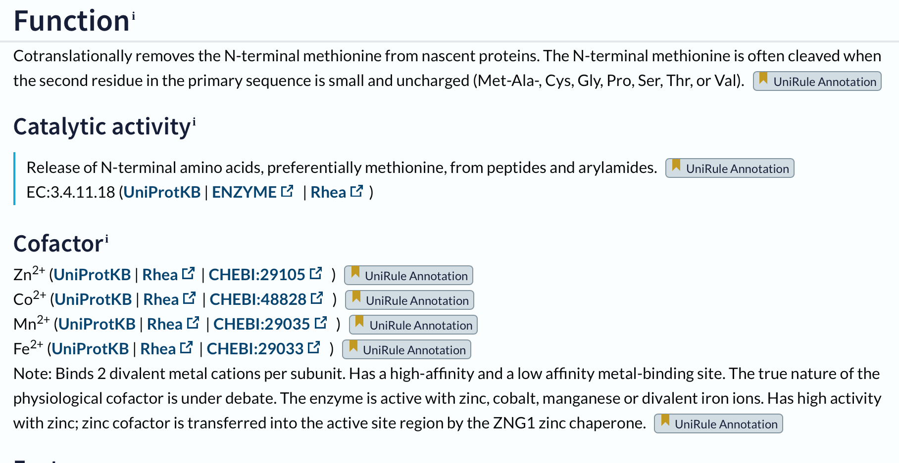

# S03

- **Avtor**: Hanna Habot
- **Datum izdelave**: 2024-05-10
- **Koda seminarja**: S03

---
## Vhodni podatek

Povezava do datoteke z vhodnim podatkom: [S03](naloge/s03-input.md)

---
## Rezultati analiz

### Identifikacija
Identifikacija je bila narejena z uporabo NCBI BLAST, blastx (zbirka metagenome nr) in nato z blastp (zbirka nr). Dobila sem zadetek s 100 % identičnostjo, zato sklepam, da predstavlja celoten zapis za moj protein. (https://en.wikipedia.org/wiki/Nocardioides) Identificiran protein se nahaja v Gram-pozitivnih, mezofilnih in aerobnih bakterijah družine Nocordioides. 

**Protein**: metionil aminopeptidaza

>WP_056907282.1 MULTISPECIES: type I methionyl aminopeptidase [Nocardioides]
MPVVSPAEVSARRAVPSHIARPEYVDKPAPQRFTGEEAKDAETIERMRIAGRLAAQARELVGQHVAPGIT
TDELDRIGHEFLCDHGAYPSTLGYRGFPKSLCSSVNEVICHGIPDARVVEDGDIVNIDITAYINGVHGDT
NATFLAGDVDEESRLLVERTREALDRAIKAVKPGRRVSIIGRVIESYAKRFGYGVVRDFTGHGIGTAFHS
GLIIPHYDDERFDDEIRVGMTFTIEPMLNLGTPDYDMWDDGWTVVTKDRRRSAQFEHTLVVTEDGAEVLT
HP

Najbolj podoben anotiran protein, ki ga dobim, s pomočjo iskanja z blastp, po bazi podatkov Swiss-Prot (98% identičnost) v bazi UniProt nima skoraj nobenega relavantnega podatka, zato vzamem drugi podoben anotiran protein (97% identičnost):

>sp|Q9FV50.1|MAP1D_ARATH RecName: Full=Methionine aminopeptidase 1D, chloroplastic/mitochondrial; Short=MAP 1D; Short=MetAP 1D; AltName: Full=Peptidase M 1D; Flags: Precursor
MAGVKSLQPRLISSFLGNNSIRSTQPLIHLFRFDLGRRHVSMQLSRTFSGLTDLLFNRRNEDEVIDGKRK
RLRPGNVSPRRPVPGHITKPPYVDSLQAPGISSGLEVHDKKGIECMRASGILAARVRDYAGTLVKPGVTT
DEIDEAVHNMIIENGAYPSPLGYGGFPKSVCTSVNECICHGIPDSRPLEDGDIINIDVTVYLNGYHGDTS
ATFFCGNVDEKAKKLVEVTKESLDKAISICGPGVEYKKIGKVIHDLADKHKYGVVRQFVGHGVGSVFHAD
PVVLHFRNNEAGRMVLNQTFTIEPMLTIGSRNPIMWDDNWTVVTEDASLSAQFEHTILITKDGAEILTKC

**Protein**: metionin aminopeptidaza 1D

**Organizem**: [*Arabidopsis thaliana*] (https://en.wikipedia.org/wiki/Arabidopsis_thaliana); gre za rastlino "Navadni repnjakovec", ki se uporablja kot modelni organizem za določanje specifičnih obrambnih mehanizmov odpornosti rastlinskih patogenov.

**Potencialna funkcija proteina**: Odstrani N-terminalni metionin iz nastajajočih proteinov. N-terminalni metionin se pogosto odcepi, ko je drugi ostanek v primarnem zaporedju majhen in nenabit (Met-Ala-, Cys, Gly, Pro, Ser, Thr, ali Val). S katalitično aktivnostjo protein sprošča N-terminalne aminokisline (metionin), iz peptidov in arilamida. Za delovanje so potrebni kofaktorji (Co2+, Zn2+, Mn2+, Fe2+). Encim deluje kot metaloproteaza, mesto za vezavo kovin pa najverjetneje vsebuje histidin. Substrat proteina se lahko veže na dve različni vezavni mesti (na aminokislinski ostanek 180 ali 278 - v obeh primerih je v vezavnem mestu histidin). 
Podatek sem pridobila iz drugega zadetka blastp Swiss-Prot (Q9FV50).

### Splošna karakterizacija
Za zapis GenBank WP_056907282 ni na voljo značilnosti v bazi UniProt. Zato si pomagam z zaporedji proteinov z aminokislinskim zaporedjem, podobnim aminokislinskemu zaporedju identificiranega proteina (kot je npr. Q9FV50). 

**Lokacija proteina v celici izvornega organizma**:
Nahaja se v plastidih, kloroplastih, mitohondrijih (sklep s pomočjo drugega anotiranega zaporedja Q9FV50 iz blastp z iskanjem po bazi Swiss-Prot).

**Velikost proteina**: 
Identificiran protein je velikosti 282 aminokislinskih ostankov.

**Domenska zgradba**: 
Za določanje domenske zgradbe si pomagam z bazo InterPro. Med ostanki 114 in 341 je določena peptidazna domena. Sklepam, da moj identificiran protein lahko deluje kot peptidaza (sodeluje pri razgradnji nefunkcionalnih proteinov).

**Post-translacijske modifikacije**: 
Tranzicijski peptid se nahaja med aminokislinskimi ostanki 1-49 (ta regija je odgovorna za transport proteina, kodiranega z jedrnim genom, do določenega organela). Modificiran je le en aminokislinski ostanek, na mestu 50 (glicin). Drugih post-translacijskih modifikacija protein Q9FV50 nima.

**Sorodni proteini**:
Iz filogenetskega drevesa je razvidno, da je moj protein (oznaka: Q5ZIM5.1 93-372) najbolj soroden s proteinom z oznako Q8BP48.1 97-372 (metionin aminopeptidazo 1, iz organizma Mus musculus (Hišna miš)). Proteina sta homologa, najverjetneje ortologa, imata podobno funkcijo v različnih organizmih.

**Najbolj in najmanj ohranjene regije**:
Po iskanju z blastp (zbirka nr) sem izbrala 10 različnih proteinov in njihova zaporedja vnesla v COBALT. Podatke, ki sem jih dobila sem vnesla v WebLogo in dobila diagram bolj in manj ohranjenih regij. Bolj ohranjene regije so prikazane z večjimi črkami.

**Podobni evkariontski proteini**:
Identificiranemu proteinu najbolj podoben protein (98 % identičnost) ima PDB kodo "4OOK". Kodo sem dobila kot prvi zadetek iskanja v blastp, po zbirki PDB med evkariontskimi organizmi.

**Potencialna funkcijska povezanost z drugimi proteini**:
Graf sem dobila s pomočjo programa STRING, v katerega sem vnesla aminokislinsko zaporedje identificiranega proteina. Analiza nam pokaže, da so različno izraženi geni vključeni v znane in predvidene interakcije protein-protein. Vozlišča predstavljajo gene, črte različnih barv pa napovedi povezav.   

### Strukturna katakterizacija

***Struktura***: 
Do modela strukture identificiranega proteina pridemo s pomočjo AlphaFold. Program napove 3D strukturo proteina glede na njegovo aminokislinsko zaporedje. IDDT ocenjuje lokalne razlike v razdalji vseh atomov v modelu. Razlike v lokalni razdalji, za katere je verjetnost pojava visoka so označene z modro. 

***Superpozicija***:
Superpozicijo pripravim s pomočjo izrisa modela v Swiss-Model. Model nato odprem v programu UCSF Chimera in poravnam verigi modelov podobnih proteinov (za model podobnega proteina uporabim strukturo s PDB kodo "4OOK"). Moj protein je rjavo obarvan, veriga podobnega proteina pa je modre barve. Glede na superpozicijo mojega identificiranega proteina in strukture 4OOK lahko predpostavljam, da sta si res zelo podobna, saj prihaja do prekrivanja verig na skoraj vseh mestih.

 
