# S05

- **Avtor**: Nika Janc
- **Datum izdelave**: 2024-05-22
- **Koda seminarja**: S05

---
## Vhodni podatek

Povezava do datoteke z vhodnim podatkom: [S05](naloge/s05-input.md)

---
## Rezultati analiz
 
### Identificiranje vstavljenega vključka
 
1. Dobljeno zaporedje in zaporedje vektorja pUC57 poravnamo v EMBOSS Needle, da ugotovimo, kateri del zaporedja priprada vstavljenemu fragmentu.
Zdaj imamo del zaporedja, ki pripada iskanemu proteinu: GAGATCGACCCCATCTTCGCCCGCTTGGGCGAAGCCCTGCCACCGCTGCTCACGGCCGTGCTGGAGCGCCAAGCAGAAGCCGGGCCGCCGCCGGAGTTTCGCGGGCCGTTCCCGATCGAGGCGCAGCGACGGCTCGCTGTGCAGTTCATGGAACGGCTCGGCTTCGATTTCCATCATGGCCGCCTCGACGTCAGCCTGCATCCGTTCTGCGGCGGCACGCCCGACGATGTCCGTATCACGACGCGCTACGACGAGCAGGACTTCCGCCCGGCGCTGATGGGGGTCCTGCACGAAACCGGTCATGCGCTCTACGAACGTGGTTTGCCAAGAGAATGGCGCGGCCTGCCGGTGGCGGACGCGCGCGGCATGGTCCTGCACGAGAGCCAGTCGCTGCTGATCGAGATGCAGGTCTGCCGCTCGCGAGCCTTCCTCGCCTTCGCGGCGCCCTTGATCCGCGCCACCTTCAACGGTTCCGGGCCGGCCTGGGAGGCGGAGGCACTCTATCGCCACTATGCCCGCGTCGAGCCGGGCTTGATCCGCGTCAATGCCGACGAGGTTACCTATCCGGCGCACGTGATCCTGCGCTATCGCCTGGAGAAGGCGCTTCTGGCGGGAACGCTGAAGGTCGCGGATCTGCCCGGCGCGTGGGCCGAGGGGATGCGCGATCTGTTGGGCATCACCCCGCCCGACGACCGTTCCGGGTGCCTGCAGGACATCCACTGGTACGACGGCGCGTTCGGCTACTTTCCGACCTACACGCTGGGCGCGATCGCGGCGGCGCAACTGTTCGACGCCGCCTGCCGGGCCGAGCCGGGATTGACCGAAGGGATCGCGGCCGGTGAATTCGCGCCGCTGATTACGTGGCTGCGCACGCACGTGCACAGCCAGGGCTCTTCCAAGAGTACGCGCGAGATCCTGATCGCTGCCACCGGCCGCCCCCTCGACGCGGAAGCCTTCGTGACGCACCTGGAACGGCGGTATCTAGGGTAGGGAAGGCTGGAGCAGTTACGGCCGTGCCTTTCTAAATCTGGTCGTAAAGAGTCTCCAACCGCTTCCTTTGCACGTCACGGTGAAATTTGGTGCGTGCAGTTTCAAGGGCGTTGTAGCTCAGCTC

2. Naslednji korak je uporaba orodja blastx, kjer poiščemo podobna zaporedja tako, da vstavimo nukleotidno zaporedje, algoritem ga prevede v aminokislinsko zaporedje in rezultat poišče med aminokislinskimi zaporedji (ni samo 1 rešitev, ampak vsaj 6, 3 = bralni okvir in še 3, če gremo od odzadaj). V blastx smo za Database uporabili non-redundant protein sequences (nr).

3. Za 100 % ujemanjen z vključkom dobimo: Thermostable carboxypeptidase 1 [uncultured Defluviicoccus sp.] s 407 aminokislinskih ostankov. Tudi podatek za Query Cover je dokaj visok (88 %) in E value je 0, kar potrdi, da lahko ta zadetek uporabimo za nadaljne analize.

### Analiza proteina

1. Ker o našem proteinu v UniProt ni podatkov, si pomagamo z BLAST. Uporabimo blastp z blastp in psi-blast ter dobimo enake rezultate. Za izbiro pravega proteina preverimo ujemanje v EMBOSS Needle in Water, kjer je najboljše ujemanje pri proteinu z najvišjim Query Cover in Per. Ident, tako da izberemo termostabilno karboksipeptidazo 1 iz Thermus thermophilus (Gram negativna bakterja).
Za nadaljno analizo uporabimo dobljen protein, saj je anotiran v UniProt, z Accession Number in Entry Name: Q5SLM3 · CBP1_THET8 (https://www.uniprot.org/uniprotkb/Q5SLM3/entry).

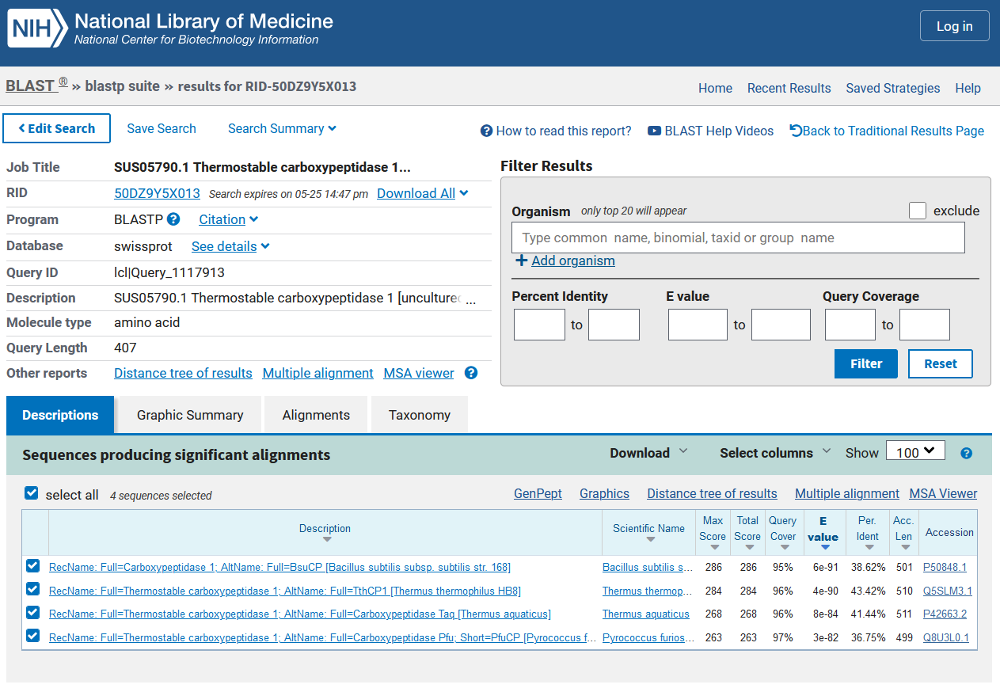

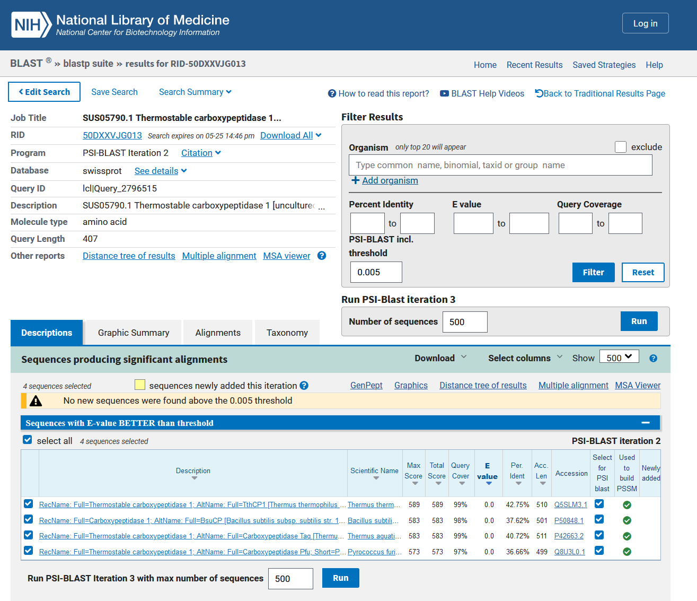

2. O proteinu:
* Lokacija - podatek Subcellular Location pri tem proteinu v UniProt ni dodan, vendat MolStar prikaže orientiranost glede na membrano tudi v nadaljevanju pri človeškem proteinu.

* Velikost 510 aminokislinskih ostankov oz 58,014 Da.

* Domenska zgradba - vsebuje katalitično domeno.

* Post-translacijske modifikacije pri tem proteinu v UniProt niso izpostavljene. Ponovno je za človeški primer ta podatek dodan in sicer se vzpostavijo disulfidni mostički.

* Funkcija proteina (in substrat, če gre za encim) - ima biološko in molekulsko funkcijo, ker zaporedno sprošča aminokisline s C-konca, vključno z nevtralnimi, aromatskimi, polarnimi in baznimi ostanki, vendar ne Pro. Ima nižjo aktivnost s substrati, ki se končajo z Gly ali Glu. Za aktiven encim potrebujemo kofaktor cinkov ion (vezavno mesto: H276, H280 in E360).

* Sorodni proteini (poravnava, filogenetsko drevo): zaporedje za naš protein vnesemo v blastp in izberemo nekaj zadetkov, ki jih preuredimo v beležnici, da jih lahko poravnamo v Clustal Omega. Dobimo filogenetsko drevo (hitreje ga lahko poustvarimo v BLAST).

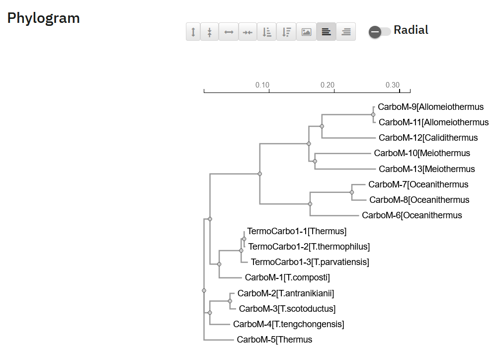

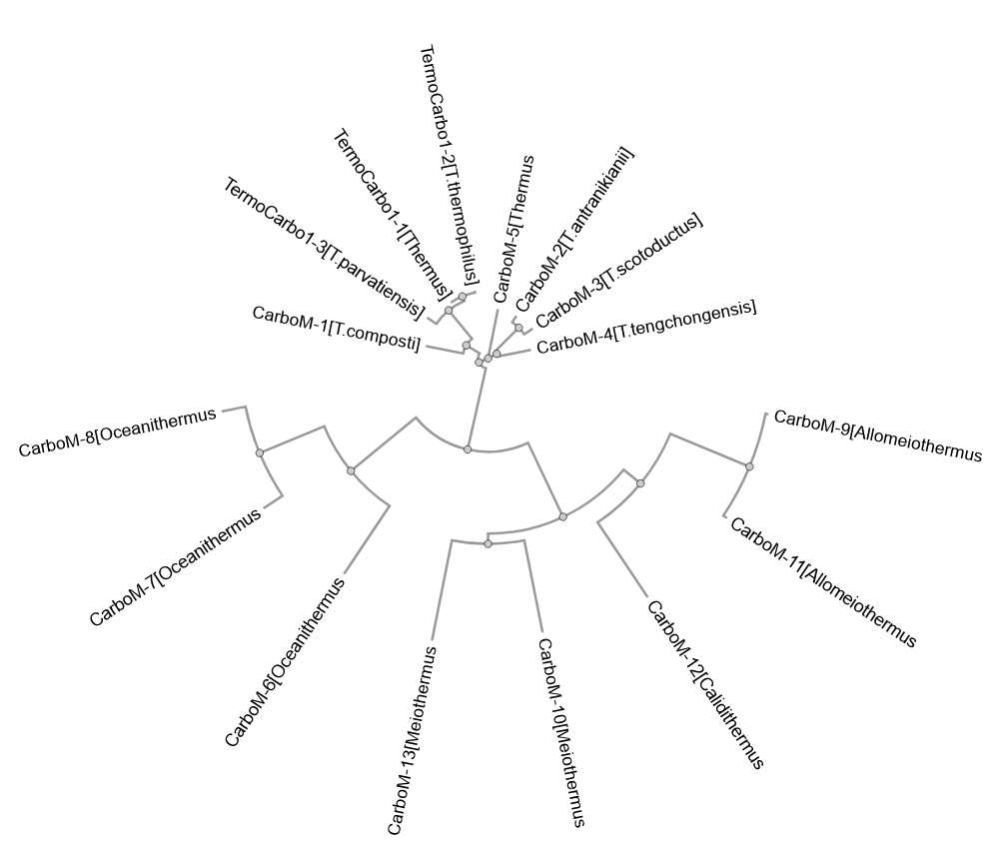

Komentar: Okrajšava TermoCarbo1 pomeni thermostable carboxypeptidase 1, poleg je znak - s številko, zaradi lažjega ločevanja med primeri. CarboM pa pomeni carboxypeptidase M32, poleg je prav tako pomišlaj s številko za lažje ločevanje vnešenih proteinov. 
Opažanja: Termostabilna karboksipeptidaza 1 iz Thermus oz Thermus thermophilus je naš izhodni protein in opazimo, da je najbližje s proteinom iz Thermus parvatiensis, ki je prav tako bakterija iz rodu Thermus. Ker so bili zadetki v blastp predvsem iz tega rodu, je smiselno, kar dobimo kot rezultat. Soroden termostabilni karboksipeptidazi 1 je tudi encim karboksipeptidaza M32, najbližje iz organizmov rodu Thermus, na drevesu pa vidimo tudi bolj specifične organizme skupine Oceanithemus, Allomeiothermus, Calidithermus in Meiothermus, nekatere od teh so še dokaj neraziskane.

* Najbolj in najmanj ohranjene regije, tudi v luči funkcije proteina: izhodni protein ima 4 pomembne aminoksilsinske ostanke in sicer tri vezavna mesta za cinkov, ki smo jih že omenili in in eno aktivno mesto (proton donor/akceptor) z aminokislino E277. Če predpostavimo, da so te najpomembnejše za aktivnost encima si oglejmo ohranjenost teh aminokislinskih ostankov pri proteinih, ki smo jih uporabili za filogenetsko drevo. Najmanj ohranjene regije se verjetno nahajajo stran od katalitiče domene in domen, ki so pomembne za funkcijo proteina.

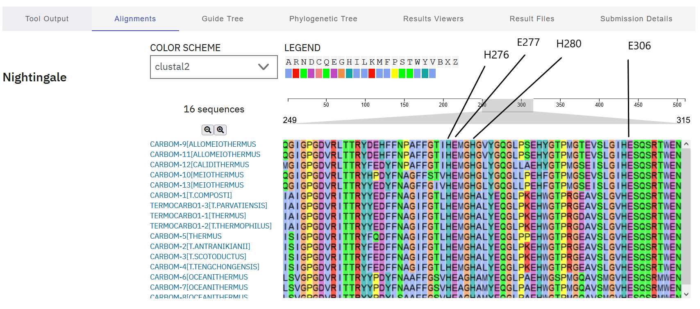

Opažanja: Okoli izpostavljenih aminokislinskih ostankov, so zaporedja ohranjena pri vseh izmed poravnanih zaporedij, kar kaže na pomembnost le teh za opravljanje funkcije proteina.

* Podobni evkariontski proteini (in demonstracija z ustrezno analizo) – organizem, protein, funkcija, … - termostabilne karboksipeptidaze pri evkariontih ne najdemo, najdemo pa karboksipeptidazo med drugim tudi pri človeku (https://www.uniprot.org/uniprotkb/P15085/entry). Kljub vsem poravnava v EMBOSS Needle in Water pokaže Score 30.0 oz. 45.0, kar je pomemben podatek, ki ga moramo imeti v mislih in morda o podobnosti/sorodnosti težko govorimo.

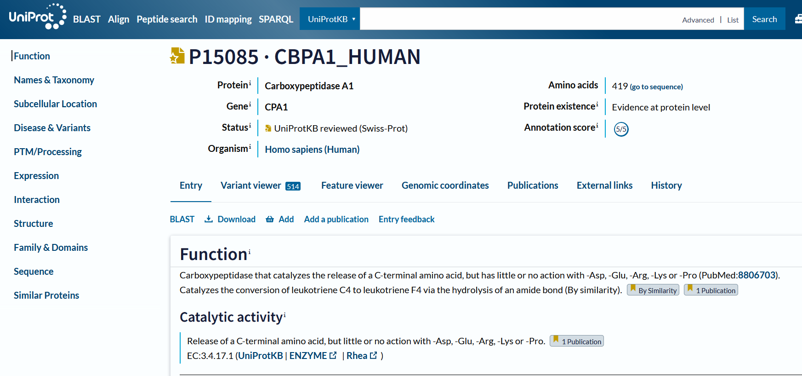

Analiza: Pri ljudeh ima encim enako vlogo, saj katalizira sproščanje C-terminalne aminokisline, vendar ima malo ali nič delovanja z -Asp, -Glu, -Arg, -Lys ali -Pro. Prav tako za aktivnost potrebuje cinkove ione kot kofaktor in je krajši za 100 aminokislinskih ostankov. Pri ljudeh je karboksipeptidaza bolje raziskana in lahko najdemo podatek o lokaciji proteina zunaj mrmbrane.

* Potencialna funkcijska povezanost z drugimi proteini, morebitne medproteinske interakcije (tudi pri morebitnih sorodnih evkariontskih proteinih) - v Cytoscape uvozimo podatke za termostabilno karboksipeptidazo. 

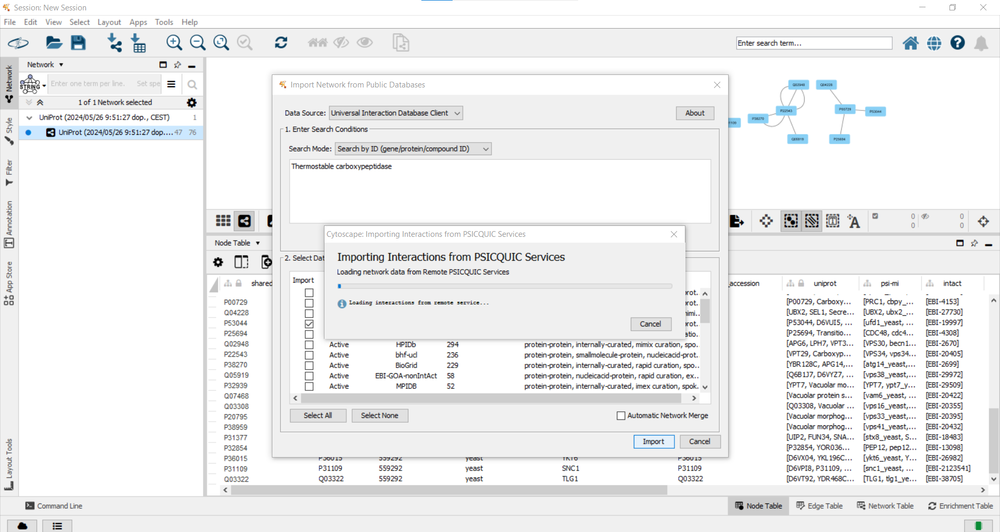

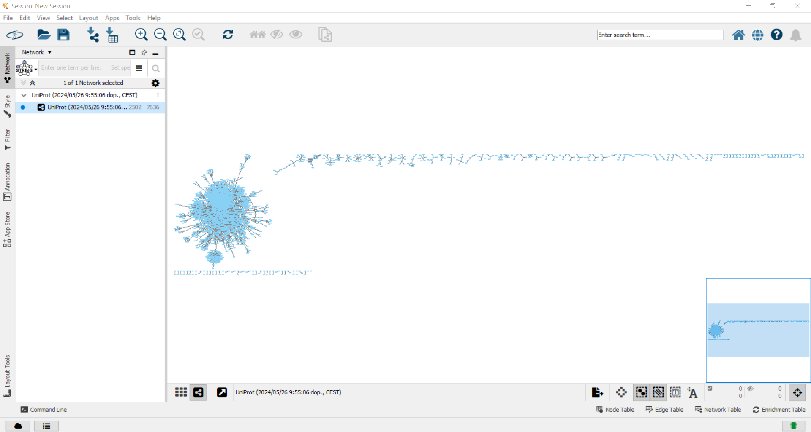

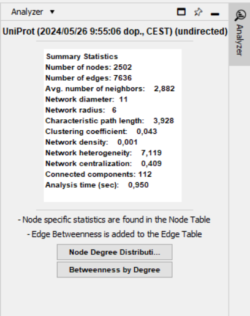

Komentar: V tej mreži ni našega proteina in prav tako ne človeške karboskipeptidaze. Tako, da gre zgolj za primer uvoza, mreže in analize proteina termostabilne karboksipeptidaze iz zbirke UniPort. 

* Struktura oz. model strukture (tudi superpozicija pro- in evkariontskih variant) z MolStar: za prvo poravnavo struktur smo vzeli PDB ID 3HOA, ki pripada karboksipeptidaze M32 iz Thermus thermophilus in pa 5WVU, ki je karboksipeptidaza iz Thermus thermophilus, saj so ti dve strukturi v UniProt pod našim izhodnim proteinom (Q5SLM3). Za drugo superpozivijo pa smo vzeli 3HOA in pa človeško karboksipeptidazo A1 (2V77).

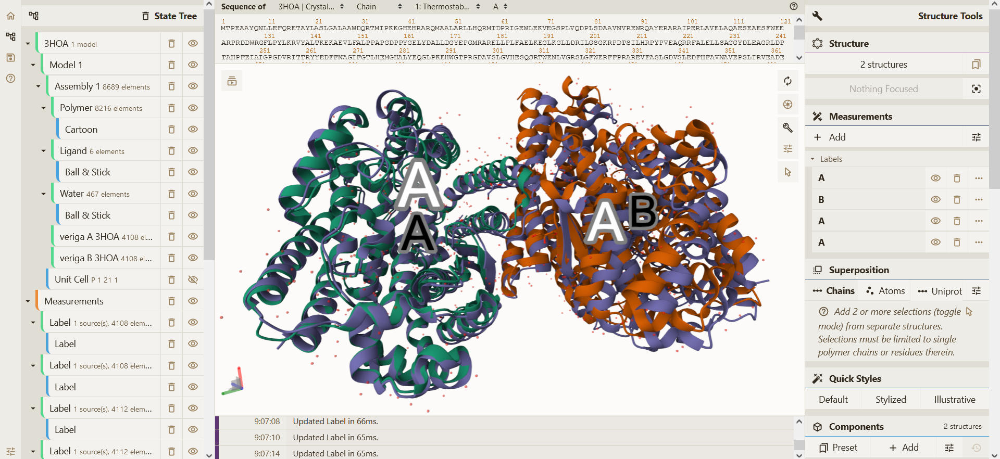

Opažanja: Vidimo, da sta oba proteina dimera in poravnava je bila narejena glede na verigo A (3HOA). Pri superpoziciji se vidi velika podobnost v strukturi.

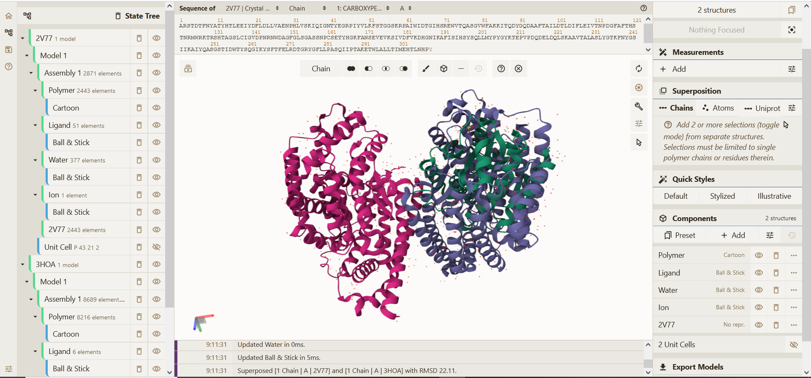

Opažanja: V tem primeru je človeška karboksipeptidaza monomer in to predstavlja že prvo večjo razliko med strukturama. Ko naredimo prekrivanje struktur, prav tako o podobnosti težko govorimo, saj je človeški protein veliko manjši, prekrivanje pa je vidno le na zelo kratkih odsekih, kar lahko predstavlja bolj naključje kot podobnost.
