# S06

- **Avtor**: Uma Jordan Ferbežar
- **Datum izdelave**: 2024-05-17
- **Koda seminarja**: S06

---
## Vhodni podatek

Povezava do datoteke z vhodnim podatkom: [S06](naloge/s06-input.md)

---
## Rezultati analiz

### Iskanje tarčnega proteina

Nukleotidno zaporedje vključka sem vnesla v blastx in iskala po bazi *Non-redundant protein sequences*. 
Tarčni protein sem identificirala kot **domnevni seralizin** (*putative serralysin*), ki se nahaja v negojeni bakteriji *Defluviicoccus sp.*.
Identičnost je 99.80%, zato predvidevam, da gre v vključku za skoraj celotno zaporedje tega proteina.
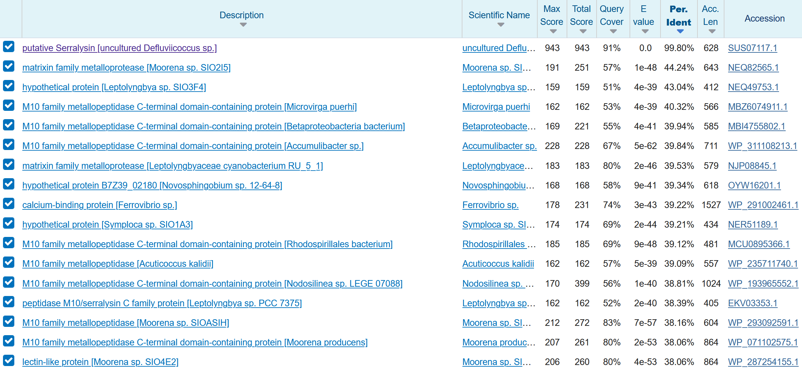

S podatki, pridobljenimi iz GenBank-a sem ugotovila, da gre za **628 aminokislin** dolg protein. 
Spada med **od cinka odvisne metaloproteaze** in v **poddružino seralizinu podobnih proteinov**, ki so pri bakterijah pomembni virulenčni faktorji.
Ima tudi vezavna mesta za kalcijeve ione.

Aminokislinsko zaporedje domnevnega seralizina sem vnesla še v InterPro, da bi identificirala pomembne domene.
Rezultati analize so med drugim pokazali **seralizinu podobno metalopeptidazno domeno**.
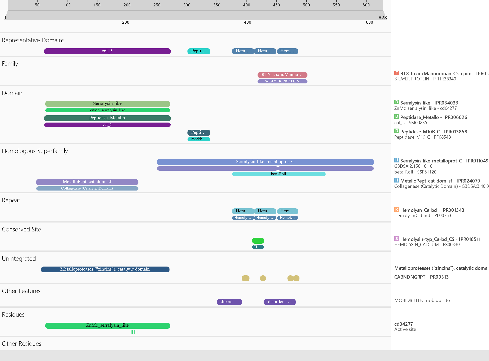

### Iskanje bolje anotiranega proteina

Ker domnevni seralizin ni najbolje anotiran, sem se v blastp z iskanjem po bazi *UniProtKB/Swiss-Prot* odločila poiskati sorodnega. Našla sem protein **seralizin C** (*Serralysin C*), ki je dobro anotiran in preverjen v UniProt-u.
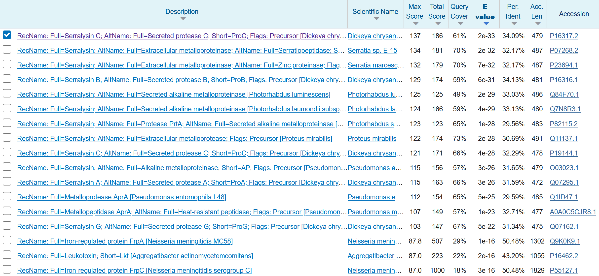

Tudi zaporedje tega proteina sem vnesla v InterPro, rezultati analize so prav tako pokazali **seralizinu podobno metalopeptidazno domeno**.
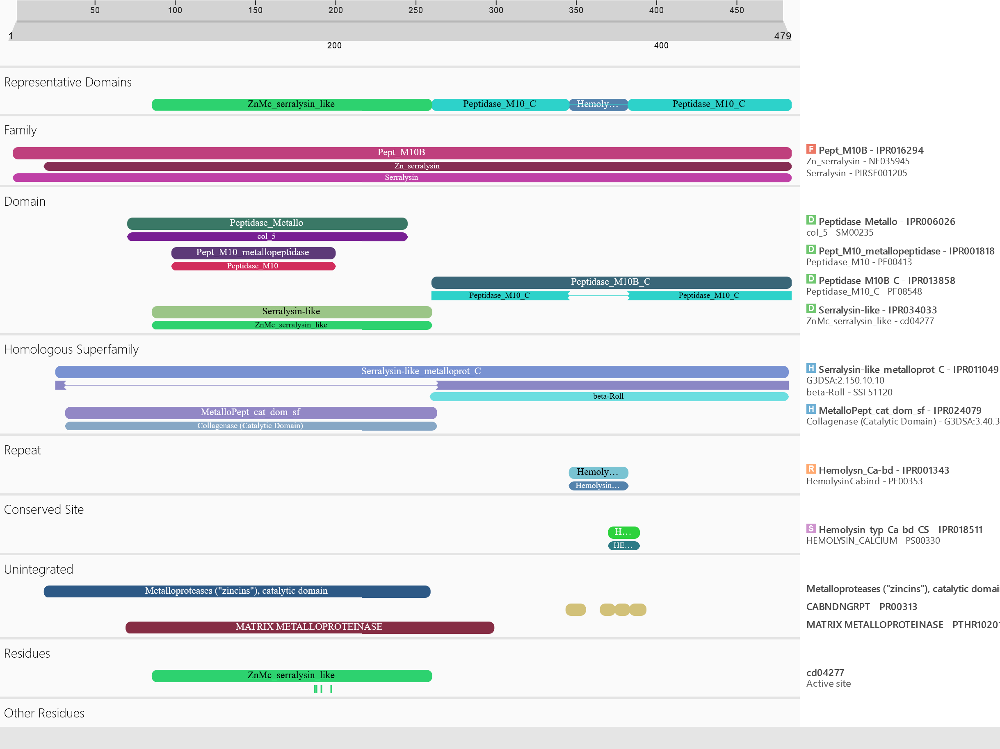

### Lastnosti proteina

Na večino lastnosti domnevnega seralizina sem sklepala iz anotiranih zapisov za soroden protein, seralizin C iz organizma *Dickeya chrysanthemi* (UniProt ID: P16317), ki je dolg 479 AK in ima maso prbl. 52 kDa.
Gre za **metaloproteazo** (seralizin C ima aktivno mesto na mestu 189), ki preferenčno cepi vezi s hidrofobnimi ostanki v P1'.
Njegovi kofaktorji so **kalcijevi ioni**, za katere ima seralizin C na podenoto 7 vezavnih mest, in **cinkovi ioni**, za katere ima na podenoto eno vezavno mesto.
Nahaja se v **ekstracelularnem matriksu** (alternativno ime seralizina C je tudi izločena proteaza C oz. *secreted protease C*).
Seralizin C se sprva nahaja v neaktivni obliki, po odcepu 17 AK dolgega propeptida pa preide v aktivno obliko.
Sestavljen je iz 𝛼-heliksov in 𝛽-trakov ter ima **tri kalcij vezavne hemolizinu podobne ponovitve** (*hemolysin-type calcium-binding*), ki so bogate z glicinom in so verjetno pomembne za izločanje tega proteina iz celice.

### Sorodni proteini & ohranjene domene

Sorodne proteine sem poiskala tako, da sem v blastp po bazi *Non-redundant protein sequences* z AK zaporedjem domnevnega seralizina poiskala 10 podobnih proteinov in poravnane sekvence - Download -> FASTA(aligned sequences) - vnesla v program Clustal Omega, ki je pripravil grafični prikaz poravnave ter podatke za filogenetsko drevo, ki sem jih vnesla v program phylo.io.
Na spodnji sliki je del poravnave iz programa Clustal Omega.
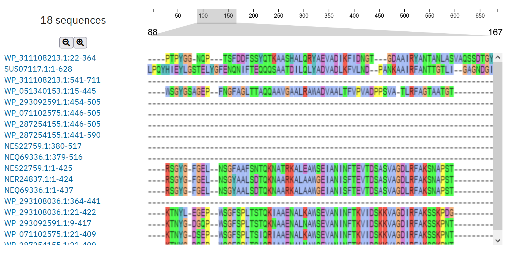

Kot lahko vidimo iz filogenetskega drevesa (program phylo.io), je domnevni seralizin najbolj podoben **metalopeptidazi s C-končno domeno** (družina M10), ki se nahaja v organizmu *Accumulibacter sp.*. 
Tarčni protein je uokvirjen z modro, najbolj podoben pa z rdečo barvo.
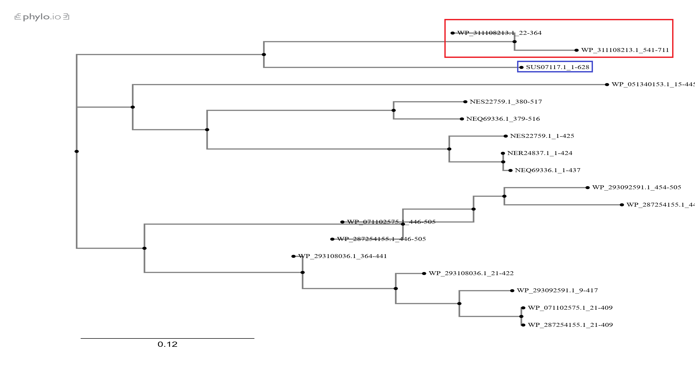

Za prikaz ohranjenih domen sem poravnane sekvence iz blastp vnesla v program Cobalt Alignment, nato pa rezultat te analize - Download alignment -> Fasta plus gaps - vnesla v program Weblogo. 
Večje, kot so črke, ki označujejo AK ostanke, bolj ohranjeni so ti ostanki; vidimo lahko **veliko ohranjenih glicinov**, pa tudi asparaginov in aspartatov.
Na pomembnost glicinov za funkcijo proteina sem sklepala že glede na podatke o seralizinu C, ta analiza pa moj sklep še dodatno potrdi.

### Podobni evkariontski proteini

Z iskanjem v blastp po bazi *Non-redundant protein sequences* ali *Protein Data Bank Proteins* nisem dobila nobenih relevantnih rezultatov, pri iskanju po bazi *UniProtKB/Swiss-Prot* pa sem dobila en zadetek za evkariontski protein **cinkova metaloproteaza nas-26** (*zinc metalloproteinase nas-26*), kjer je identičnost 33.33%.
Protein se nahaja v organizmu *Caenorhabditis elegans*, ki je vrsta gliste in pogost modelni organizem.
Tudi ta protein ima vezavna mesta za cinkove ione, nahaja se v ekstracelularnem matriksu in ima **metaloproteazno aktivnost**.

### Medproteinske interakcije

Za analizo medproteinskih interakcij sem uporabila program STRING. Ker organizma *Defluviicoccus sp.* ni v njihovi bazi, sem za analizo uporabila protein seralizin C iz organizma *Dickeya chrysanthemi*.
Na spodnjih slikah so prikazani proteini, s katerimi bi seralizin C potencialno lahko interagiral, na primer še nekaj drugih metaloproteaz, metaloproteazni inhibitor in ATPaze ter drugi proteini sekrecijskega sistema celice.
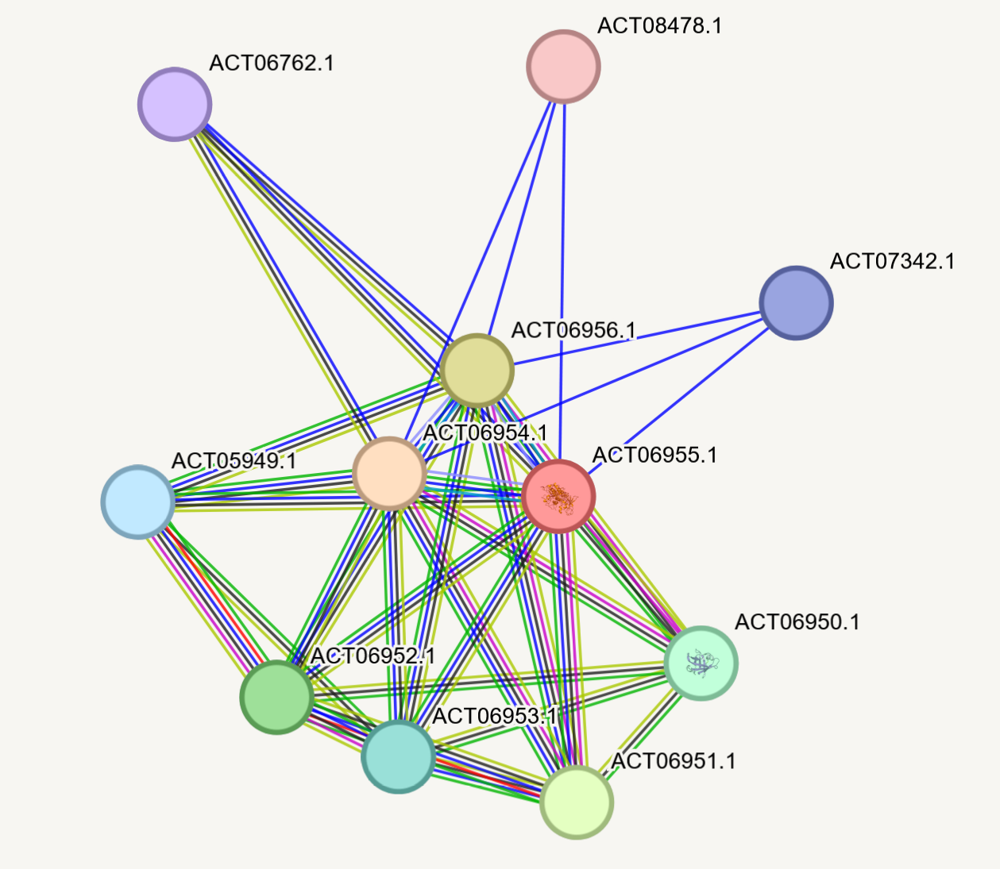

Pri enaki analizi evkariontskega proteina pa vidimo, da je ta povezan z veliko proteini, ki imajo domeno lektinov tipa C (oz. so sami lektini tipa C).
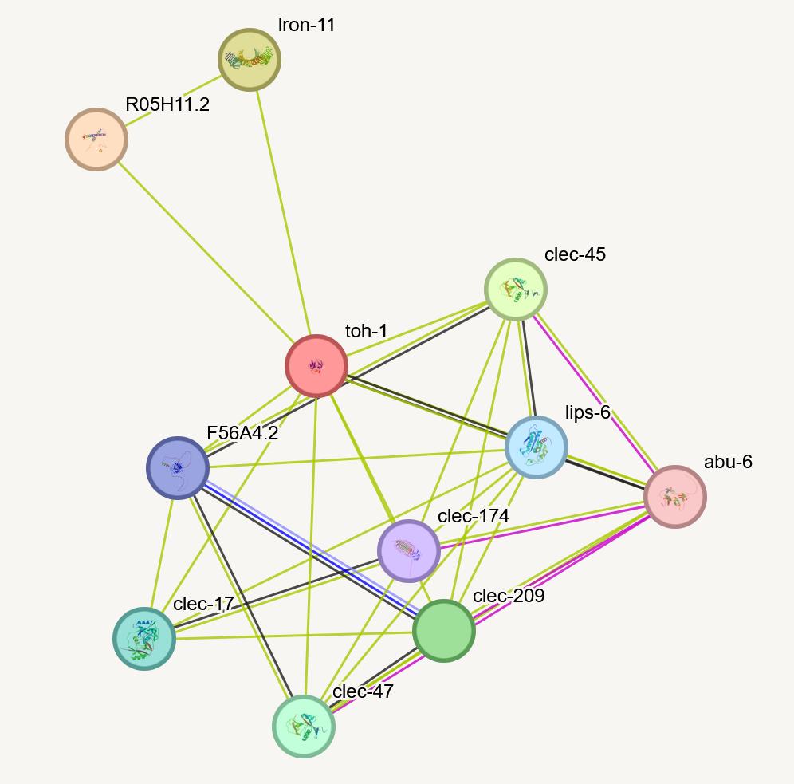
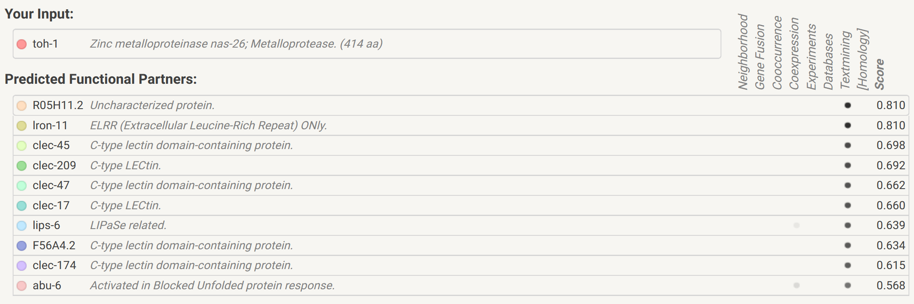

### Struktura domnevnega seralizina in superpozicija

Strukturo domnevnega seralizina sem pripravila v programu AlphaFold3, ki nam napove 3D strukturo proteina, jo naložila na računalnik in nato odprla v programu MolStar.
Protein je sestavljen iz večih 𝛼-heliksov in 𝛽-trakov, ki tvorijo 𝛽-ploskev.
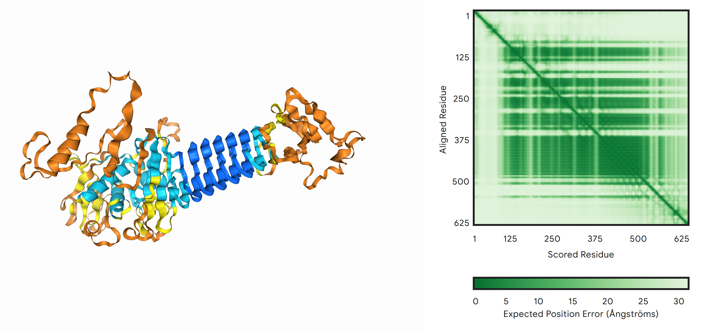
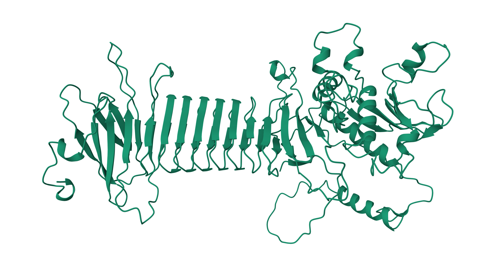

Superpozicijo sem naredila najprej s seralizinom C (prokariontski protein).
Vidimo lahko, da se strukturi precej dobro ujemata.

Ker struktura evkariontskega proteina še ni eksperimentalno določena, sem jo najprej pripravila v programu AlphaFold3.
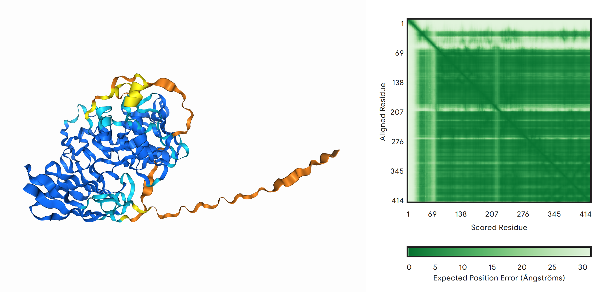

Spodnja slika je prikaz superpozicije domnevnega seralizina z evkariontskim proteinom v MolStar-u.
Vidimo lahko, da se ta dva proteina tudi po strukturi ne ujemata najbolje.
