# S07

- **Avtor**: Brina Klinar
- **Datum izdelave**: 2024.05.25
- **Koda seminarja**: S07

---
## Vhodni podatek

Povezava do datoteke z vhodnim podatkom: [S07](naloge/s07-input.md)

---
## Rezultati analiz

### IME
Protein vstavljen v plazmid je **domnevna izomeraza** (*putative isomerase*; *UniProt accession code: A0A2P2BVV3*). Prevedeno aminokislinsko zaporedje vključka in zaporedje dotičnega proteina se namreč prekrivata v 71%, delež identičnosti pa je 99,48%. Če pogledamo pobližje, se del vključka in protein ujemata v 191 od 192 primerjanih aminokislin (začetni aminokislini se razlikujeta – v vključku je na tem mestu valin, v proteinu pa metionin). Celoten protein je sicer dolg 193 aminokislinskih ostankov (zadnji aminokislinski ostanek proteina ni bil poravnan v primerjavi z blastom).

Preostanek vključka predstavlja zaporedje, s katerim v blastu ne najdemo sigifikantnih zadetkov (ne z iskanem po ne-redundančni zbirki, ne z  iskanjem po metagenomski zbirki). V aminokislinsko zaporedje preveden del vključka pred proteinom vsebuje kratek, 18 aminokislinskih ostankov dolg del, katerega zaporedje se ujema s proteinom, ki sodeluje pri elongaciji transkripcije, NusA. 

### IZVORNI ORGANIZEM
Zaporedje domnevne izomeraze je sicer podatek metagenomske analize. Vir izolata le te je bil tekoč mineralni medij. Na podlagi opisa projekta, v okviru katerega je bilo zaporedje posekvencirano sklepam, da je izvorni organizem dotičnega proteina **bakterija iz rodu Nocardioides** (ime vzorca je namreč Nocardioides strain A2).

### DOMENA
193 aminokislinskih ostankov dolg protein sestavlja ena reprezentativna domena, ki se razteza od 8. do 192. aminokislinskega ostanka in s tem predstavlja večino proteina. Gre za **histidin fosfatazno domeno** (*HP_PMG-like domain*), ki je katalitična domena med seboj funkcionalno precej različnih proteinov, ki so sicer večinoma fosfataze, pa tudi fosfoglicerat mutaze in nekateri drugi sorodni proteini. Za to domeno je značilno, da ima v svojem katalitičnem jedru histidinski ostanek, ki se tekom reakcije fosforilira. 
Domena našega proteina se uvršča v superdružino histidinskih fosfataz (*His_Pase_superF_clade-1*), malce krajši del proteina pa bi se lahko potencialno uvrščal v družino fosfoglicerat mutaz (*PMG_Phosphatase*). Gre za družino, ki se prekriva s superdružino histidinskih fosfataz in ji naj bi bila homologna. 

**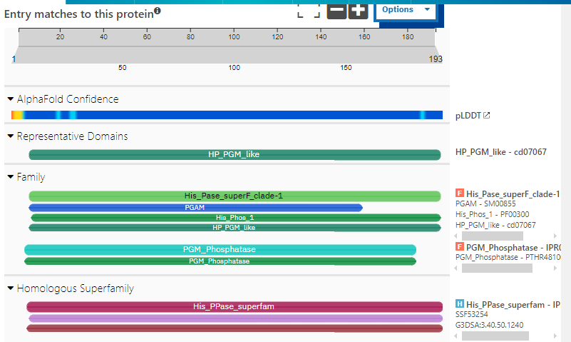**

### FUNKCIJA
O sami funkciji proteina se le predvideva (zato tudi poimenovanje domnevna izomeraza) na podlagi ohranjenega aminokislinskega motiva oziroma strukturne značilnosti (verjetno značilne katalitične domene). Ker protein vsebuje histidin fosfatazno domeno, ki jo med drugim najdemo tudi v fosfoglicerat mutazah predvidevam, da je tudi naš protein neka vrsta **fosfoglicerat mutaze**. 
Fofoglicerat mutaza je encim, ki sodeluje v 8. koraku glikolize. Njena naloga je prenos fosfatne skupine iz C-3 atoma na C-2 atom, torej pretvorba 3-fosfoglicerata v 2-fosfoglicerat prek 2,3-bisfosfoglicerata kot intermediata. Ti encimi so v grobem razdeljeni v dva kategoriji – od kofaktorja odvisne in od kofaktorja neodvisne fosfoglicerat mutaze.

### LOKALIZACIJA
Na podlagi predvidevanja, da gre za fosfoglicerat mutazo oz. neko drugo vrsto izomeraze, ki sodeluje pri metabolizmu ogljikovih hidratov, sklepam, da se encim nahaja **v citosolu**.

### SORODNI PROTEINI
Iskanje sorodnih proteinov s pblastom po ne-redundančni zbirki nas pripelje do več **proteinov iz družine histidinskih fosfataz** (torej imajo vsi enako domeno: *HP_PMG-like*). Izvorni organizmi večine teh proteinov so bakterije različnih vrst iz rodu Nocardioides. Procent prekrivanja z našim proteinom je visok, najvišji procent identičnosti pa je 59,28%.

 **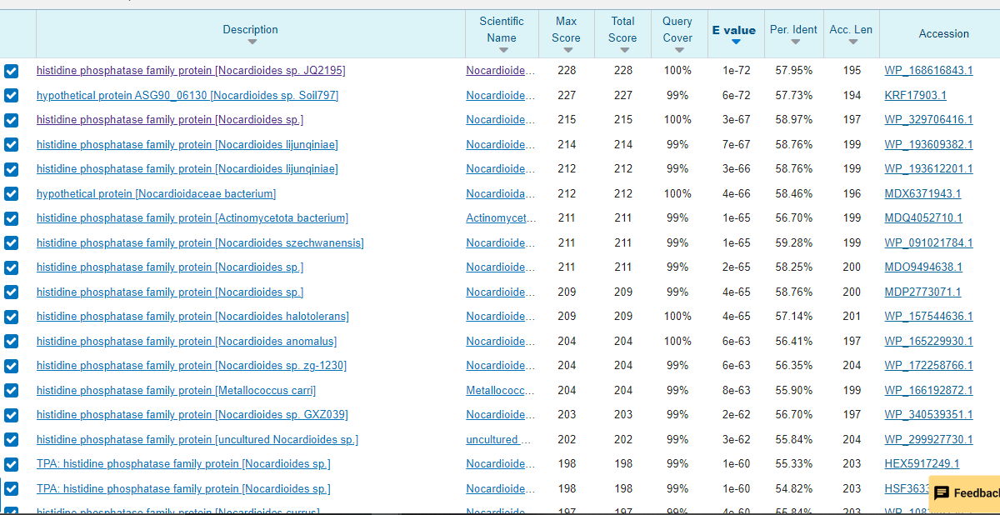**

Podobne zadetke dobimo tudi z iskanjem po UniProtu.
Iz UniProt strani lahko dostopamo do UniRef50 clustra, ki združuje zaporedja, ki se med seboj ujemajo v vsaj 50%. Gre predvsem za **proteine iz družine histidinskih fosfataz, izomeraze, fosfoglicerat mutaze in fosfoglicerat kinaze, večinoma iz bakterij rodu Nocardioides**.
Poravnala sem nekatere izmed zaporedij v klustru (izbrala sem proteine iz družine histidinskih fosfataz iz različnih vrst bakterij iz rodu Nocardioides, ter izomeraze, fosfoglicerat kinaze in mutaze iz bakterij iz rodu Nocardioides).

 **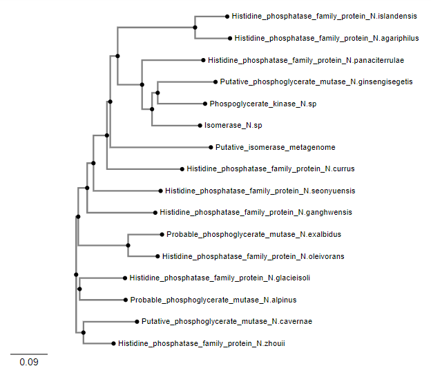**

Opazimo, da je domnevna izomeraza, s katero imamo opravka, evulocijsko bližje različnim proteinom nekaterih vrst. Vsi izmed bolj podobnih proteinov, s katerimi je bila izomeraza zgoraj primerjana, so žal slabše anotirani -  proteini iz družine histidinskih fosfataz bi tako lahko potencialno bili fosfoglicerat mutaze ali kinaze, vendar njihova vloga ni bila natančneje določena.

**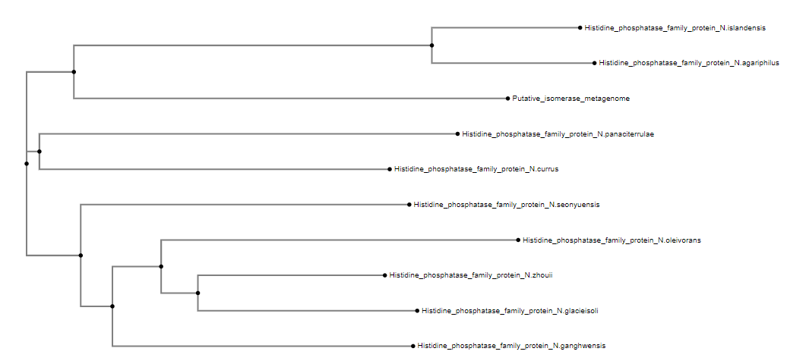**

Primerjava domnevne izomeraze samo s proteini iz družine histidinskih fosfataz nam pokaže, da je ta najbolj sorodna proteinom, ki jih najdemo v vrstah N. islandensis in N. agariphilus.

 **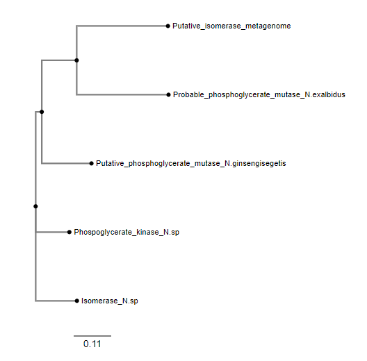**

Primerjava s podobnimi proteini, ki jim je bila določena funkcija, nam pokaže, da je domnevna izomeraza najbolj sorodna proteinom, ki so verjetno fosfoglicerat mutaze, kar dodatno potrdi naš sum o funkciji proteina.

### POSTTRANSLACIJSKE MODIFIKACIJE 
Ker so dotični protein in vsi njemu bolj sorodni proteini slabo anotirani, lahko o posttranslacijskih modifikacijah le sklepamo na podlagi najbolj sorodnega dobro anotiranega proteina.
Iskanje s pblast po zbirki dobro anotiranih zaporedij UniProt/SwisProt nam v prvih nekaj zadetkih vrne fosfoglicerat mutazi podoben protein 4 (Phosphoglycerate mutase-like protein 4) iz Arabidopsis thaliana in verjetno fosfoglicerat mutazo GpmB (Probable phosphoglycerate mutase GpmB) in Salmonella choleraesuis. Nobeden izmed teh proteinov nima anotirane nobene posttranslaijske modifikacije. 

**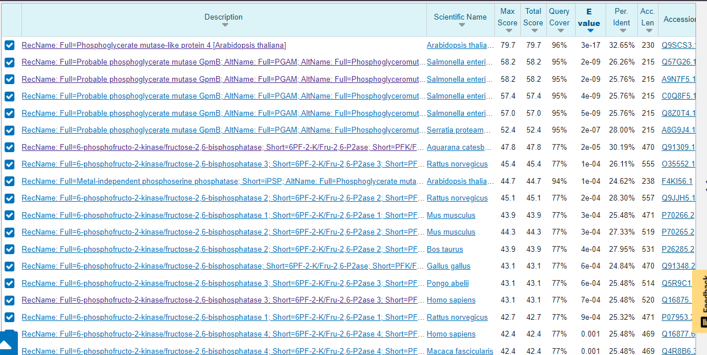**

Zadetki z nekoliko manj ujemanja predstavljajo 6-fosfofrukto-2-kinaze/fruktoza-2,6-bisfosfataze različnih evkariontskih organizmov, ki vključujejo posttraslacijske modifikacije (predvsem fosforilacije na serinskih ostankih). Ker pa sklepamo, da je naš porotein izomeraza, oziroma bolj specifično mutaza, torej druga vrsta encima, sklepamo, da se te posttranslacijske modifikacije našega proteina ne tičejo.
Na podlagi povedanega predvidevam, da je naš protein brez posttranslacijskih modifikacij oziroma na podlagi teh podatkov o njih ne morem sklepati z dovolj visoko zanesljivostjo

### NAJBOLJ IN NAJMANJ OHRANJENE REGIJE
Za identifikacijo bolj ohranjenih regij sem naredila 8 iteracij psi blasta z domnevno izomerazo. Končna zaporedja sem poravnala s programom Cobalt in iz poravnavo vstavila v EMBOSS Consensus sequence maker, s čimer sem dobila to zaporedje:
xxxxxxxxxxxxxxxxxxxxxxxxxxxxxxxxxxxxxxxxxxxxxxxxxxxxxxxxxxxx
xxxxxxxxxxxxxxxxxxxxxxxxxxxxxxxxxxxxxxxxxxxxxxxxxxxxxxxxxxxx
xxxxxxxxxxxxxxxxxxxxxxxxxxxxxxxxxxxxxxxxxMxxxxxxxxxxxxxxxxxx
xxxxxxxxxxxxxlxxxARLILVRHGETEYNVAxxxxILxxxxxGGxLTERGxAQAKxxG
ESLxxxxxxxxxxIYSSxxxRARQTAxxIxAxxGVxxxxxxxVLDGLxEVQVGDLxxGqx
xxExxxxFQxVYxAWxxGxDLxxRIPGGESGxEVLxRYLxVLEEIxDxHxxxGExxxxxx
xxxVLVVSHGxAMRLVxxxxxxxLAxxVxPxxxxxFxxNNxxLxxDNxETIxxxELxxxx
DxDxxxxxxxxxxxGWxCVRxxxxWxxGxxxxxPxxxxxxxxxxxxxxxxxxxxxxxxxx
xxxxxxxxxxxxxxxxxxxxxxxxxxxxxxxxxxxxxxxxxxxxxxxxxxxxxxxxxxxx
xxxxxxxxxxxxxxxxxxxxxxxxxxxxxxxxxxxxxxxxxxxxxxxxxxxxxxxxxxxx
xxxxxxxxxxxxxxxxxxxxxxxxxxxxxxxxxxxxxxxxxxxxxxxxxxxxxxxxxxxx
xxxxxxxxxxxxxxxxxxxxxxxxxxxxxxxxxxxxxxxxxxxxxxxxxxxxxxxxxx
Dobljeno konsenzno zaporedje sem nato globalno poravnala z iskalnim zaporedjem (v poravnavi je zgornje zaporedje kosnenzno, spodnje pa iskalno).

**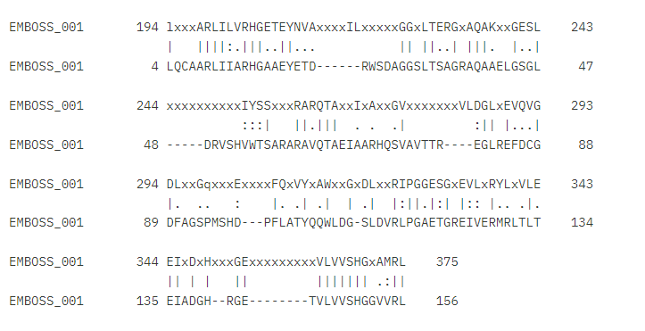**

Iz poravnave opazimo, da se nekatere regije iskalnega proteina bolj ujemajo s konsenznim zaporedjem kot druge (so bolj ohranjene).

**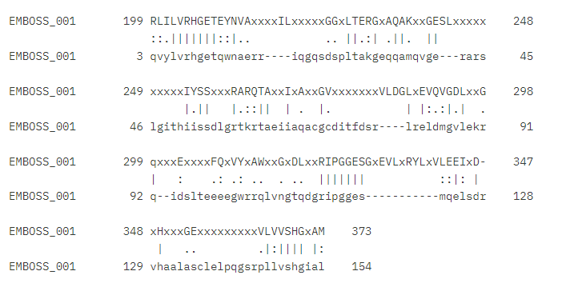**

Če poravnavo s konsenznim zaporedjem naredimo še z zaporedjem bolje anotiranega našemu podobnega proteina (*Probable phosphoglycerate mutase GpmB* iz *Salmonella parathypi*; to sicer ni protein, ki bi se z našim ujemal najbolje iz zbirke UniProt/SwissProt, ima pa boljše anotacije kot prvi zadetek) vidimo, da so nekatera ujemanja s konsenznim zaporedjem, pri obeh proteinih podobna (na približno enakih mestih so približno enaka ujemanja. Primer: zadnjih nekaj aminokislinskih ostankov pri obeh proteinih).  Predvidevam, da gre za bolje ohranjene elemente sekundarne strukture, ki so značilni za proteine, ki vsebujejo reprezentativno domeno histidinskih fosfataz (model strukture je prikazan v nadaljevanju, gre predvsem za **alfa vijačnice**). Vmesne, manj ohranjene regije so verjetno **zanke**, ki povezujejo bolje ohranjene **alfa vijačnice**.

Poravnava našega proteina z izbranim bolje anotiranim proteinom (*Probable phosphoglycerate mutase GpmB* iz *Salmonella parathypi*) nam pokaže, je aktivno mesto ohranjeno, medtem ko vezavno mesto substrata ni povsem ohranjeno. V teh dveh poravnavah so sicer za razliko od prvih dveh dveh poravnav označeni le identični aminokislinski ostanki, ne pa tudi podobni.

**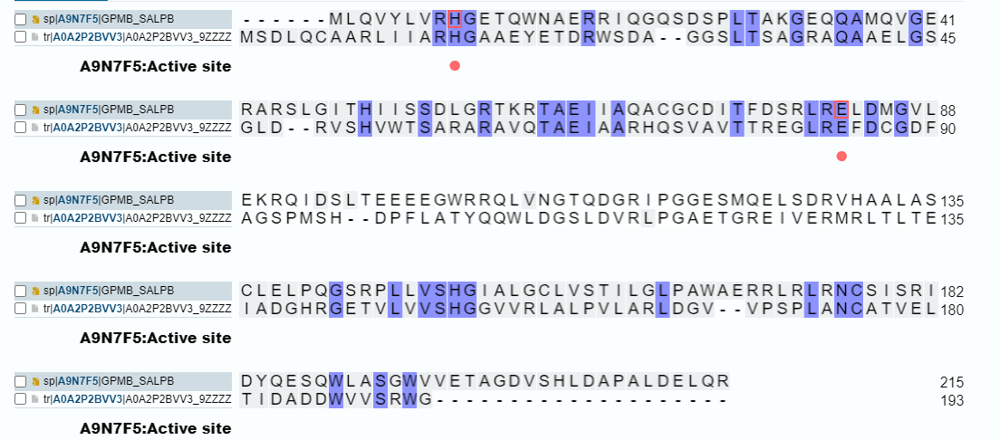**

****

### PODOBNI EVKARIONTSKI PROTEINI
Podobne evkariontske proteine, sem iskala s pblastom po zbirki UniProt/SwissProt (iskala sem po zbirki z bolje anotiranimi proteini za lažje sklepanje o povezavi) s filtrom eucaryotes. Prvi zadetek je **fosfoglicerat mutazi podoben protein** iz ***Arabidopsis thaliana***, ki se z iskalnim proteinom pokriva v 96%, procent identičnosti pa je 32,65%, kar je po nekaterih kriterijih izven cone somraka (torej bi proteina lahko potencialno bila homologa).
Naslednji zadetki so večinoma **6-fosfofrukto-2-kinaze/fruktoza-2,6-bisfosfataze** iz različnih evkariontskih organizmov. Gre za bifunkcionalne dvo-domenske encime, katerih ena domena deluje kot kinaza, druga pa kot fosfataza. Za podobnost med tem encimom in iskalnim proteinom pa je kriva fosfatazna domena, saj spada v družino histidinskih fosfataz, torej v isto dolžino kot domnevna metagenomska izomeraza. Čeprav encim opravlja povsem drugačno vlogo kot iskalni protein, pa zadetki, zaradi podobnosti v zaporedju ohranjene katalitične domene, po procentu identičnosti padejo v cono somraka (med 20% in 30%).

****

### MEDPROTEINSKE INTERAKCIJE
Kot že povedano sklepam, da je iskalni protein vrsta fosfoglicerat mutaze. Če je to predvidevanje pravilno, je možno, da iskalni protein sodeluje v procesu glikolize.

### MODEL STRUKTURE
Zaporedje sem vstavila v Alphafold 3, ki je izračunal najverjetnejši model strukture proteina. 

**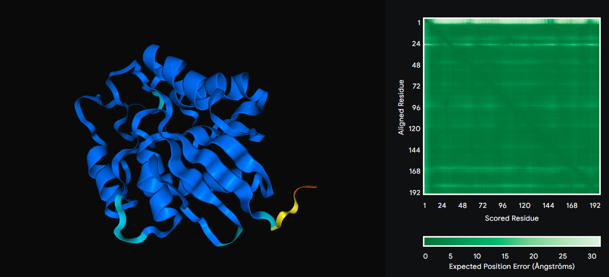**

Alphafold pobarva model proteina glede na vrednost pLDDT (*local distance difference test*), ki nam pove, kako zanesljiva je napoved strukture na nekem mestu. V skladu z barvno lestvico vidimo, da je napoved verjetno precej zanesljiva v skoraj vseh delih, razen na nekaj obrobnih aminokislinskih ostankih (N-konec proteina). 
Na desni strani vidimo graf, ki nam prikazuje napovedano napako poravnave. Kot vidimo, ima ta občutno večjo vrednost od 0 le na položajih prvih nekaj aminokislinskih ostankov (tam je graf bele barve, vsepovsod drugod pa je zelen).
Model strukture sem nato superponirala na iskalnemu proteinu najbolj podoben evkariontski protein s PDB modelom strukture. Iskanje s pblastom po zbirki PDB je kot najboljši rezultat podalo **verigo A človeške 6-fosfofrukto-2-kinaze/fruktuza-2,6-bisfosfataze**. Čeprav procent identičnosti poravnanih zaporedij le 25,48%, nam superpozicija modelov struktur pokaže, da sta si proteina strukturno precej bolj podobna, kot bi sklepali le iz poravnave zaporedij. Struktura je namreč mnogo bolj ohranjena kot zaporedje. Oba primerjana proteina vsebujeta ohranjeno histidin fosfatazno domeno, na podlagi katere sem ju prilegala. V primeru domnevne izomeraze, se fosfatazna domena razteza od 8. do 192. aminokislinskega ostanka, v primeru 6-fosfofrukto-2-kinaze/fruktuza-2,6-bisfosfataze pa od 230. so 416. aminokislinskega ostanka. V poravnavi stuktur je oranžna struktura domnevan izomeraza, veriga A 6-fosfofrukto-2-kinaze/fruktuza-2,6-bisfosfataze pa je zelene barve.

**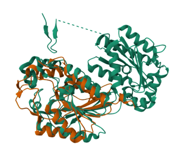**

**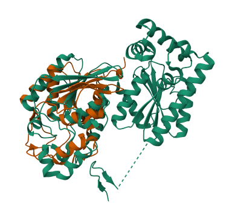**

