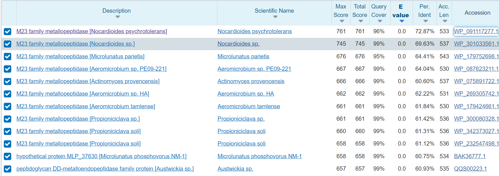
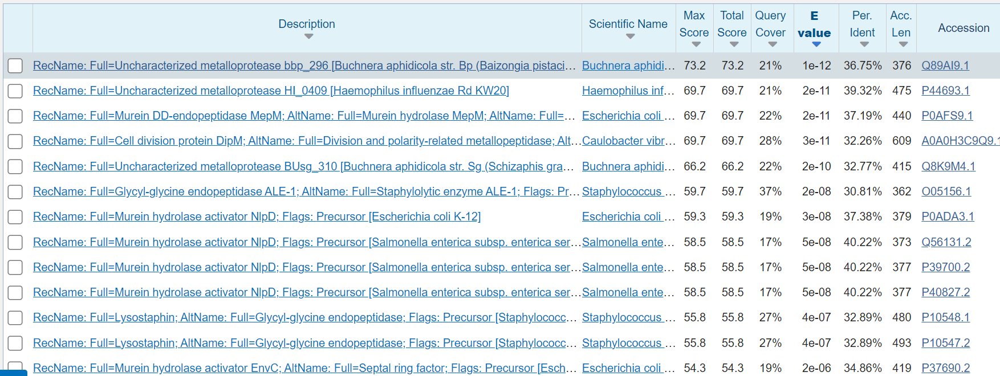
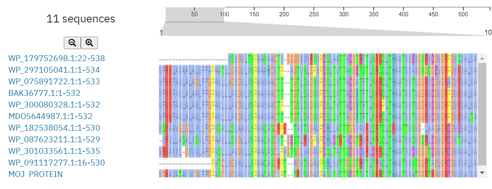
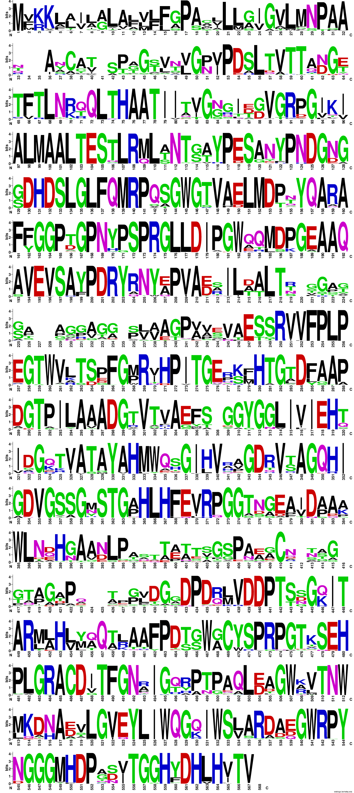
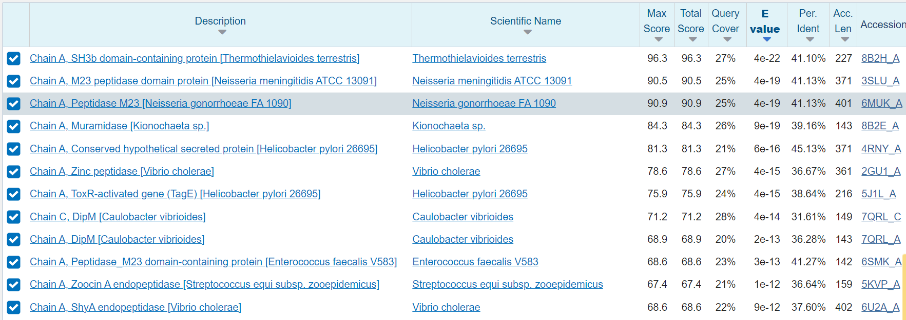
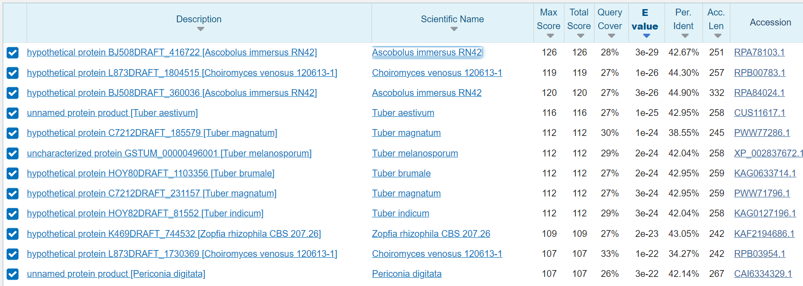
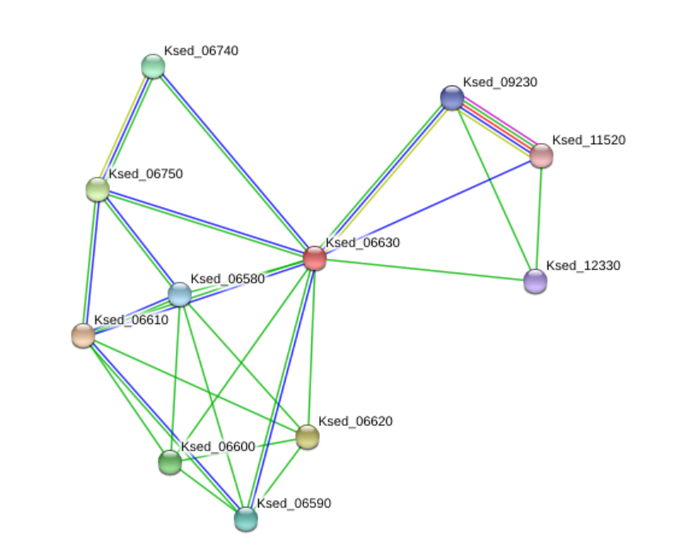
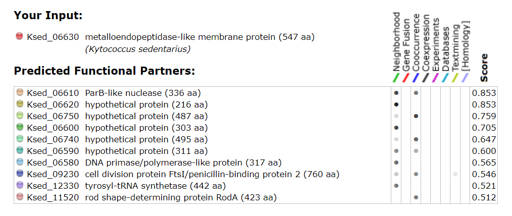
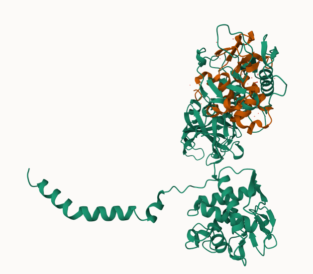

# S09

- **Avtor**: Klara Kolenc
- **Datum izdelave**: 2024-05-10
- **Koda seminarja**: S09

---
## Vhodni podatek

Povezava do datoteke z vhodnim podatkom: [S09](naloge/s09-input.md)

---
## Rezultati analiz

### Postopek identifikacije proteina

V podanem nukleotidnega zaporedju plazmida osnovanega na vektorju pUC57, sem našla klonirmo regijo (MCS). S pomočjo globalne poravnave (Needle) sem poravnala MCS del podanega zaporedja in zaporedje MCS vektorja pUC57, ki sem ga dobila na internetu. Kot nukleotidno zaporedje mojega proteina, sem vzela del zaporedja v poravnavi, ki se ni ujemal. Tega sem nato dala v blastx, ki mi je prevedel nukleotidno zaporedje v aminokislinskega in mi poiskal proteine s podobnim zaporedjem. Iskala sem po bazi Metagenomic proteins in kot moj protein identificirala tistega, ki je imela 100% ujemanje.

Zaporedje mojega proteina

>MGKAVATALVLGLFFGPASCLVGMAVLLNPAAQASCLPTSRLNVGAIPASLSVTTSDGTTLTLNRRQLTHAATIIATGGRTRGVGRDGVVIALMAALTESSLRMLSNTSAYPESANYPHDGNGGDRDSLGLFQMRPSAGWGTIADLMDPAYQARAFFGGLTSPNHGSPRGLLDIPGWQQLSPGAAAQAVEGSAYPDRYARFERVAAQTVDALTRTASTSASASSVVPETGRVVFPLPAGTWVRTSGFGMRVHPVTGESKLHTGVDLAAPSGTHILAAADGRVSFAGPAPGYGHLILIEHTVARRRVATGYAHMYAEGIRVKAGDTVTAGQYIGDVGMDGYATGPHLHFEVRPGRADAAPVDPEEWLTSNGASDVESRTERSAAGCGNAGGPASSYAGDDPNHLIDDPTTDGQITERTASVLAQVQKNFPDSRWGCWSPRAGQQSEHPLGRACDGTFGNSIGTAASGPALDLGWKICNWLKVNAVTLGVEYLIWQGHIWSVARNSEGWRPYDGGGMHDPNSVTGGHYDHLHFTVVG

### Lastnosti proteina

Moj protein je **Metaloendopeptidazi podoben membranski protein**. Ker je bil ta izoliran kot metagenom lahko o izvorne organizmu tega proteina sklepam iz podobnih poteinov in organizmov v katerem so bili najdeni te. Protein z najbolj podobnim zaporednjem je protein metalopeptidaza iz družine M23, ki je bila izolirana iz gram-pozitivne bakterije *Nocardioides psychrotolerans*, zato lahko sklepam, da tudi moj protein lahko najdemo v tej bakteriji sorodnem organizmu. Ta sorodni protein sem našla tako, da sem v pblast dala zaporedje mojega proteina in iskala po zbirki non-redundant protein sequences (nr), vzela sem prvi zadetek, ki je imel najboljše ujemanje (73%) in na podlagi tega proteina sklepala v katere izvornem organizmu je bil najden protein.

Lastnosti:
* Lokalizacija,topologija: Že iz imena je razvidno, da se protein nahaja v membrani. 
* Velikost: Protein je dolg 535 aminokislinskih ostankov. 
* Domenska zgradba: Protein ima transmembransko domeno (sklep s pomočjo podobnosti proteina, ki je notiran v Uniprot) 
* Post-translacijske modifikacije: Nisem našla nobenih post-translacijskih modifikacij

Funkcija: Na podlagi podobnosti s proteinom nekarakterizirane metaloproteaze, sem s pregeledom podatkov na uniproti, do katerega sem prišla iz povezave na genbank, ugotovila, da deluje kot metaloproteaza, kar pomeni, da je njegov katalitični mehanizem odvisen od vezave kovine, ta protein veže cink. Protein je encim, ki deluje kot proteaza, torej razgrajuje druge proteine in je tudi hidrolaza, saj katalizira cepitev vezi s pomočjo rekacije z vodo. Prav tako sem po pregeldu v uniprotu podobnega proteina ugotovila, da vsebuje transmembransko domeno. 

Moj protein je soroden proteinom iz družine M23. Poravnavo sornodnih proteinov sem naredila s pomočjo Clastel Omega, ter nato s pomočjo teh podatkov izrisala filogenetsko drevo.

Za ugotovitev najbolj in najmanj ohranjenih regij sem izrisala Sequance logo, na kateremu lahko vidmo kateri aminokislinski ostanki so bolj ohranjeni. Sklepam, da tisti predeli, ki imajo največ ohranjenih aminokislinskih ostankov so bolj ohranjeni, in tisti, ki jih imajo manj, manj ohranjeni. Bolj ohranjeni aminokislinski ostanki sona grafu prikazani z večjimi črkami in manj ohranjeni z manjšimi.

Podobne evkariontske proteine sem iskala s pomočjo pblast, iskala pa sem po več bazah: non-redundant protein sequences (nr) *(slika1)*, pdb *(slika2)* in swissprot. Po iskanju v bazi swissprot ni bilo zadtekov, ko pa sem iskala po non-redundant protein sequences (nr) je bil najbolj podoben protein je nek hipotetičen protein izoliran iz glive, ko pa se iskala po pdb je bil najbolj podoben protein, ki vsebuje SH3b domeno v verigi A, prav tako pridobljen iz glive.

Slika 1:

Slika 2:

Interakcija: Zaporedje mojega proteina sem dala v program String, ki mi je izrisal spodji graf in tabelo. Razvidno je da protein reagira z sosednjimi proteini kot posledica bližine.

### Struktura

Struktura mojega proteina še ni bila določena zato sem jo narisala s pomočjo Alphafold2. Struktura je prikazana na spodnji sliki:

Na sliki so z rdečo prikazani deli, ki so najmanj zanesljivi, z modro pa deli, ki so najbolj zanesljivi. 

Podatki dobljeni iz alpha folda so prikazani na spodjih grafih. Prvih 5 grafov v zgornji vrstici predstavljajo napake predvidene razdalje za vsak par ostankov za vseh 5 struktur, ki jih je zmodeliral Alphafold2. Obe osi označujeta položaj posameznih aminokislin. Negotovost v predvideni razdalji dveh aminokislin je barvno kodirana od modre (0 Å) do rdeče (30 Å), kar je tudi prikazano na desni strani na y-osi. Graf spodaj desno prikazuje izračun LDDT za vseh 5 meritev, kjer tiste vrednosti LDDT, ki so pod 50 kažejo zelo nizko natančnost/zanesljivost, vrednosti med 70 in 90 pomenijo visoko natančnost, kjer je napoved glavne verige proteina zanesljiva, vrednosti pLDDT nad 90 pa kažejo na zelo visoko natančnost.

Superpozicija proteina modeliranega z SwissModel in podobnega evkariontskega proteina. Vzela sem strukturo, ki mi jo je izrisal Swissmodel in najpodobnejši evkariotski protein, ki sem ga našla, da je imel določeno strukturo v pdb. Strukturi sem superpozicionirala s pomočjo programa Molstar. Kot je tudi razvidno iz slike si proteina nista prav podobna (imasta le 41% podobnost)

