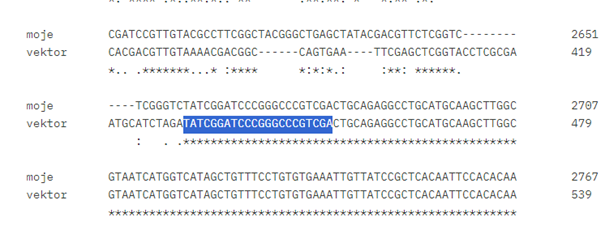
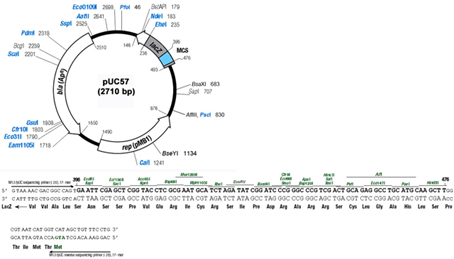
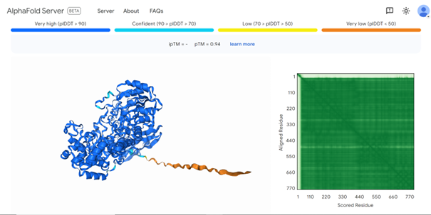
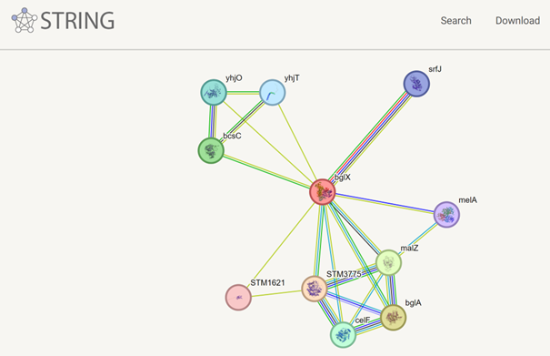
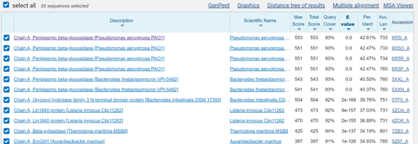
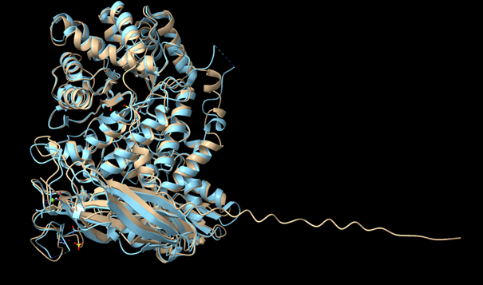
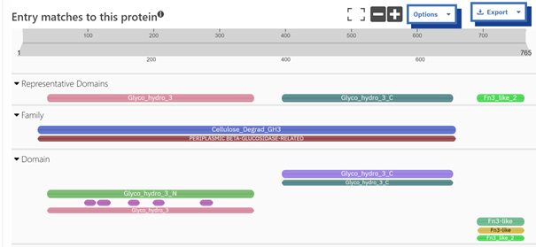
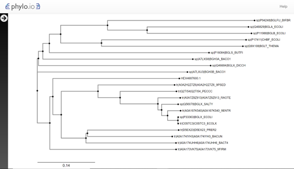

# Predloga

- **Avtor**: Simon Kristl
- **Datum izdelave**: 2024-05-25
- **Koda seminarja**: S11

---
## Vhodni podatek

Povezava do datoteke z vhodnim podatkom: [S11](naloge/s11-input.md)

---
## Rezultati analiz
### Iskanje zaporedja

Zaporedje našega vključka (zaporedje neznanega proteina) sem dobil tako, da sem najprej poiskal zaporedje vektorja pU57, v katerega je bil naš vključek vstavljen in izvedel poravnavo obeh zaporedij na ClustalOmega, ter odstranil ujemajoče se dele, odstranil pa sem še dele zapisa, ki so se ujemali z MCS mestom na vektorju, tako, da mi je na koncu ostal le zapis za naš neznan protein.

*Z modro je označen začetek zapisa vektorja v našem zaporedju. Od vključno označenega dela naprej sam zaporedje odstranil.*

*Zapis za MCS mesto, katerega sem tudi odstranil iz našega zaporedja.*

Preostalo zaporedje sem vnesel v Blastn, iskal v bazi podatkov metagenome in dobil zadetek Beta-glucosidase [metagenome] s 100% ujemanjem.

Ker o tem zaporedju nisem našel nobenih podatkov, sem nato vstavil dobljen metagenom v Blastx z bazo podatkov non-redundant, v katerem sem iskal proteinska zaporedja podobna prevedenemu metagenomu in dobil sledeči zadetek s 100% ujemanjem, TPA: beta-glucosidase BglX Nocardioides sp. In identifikacijsko številko “HEX4687600.1”.

Iz tega zadetka lahko na spletni strani GenBank določimo izvorni organizem, Nocardioides sp., velikost proteina, 770 aminokislinskih ostankov in da protein izvaja hidrolazno aktivnost, saj hidrolizira O-glikozil spojine. Poskusil sem pridobiti še več podatkov, vendar nadaljna iskanja po podobnih proteinih iz zgornje slike niso prinesla dodatnih ugotovitev. Lokalizacija in post-translacijske modifikacije proteina niso znane.

### Značilnosti proteina
Kot sem omenil že prej, gre za beta-glikozidazo, ki hidrolizira O-glikozil spojine. Da bi izvedel več o strukturi proteina sem vnesel njegovo zaporedje v InterPro in dobil sledeče izsledke.

Protein vsebuje N in C-terminalno glikozid hidrolazno domeno, ki sta značilni za družino glikozid hidrolaz. Vsebuje pa tudi fibronektin tipa 3-podobno domeno, ki lahko sodeluje pri vezavi substrata, omogoča interakcije z drugimi proteini in služi kot signal za pravilno lokalizacijo.

Zaporedje proteina sem tudi vnesel v AlphaFold3 in pridobil sledečo strukturo.

Kot je razvidno, je začetni N-konec predviden z zelo nizko stopnjo zanesljivosti, od okoli 30. aminokislinskega ostanka naprej pa je struktura predvidena z visoko stopnjo zanesljivosti.

Glede morebitnih interakcij z ostalimi protein sem moral sklepati glede na podobne proteine, saj noben zadetek ni imel opisanih morebitnih interakcij. Zato sem poiskal SwissProt anotiran protein, ki je bil še najbolj podoben našemu, temu kriteriju je najbolje ustrezal Q56078.2 z 42% ujemanjem. Tu sem našel seznam možnih interakcij z drugimi protein dostopni na sledeči povezavi https://string-db.org/network/99287.STM2166.

Kot lahko vidimo iz sheme so pri tem proteinu možni funkcijski partnerji druge beta-glukozidaze, glikoziltransferaze, galaktozidaze in določeni membranski protein.

### Primerjava s podobnimi proteini

Predvideno strukturo ustvarjeno v AlphaFold3 sem nato odprl v ChimeraX in jo preko superpozicije primerjal s proteinom, ki sem ga poiskal na Blastp z iskanjem po PDB podatkovni bazi, da je imel določeno strukturo, s katero sem lahko primerjal predvideno strukturo našega proteina.

Za primerjavo sem vzel prvi zadetek z največjo podobnostjo s PDB kodo 6R5I. Kot lahko vidimo na sliki spodaj sta strukturi zelo podobni, z izjemo slabo predvidenega začetnega dela našega proteina, čeprav je bila podobnost pri primerjavi zaporedij le okoli 42%. Tudi v tem protein niso določena aktivna mesta ali post-translacijske modifikacije. S to primerjavo sem dodatno potrdil da je naš protein beta-glikozidaza, več od tega pa ne bi sklepal, saj je kljub podobnosti v strukturi razlika v zaporedjih velika, prav tako pa je velika neznanka slabo predviden začetni del verige. ChimeraX seja na voljo [tukaj](https://github.com/Simon-Kristl/Slike/blob/main/zaporedje.cxs).

*Z rjavo barvo je označen naš protein, s svetlo modro pa 6R5I.*

Zapis za 6R5I sem vstavil v InterPro in dobil enake značilne domene, ki so prisotne v našem proteinu, kot je razvidno na spodnji sliki.

Z iskanjem BglX v uniprotu sem nabral več zapisov tega proteina iz različnih vrst prokariontov in ustvaril sledeče filogenetsko drevo z uporabo ClustalOmega in Phylo.io. Naše zaporedje je označeno s “HEX4687600.1”s.

Iz zbirke the proteinov sem ustvaril še WebLogo diagram, iz katerega bi lahko morda sklepal o aktivnem mestu, saj so nekateri zapisi imeli določena aktivna mesta. Aktivna mesta so bila v SwissProt anotiranih proteinih aspartati, vendar se te značilnosti ni jasno videlo na ustvarjeni shemi, tako bi lahko sklepal, da je aktivno mesto mogoče aspartat, ne pa tudi kateri aspartat to je.

Slika je zaradi velikosti dostopna [tukaj](https://github.com/Simon-Kristl/Slike/blob/main/filerhhp4g.png).
[Datoteka](https://github.com/Simon-Kristl/Slike/blob/main/clustalo-I20240525-091158-0789-8565824-p1m.fa) uporabljena pri tvorbi WebLogo slike.

### Evkariontski ekvivalent
Evkariontski ekvivalent sem poskusil poiskati na več načinov, iskal sem z Blastp s kriterijem, da je rezultat pripadnik evkariontov po Swiss-Prot in PDB bazah z navadnim in PSI-Blast iskanjem, vendar so največje podobnosti bile pod 33%, kar je zelo nizko ujemanje. Poskusil sem tudi bazo non-redundant, vendar so tudi tu ujemanja bila največ okoli 42%, prav tako pa je veliko zadetkov bilo domnevnih zaporedij ali celo neimenovanih zaporedij. Zato sem zaključil, da sta struktura in zaporedja evkariontskih beta-glikozidaz preveč različni, da bi ju lahko primerjali.

*Blast PDB*

*Blast SwissProt*

*Blast non-redundant*

