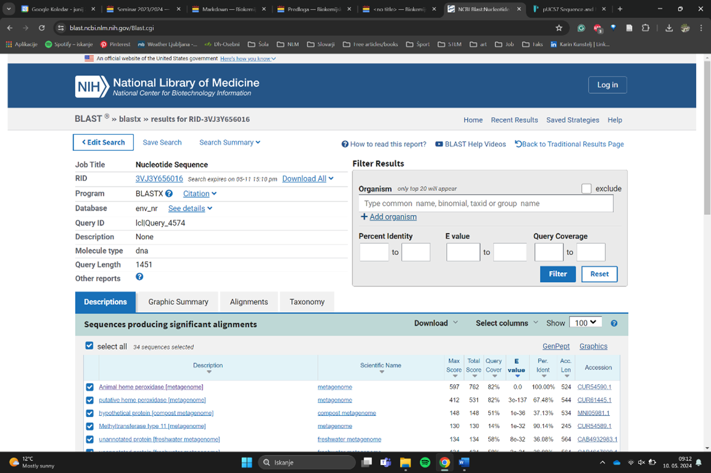
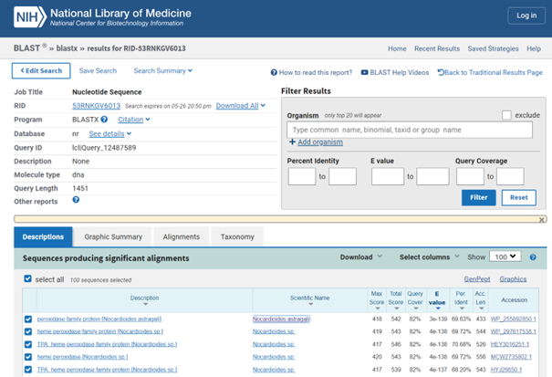
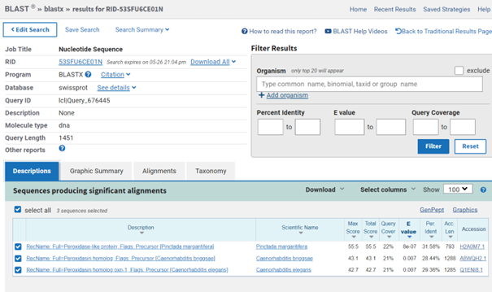

# S12

- **Avtor**: Karin Kunstelj
- **Datum izdelave**: 2024-05-25
- **Koda seminarja**: S12

---
## Vhodni podatek
Povezava do datoteke z vhodnim podatkom: [S12](naloge/s12-input.md)

---
## Rezultati analiz

### Ime, velikost in izvorni organizem

**Ime**: živalska hem peroksidaza (GenBank: CUR54590.1)

**Velikost**: 524 aminokislinskih ostankov

**Izvorni organizem**: neznana bakterija, okoljski vzorec

## Identifikacija
Identifikacija je bila narejena z uporabo NCBI BLAST, varianta blastx (zbirka env_nr). Dobila sem zadetek s 100 % identičnostjoin E vrednostjo O, zato sklepam, da predstavlja celoten zapis za moj protein. Gre torej za živalsko hem peroksidazo iz okoljskega vzorca in neznane bakterije.

[>CUR54590.1 Animal heme peroxidase [metagenome]](https://www.ncbi.nlm.nih.gov/protein/CUR54590.1)
MGVSGQSEPRHGRDFFHIEGEGFVGDPPGTQRLAEEPPPFRFSRMGPRGRRLSRSLRVKLARAMTSGTNR
NGTIPAGFTYLGQFVDHDLTFDFTDVALGDDVSPADLLQGRSPTLDLDNVYGAGPNDTKSARFYEDGLHL
KIGTTTRAGSDRAKVGFDVPRVGTGGVVARRRAQIPDRRNDENLAVAQTHAAMIRFHNRVVDKQRDTVPP
SDRFRRARKRVVLHYQWMLRTDYLPRICDPAVVDDVFTNGRKVFEVGADPLSMPTMPVEFSVAAFRLGHS
MVREAYDWNARFPSGQGLLDLLFTFSATSGDLGFNDTLPSNWIADWRRLYRFHEIQRDDLKPPPKEFNFA
RRLDTVLVDPLSVLPPGSFGGADEDAGTIEANLAFRNLTRATMLKLASGQQMADLMIAAGVSLTKLTAAQ
IRTGLDGTTLEDLTASEREVFVANTPLWFYVLREAELNNGRLTGVGARIVAETFHRAMEGSRFSIVRETD
FSPKLGAVPGRFTMTDLLVFAFENKVGLLAPLGD

V kolikor pa vzamemo za indentifikacijo v blastx zbirko nr, se pojavijo slabši rezultati z identičnostjo pod 74% in E vrednostjo pod 3e -139. Pri rezultatih z najvišjim ujemanjem v tej zbirki gre v vsakem primeru za protein iz družine hem peroksidaz, organizem pa naj bi bil rodu *Nocardioides*.

Anotirani rezultati, ki jih dobimo z iskanjem po blastx (zbirka swissprot), pa imajo E vrednost pod 8e -7 in identičnost pod 32%. Gre za protein podoben peroksidazi.

### Podobnost z evkariontskimi proteini
Ker gre za ŽIVALSKO peroksidazo bi seveda pričakovali dobro ujemanje z ekvariontskimi proteini, a temu ni tako. 

## Poravnava in ohranjenost regij
Poravnavo več zaporedij sem izvedla v programu Clustal Omega. Prvo zaporedje je bil moj protein - živalska hem peroksidaza(CUR54590.1), nato je sledila serija proteinov, ki so bili najdeni z blstx verzijo env_nr - protein družine peroksidaz iz *Nocardioides astragali*(WP_255892850.1), proteini družine hem peroksidaz iz *Nocardioides sp.*(WP_297617538.1),  *Nocardioides immobilis*(WP_118925846.1) in *Nocardioides donggukensis*(WP_192142959.1). Zadnji poravnan protein je bil najden z blastx verzijo swissprot in sicer peroksidazi podoben protein(sp|H2A0M7.1|PLSP_PINMG). V programu phylo.io sem izrisala filogenetsko drevo.

, 
,

Anotirani protein je daljši od ostalih, zato so v poravnavi opazne "luknje", ki se "zakrpajo", ko sem iz poravnave odstranila anotirani protein (prikazano spodaj).
Pomembno je poudariti, da je bila poravnava izvedena na anotiran protein, ki ima najmanjše ujemanje po blast iskanju z našim proteinom, kjub temu pa so poravnave, če opazujemo ostale primerjane proteine, izmeno na mestu in se velikokrat skoraj popolnoma prilegajo.
Zato sem torej ponovno izvedla poravnavo, a tokrat BREZ anotiranega proteina in dobila sledeče rezultate:

, 

Z izjemo proteina iz *Nocardioides astragali* (ta je tudi dosti krajši od ostalih) se peroksidaze skoraj popolnoma ujemajo. Ko pogledamo poravnavo zaporedij pod drobnogledom vidimo izjemno ohranjeno zaporedje, ki se pojavi že skoraj na čistem začetku vseh primerjanih proteinov. Skoraj celotno zaporedje je torej konsenzno vsaj 70%, kar je izredno veliko. Tudi prmerjava z anotiranim zaporedjem nam poda, katere regije so ohranjene, to pa je predvsem v okolici sredine zaporedja, če gledamo glede na anotirani protein.

## Post translacijske modifikacije, domene, lokacija in interakcija z drugimi proteini
Anotirani protein ima v [UniProt](https://www.uniprot.org/uniprotkb/H2A0M7/entry#ptm_processing) žal zapisano samo, kateri del zaporedja je signalno zaporedje, tega pa pri ostalih ni. Lokacija naj bi bila za anotirani protein določena po podobnosti -nahaja se izven celice oz. je izločen- , to pa se že preveč oddaljeno našemu proteinu, da bi lahko res zatrdili točno nahajanje. 
Domene niso nikjer zapisane, prav tako pa niso nikjer omenjene interakcije z drugimi proteini.

## Funkcija in vezava substrata
Ker gre za hem peroksidazo, lahko sklepamo, da gre za encim, ki uporablja vodikov peroksid kot akceptor elektronov. V reakcijo je vključeno železo.

## Model proteina
Z nova različico programa AlphaFold -AlphaFold3- sem dobila izrisan model strukture proteina, ki ima izjemno visok plDDT za večino strukture, torej lahko skoraj z zagotovostjo vidimo, kako približno bi izgledala struktura živalske hem peroksidaze.

