# S13

- **Avtor**: Nina Majerle
- **Datum izdelave**: 2024-05-10
- **Koda seminarja**: S13

---
## Vhodni podatek

Povezava do datoteke z vhodnim podatkom: [S13](naloge/s13-input.md)

---
## Rezultati analiz

### Ime in izvorni organizem proteina
Najprej na internetu poiščemo plazmidno karto pUC57. Vemo, da je naš protein vstavljen nekam v multiplo klonirno regijo, zato skopiramo ta del nukleotidnega zaporedja plazmida iz plazmidne karte in ga poravnamo z našim (skopiramo spet samo MCS). Poravnavo izvedemo s Clustal Omega Multiple Sequence Alignment (MSA).

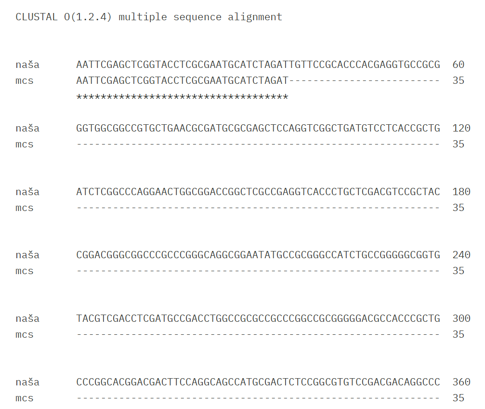

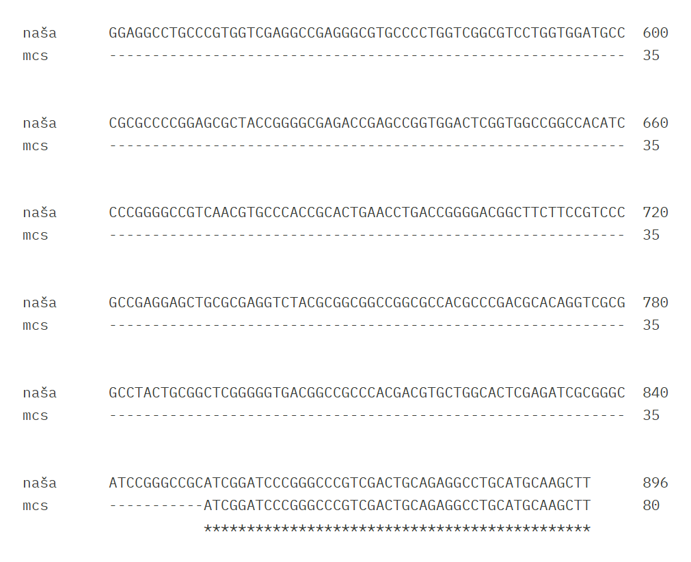

Del, ki ni poravnan z MCS plazmida je naš protein. Skopiramo to zaporedje in ga vnesemo v BLAST, kjer iščemo z blastx po bazi metagenomic proteins.

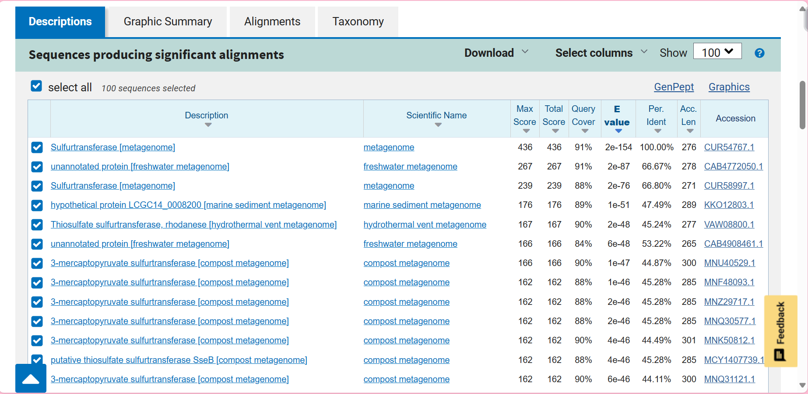

Zadetek s 100% Per. Ident ujemanjem je naš protein (GenBank accession: CUR54767). Sekvenca, ki je bila vstavljena v naš plazmid predstavlja 91% celotnega proteina (konec manjka). Od tukaj naprej uporabimo vedno zaporedje celotnega našega proteina.

**Ime proteina:** žveplotransferaza (*angl. sulfurtransferase*)

**Izvorni organizem proteina:** ni znan, protein je iz okoljskega vzorca; tekočega mineralnega medija (*angl. liquid mineral medium*). Protein je najverjetneje iz roda *Nocardioides*, saj je protein z največjim ujemanjem z znanim izvornim organizmom (iščemo z blastp po bazi non-redundant protein sequences) iz organizma *Nocardioides sp*. (WP_300371283)

### Lokalizacija, topologija
Iščemo z blastp bo bazi UniProtKB/Swiss-Prot, saj bi si želeli najti čimbolj podoben protein z zapisom na UniProtu.

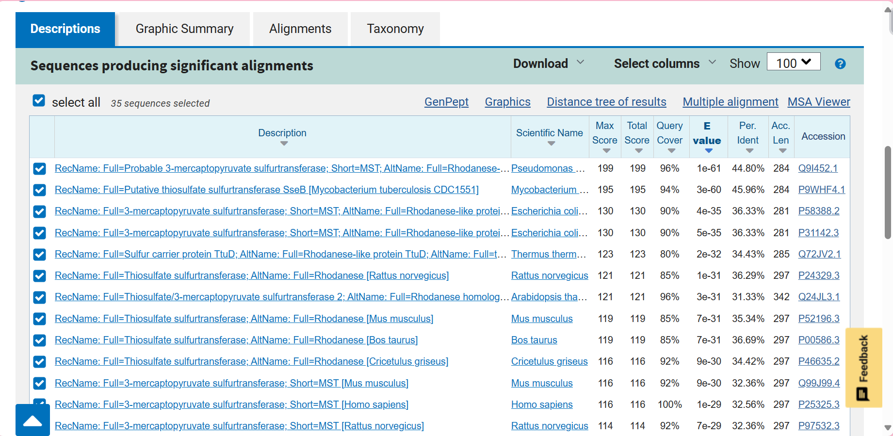

Če pregledamo npr. prve 3 zadetke z najnižjimi E-vrednostmi (Q9I452, P9WHF4, P58388) vidimo, da se vsi trije nahajajo v citoplazmi. Na podlagi tega sklepamo o lokalizaciji našega proteina.

**Lokalizacija:** citoplazma

**Topologija:** ni membranski

### Velikost proteina
Pomagamo si z orodjem ProtParam.

**Število aminokislinskih ostankov:** 276

**Molekulska masa:** 28989.57 g/mol

### Domenska zgradba
Že v GenBank zapisu za naš protin piše da vsebuje dve rhodanese domeni. Na podlagi poravnave našega proteina in najbolj podobnega proteina z zapisom na UniProtu (Q9I452) lahko določimo od katerega do katerega aminokislinskega ostanka potekata domeni.

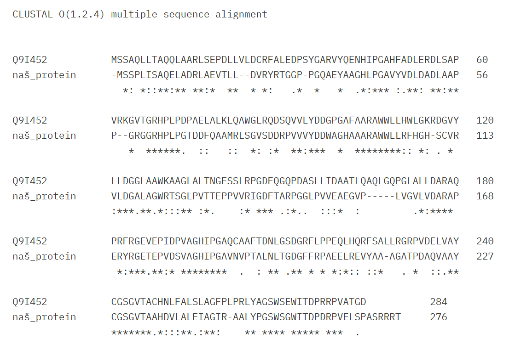

**Rhodanese 1:** 16-131

**Rhodanese 2:** 158-167

Na UniProtu (Q9I452) je omenjena tudi regija odgovorna za specifičnost prepoznavanja substrata (CGSGVTA), katera je popolnoma ohranjena tudi v našem proteinu: 228-234

Ohranjena sta tudi aminokislinska ostanka vezavnega in aktivnega mesta:

**Vezavno mesto:** R170

**Aktivno mesto:** C228

### Post-translacijske modifikacije
Gledamo npr. prve 4 najbolj podobne proteine z zapisom na UniProtu (Q9I452, P9WHF4, P58388, P31142). Pri prvih dveh ni nobene PTM, pri drugih dveh pa pride do odstranitve iniciatorskega metionina.

**PTM:** najverjetneje ni, mogoče odstranitev iniciatorskega metionina

### Funkcija proteina in substrat
Na GenBanku piše, da je naš protein 3-merkaptopiruvat žveplotransferaza (*angl. 3-mercaptopyruvate sulfurtransferase*), enako kot tudi najbližji homolog (WP_300371283) in najbolj podoben protein z zapisom na UniProtu (Q9I452).

**Funkcija:** katalizira prenos žvepla iz 3-merkaptopiruvata do akceptorja s tiolno skupino, kar tvori intramolekularen disulfid in sprosti vodikov sulfid ter piruvat. Encim sodeluje v metabolizmu cisteina in je udeležen v detoksifikaciji cianida.

**Substrat:** 3-merkaptopiruvat

### Sorodni proteini (poravnava, filogenetsko drevo)
Poravnamo 3-merkaptopiruvat žveplotransferaze iz različnih vrst in rodov bakterij. Naš protein je verjetno res iz roda *Nocardioides* (po filogenetskem drevesu najbližji proteini so vsi iz tega roda).

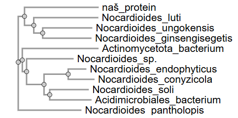

Poravnamo različne proteine iz različnih organizmov. Presenetljivo je naš protein, ki naj bi bil 3-merkaptopiruvat žveplotransferaza, po filogenetskem drevesu najbližje tiosulfat žveplotransferazi.

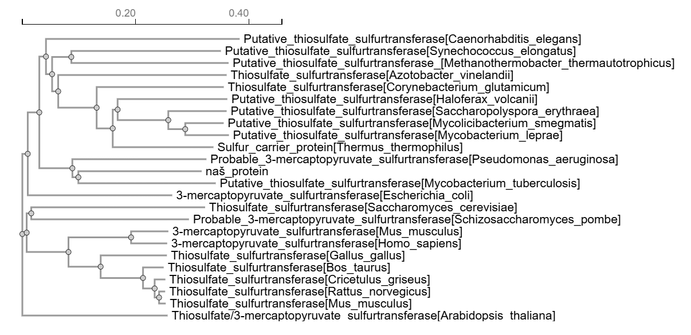

### Najbolj in najmanj ohranjene regije, tudi v luči funkcije proteina
Izvedemo 8 iteracij PSI BLAST po bazi non-redundant protein sequences in jih poravnamo (multiple alignment). Ustvarimo WebLogo.

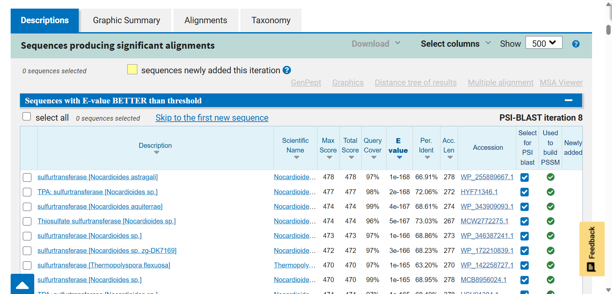

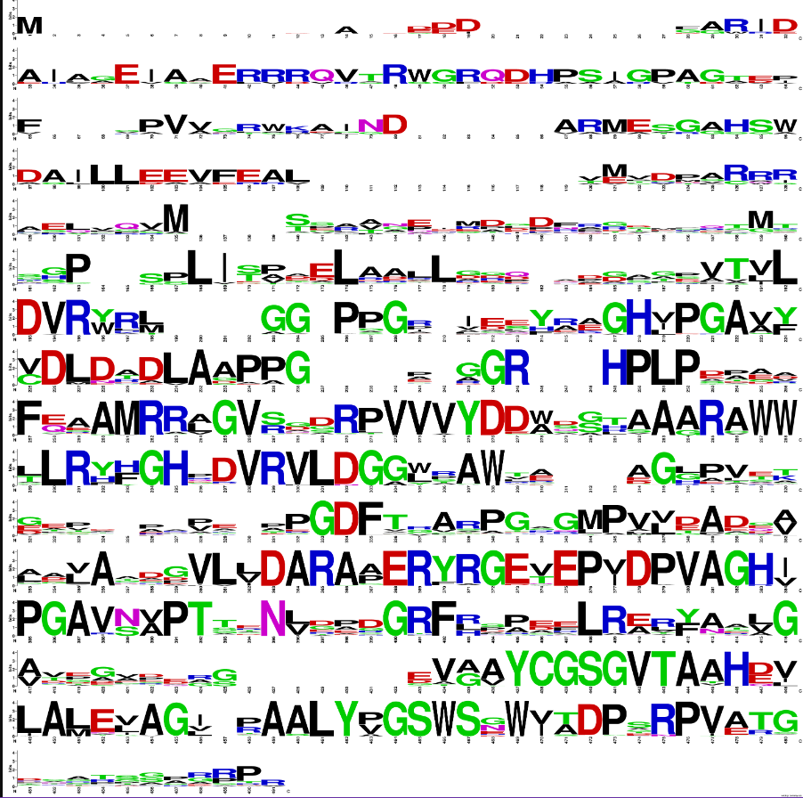

Bolj ohranjene regije so najverjetneje ohranjeni elementi sekundarnih struktur kot so alfa vijačnice, beta trakovi, itd.

Zelo ohranjena je regija odgovorna za specifičnost prepoznavanja substrata (CGSGVTA), kjer se nahaja tudi ohranjen cistein aktivnega mesta. To je logično in pričakovano, saj na ta način encim ohranja svojo funkcijo.

### Podobni evkariontski proteini – organizem, protein, funkcija, …
Iščemo po bazi UniProtKB/Swiss-Prot, pod organizem vnesemo Eukaryota.

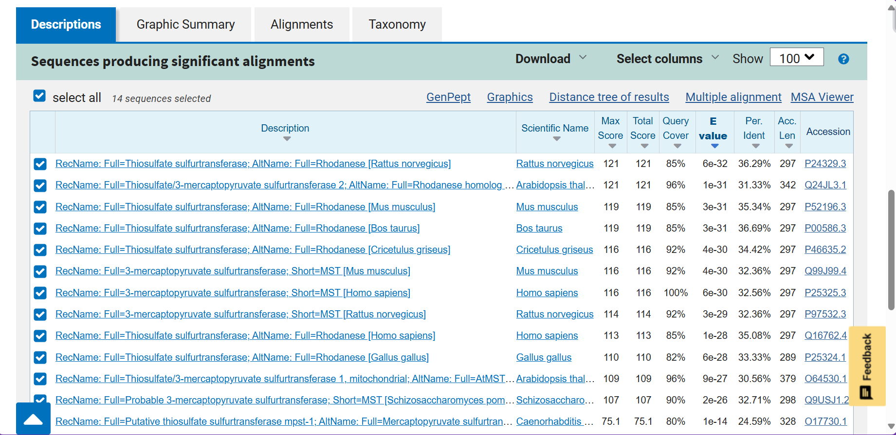

Podobni evkariontski proteini so bodisi 3-merkaptopiruvat žveplotransferaze bodisi tiosulfat žveplotransferaze. Njihova funkcija se do neke mere ohranja (sodelujejo pri detoksifikaciji cianida), evkariontski proteini pa imajo poleg tega še druge raznolike funkcije.

Če pregledamo prvih 5 evkariontskih proteinov z najnižjo E-vrednostjo (P24329, Q24JL3, P52196, P00586, P46635) vidimo, da se 4 od teh nahajajo v matriksu mitohondrijev, kar je evolucijsko smiselno. Ohranjeni sta tudi rhodanese domeni ter arginin v vezavnem mestu in cistein v aktivnem mestu. Prisotno pa je še eno vezavno mesto z lizinom. Iz poravnave razberemo tudi skoraj popolnoma ohranjeno regijo CGSGVTA.

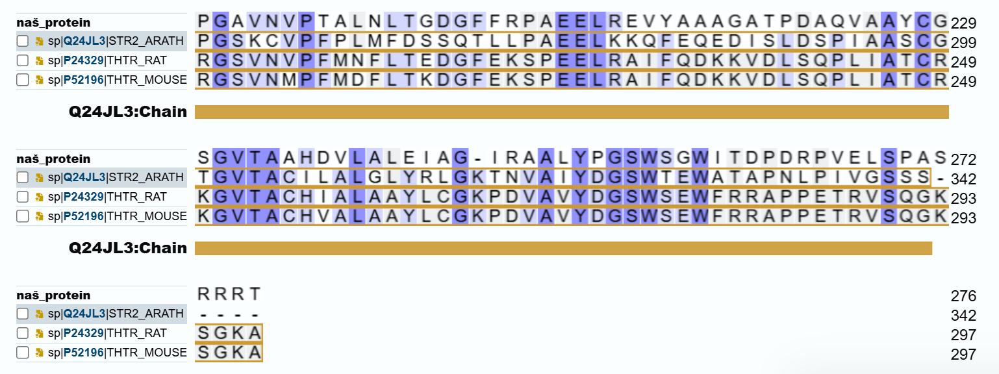

### Potencialna funkcijska povezanost z drugimi proteini, morebitne medproteinske interakcije

Medproteinske interakcije najbolj podobnega proteina z zapisom na UniProtu (Q9I452):

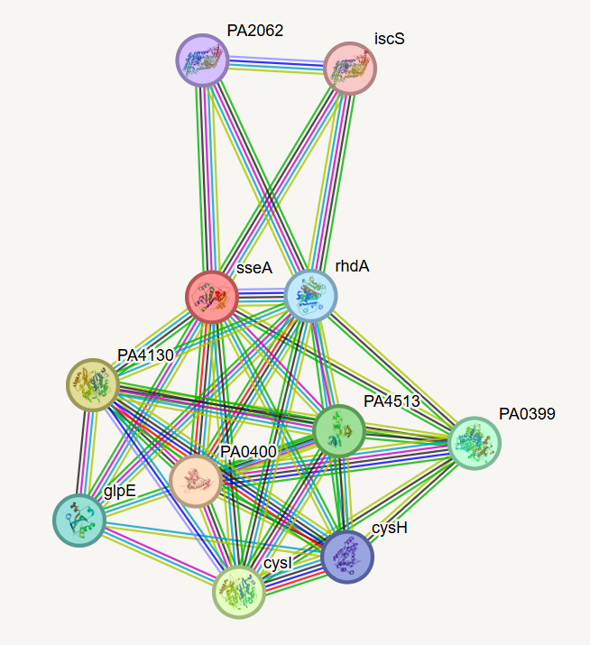

Te proteini večinoma sodelujejo v metabolizmu cisteina in pri detoksifikaciji cianida.

Medproteinske interakcije najbolj podobnega evkariontskega proteina z zapisom na UniProtu (P24329):

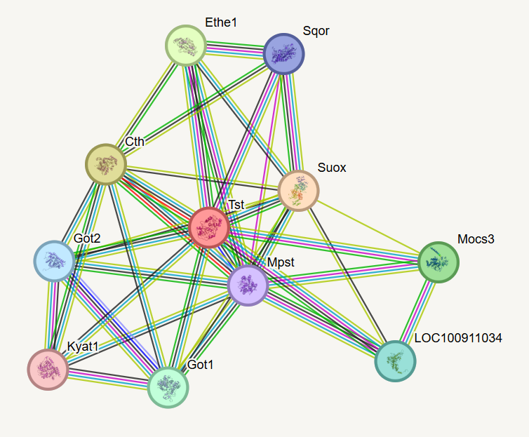

Tudi te proteini večinoma sodelujejo v metabolizmu cisteina in pri detoksifikaciji cianida.

### Struktura oz. model strukture (tudi superpozicija pro- in evkariontskih variant)
Napoved strukture našega proteina z AlphaFold3:

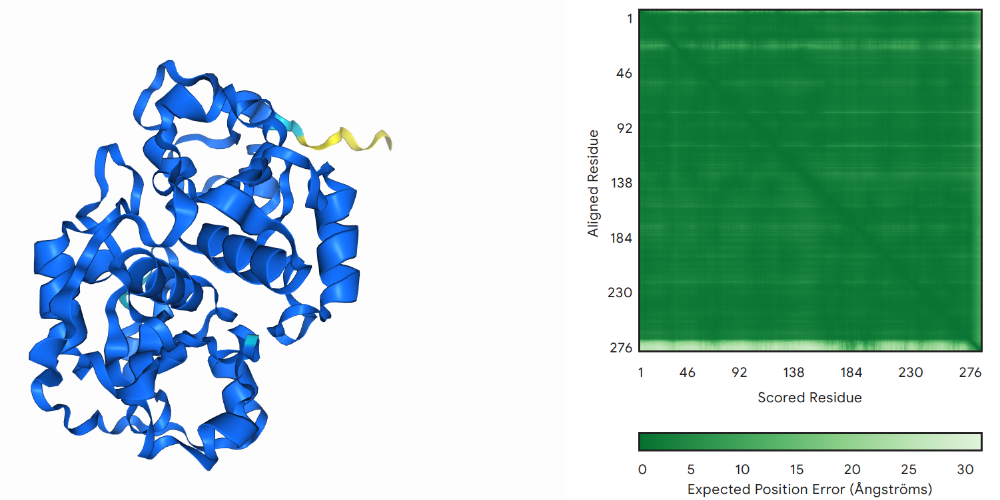

ipTM = 0.95

ipTM vrednost je zelo visoka, torej je napoved zanesljiva in kvalitetna. Manj sigurno napovedan je C-konec proteina, kar je v skladu s pričakovanji, saj so konci običajno bolj fleksibilni.

Superpozicija prokariontske variante (Q9I452) in evkariontske variante (P24329):

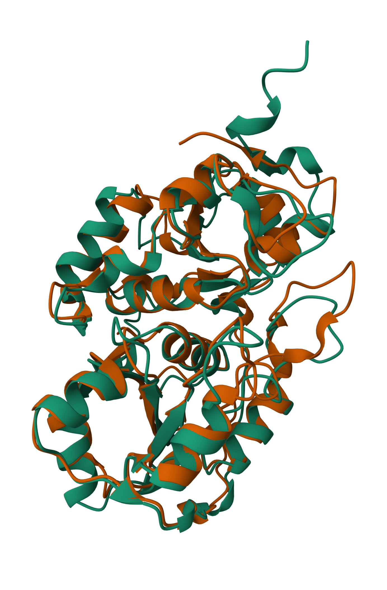

Čeprav si sami zaporedji med sabo nista tako zelo podobni, lahko iz superpozicije struktur vidimo, da sta strukturi zelo ohranjeni, predvsem elementi sekundarnih struktur (alfa vijačnice).