# S14

- **Avtor**: Teja Mohar
- **Datum izdelave**: 2024-05-22
- **Koda seminarja**: S14

---
## Vhodni podatek

Povezava do datoteke z vhodnim podatkom: [S14](naloge/s14-input.md)

---
## Rezultati analiz

### Ime in izvorni organizem proteina
Zaporedje celotnega plazmidnega konstrukta sem primerjala z zaporedjem plazmida in tako določila del zaporedja, ki predstavlja MCS regijo + vključek.
Ta del sem v EMBOSS Needle poravnala z MCS regijo plazmida. Tako sem dobila zaporedje, ki predstavlja le vključek.

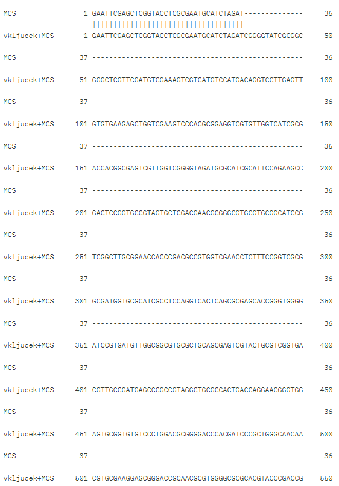 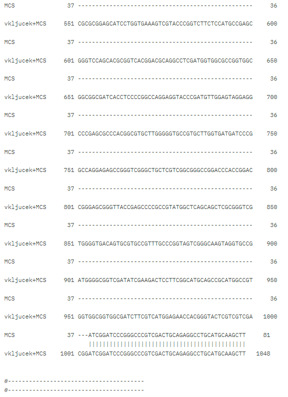

Zaporedje vključka sem vnesla v blastx in iskala po zbirki Metagenomic proteins in tako prišla do iskanega proteina. Ta je predstavljal prvi zadetek, ki je imel 100 % identičnost.

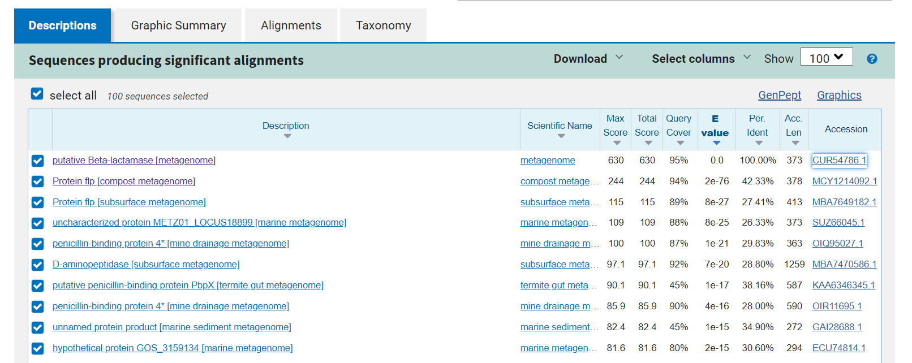

Protein se imenuje Beta laktamaza in izvira iz metagenoma. 

### Velikost proteina
Vsebuje 373 aminokislinskih ostankov, kar sem prebrala iz zapisa v GenBank. Če pa aminokislinsko zaporedje vstavimo v ProtParm pa izvemo, da je njegova molekulska masa 40025.44. 

### Funkcija proteina
Beta laktamaza posreduje odpornost na cefalotin, cefazolin, cefoksitin in večino penicilinov.

### Sorodni proteini (poravnava, filogenetsko drevo)
Aminokislinsko zaporedje mojega proteina sem vstavila v blastp in tako našla sorodne proteine ter jih poravnala v programu Clustal Omega in Cobalt ter izrisala filogenetsko drevo.

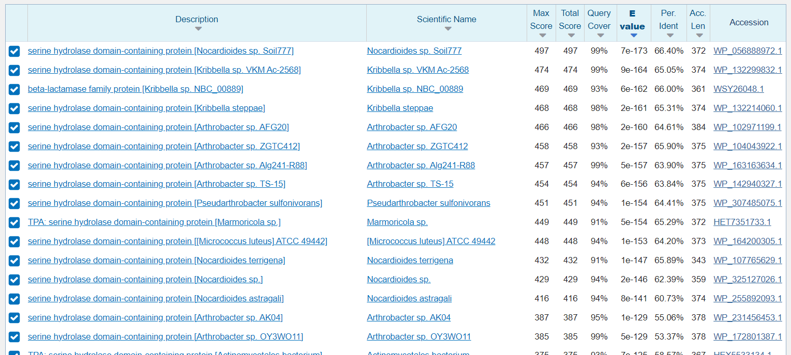 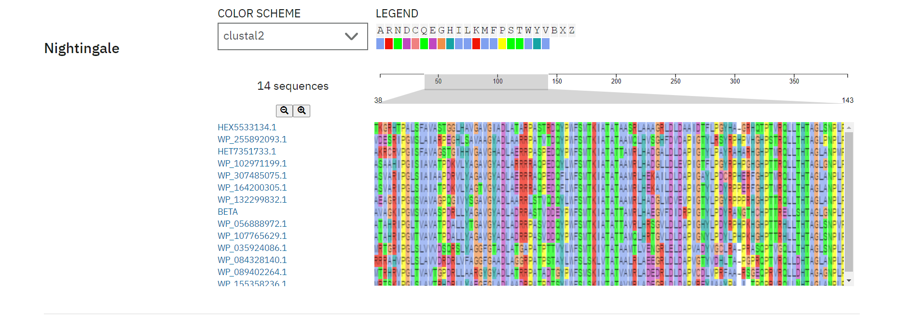 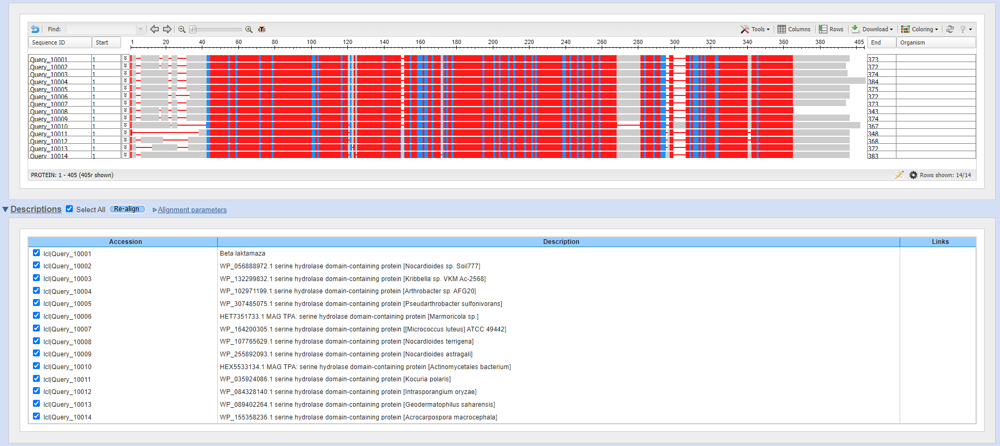 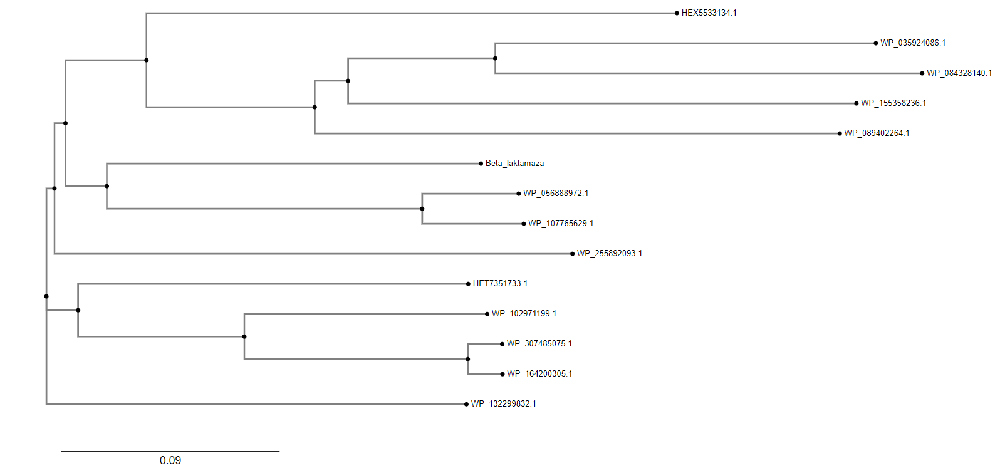

Na osnovi sorodnih proteinov bi lahko sklepali, da je protein (Beta laktamaz) iz bakterije, natančneje iz rodu _Actinomycetes_.

### Domenska zgradba
Iz sorodnih proteinov pa lahko sklepamo tudi, da vsebuje serin hidrolazno domeno. 

### Najbolj ohranjene regije
Do tega, katere regije so bolj ohranjene sem prišla tako, da sem poravnavo sorodnih proteinov, ki sem jo naredila v programu Cobalt vnesla v program WebLogo.

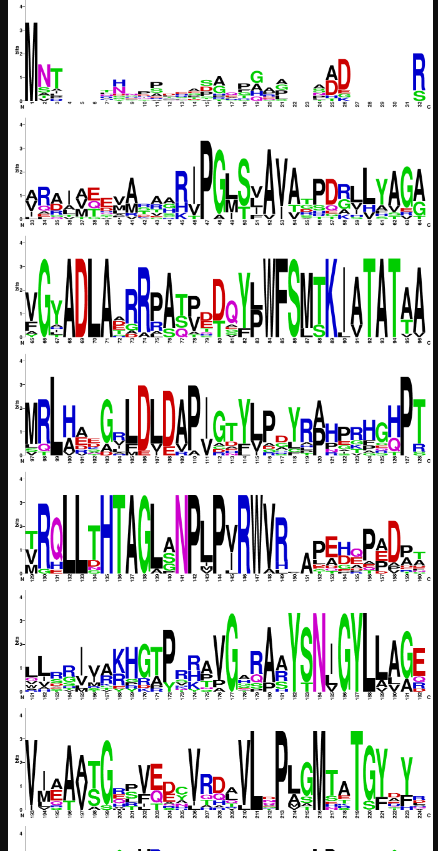

Kjer so enočrkovne oznake aminokislinskih ostankov večje, so ti bolj ohranjeni, kjer pa so manjše, pa so na tistih mestih aminokislinski ostanki manj ohranjeni.
Običajno bolj ohranjeni aminokislinski ostanki predstavljajo katalitično mesto.

### Podobni evkariontski proteini
Da sem našla podobne evkariontske proteine sem ponovno iskala s pblast-om a sem pod organizem izbrala _Eucaryotae_.
Dobila sem kar nekaj zadetkov. Večinoma so bili to hipotetični proteini, peptidaze iz gliv.

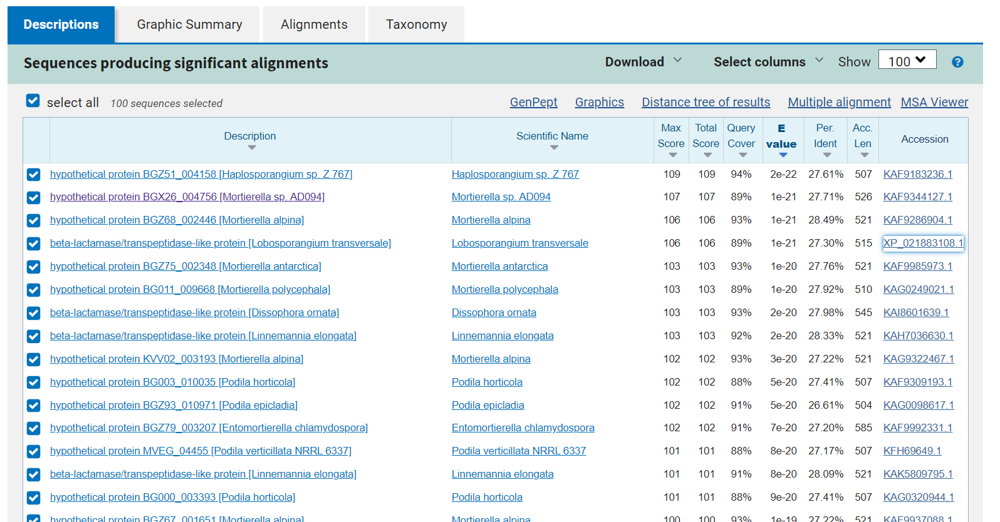

### Medproteinske interakcije
Do teh sem prišla tako, da sem aminokislinsko zaporedje mojega proteina vstavila v program String.

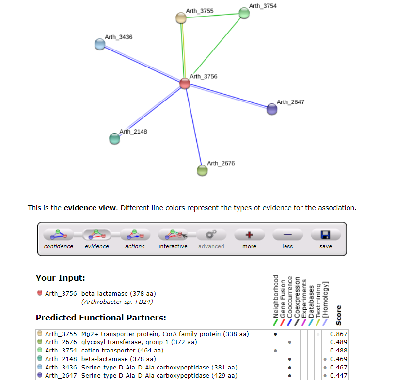

### Model strukture in superpozicija

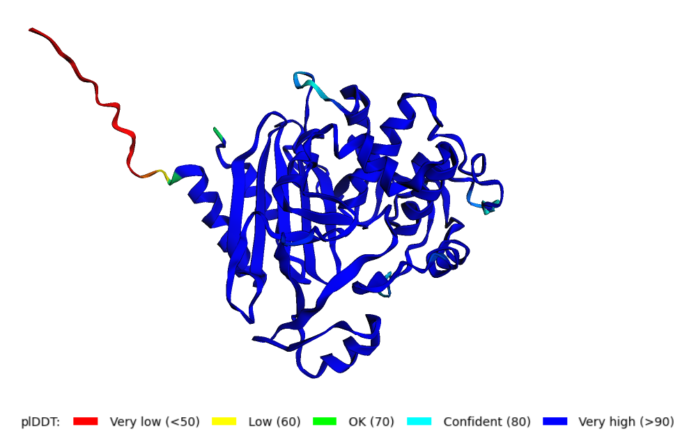

Model strukture sem dobila s pomočjo AlphaFold2. Kjer je struktura temno modre barve pomeni, da lahko z večjo gotovostjo trdimo, da je dejanska struktura taka, kot jo je izrisal AlphaFold2. Kjer pa je struktura oranžne barve pa pomeni, da je tisti del bolj fleksibilen - intrizično neurejena regija.
O zanesljivosti modela lahko razberemo iz grafa, ki nakazuje na to, da fleksibilen del strukture predstavljajo aminokislinski ostanki na N-koncu.

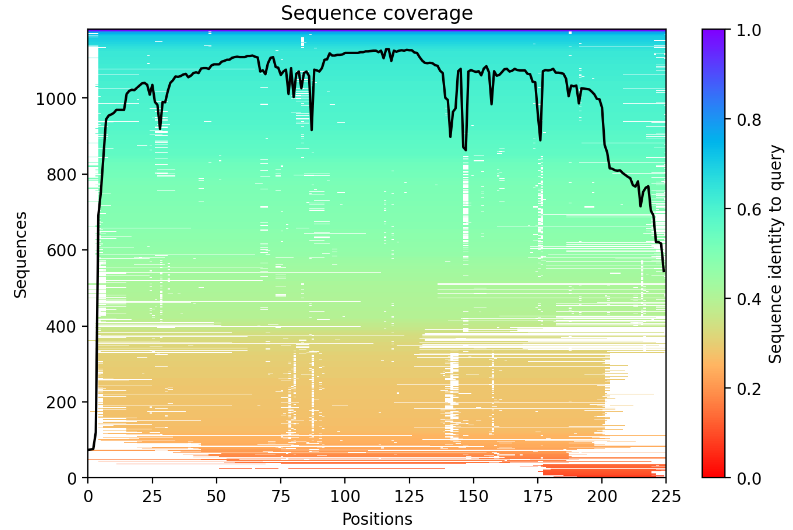

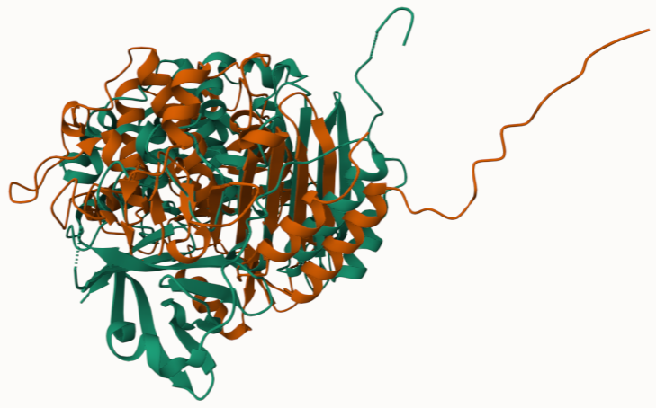

Superpozicijo strukture, ki sem jo dobila z AlphaFold2 (oranžne barve), sem naredila s strukturo, do katere sem prišla tako, da sem v pblast-u iskala po zbirki pdb (zelene barve). Kot zadetek sem dobila protein s PDB kodo 8FEK.
Pri superpoziciji je opaziti nekaj ujemanja. 