# S15

- **Avtor**: Igor Osterc
- **Datum izdelave**: 2024-05-10
- **Koda seminarja**: S15

---
## Vhodni podatek

Povezava do datoteke z vhodnim podatkom: [S15](naloge/s15-input.md)

---
## Rezultati analiz

### Iskanje proteina
Najprej sem iz danega zaporedja odstranil zapis za vektor in obdržal le zapis proteina na multiplem klonirnem mestu. Zaporedje proteina je: GAATTCGAGCTCGGTACCTCGCGAATGCATCTAGATGAATCGGCCCCTCTTCACCGGCACAACTGAATGGGACTTTCTCTTCCCAATCCCACTGAAGGGGATTCGAGCCGCGCGGGGGGCAGCTCGAATCCCCTTTCCCATGCCCGCAGCGCCACCCCTGTAGCCTCGGGCCGTGACTTCCCCTGCCCCATCCGTCGGCCCGACCGTCCGGCCGATCACCGAGGGCGAGCACCTCGACTTCATCCGCGGCCAGCGCTCGGCGAGCTTCCTGCAGACCCCCGCGTGGGGACAGGTCAAGGGCGAGTGGAAGCGCGAGTCGATCGGTTGGTGGGTCGGCGAGGAGCTGGTGGGGGTCGCGCTGGTGCTCTACCGCCAGCTGCCGCGCGTCAAGCGCTACCTCGCCTACCTCCCCGAGGGCCCGGTCATCGACTGGGACACCGACGACCTCGGCTCCTGGCTCAGCCCGCTCGTCGCGCACCTGCGCACCGCGGGCGCCTTCGGGGTCCGGATGGGCCCCCCGGTGATCACCGCCCGCTGGTCGGCGAGCCAGGTCAAGGAGGGCATCGCCAGCAGTGAGGTACGCCGACTGGCCGATCTGCCCCCGACCGAGCGCAGCCAGGCGGGGGCGATCGTCGTCTCGCAGCTCAACGAGCTCGGCTGGCGCCTCCAGGCGACTGAGGGTGGCTTCGCCGCCGGCCAGCCGCAGTACAACTTCCAGATCCCTCTGGCGGGCAAGTCCGAGGACGACGTCCTCAAGGGCATGAACCAGCTGTGGCGCCGCAACATCAAGAAGGCCGCCAAGGAGGGGGTGGTGGTCTCGCACGGCACGCGTGAGGACCTGAAGCTGTTCCACGACCTCTACGTCCACACGGCCGAGCGCGACCACTTCACGCCGCGGCCGCTGGCCTACTTCCAGACCATGTTCACGGCGCTGGAGGCCGAGGAGCCCGATCGGATCCGGCTCTACCTCGCCCGGCACGAGGACGACCTGGTGGCCGCCACCATCGCGATCCGGGTGGGTGCCCACGCGTGGTACTCCTACGGCGCCTCCTCGACCGAGAAGCGCGAGGTCCGAGGCTCCAACGCCGTCCAGTGGGCGATGATCCGCGACGCGCTCGCGGCGGGCGCCGAGGTCTACGACCTGCGCGGGATCACCGACACCCTGGACGCCGAGGACAGCCACGTATCGGATCCCGGGCCCGTCGACTGCAGAGGCCTGCATGCAAGCTT 

To zaporedje sem dal v blastx in iskal v metagenomski bazi. Rezultati iskanja so prikazani na sliki: 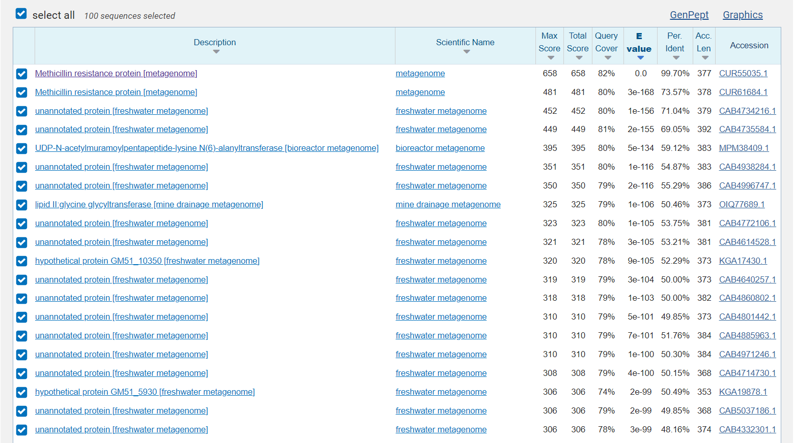
Nato sem v blastp iskal podobne proteine zaporedju od metagenoma Methicillin resistant protein, katerega zaporedje sem dobil pri prejšnjem iskanju. Novi zadetki so bili: 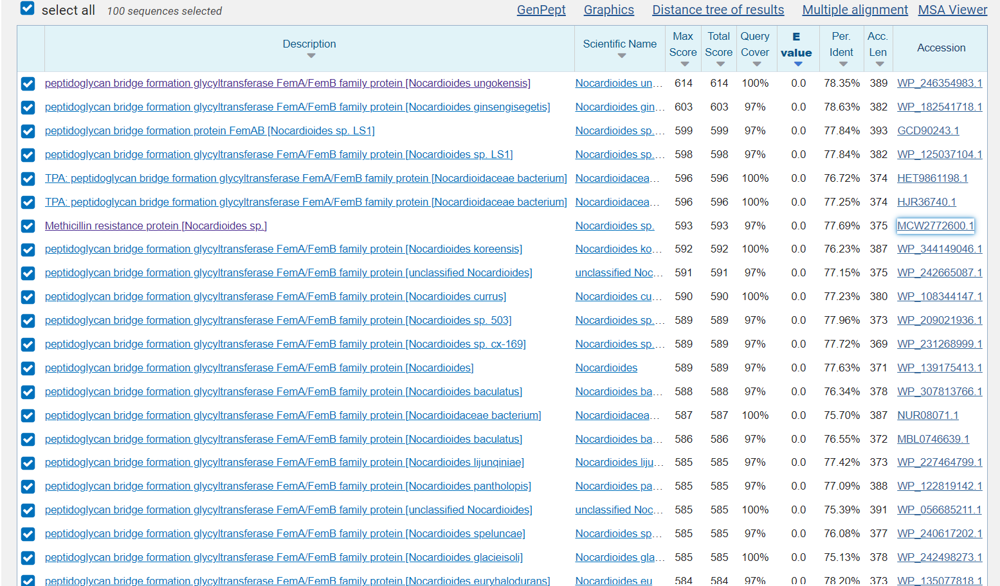
###Ime in izvorni organizem proteina
Iz zadetkov lahko vidimo, da je iskani protein Peptidoglycan bridge formation glycyltransferase FemA/FemB family protein iz družine bakterij Nocardioides. Vsi ti proteini različnih vrst bakterij iz te družine so bili slabo anotirani v UniProt, zato sem za lastnosti proteina iskal podobne proteine pri drugih bakterijah. Našel sem proteine iz družine FemA in FemB, ki so bili bolje anotirani. Tukaj je primer aminoaciltransferaze FemA proteina iz Staphylococcus aureus: 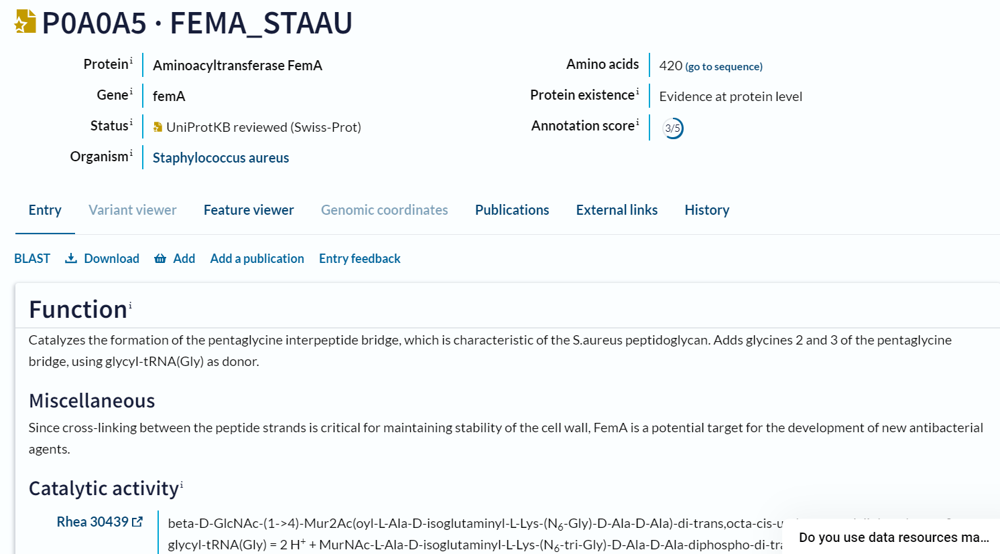.
###Lokalizacija 
Protein se nahaja v citoplazmi. To sklepam na podlagi podobnosti s proteinoma aminoaciltransferaza FemA in FemB iz Staphylococcus aureus.
###Velikost
Naš protein peptidoglycan bridge formation glycyltransferase FemA/FemB family protein iz Nocardioides ungokensis je dolg 389 aminokislinskih ostankov in ima molekulsko maso 43518,07 Da; izračunano s pomočjo ProtParam: 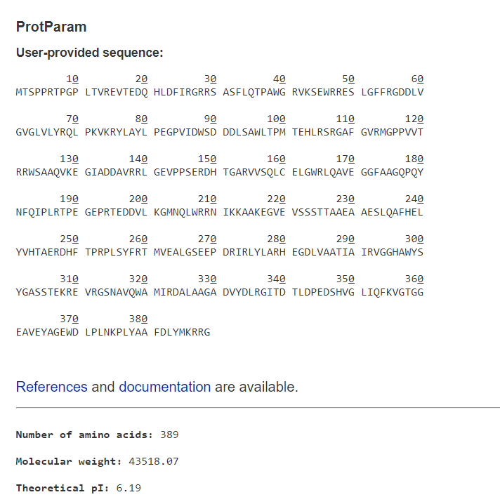.
###Domenska zgradba
Protein je sestavljen iz ene domene in sicer FEMABX domene, kar je prikazano v InterPro: .
###Posttranslacijske modifikacije
Protein nima posttranslacijskih modifikacij, kar sklepam iz podobnosti s proteinoma aminoaciltransferaza FemA in FemB iz Staphylococcus aureus: 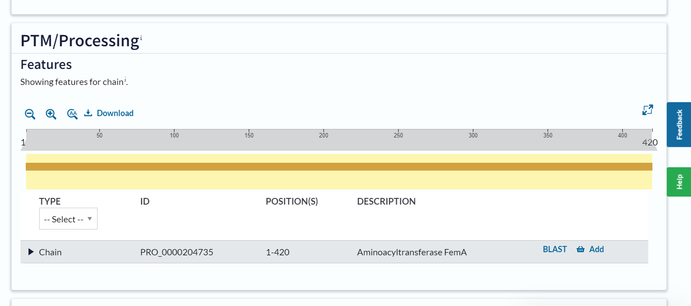.
###Funkcija
Protein sodeluje pri sintezi peptidoglikana za bakterijsko celično steno. Katalizira namreč dodajanje glicina peptidoglikanskim prekurzorjem (substrat) in tako ustvarja interpeptidne mostičke, ki dodatno ojačajo poptidoglikanski sloj. Zaradi interpeptidnih mostičkov (petglicinski mostički, ki prečno povežejo peptidne dele peptidoglikana) je celična stena bolj robustna in bakterijam omogoča odpornost na nekatere antibiotike, npr. na Methicillin.
###Sorodni proteini in filogenetsko drevo
V filogenetsko drevo sem vključil 25 proteinov in sicer peptidoglycan bridge formation glycyltransferase FemA/FemB family proteine iz različnih bakterij in aminoaciltransferazi FemA in FemB iz različnih sevov Staphylococcus aureus: 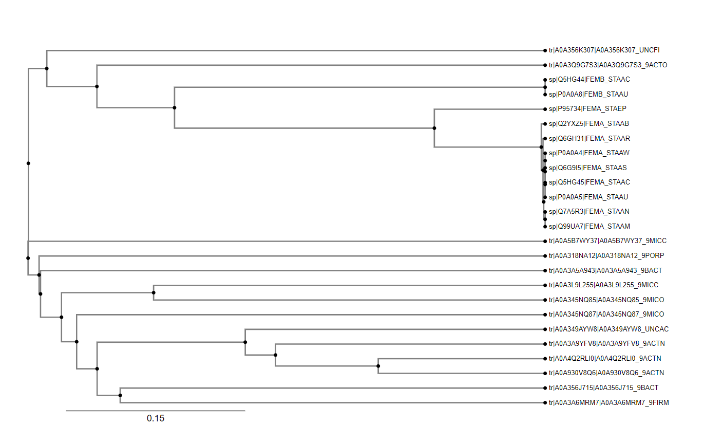. Med sabo so si bolj sorodna FemA in FemB iz različnih sevov Staphylococcus aureus kot pa z peptidoglycan bridge formation glycyltransferase FemA/FemB family proteini. Vidimo, da sta proteina, ki sta še najbolj sorodna aminoacil FemA in FemB, peptidoglycan bridge formation glycyltransferase FemA/FemB family protein iz Flaviflexus ciconiae in iz Bacillota bacterium (Firmicutes bacterium).
###Ohranjenost regij
Podatke poravnave 25 proteinov iz prejšnje analize sem dal v WebLogo, da sem dobil prikaz ohranjenih in neohranjenih regij: 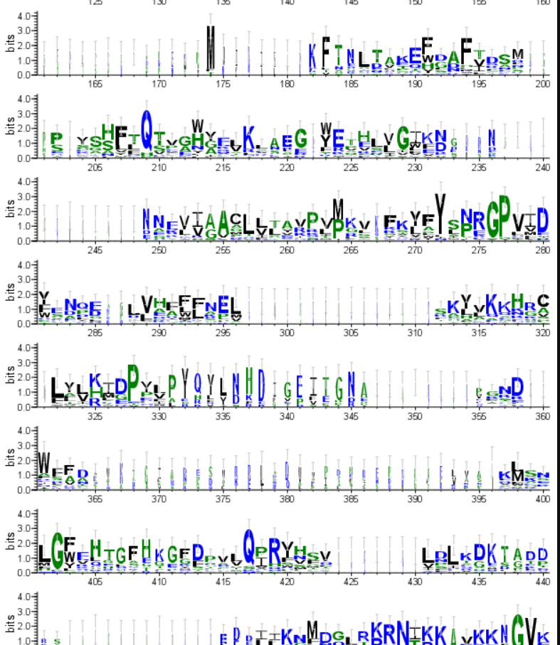 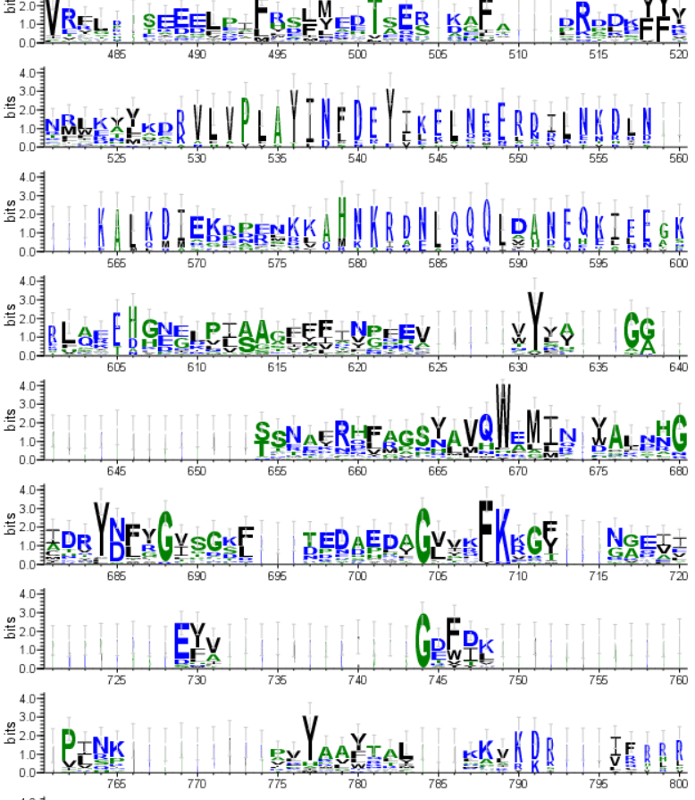. Zaradi podobne funkcije proteinov je tudi veliko regij ohranjenih. Najbolj izstopajo ohranjene glicinske regije.
###Podobni evkariontski proteini
Za iskanje podobnih evkariontskih proteinov sem uporabil FASTA zaporedje peptidoglycan bridge formation glycyltransferase FemA/FemB family proteina iz Nocardioides ungokensis in v blastp izbral, da išče podobne proteine v evkariontih. Dobil sem le en zadetek 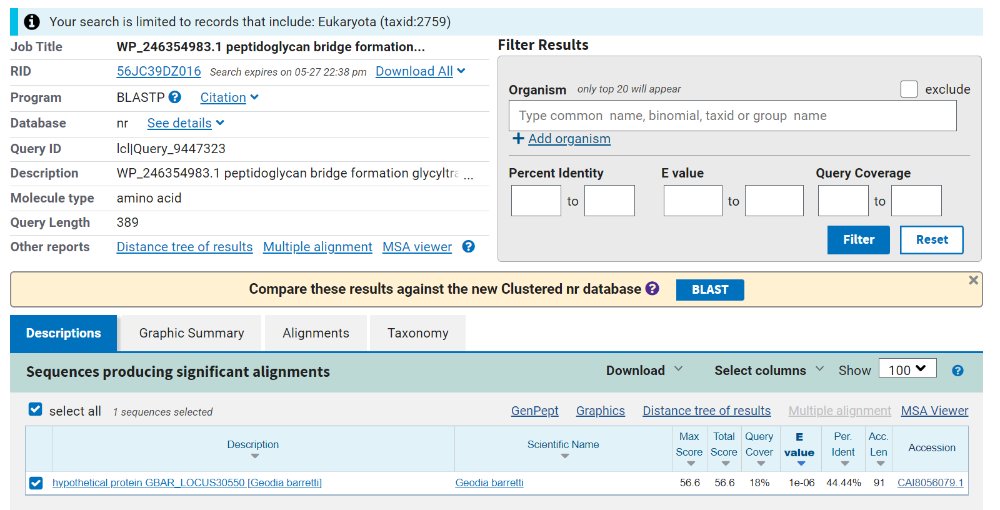 iz globokomorske spužve. Zaradi dokaj viskoke E vrednosti (1E-06) je velika verjetnost, da je zadetek naključen. K temu pripomore tudi dejstvo, da evkarionti nimajo peptidoglikana v celični steni, zato podobnih proteinov našemu ne potrebujejo. Iz tega lahko zaključim, da ni podobnih evkariontskih proteinov.
###Interakcije z drugimi proteini
S pomočjo programa String sem poiskal interakcije proteina z ostalimi proteini. Kot je razvidno iz 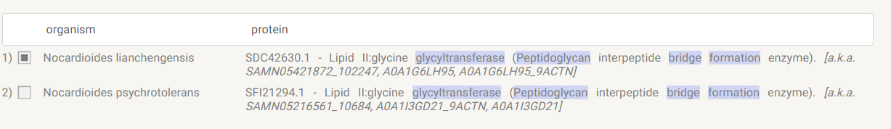 naš protein interagira s proteinom Lipid II:glycine glycyltransferase, ki je prav tako vključen pri gradnji petglicinskega mostička in sicer katalizira prenos glicina iz tRNA na lipid II.
###Model strukture
S pomočjo AlphaFold2 sem narisal tudi model strukture peptidoglycan bridge formation glycyltransferase FemA/FemB family proteina iz Nocardiodes islandensis, ki je prikazan 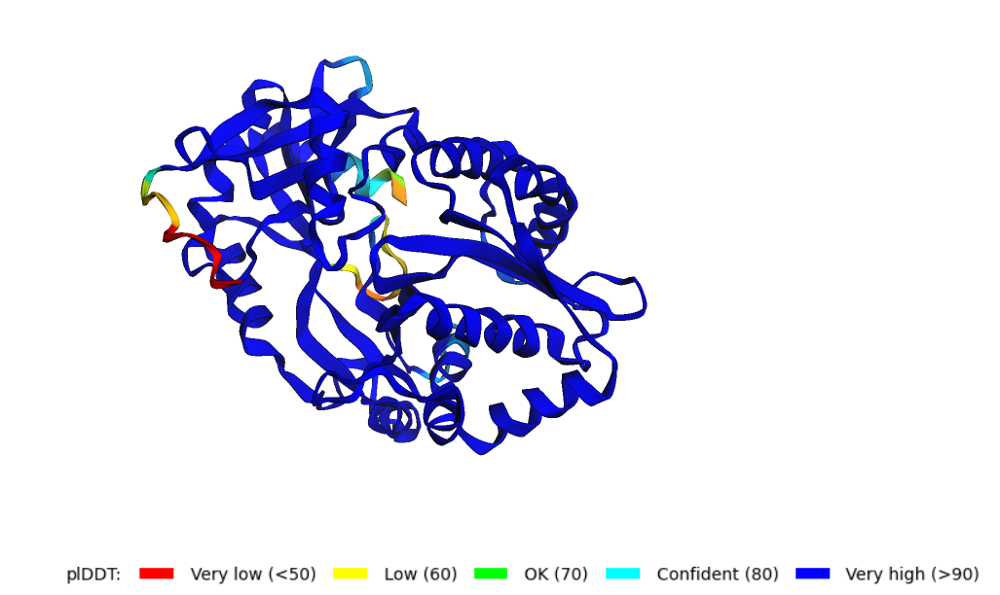. Velika večina modela ima zelo visoko zanesljivost zgradbe, nižja zanesljivost je le na robovih zaporedja, kar je verjetno zaradi dinamike tega predela. 

V ChimeraX sem naredil tudi superpozicijo proteinov FemA in FemX iz Staphylococcus aureus: 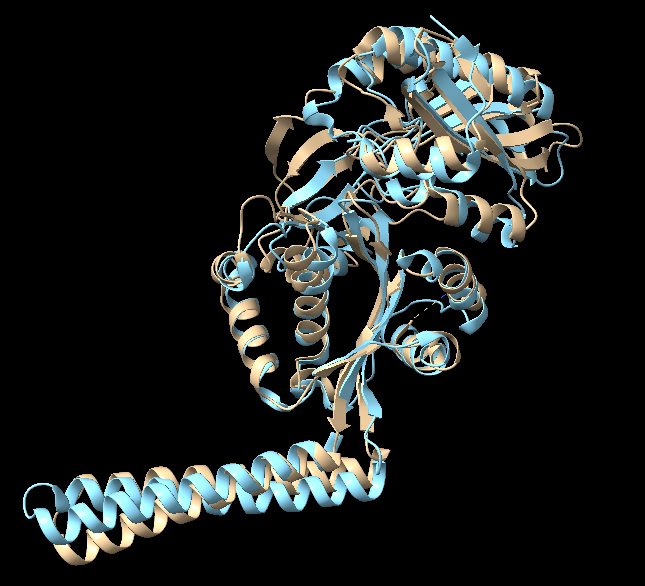. Vidimo, da imata podobno strukturo, največja razlika je pri repu, ki je pri FemX dvignjen malo bolj gor. Proteina imata tudi podobno vlogo, FemX katalizira dodajanje prvega glicina na peptidoglikanski prekurzor, FemA pa dodajanje drugega in tretjega glicina. Superpozicije prokariontskih in podobnih evkariontskih proteinov nisem mogel narediti, saj sem pri prejšnji analizi ugotovil, da podobnih evkariontskih proteinov ni.

