# S16

- **Avtor**: Anže Perc
- **Datum izdelave**: 2024-05-24
- **Koda seminarja**: S16

---
## Vhodni podatek

Nukleotidno zaporedje: 
```
GGTGATGACGGTGAAAACCTCTGACACATGCAGCTCCCGGAGACGGTCACAGCTTGTCTG TAAGCGGATGCCGGGAGCAGACAAGCCCGTCAGGGCGCGTCAGCGGGTGTTGGCGGGTGT CGGGGCTGGCTTAACTATGCGGCATCAGAGCAGATTGTACTGAGAGTGCACCATATGCGG TGTGAAATACCGCACAGATGCGTAAGGAGAAAATACCGCATCAGGCGCCATTCGCCATTC AGGCTGCGCAACTGTTGGGAAGGGCGATCGGTGCGGGCCTCTTCGCTATTACGCCAGCTG GCGAAAGGGGGATGTGCTGCAAGGCGATTAAGTTGGGTAACGCCAGGGTTTTCCCAGTCA CGACGTTGTAAAACGACGGCCAGTGAATTCGAGCTCGGTACCTCGCGAATGCATCTAGAT CCGGACTCACTCCCCGCAGCGGCTACGACGGACCCAGTACGGACATGACCTGATGGCACC CCCGGAGGTAGTGATGGGCACGACCGACAATCGCGCTCCCGGCCGGGTGGTCGTGCTGGC CGGCGGACTCTCCCACGAACGCGATGTGTCGCTGCGGTCAGGCCGACGGGTGGCCGAGGC GCTGCGCAACGACGGCATCGAGGTGGAGGAGCGCGACGTCGACGCCGGCCTGTTGCCCTC GCTGTCCGCCGAGCGGCCCGCCTGCGTGGTCCCGATGCTGCACGGAGAGGCCGGCGAGGA CGGAGCCGTCCGCGAGGTCCTCGAGCTGCTCGACCTGCCGTACGTCGGCTCGCGCCCCGC CGTGTGCCGTACGGCGTTCGACAAGCCCGTGGCGAAGACCATCGTGCGGGCGACGGGCAT CAGCACGCCGGAGTGGTACTGCCTGCCCCACGAGACGTTCCGCGAGCTGGGTGCGGTGGC GGTGATGGACGCCCTGGTCGCCAAGCTCGGCCTGCCCCTGATGGTCAAGCCGGCCCGGAG CGGGTCGGCGCTCGGCTGCACCGTCGTCCGTGAGGCCTCCGAGCTGCCTACCGCGATGAT CAACGCGTTCGCCTACGGTGACGTCGCGCTGCTGGAGCAGTTCGTCGCCGGCACGGAGGT CGCCGTGCCCGTGCTGGACGACGGCTCCGGTCCCCAGGCCCTCCCGGCGGTCGGCATCCG CCCGGACGGCGGGGTCTACGACTACACCGCCCGCTACACCGCGGGGTCCACCGAGTTCGT CGTGCCGGCCCGACTGTCCCCGGAGCTCACCCGTCGGTGTGCCGAGGTGGCCGTCGGTGC CCACGAGGCGCTCGGCCTGCGTGACCTGTCGCGCTCCGACCTCATCATCGACGACGCCGG CGAGATCTGGTTCCTCGAGGTGAACGTCGCGCCGGGCTTCACCGAGACCTCCACGGTCCC GCTGGCGATCATCGGATCCCGGGCCCGTCGACTGCAGAGGCCTGCATGCAAGCTTGGCGT AATCATGGTCATAGCTGTTTCCTGTGTGAAATTGTTATCCGCTCACAATTCCACACAACA TACGAGCCGGAAGCATAAAGTGTAAAGCCTGGGGTGCCTAATGAGTGAGCTAACTCACAT TAATTGCGTTGCGCTCACTGCCCGCTTTCCAGTCGGGAAACCTGTCGTGCCAGCTGCATT AATGAATCGGCCAACGCGCGGGGAGAGGCGGTTTGCGTATTGGGCGCTCTTCCGCTTCCT CGCTCACTGACTCGCTGCGCTCGGTCGTTCGGCTGCGGCGAGCGGTATCAGCTCACTCAA AGGCGGTAATACGGTTATCCACAGAATCAGGGGATAACGCAGGAAAGAACATGTGAGCAA AAGGCCAGCAAAAGGCCAGGAACCGTAAAAAGGCCGCGTTGCTGGCGTTTTTCCATAGGC TCCGCCCCCCTGACGAGCATCACAAAAATCGACGCTCAAGTCAGAGGTGGCGAAACCCGA CAGGACTATAAAGATACCAGGCGTTTCCCCCTGGAAGCTCCCTCGTGCGCTCTCCTGTTC CGACCCTGCCGCTTACCGGATACCTGTCCGCCTTTCTCCCTTCGGGAAGCGTGGCGCTTT CTCATAGCTCACGCTGTAGGTATCTCAGTTCGGTGTAGGTCGTTCGCTCCAAGCTGGGCT GTGTGCACGAACCCCCCGTTCAGCCCGACCGCTGCGCCTTATCCGGTAACTATCGTCTTG AGTCCAACCCGGTAAGACACGACTTATCGCCACTGGCAGCAGCCACTGGTAACAGGATTA GCAGAGCGAGGTATGTAGGCGGTGCTACAGAGTTCTTGAAGTGGTGGCCTAACTACGGCT ACACTAGAAGAACAGTATTTGGTATCTGCGCTCTGCTGAAGCCAGTTACCTTCGGAAAAA GAGTTGGTAGCTCTTGATCCGGCAAACAAACCACCGCTGGTAGCGGTGGTTTTTTTGTTT GCAAGCAGCAGATTACGCGCAGAAAAAAAGGATCTCAAGAAGATCCTTTGATCTTTTCTA CGGGGTCTGACGCTCAGTGGAACGAAAACTCACGTTAAGGGATTTTGGTCATGAGATTAT CAAAAAGGATCTTCACCTAGATCCTTTTAAATTAAAAATGAAGTTTTAAATCAATCTAAA GTATATATGAGTAAACTTGGTCTGACAGTTACCAATGCTTAATCAGTGAGGCACCTATCT CAGCGATCTGTCTATTTCGTTCATCCATAGTTGCCTGACTCCCCGTCGTGTAGATAACTA CGATACGGGAGGGCTTACCATCTGGCCCCAGTGCTGCAATGATACCGCGAGACCCACGCT CACCGGCTCCAGATTTATCAGCAATAAACCAGCCAGCCGGAAGGGCCGAGCGCAGAAGTG GTCCTGCAACTTTATCCGCCTCCATCCAGTCTATTAATTGTTGCCGGGAAGCTAGAGTAA GTAGTTCGCCAGTTAATAGTTTGCGCAACGTTGTTGCCATTGCTACAGGCATCGTGGTGT CACGCTCGTCGTTTGGTATGGCTTCATTCAGCTCCGGTTCCCAACGATCAAGGCGAGTTA CATGATCCCCCATGTTGTGCAAAAAAGCGGTTAGCTCCTTCGGTCCTCCGATCGTTGTCA GAAGTAAGTTGGCCGCAGTGTTATCACTCATGGTTATGGCAGCACTGCATAATTCTCTTA CTGTCATGCCATCCGTAAGATGCTTTTCTGTGACTGGTGAGTACTCAACCAAGTCATTCT GAGAATAGTGTATGCGGCGACCGAGTTGCTCTTGCCCGGCGTCAATACGGGATAATACCG CGCCACATAGCAGAACTTTAAAAGTGCTCATCATTGGAAAACGTTCTTCGGGGCGAAAAC TCTCAAGGATCTTACCGCTGTTGAGATCCAGTTCGATGTAACCCACTCGTGCACCCAACT GATCTTCAGCATCTTTTACTTTCACCAGCGTTTCTGGGTGAGCAAAAACAGGAAGGCAAA ATGCCGCAAAAAAGGGAATAAGGGCGACACGGAAATGTTGAATACTCATACTCTTCCTTT TTCAATATTATTGAAGCATTTATCAGGGTTATTGTCTCATGAGCGGATACATATTTGAAT GTATTTAGAAAAATAAACAAATAGGGGTTCCGCGCACATTTCCCCGAAAAGTGCCACCTG ACGTCTAAGAAACCATTATTATCATGACATTAACCTATAAAAATAGGCGTATCACGAGGC CCTTTCGTCTCGCGCGTTTC
```

## Rezultati analiz


**Protein**: Protein je D-alanine--D-alanine ligaza, ki je dolg 320 aminokislinskih ostankov

**Organizem**: gre za Nocardioides sp. (zemeljski metagenome), ki je bil vzorčen na agrikulturni površini .Protein je bil indentificiran s pomočjo NCBI BLAST, varianta blastx znotraj zbirke non-redundant protein sequences (nr), pri čemer je bila E vrednost enaka 3e-171 identičnost pa 82,13%, tako da sem iz danega nukleotidnega zaporedja s pomočjo karte plazmida pUC57 (https://www.snapgene.com/plasmids/basic_cloning_vectors/pUC57) določili multiklonirno mesto  (MCS), zaporedje znotraj MCS sem vstavil v blastx.

Prikaz najdenih podobnih zaporedij z največjo podobnostjo:

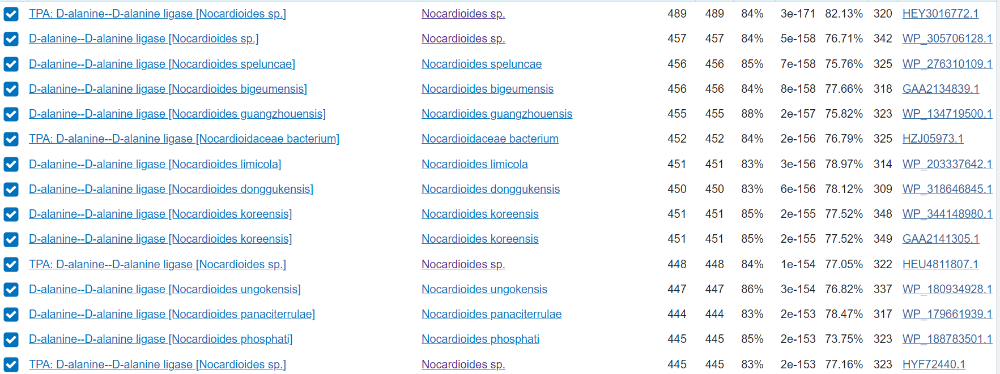

**Funkcija proteina**: D-alanin--D-alanin ligaza je pomemben encim v biosintezi peptidoglikana, ki je ključna komponenta celične stene bakterij, reakcija: ATP + 2 D-alanine = ADP + D-alanil-D-alanine + H+ + fosfat, kofaktorji Mg2+ oz. Mn2+ veže dva iona na podenoto..


Koda zapisa BLAST identificiranega proteina: GenBank [HEY3016772.1](https://www.ncbi.nlm.nih.gov/protein/HEY3016772.1?report=genbank&log$=prottop&blast_rank=1&RID=4XW0X8KG016)

Aminokislinsko zaporedje:
```
>ORIGIN [HEY3016772.1]      
        1 mpdaipgriv vlagglsher dvslrsgrrv aeamrtsglq veerdvdasl lpafvadppa
       61 cvvpmlhget gedgairevl elldlpyvgs rpavcrtafd kpvaktivrr igidtpdwfc
      121 lphqtfrelg avavmdalva rlglplmvkp arsgsalgct vvhdsadlps amvnafaygd
      181 valleqfveg devavcvidd gsgphalpiv sikpdggvyd ytarytagst qfevparlep
      241 evleacarva itahealglr dlsrsdlivd pdgrvwflev nvapgftets tvplsiqaag
      301 ldlgkvmtsl vtaavgrtas
```

### Splošna karakterizacija:
Za zapis GenBank [HEY3016772.1](https://www.ncbi.nlm.nih.gov/protein/HEY3016772.1?report=genbank&log$=prottop&blast_rank=1&RID=4XW0X8KG016) ni na voljo pripisov glede značilnosti proteinskega produkta, zato so za karakterizacijo proteina bila v pomoč anotirana aminokislinska zaporedja, ki so podomna zaporedju identificiranega proteina. Nadaljne analize sem opravil z proteinom, ki ima v uniprot ID: [O66806] organizma aquifex aeolicus sev VF5, ki sem ga določil z uporabo  NCBI BLAST, varianta blastp znotraj zbirke UniProtKB/Swiss-Prot(swissprot) identičnost je bila 35.83%, E vrednosti pa 6e-61. 

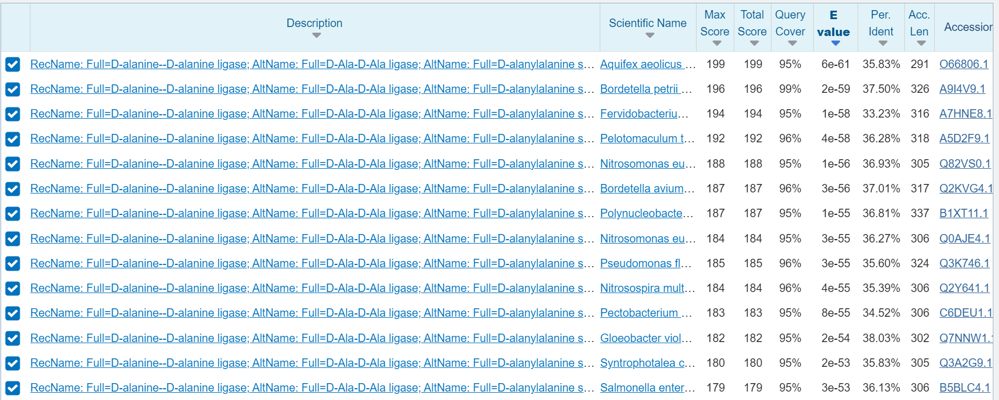

### Lokacija in post-translacijske modifikacije
Sam protein je citoplazemski glavna post-translacijska modifikacija pa je obseg aktivnega peptida v zrelem proteinu.

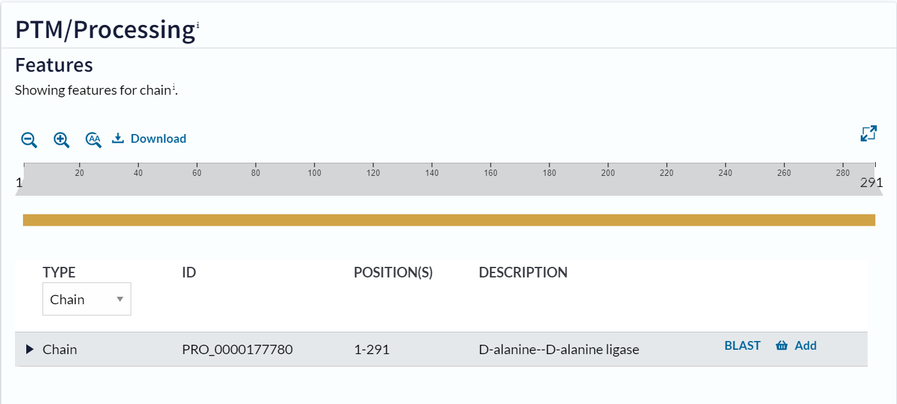
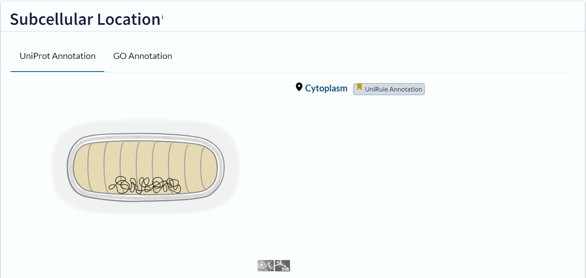

Najbolj podobno zaporedje je zaporedje vnešeno v Uniprot kot [O66806](https://www.uniprot.org/uniprotkb/O66806/entry#function). Gre za protein D-alanine--D-alanine ligaza, ki pripada organizmu aquifex aeolicus sev VF5. Ta protein se nahaja v citosolu. Zaporedje je dolgo 291 amoinokislinskih ostankov.

Na podlagi relativno visoke podobnosti z iskalnim zaporedjem lahko sklepamo, da je protein z zaporedjem HEY3016772.1 D-alanine--D-alanine ligaza , ki se nahaja v celičnem citosolu. Ta zaključek podpirajo tudi prostala zaporedja z visoko podobnostjo, ki so bila najdena v zbirki swissprot.

Poravnava HEY3016772.1 z [O66806](https://www.uniprot.org/uniprotkb/O66806/entry#function):

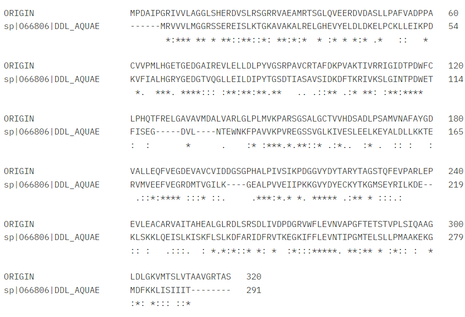

Iz poravnave je razvidno, da 6 AK ostankov na začrtku iskalnega zaporedja ne predstavlja D-alanine--D-alanine ligaze.


### Sorodni proteini in ohranjenost regij:
Izhodščni protein sem primerjal z drugimi sorodnimi proteini D-alanine--D-alanine ligaz, ki sem jih dobil  z uporabo izhodiščnega zaporedja v NCBI BLAST, varianta blastp znotraj zbirke UniProtKB/Swiss-Prot(swissprot), nato pa jih poravnal z uporabo programa Clustal Omega (https://www.ebi.ac.uk/jdispatcher/msa/clustalo).:
CLUSTAL O(1.2.4) multiple sequence alignment. Iz poravnave je razvidno da je pomembna regija od cca. 50 AK ostanka do 100 AK ostanka, saj se ta regija pri vseh organizmih najbolj ujema, lahko sklepamo, da je pomembna za samo funkcijo proteina.


ORIGIN                ---------------------MPDAIPGRIVVLAGGLSHERDVSLRSGRRVAEAMRTSGL	39
Fervidobacterium      ---------------------------MYLGVLLGGISREREISIRSGKRIAQALRNMGH	33
Gloeobacter           ---------------------------MRITVLSGSDSPEREVSLVSGRAVQAALETLGH	33
Pseudomonas           ----------MTAAYANLFSTIAPKDFGRVAVLFGGLSAEREVSLKSGNAVLTALQSAGV	50
Pectobacterium        -------------------------MTEKVAVLLGGTSAEREVSLLSGQAVLAGLKEAGI	35
Salmonella            -------------------------MADKIAVLLGGTSAERDVSLNSGAAVLAGLREGGI	35
Nitrosomonas          ---------------------MNIRDLGKVAVLLGGRSAEREISLKSGHAVLAALQRSQV	39
Bordetella            ------------MNQSVTRPRPDAKALGKVGVLYGGRSAERDVSLMSGKGVHQALLSAGV	48
Polynucleobacter      MFNVGANLSSWGDRVKSSLAGMDLKSLGRVGVLLGGKSGEREISLMSGNGVLEALRSKGV	60
Aquifex               ---------------------------MRVVVLMGGRSSEREISLKTGKAVAKALRELGH	33
Pelotomaculum         -------------------------MTLKVGVLMGGRSSEREVSLKTGEAVYNALKVKNY	35
Syntrophotalea        -------------------MQRQELQQKKIAVLMGGLSAEREVSLRTGKAISQALTRCGY	41
                                                   : ** *. * **::*: :*  :  .:     

ORIGIN                QVEERDVDASLLPAFVA-DPPACVVPMLHGETGEDGAIREVLELLDLPYVGSRPAVCRTA	98
Fervidobacterium      VVDEIDVDDNFIYKLSELKKYDALFNILHGTFGEDGKMQAILDSIGIPYTGSGVETSVIA	93
Gloeobacter           EVTMVDPGPDLPVRLLE-NPPDFVWIALHGDKGENGKLQGLLDWLGLPYNGSGVTASAIA	92
Pseudomonas           DAFGIDVGADILQRLLS-EKIDRAFIILHGRGGEDGSMQGLLEVAGIPYTGSGILASALA	109
Pectobacterium        NAHAVDTRDVSVTTLKE-EGFTKIFIALHGRGGEDGTLQGVLEFLGLPYTGSGVMASALT	94
Salmonella            DAHPVDPQEVDVAQLKA-MGFQKVFIALHGRGGEDGTLQGMLELLGLPYTGSGVMASALS	94
Nitrosomonas          DAHAFDPVGQPLEDLLK-QGFDRAFIALHGRYGEDGSVQGALELMDLPYTGSGILASALA	98
Bordetella            DAHLFDTGERTLAELAA-AGFDRVFIALHGRYGEDGTLQGALELLGLPYTGSGPMASSLS	107
Polynucleobacter      DAHAFDAGLRCPTELVK-EKFDRIFISLHGRFGEDGTIQGLLELLGLPYTGSAVLASALA	119
Aquifex               EVYELDLDKELPCKLLE-IKPDKVFIALHGRYGEDGTVQGLLEILDIPYTGSDTIASAVS	92
Pelotomaculum         LAVKIDVGLDVVERIKE-ERIDLAFIALHGRYGEDGTIQGLLEMLDIPYTGSGVLASALA	94
Syntrophotalea        EVTDIDAGRDLAQQLEK-TGVEVAFIALHGRFGEDGTVQGLLELADIPYTGSGVLASSLA	100
                       .   *        :            ***  **:* ::  *:  .:** **   ..  :

ORIGIN                FDKPVAKTIVRR--------IGIDTPDWFCLPHQTFRELGAVAVMDA-LVARLGLPLMVK	149
Fervidobacterium      FDKYLCNLFVENTIERYEELSVVKIPNFLLISSEEF-----EESKIYMIEEKIGLPCVVK	148
Gloeobacter           MDKVVSKRLFVA--------EGIPTPAYRVAEAV----PQVSECQAWL--AALGSPVVVK	138
Pseudomonas           MDKLRTKQVWHT--------LGIPTPRHAVLRSE-------ADCISAA--TELGFPLIVK	152
Pectobacterium        MDKLRTKQVWQA--------VGLPVSPYVALDRRQYSEMAANALLATF--THLGLPLIVK	144
Salmonella            MDKLRSKLLWQG--------AGLPVAPWVALTRAEFEKGLSEEQKARI--SALGLPLIVK	144
Nitrosomonas          MDKWRTKMIWQA--------AGISTPDYVMLDAD-------SNFQEVT--DRLGLPLIIK	141
Bordetella            MDKIMTKRVWLQ--------HGLRTPAFEVLDAQ-------AELRTVP--DRLGLPLILK	150
Polynucleobacter      IDKIVTKQVWIS--------NGLATPEYEELTAT-------SDWNAVV--QHLGLPLIVK	162
Aquifex               IDKDFTKRIVKS--------LGINTPDWETFISEGD----------VLNTEWNKFPAVVK	134
Pelotomaculum         MDKAATKKIIQY--------EGLPTPPFMLVEKKEALKESLQACSERICRE-MGLPLVVK	145
Syntrophotalea        MDKVATKKMLCY--------HGIATPGFAVMRRGQK-----------ICGTLPDYPLVVK	141
                      :**   : .             :                                * ::*

ORIGIN                PARSGSALGCTVVHDSADLPSAMVNAFAYGDVALLEQFVEGDEVAVCVIDDGSGPHALPI	209
Fervidobacterium      PRKEGSSIGTHICFSKEELLDALKNEFKNYDEMIVQEYIKGKEITVSVIDINGTPTVLPI	208
Gloeobacter           PADGGSTVGVTIAREAGHLPEAVRLALQYSPQVLIEQYIPGQEITVALLDG----LVLPA	194
Pseudomonas           PAHEGSSIGMAKVSSASELIDAWKAASTYDSQVLVEQWIHGPEFTIATLRD----QVLPP	208
Pectobacterium        PSREGSSVGMSKVNTLSELPAALEEAFRHDDDILVEKWLSGPEYTVAILGD----EVLPS	200
Salmonella            PSREGSSVGMTKVVEENALQGALSLAFQHDDEILIEKWLCGPEFTVAIVGE----EILPS	200
Nitrosomonas          PAREGSTIGLNKVDYAQDMQSAYQTAAQHDSLVIAEQFIQGIELTAAILDD----VPLPL	197
Bordetella            PPHEGSTVGITKVAGYSDMKEGYAQAAKFDDEVLAEQFIAGRELTVAVLGTGAAAHALPV	210
Polynucleobacter      PAHEGSSLGLTKVKSVEELPAAYKLAAGLDKKVIAETCIIGDELTCPLVGQGKTAEALPV	222
Aquifex               PVREGSSVGLKIVESLEELKEYALDLLKKTERVMVEEFVEGRDMTVGILKG----EALPV	190
Pelotomaculum         APTQGSTIGMSFVHKEEDMAGALELAYDYDPVALVEQFIRGTEVTASILGN-EEPVALPL	204
Syntrophotalea        PAREGSTIGISIVHDEQELAAGLEEAFRHDDLVLVEQFIAGAEVTVGVLDG----QPLPI	197
                          **::*         :              : :  : * : :   :        ** 

ORIGIN                VSIKPDG-GVYDYTARYTAGSTQFEVPARLEPEVLEACARVAITAHEALGLRDLSRSDLI	268
Fervidobacterium      LELRPKK-LFYDYEAKYTDGMTEFIIPAELDGETTEKINHAVLKIYKSLGCKHFSRIDGI	267
Gloeobacter           IEIVPQGRDFYDYEAKYAPGGSRHLIPPNLAADVLKASVDAAYRACRAVGSTGLVRADVR	254
Pseudomonas           IALGTPH-TFYDYDAKYIANDTQYRIPCGLDAAKEKELMDLTAQACEALGIAGWGRADVM	267
Pectobacterium        IRIQPAG-TFYDYEAKYLSDDTQYFCPSGLSDEKEQELAGLAMAAYRAVGCSGWGRVDFM	259
Salmonella            IRIQPAG-TFYDYEAKYLSDETQYFCPAGLEASQEAALQSLVLQAWKALGCTGWGRIDVM	259
Nitrosomonas          VRIDVTE-GLYDYQAKYFSESTRYTCPSGLSKILTTRIQEQALYAHRILGCTGWSRVDLI	256
Bordetella            IEIVAPG-GNYDYEHKYFSDETQYFCPADLPDAVAAEVADLAVRAYRALGCAGWGRIDFM	269
Polynucleobacter      IKIIPPQ-ANYDFHNKYFSDETQYLCPTGLAPEVNAAVQTLALAAYKALGCRTWGRADVM	281
Aquifex               VEIIPKK-GVYDYECKYTKGMSEYRILK--DEKLSKKLQEISLKISKFLSLKDFARIDFR	247
Pelotomaculum         IEIVSAT-GVYDYKAKYTAGMSDHIIPPRIPEKQQNAIKKLAVSTFKSLGCRGLARVDFI	263
Syntrophotalea        IQVVPKG-GFYDYQSKYTPGQTEYLLPAPLPETLYGALQDSAVRVFEAIGCCGAARVDFM	256
                      : :       **:  :*    : .                      . :.     * *  

ORIGIN                VDPD-GRVWFLEVNVAPGFTETSTVPLSIQAAGLDLGKVMTSLVTAAVGRTAS-----	320
Fervidobacterium      VKD--GVFYFLEVNTLPGMTELSDLPMSANAFGISFDELVDLIIKEACRKL-------	316
Gloeobacter           VDPE-GRPWVLEVNTLPGMTATSLAPEAAQAAGIDFEQLIQRIIDRSLD---------	302
Pseudomonas           QDAD-GKFWFLEVNTAPGMTDHSLVPMAAKAAGLDFQQLVLAILAASVDADGKKEARG	324
Pectobacterium        LDSD-GAFYLLEVNTSPGMTSHSLVPMAAHQRGLTFSQLVVKILELAG----------	306
Salmonella            LDSD-GQFYLLEANTSPGMTSHSLVPMAARQAGMSFSQLVVRILELAD----------	306
Nitrosomonas          LDKN-GQPFFLEANTSPGMTNHSLVPMAAQAAGISFDELVIQILELSCEYA-------	306
Bordetella            LDAD-NRPWLLEANTSPGMTSHSLVPMAAKAIGMSYAELCVSIVSEAACKVHSPARNS	326
Polynucleobacter      LDQKTGKPYLLEMNTSPGMTSHSLVPMAAKAAGIEYADLVLWLLSQTLQQKEGATT--	337
Aquifex               VTKE-GKIFFLEVNTIPGMTELSLLPMAAKEKGMDFKKLISIIIT-------------	291
Pelotomaculum         VDKQ-GNPFILEVNTIPGMTATSLFPDAARAAGIEFPDLIEKLVELAMENCGIRRR--	318
Syntrophotalea        VTDT-G-FYCLEVNTIPGMTETSLLPKAANAVGMSFDELVERILAGAS----LRK---	305
                           .  : ** *. **:*  *  * : .  *:   .:   ::     
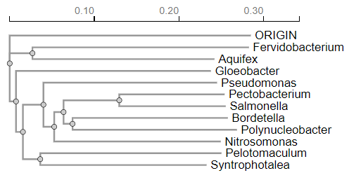
         
Z aminokislinskimi zaporedji proteinov iz istih proteinov sem prav tako naredil filogenetsko drevo. Iz filogenetskega drevesa lahko razberemo specifične lastnosti npr.: Fervidobacterium in Aquifex sta oba termofilna organizma (živita v vročih okoljih) in sta blizu pri korenu drevesa. Pseudomonas, Pectobacterium, Salmonella, in Bordetella so razmeroma bližje drug drugemu, kar pomeni, da imajo bolj skupnega prednika in so verjetno evolucijsko bolj sorodne kot na primer Syntrophotalea.
Da bi ugotovil ohranjenost sspecifičnih regij sem moral izvesti analizo z WebLogo3 (https://weblogo.threeplusone.com/create.cgi), iz katerega je razvidno da so najbolj ohranjene regije 3 in sicer:
Regija okoli 55-75 AK ostanka vtej regiji so opazne velike črke, kar kaže na visoko stopnjo ohranjenosti aminokislin. Ta regija verjetno vsebuje ključne funkcionalne ali strukturne elemente, kot so katalitična mesta ali vezavne domene za ATP ali substrat (vrjetno gre za ATP-grasp domeno). Regija okoli 95-115 in regija okoli 200-220. Najmanj ohranjene regije pa so Regija okoli 1-40 na začetku zaporedij je precej variabilnosti, kar je razvidno iz manjših črk v weblogo-tu. Te regije so manj kritične za osnovno delovanje proteina in se lahko med vrstami bolj razlikujejo. Regija okoli 145-165.Regija okoli 320-350: Tudi na koncu zaporedij je precej variabilnosti, kar kaže na manjšo ohranjenost aminokislin. Ta del proteina je verjetno manj pomemben za osnovno funkcijo encima. Najbolj ohranjene regije verjetno vsebujejo aktivna mesta in ključne strukturne elemente, ki so bistveni za katalitično delovanje D-alanin--D-alanin ligaze. Variabilne regije pa lahko prispevajo k specifičnim prilagoditvam posameznih vrst, vendar ne vplivajo bistveno na osnovno funkcijo proteina

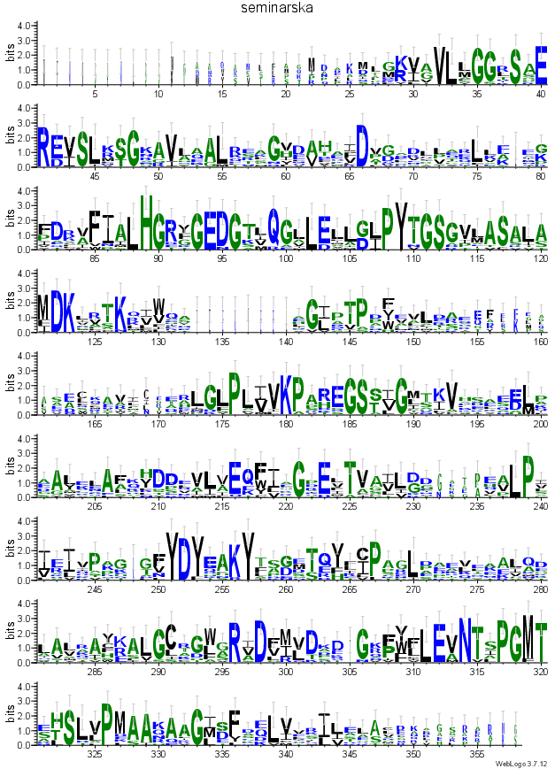


### Podobni evkariontski proteini: 
Iskanje z blastp v podatkovni bazi UniProtKB/Swiss-Prot(swissprot) ni dalo nobenih zadetkov zato sem podobne evkariontske proteine poiskal z pomočjo NCBI BLAST-a (https://blast.ncbi.nlm.nih.gov/Blast.cgi), tako da sem izhodiščno AK zaporedje dal v blastp in iskal v podatkovni bazi Non-redundant protein sequences (nr), prav tako pa sem iskanje omejil na organizem: Eucaryotae [2759]. Vzel sem prve 4 zadateke na blastp, kode zapisov BLAST identificiranih proteinov v GenBank-u so [MCL4150601.1] (E vrednost = 3e-42), [CAJ0543218.1] (E vrednost = 4e-41), [GEU28085.1] (E vrednost = 4e-39), [PON53579.1] (E vrednost = 4e-39). Protein [MCL4150601.1] je iz organizma idotea baltica, ker protein ni anotiran sem iskal njemu najbolj podobne proteine v blastp v podatkovni bazi UniProtKB/Swiss-Prot(swissprot), in za funkcijo uporabil najboljši zadetek in sicer to je bil protein D-alanine--D-alanine ligaza organizma Saccharophagus dgradans (UniProt ID [Q21MG7]), funkcija ostane enaka izhodiščnemu. Protein [CAJ0543218.1] je iz organizma Culicoides impunctatus in je  D-alanin--D-alanin ligaza B, katerega funkcija je ista kot tista od izhodiščnega proteina. Protein [GEU28085.1] organizma Tanacetum cinerariifolium je protein za celično delitev FtsZ, ki je bistven za celično delitev in tvori kontraktilno obročasto strukturo (Z-obroč) na bodočem mestu delitve celice. Regulira sestavo obroča nadzoruje čas in lokacijo celične delitve. Ena od funkcij FtsZ obroča je, da na septum pritegne druge proteine za celično delitev, da se ustvari nova celična stena med delitvenima celicama. Veže GTP in ima GTPazno aktivnost. Protein [PON53579.1] organizma Parasponia andersonii, da sem ugotovil njegovo funkcijo sem uporabil blastp v podatkovni bazi UniProtKB/Swiss-Prot(swissprot), funkcija tega proteina je kataliza proizvodnje glutationa iz gama-glutamilcisteina in glicina na ATP-odvisen način, sam protein pa pripada družini evkariontskih GSH sintaz. Večina zadetkov je bila za D-alanin--D-alanin ligaze jaz sem vzel še dva proteina, ki to nista bila da bi videl podobnost med njimi in njihovimi funkcijami.

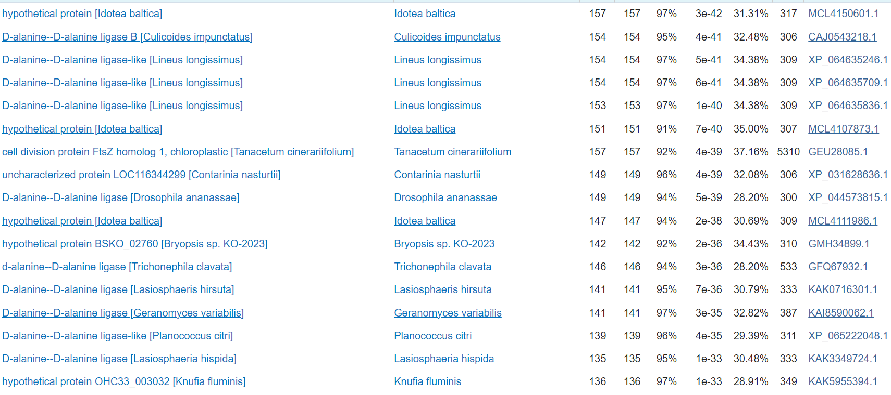

### Medproteinske interakcije:
Ker v izhodiščnem proteinu niso bile anotirane medproteinske interakcije sem za to analizo uporabil protein, ki ima v UniProtu-u ID [O66806], ki sem ga dobil z uporabo NCBI bLAST-a z različico blastp v podatkovni bazi UniProtKB/Swiss-Prot(swissprot) identičnost je bila 35.83%, E vrednosti pa 6e-61. Za ta protein so predvideli, da naj bi interagiral z 10 različnimi proteini, glavni so UDP-MURNAC-pentapeptid sintaza sodeluje pri tvorbi celične stene. Katalizira zadnji korak v sintezi UDP-N-acetilmuramojl-pentapeptida, prekurzorja mureina (na sliki označen "murF"). UDP-N-acetilenolpiruvoilglukozamin reduktaza, tvorba celične stene (na sliki označen "murB1").UDP-N-acetilmuramat-alanin ligaza; tvorba celične stene;(na sliki označen "murC"). Alanin racemaza katalizira medsebojno pretvorbo L-alanina in D-alanina. Lahko deluje tudi na druge aminokisline (na sliki označen "alr"). Fosfo-N-acetilmuramojl-pentapeptid transferaza; tvorba celične stene. Katalizira prenos GlcNAc podenote na undecaprenil-pirofosforil-MurNAc-pentapeptid (lipidni intermediat I), da se tvori undecaprenil-pirofosforil-MurNAc-(pentapeptid)GlcNAc (lipidni intermediat II) (na sliki označen "murG"). Ker nisem dobil nobenih zadetkov pri iskanju z blastp v podatkovni bazi UniProtKB/Swiss-Prot(swissprot) za podobne evkarionske proteine, nisem mogel določiti če oni interagirajo z kakšnimi drugimi proteini.


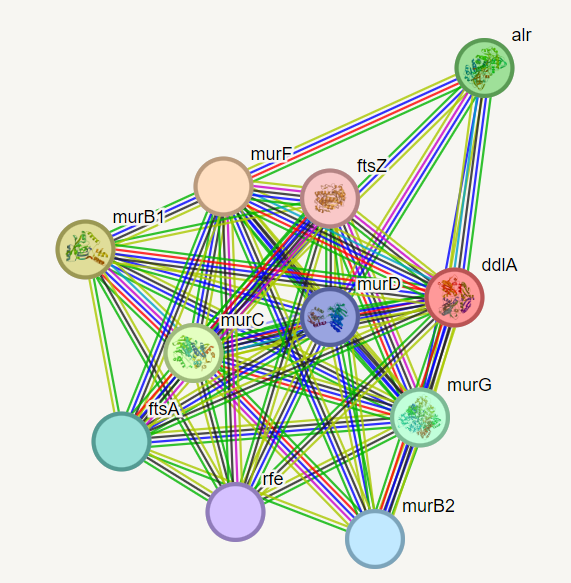

### Strukturna katakterizacija
Struktura proteina še ni znana (ni vnešena v zbirko PDB). 
Homologi z določeno strukturo so bili poiskani s pomočjo izvedbe blastp po zbirki PDB, ki vsebuje že eksperimentalno določene strukture.


Eden izmed homologov (predstavlja 95% iskalnega zaporedja iin ima 34,49% identičnost), za katerega je določena struktura je veriga A D-alanin--D-alanin ligaze organizma [*Pseudomonas aeruginosa*](https://en.wikipedia.org/wiki/Pseudomonas_aeruginosa) PDBID [8EVX](https://www.rcsb.org/structure/8EVX) in UniProtID [Q9HWI0](https://www.uniprot.org/uniprotkb/Q9HWI0/entry#family_and_domains). Struktura je bila določena s x-ray difrakcijo. Gre za dimer.


Narejena je bila poravnava predvidene strukture iskalnega proteina, ki je bila zgenerirana v [AlphaFold-u 3](https://golgi.sandbox.google.com/) in eksperimentalno določene strukture verige A D-alanin--D-alanin ligaze organizma [*Pseudomonas aeruginosa*] v programu PyMol .


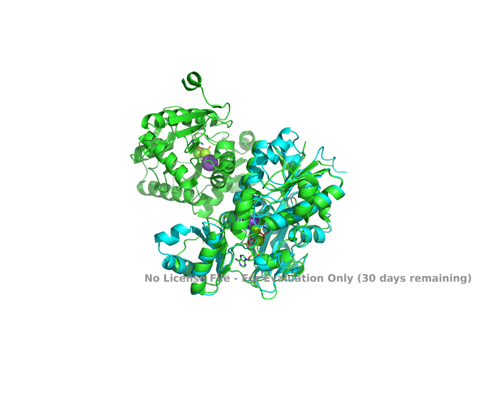

Jasno je razvidno, da predvidena struktura iskalnega proteina na sliki prikazan svetlo modro na začetnem N-koncu strukture vsebuje velik del, ki v eksperimentalno določeni strukturi ni prisoten (na sliki prikazan temno modro). Preostal del strukture določene z AlphaFoldom vsebuje bolj ali manj enake strukturne elemente, ki imajo tudi zelo podobno prostorsko ureditev. Najbolj se prilega del v prvi tretjini od N-terminalnega dela, kar je smiselno saj je tam ATP-grasp domena, ki igra ključno vlogo pri funkciji proteina (pri iskalnem proteinu smo to predvidevali preko primerjave s homologi).

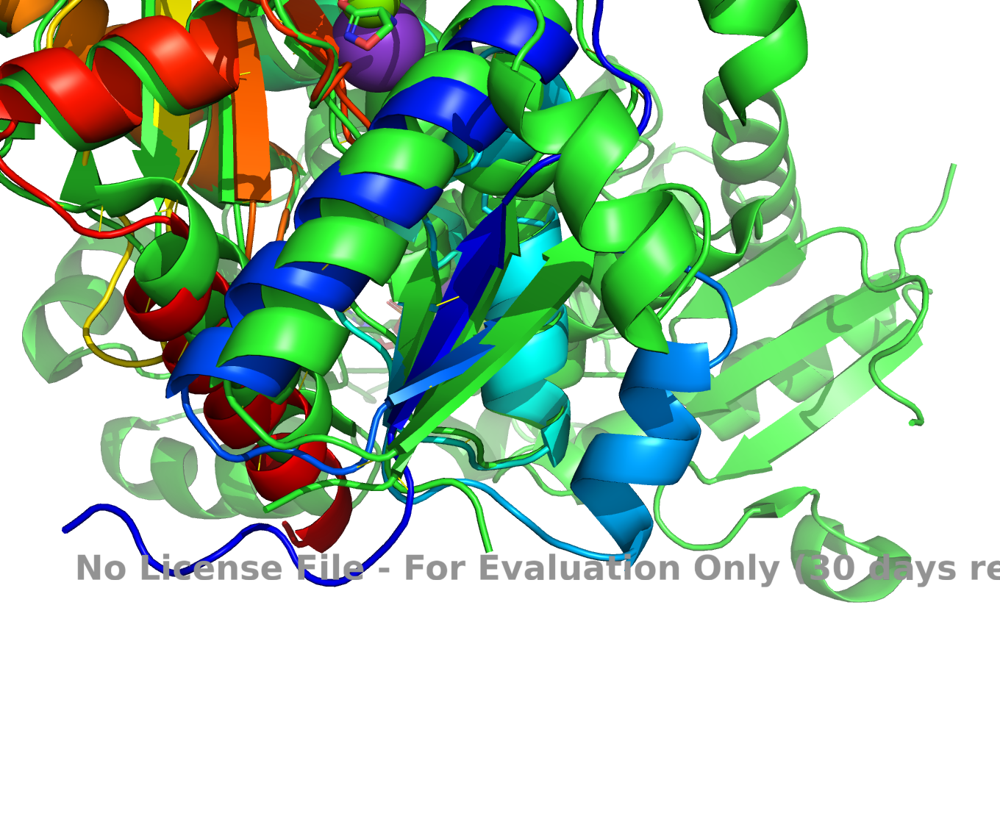


## VIRI:

- https://www.snapgene.com/plasmids/basic_cloning_vectors/pUC57
- A genomic catalogue of soil microbiomes boosts mining of biodiversity and genetic resources
Bin Ma, Caiyu Lu, Yiling Wang, Jingwen Yu, Kankan Zhao, Ran Xue, Hao Ren, Xiaofei Lv, Ronghui Pan, Jiabao Zhang, Yongguan Zhu, Jianming Xu;  DOI: 10.1038/s41467-023-43000-z
-The complete genome of the hyperthermophilic bacterium Aquifex aeolicus
G Deckert, P V Warren, T Gaasterland, W G Young, A L Lenox, D E Graham, R Overbeek, M A Snead, M Keller, M Aujay, R Huber, R A Feldman, J M Short, G J Olsen, R V Swanson;  DOI: 10.1038/32831
- https://golgi.sandbox.google.com/
- https://weblogo.threeplusone.com/create.cgi
- https://www.ebi.ac.uk/thornton-srv/databases/cgi-bin/enzymes/GetPage.pl?ec_number=6.3.2.4

