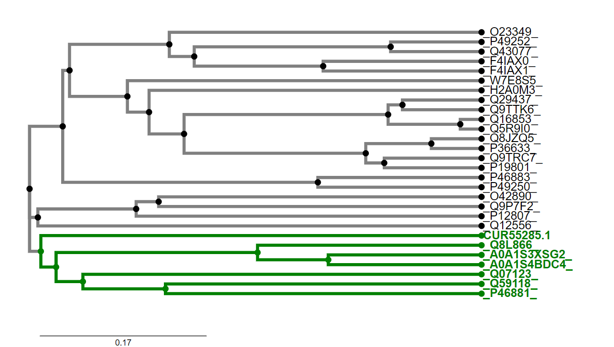

# S18

- **Avtor**: Andraž Snedec
- **Datum izdelave**: 2024-05-26
- **Koda seminarja**: S18

---
## Vhodni podatek
Povezava do datoteke z vhodnim podatkom: [S18](naloge/s18-input.md)

---

## Rezultati analiz
V spodnjih poglavjih so opisani postopki izvedbe analiz in njihovi rezultati.
### IME in IZVORNI ORGANIZEM PROTEINA
Vhodni podatek je vseboval zaporedje celotnega posekvenciranega plazmidnega konstrukta. Prvi korak pri določanju proteina je bil, da sem iz celotnega zaporedja izluščil zaporedje vključka. To sem dosegel tako, da sem na spletu poiskal plazmidno karto vektorja pUC57. Na plazmidni karti se je nahajal podatek, na keterem mestu v zaporedju se nahaja multiplo klonirno mesto (med 396bp in 476bp). To mi je omogočilo, da sem na drugi spletni strani, kjer se je nahajalo zapisano zaporedje vektorja pUC57, našel in prekopiral zaporedje dolžine 10bp pred začetkom multiplega klonirnega mesta (396) in zaporedje dolžine 10bp za multiplim klonirnim mestom (476). Ti dve zaporedji sem nato poiskal v vhodnem zaporedju. Zaporedje, ki se je nahajalo med obema zaporedjema, je predstavljalo vključek in je vsebovalo zapis za iskani protein. Z dobljenim zaporedjem vključka sem nato opravil poravnavo v blastx. Ker se laboratorij ukvarja z metagonomiko, sem poravnavo izvajal v zbirki *'Metagenomic proteins(env_nr)'*. Iz rezultatov, ki jih prikazuje [slika 1](s18-blastx_poravnava-iskanje_izvornega_proteina.png), sem lahko določil, kateri izvorni protein zapisuje zaporedje v vektorskem konstruktu. 

 Slika 1: Rezultati blastx poravnave zaporedja vključka v zbirki *Metagenomic proteins(env_nr)*.

Ime iskanega proteina je **Amin oksidaza** (ang. *Amine oxidase*) in ima 100% identičnost s poravnanim delom vstavljenega zaporedja.

Organizem, iz katerega izvira najdena amin oksidaza, ni točno določen, saj je bilo zaporedje za iskani protein izolirano iz **metagenomskega vzorca**. To je zapisano na [povezavi](https://www.ncbi.nlm.nih.gov/protein/CUR55285.1?report=genbank&log$=prottop&blast_rank=1&RID=53NWB4ES013) pod razdelkom 
*organism*.

S pomočjo zgornje povezave sem izvedel tudi, da je bilo zaporedje proteina izolirano iz vzorca aktiviranega blata v okviru raziskave na Univerzi na Dunaju, ki je preiskovala interakcije med avtotrofnimi bakterijami rodu Nitrospora in heterotrofnimi bakterijami. Več informacij o raziskavi je dostopnih na [povezavi](https://www.ncbi.nlm.nih.gov/bioproject/PRJEB10268) in v [članku](https://doi.org/10.1038/ismej.2014.156), ki izvira iz te raziskave. Članek sem našel na platformi PubMed, kjer sem v iskalno polje ustrezno vnesel podatke, ki so bili podani na [povezavi](https://www.ncbi.nlm.nih.gov/protein/CUR55285.1?report=genbank&log$=prottop&blast_rank=1&RID=53NWB4ES013) pod razdelkom *reference*.

### Lastnosti proteina:
* #### Sorodni proteini / homologi
Za analizirani protein je v podatkovni zbirki UniProt (ID: [A0A2P2BZU5](https://www.uniprot.org/uniprotkb/A0A2P2BZU5/entry#interaction)) podano le malo podatkov, zato sem moral o mnogih lastnostih proteina sklepati na podlagi podobnosti s sorodnimi proteini, ki so bolje anotirani od metagenomske amin oksidaze. Slednje sem našel tako, da sem v blastp izvedel poravnavno aminokislinskega zaporedja metagenomske amin oksidaze v zbirki '*UniProtKB/Swiss-Prot(swissprot)*'. Iz dobljenih rezultatov ([slika 2](s18-blastp_poravnava-iskanje_anotiranih_homologov.png)) sem v FASTA formatu prenesel zaporedja sorodnih proteinov, datoteki dodal še zaporedje metagenomske amin oksidaze, naredil poravnavo v programu ClustalOmega ter izrisal filogenetsko drevo ([slika 3](s18-sorodni_anotirani_proteini-filogenetsko_drevo.png)). S pomočjo filogenetskega drevesa sem lahko izluščil proteine (označeni z zeleno barvo), ki so najbolj sorodni metagenomski amin oksidazi (CUR55285.1). Te sem nato uporabil za določanje lastnosti proteina na podlagi sorodnosti. Predvsem sem uporabil *amin oksidazo zeta* iz Navadnega repnjakovca (*Arabidopsis thaliana*; UniProt Id: [Q8L866](https://www.uniprot.org/uniprotkb/Q8L866/entry#ptm_processing)).

 Slika 2: Rezultati blastp poravnave v zbirki *UniProtKB/Swiss-Prot(swissprot)*.

 Slika 3: Filogenetsko drevo metagenomske amin oksidaze in njej podobnih proteinov iz zbirke *swissprot*. Proteini so označeni z njihovimi UniProtID. Izjema je oznaka za metagenomski protein  (CUR55285.1). Metagenomski amin oksidazi najbolj sorodni proteini so označeni z zeleno barvo.
 
* #### Lokalizacija in topologija
Iskani protein se nahaja v citosolu in ni transmembranski. Podatka o lokalizaciji in topologoiji sklepam na podlagi podobnosti s histamin oksidazo iz prokarionta *Arthrobacter globiformis* (UniProt Id: [Q59118](https://www.uniprot.org/uniprotkb/Q59118/entry#subcellular_location)), ki je preiskovanemu metagenomskemu proteinu in je citosolni protein. 
Mnogo podobnih amin oksidaz iz evkrariontskih organizmov se nahaja v peroksisomu (tudi pri Navadnem repnjakovcu), kar pa pri našem organizmu ni mogoče, saj peroksisomi v prokariontih niso prisotni. 
Ker so nekatere druge (sicer manj sorodne) amin oksidaze nahajajo na membrani (npr. človeška amin oksidaza 3 (UniProt id: [Q16853](https://www.uniprot.org/uniprotkb/Q16853/entry#subcellular_location))), sem se odločil, da naredim še analizo hidrofobnosti z drsečim oknom. Analizo sem opravil na programu ProtScale (Expasy) z oknom, nastavljenim na 19 AK. Na diagramu hidrofobnosti ([slika 4](s18-hidrofobnost.png)) so vidni hidrofobni vrhovi, vendar ti niso tako izraziti kot pri transmembranskih regijah membranskih proteinov. Prav tako se ti vrhovi nahajajo predvsem v zaporedju od 100 do 200 aminokisline, ki spada v domeno N3 bakrovih amin oksidaz ([slika 5](s18-domenska_zgradba.png)). To domeno vsebuje tudi referenčni protein iz *Arthrobacter globiformis*, ki pa nima transmembranske regije. Ker je ista domena prisotna v obeh proteinih, sklepam, da v tej domeni ne more biti prisotna transmembranska regija. 

 Slika 4: Diagram hidrofobnosti zaporedja metagenomske amin oksidaze.

* #### Velikost proteina
Protein sestavlja 635 aminokislin. Njegova molska masa je 72181 Da. Podatka sta dostopna na UniProt id: [A0A2P2BZU5](https://www.uniprot.org/uniprotkb/A0A2P2BZU5/entry#sequences).

* #### Domenska zgradba
Podatke o domenski zgradbi proteina sem dobil prek analize zaporedja proteina na InterPro ([slika 5](s18-domenska_zgradba.png)). 
Metagenomska amin oksidaza je sestavljena iz 3 domen, ki so značilne za bakrove amin oksidaze: iz N2 domene, N3 domene in encimske domene. Funkciji N2 in N3 domen še nista poznani. Značilnost teh dveh domen je, da sta pomaknjeni proti N-koncu zaporedja in sicer N2 se nahaja pred N3 domeno. 
Za encimsko domeno je značilno, da se v njej nahajajo vezavna mesta za substrat, mesta za vezavo bakrovega kationa, manganovega kationa in 2',4',5'-topakinon (glej: [posttranslacijske modifikacije](#posttranslacijske-modifikacije)).[1]

 Slika 5: Rezultat InterPro analize zaporedja prikazuje domensko zgradbo proteina.

* #### Posttranslacijske modifikacije
Posttranslacijske modifikacije proteina sem ugotavljal s pomočjo primerjave z amin oksidazo Navadnega repnjakovca. Najprej sem odčital, na katerih mestih in na katerih aminokislinah se nahajajo posttranslacijske modifikacije pri Navadnem repnjakovcu. Nato sem naredil globalno poravnavo metagenomskega zaporedja in zaporedja iz Navadnega repnjakovca na EMBOSS Needle ter preveril, če se poravnani zaporedji ujemata na območju posttranslacijskih modifikacij. Poravnavo obeh zaporedij prikazuje [slika 6](s18-needle-poravanava.png).  
Analiza je pokazala, da sta obe posttranslacijski modifikaciji iz amin oksidaze Navadnega repnjakovca prisotni tudi pri naši metagenomski amin oksidazi.  
Pri Navadnem repnjakovcu cisteina na mestih 431 in 457 tvorita disulfidni mostiček. Iz poravnave se vidi, da pri metagenomski amin oksidazi disulfidni mostiček tvorita cistein 314 in cistein 340 ([slika 6](s18-needle-poravanava.png)).   
Druga postranslacijska modifikacija je modifikacija tirozina v 2',4',5'-topakinon. Modificirani tirozin se v Navadnem repnjakovcu nahaja na mestu 496. Pri poravnavi to ustreza tirozinu na mestu 378 iz zaporedja metagenomske amin oksidaze. ([slika 6](s18-needle-poravanava.png)).

 Slika 6: Poravanava zaporedij amin oksidaze iz Arabidopsis thaliana (Navadni repnjakovec) in amin oksidaze iz vhodnega podatka.

 * #### Funkcija proteina
Protein, ki ga zapisuje vključek v plazmidnem konstruktu, je encim in katalizira oksidacijo primarnih alifatskih aminov v aldehid. Pri tem reducira kisik O2 v vodikov peroksid H2O2 ([slika 7](s18-enacba_reakcije.png)). 

 Slika 7: Reakcija, ki jo katalizira encim ter kofaktorji, ki jih encim potrebuje. Slika je bila posneta v UniProt (Id: [A0A2P2BZU5](https://www.uniprot.org/uniprotkb/A0A2P2BZU5/entry#interaction)).

Poznamo 'baker vsebujoče' in 'flavin vsebujoče' amin oksidaze, ampak na podlagi analiz, ki so bolje predstavljene pod poglavjem [Sorodni proteini / homologi](#sorodni-proteini--homologi) lahko z gotovstjo trdim, da se analizirani metagenomski protein uvršča med 'baker vsebujoče'. To potrjuje tudi primerjava z zaporedjem amin oksidaze Navadnega repnjakovca, za katerega vemo, da nase veže baker.   
Na podlagi podobnosti z ostalimi bakrovimi amin oksidazami vemo, da sta za delovanje metagenomske amin oksidaze potrebna kofaktorja Cu kation (en protein veže en bakrov ion, ki s njim tvori koordinacijski kompleks) in Mn2+. Poleg tega je za funkcijo proteina ključen 2',4',5'-topakinon (nastane iz probrazbe tirozina), ki se v reakciji poveže s substratom in z njim tvori kompleks Schiffove baze ([slika 8](s18-mehanizem_oksidacije.jpg)).[1]

 Slika 8: Mehanizem oksidacije amina. B- označuje bazo, TPQ je kratica za topakinon. Vir: [1]

V primeru analizirane metagenomske amin oksidaze je substrat alifatski amin. Nekateri analiziranemu podobni proteini pa so sposobni vezati le specifične substrate, kot so npr. histamin pri histamin oksidazi (UniProt id: [Q59118](https://www.uniprot.org/uniprotkb/Q59118/entry))  in feniletilamin pri feniletilamin oksidazi (UniProt id: [P46881](https://www.uniprot.org/uniprotkb/P46881/entry#names_and_taxonomy) ) iz organizma Arthrobacter globiformis ter metilamin oksidaza (UniProt id:[Q07123](https://www.uniprot.org/uniprotkb/Q07123/entry)) iz Arthrobacter sp. P1.

* #### Ohranjenost regij
Kot je bilo že omenjeno, je bilo do danes odkritih že veliko število različnih 'amin oksidaz' oz. njihovih variant. Če v UniProt napišemo iskalni niz '*amine oxidase*', ta vrne 274477 zadetkov (vsi ti zadetki sicer predstavljajo obe skupini in ne samo tistih, ki vežejo baker). Vse te proteine mora združevati podobnost v regijah okoli aktivnega mesta, da je zagotovljena njihova funkcionalnost.   
Katere pa so te regije: V UniProt zapisu za amin oksidazo Navadnega repnjakovca so zapisane regije, ki naj bi bile ključne za funkcionalnost proteina (določene so bile na podlagi podobnosti) in jih prikazuje tabela na [sliki 9](s18-pomembne_regije_Navadni_repnjakovec.png). Na podlagi poravanave zaporedij Navadnega repnjakovca in metagenomske amin oksidaze ([slika 6](s18-needle-poravanava.png)) sem preveril, ali so te regije prisotne tudi pri analiziranem proteinu. Vse regije so popolnoma enake razen enega vezavnega mesta (410 - 421: zapredje 'AFDAGEDGLGKN'), ki se z metagenomskim zaporedjem ujema v 8 od 11 aminokislinah. Vseeno je znotraj tega zaporedja aspartat D412, ki sestavlja akivno mesto, ohranjen.  

 Slika 9: Slika, pridobljena iz UniProt zapisa za amin oksidazo iz Arabidopsis thaliana (id: Q8l866), prikazuje, kje v zaporedju amin oksidaze se nahajajo regije, pomembne za funkcionalnost proteina. Rdeče pike označujejo nahajališča aktivnih mest (D412 in Y496).

V nadaljevanju sem želel preveriti, ali je ta ohranjenost prisotna tudi drugod, zato sem iz rezultatov ClustalOmega poravnave 28 zaporedij (glej [Sorodni proteini / homologi](#sorodni-proteini--homologi)) ustvaril sequence logo ([slika 10](s18-ohranjenost_seqlogo.png)) in s tem potrdil dobro ohranjenost teh regij (predvsem vezavnih mest za bakrov in manganov kation ter prisotnost modificiranega tirozina (topakinona) in baze - akceptorja protona).

 Slika 10: Sequence Logo prikazuje ohranjenost posameznih aminokislinskih ostankov pri primerjavi 28-ih sorodnih proteinov. Dobro so ohranjeni D573 (aktivno mesto), Y663 (topakinon-aktivno mesto 2), zaporedje 'VANYEY' okoli topakinona, H722 in H724 (vezavni mesti za Cu), D896 in D913 (vezavni mesti za Mn).

* #### Podobni evkariontski proteini
Nekaj podobnih evkariontskih proteinov je bilo tekom seminarske naloge že izpostavljenih. Vseeno pa so bili vsi ti iz zbirke 'swissprot' in niso tisti evkarintski proteini, ki so najbolj podobni metagenomski amin oksidazi. Da bi odkril evkariontski protein, katerega aminokislinsko zaporedje se najbolj prilega analiziranemu proteinu, sem zopet uporabil blastp poravnavo. Tokrat sem uporabil '*non-redundant protein sequences (nr)*' bazo podatkov in iskanje omejil na taksonomsko stopnjo '*eucaryotes*'. Rezultati ([Slika 11](s18-blastp_evkarionti.png)) so pokazali, da je metagenomski amin oksidazi najbolj podobna bakrova metilamin oksidaza iz spužve vrste Geodia barretti. Ujemanje poravnanih delov zaporedja je tokrat 43,6%, torej za 4,7% višja od amin oksidaze iz Navadnega repnjakovca (Arabidopsis thaliana), ki smo jo uporabljali za določevanje lastnosti analiziranega metagenomskega proteina. 

 Slika 11: Rezultat blastp poravnavne v (nr) bazi podatkov, kjer so prikazani samo zadetki za evkariontske organizme.

Na drugi strani je najbolj podoben protein izmed prokariontskih organizmov primarni amin oksidaza iz kemoorganotrofne bakterije rodu Marmoricola ([slika 12](s18-blastp_prokarionti.png)). Tokrat je podobnost veliko boljša, saj znaša 82,8%.

 Slika 12: Rezultat blastp poravnave v (nr) bazi podatkov, kjer so prikazani samo zadetki za prokariontske organizme.

* #### Povezanost z drugimi proteini
Značilno za amin oksidaze je, da tvorijo homodimere, kjer vsaka enota v homodimerskem kompleksu tvori svojo katalitično regijo[1]. Po podatkih iz UniProt naj bi homodimer tvoril tudi analizirani metagenomski protein.   
Da bi ugotovil, kakšne interakcije ima analizirani protein z drugimi proteini, sem v programu STRING izrisal graf interakcij ([slika 13](s18-STRING_analiza_interakcij.png)) proteina tynA iz E. Coli (UniProt id: [P46883](https://www.uniprot.org/uniprotkb/P46883/entry#sequences)). Ta protein sem izbral, ker bila poravnava z zaporedjem analiziranega proteina v programu Needle ocenjena z 868. Hkrati je E. Coli bakterija in posledično bolj sorodna organizmom, iz katerih je bilo izolirano zaporedje analiziranega proteina.

Po analizi interakcij je delovanje tynA nedvoumno (verjetnost nad 0,9) povezano vsaj  s tremi proteini. Po zmanjšanju kriterija gotovosti interakcij je povezav z drugimi proteini veliko (na sliki jih je prikazanih 10).

Iz dobjenih podatkov analize interakcij, je protein TynA prek povezav z drugimi proteini funkcijsko vključen v razne katabolične procese. Najbolj očitno naj bi bil vpleten v razgradnjo fenilmetilamina, metilglioksala, L-fenilalanina kakor tudi v druge procese katabolizma aminov. Vseeno pa kljub podobnosti ne morem trditi, da je metagenomska amin oksidaza enako vključena v razgradnjo aromatskih aminov, kot protein TynA, za katerega med drugim na UniProt piše, da preferira aromatske amine pred alifaskimi.

 Slika 13: Interakcije proteina tynA iz E. coli z ostalimi proteini v celici. Gotovost interakcij je ocenjena na več kot 0,400.

* #### Struktura analiza proteina
Ker struktura analiziranega metagenomskega proteina še ni bila eksperimentalno določena, sem uporabil program AlphaFold3 za napoved strukture ([slika 14](s18-AlphaFold3_napovedana_struktua.png)).

 Slika 14: Z AlphaFold3 napovedana struktura analizirane metagenomske amin oksidaze. pTM ocena napovedane strukture je 0,96. Struktura je napovedana z zelo veliko gotovostjo. Manjšo gotovost pri strukturi predstavlja samo neurejena regija na C' koncu proteina.

Prav tako sem napovedano strukturo primerjal z eksperimentalno že določenimi strukturami iz prokariontkega (Arthrobacter globiformis) in evkariontskega (Ogataea angusta) organizma. Eksperimentalno določene strukture sem našel tako, da sem v blastp iskal v '*Protein Data Bank*' podatkovni zbirki ([Slika 15](s18-superpozicija.png)).

 Superpozicija struktur napovedane metagenomske (rumena), in eksperimentalno določenih prokationtske (1AVK, roza) in evkariontske (1EKM_C, modra) amin oksidaz. Strukture se zelo dobro prekrivajo z manjšimi odkloni.

Iz superpozicije vseh treh struktur (eksperimentalno določene prokariontske, eksperimentalno določene evkariontske in napovedane metagenomske) se jasno opazi, da se vse tri strukture skoraj popolnoma prekrivajo. To je dokaz, da so amin okdisdaze zelo ohranjena skupina proteinov. Kljub različnim zaporedjem imajo skoraj enako strukturo, kar jim omogoča opravljanje iste funkcije. Pri tem je še posebej pomembna strukturna podobnost v aktivnem mestu, ki ga prikazuje [slika 16](s18-superpozicija-prikaz_aktivnega_mesta.png).

 Slika 16: Prikaz aktivnega mesta v superpoziciji struktur iz slike 15. Regije okoli aktivnih mest se zelo dobro prekrivajo. Z zeleno barvo je označen Zn, s katerim so pri določanju strukture zamenjali Cu. Z rdečo barvo je označen 2',4',5'-topakinon (oz. tirozin, ki je modificiran v topakinon).

# Zaključek
Bakrova amin oksidaza je protein, za katerega bi lahko rekli, da je prisoten v prav vsakem organizmu. Njegova funkcija je oksidacija primarnih aminov v aldehid, za kar v aktivnem mestu potrebuje topakinon. Kot tak je encim vključen v mnoge katabolne procese v celici. Dokaz, da v celici že od pojava prvih organizmov opravlja pomembno vlogo pa bi lahko bilo ravno fascinantno dejstvo, da se je skozi evolucijo, kljub spreminjanju zaporedja za amin oksidaze, ohranila struktura encima.

Viri:
[1]: Parsons, Mr, idr. „Crystal Structure of a Quinoenzyme: Copper Amine Oxidase of Escherichia Coli at 2 å Resolution“. Structure, let. 3, št. 11, november 1995, str. 1171–84. DOI.org (Crossref), https://doi.org/10.1016/S0969-2126(01)00253-2.