# S20

- **Avtor**: Mark Varlamov
- **Datum izdelave**: 2024-05-23 
- **Koda seminarja**: S20

---
## Vhodni podatek

Povezava do datoteke z vhodnim podatkom: [S20](naloge/s20-input.md)

---
## Rezultati analiz

### Določitev zaporedja inserta 
Za začetek sem poiskal plazmidno karto za plazmid pUC57, v katerega je bilo vstavljeno zaporedje za protein. Na plazmidni karti sem poiskal multiplo klonirno mesto (MCS) ter določil mejna bazna para, med katerima se nahaja MCS 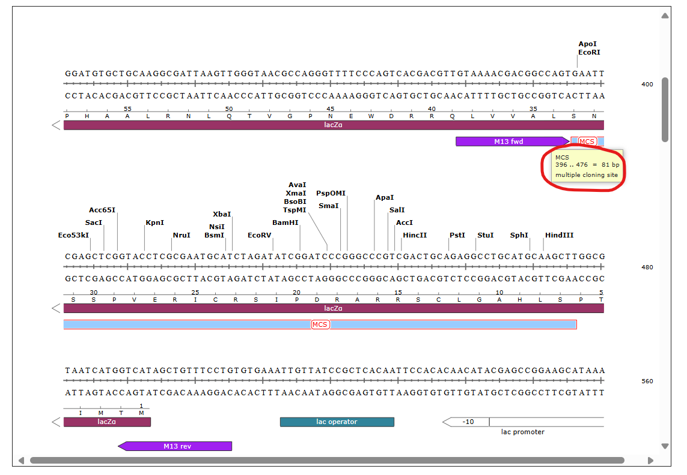. Ta bazna para sta 396 in 476. Nato sem z iskanjem nadaljeval po zbirki GenBank, kjer sem našel celotno zaporedje vektorja ter iz informacije pridobljene s plazmidne karte določil zaporedje za MCS 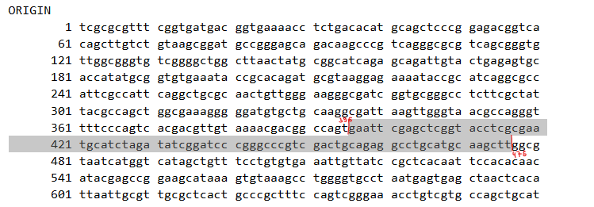. Zaporedje iz GenBanka sem očistil z uporabo programa Dna Protein sequence cleaner. Pridobljeno zaporedje sem zaradi lažjega dela prenesel v datoteko Notepad ter s pomočjo funkcije "Find on page" in hkratnim vpisovanjem zaporedja klonirnega mesta plazmida pUC57, določil kje se to zaporedje pretrga in kakšen je zapis za insert.

### Analiza zaporedja
Pridobljeno zaporedje inserta sem vstavil v blastx, vendar mi iskanje po nepresežni podatkovni bazi ni dalo 100% ujemanja. Pogoje iskanja sem spremenil tako, da sem v podatkovni bazi izbral metagenomske proteine (env_nr). Rezultati so pokazali 100% identičnost z zaporedjem avtolizina (hidrolaze celične stene) 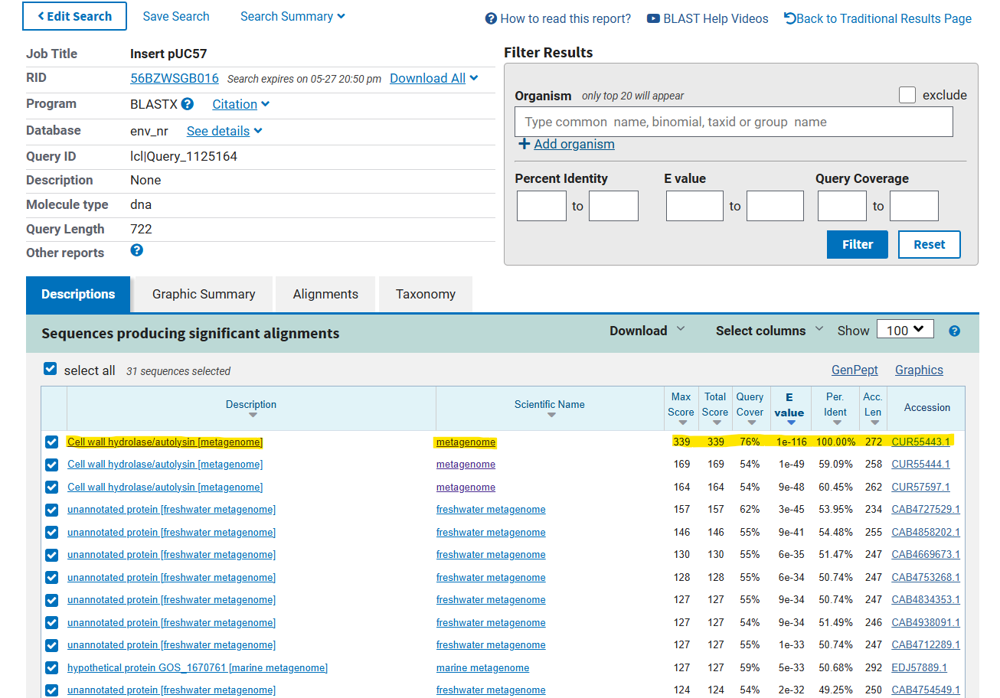. Iz povezave na vnos v GenBanku sem odčital, da gre za metagenomski vzorec tekočega mineralnega medija, kar sicer ne pove skoraj nič o samem proteinu ali njegovih homologih. Prav tako sem zasledil podatek o regiji, zapisani znotraj proteina, ki spada v družino N-acetilmuramoil-L-alanin amidaz Rv3717 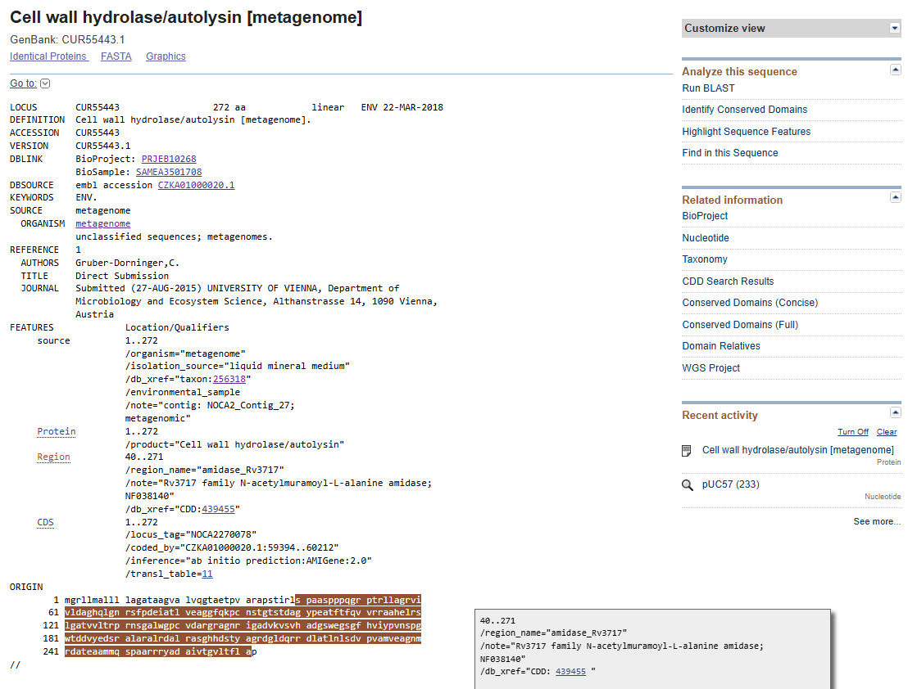.Ponovno sem se obrnil na blast, vendar sem tokrat v pogojih iskanja spremenil podatkovno bazo na UniProtKB/Swiss-Prot (swissprot), pri čemer sem v rezultatih dobil eno ujemanje z N-acetilmuramoil-L-alanin amidazo iz Mycobacterium tuberculosis. Zaporedje je imelo 42% identičnosti, kar sicer ne zadostuje vrednosti, pri kateri bi lahko razpravljali o tesni sorodnosti, vendar pa kaže na morebitno prisotnost podobnih domen. Vrednost E je zelo nizka, in sicer znaša 1e-15, kar nam kaže na homolognost našega zaporedja z rezultatom 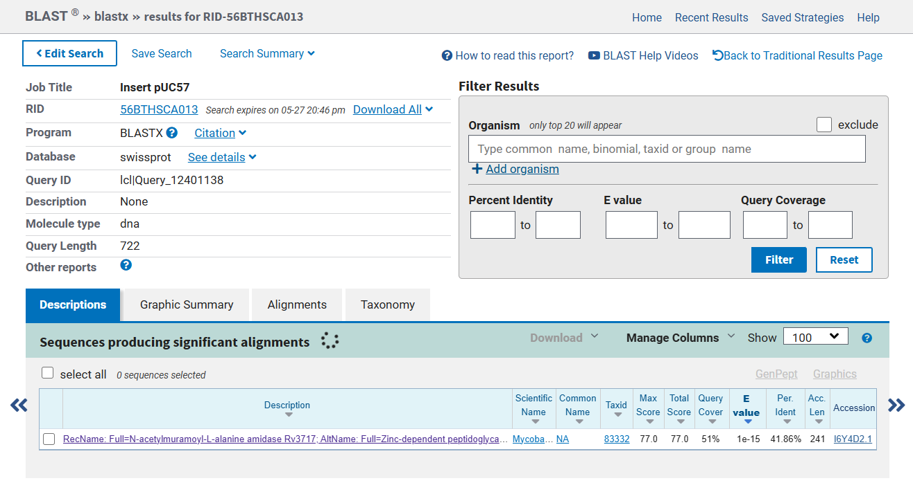.

### Določitev domen in aktivnosti proteina
Rezultate blastx sem želel podpreti z dokazom o homolognosti domen, in sicer sem sledečo analizo izvedel v programu Emboss Dotmatcher. Za velikost okna sem uporabil vrednost 10, za prag pa vrednost 20. S tem sem izvedel vizualno analizo zaporedij ter odstranil morebiten šum. Iz rezultatov sem razbral, da sta zaporedji zelo podobni,da je prisotnih veliko diagonal, kar kaže na homolognost. Prav tako sem opazil nekaj prelomov v diagonalah, iz česar bi lahko sklepal, da je na tistih mestih tekom evolucije potekla mutacija (delecija/insercija/substitucija) 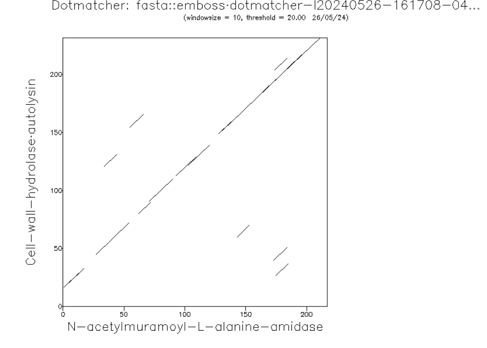. Znana domena, ki sem jo primerjal z domeno iz zaporedja je katalitična domena N-acetilmuramoil-L-alanin amidaze Rv3717. Iz podobnosti lahko rečemo, da gre za protein, ki je v periplazmi vezan na zunanjo membrano. Sodeluje pri izgradnji celične stene in katabolnem procesu makromolekul. Za analizo aktivnega mesta, sem se obrnil na poravnavo iz blastx. Želel sem preveriti ohranjenost aktivnega mesta (donorja/akceptorja protonov) in treh vezavnih mest za cinkove (2+) ione, s čimer bi lahko dokazal tudi molekulsko funkcijo vezave kovinskih ionov analiziranega proteina. Sledečo analizo em izvedel z uporabo programa InterPro, ki mi je še enkrat potrdil ohranjenost domene in aktivnega ter vezavnih mest znotraj zaporedja. Iz rezultatov lahko povem, da je aktivno mesto E-197 (glutaminska kislina), tri mesta za vezavo cinkovih ionov pa 27-H (histidin), 64-E (glutaminska kislina) in 121-H (histidin) 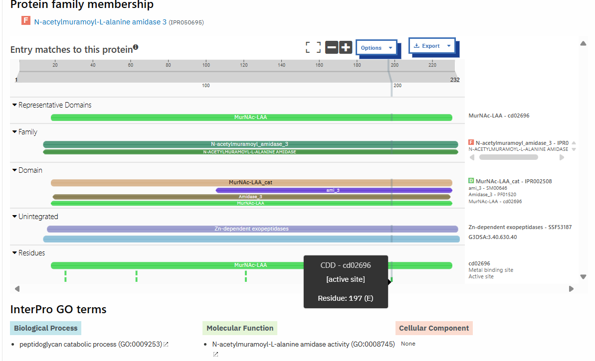. Predlagan substrat za analiziran protein je peptidoglikan, kajti domena sodeluje pri aktivni razgradnji le tega.

### Iskanje homologov in oblikovanje filogenetskega drevesa
Analiziran protein je značilen samo za prokarionte, kajti analize ustreznih ujemanj v podobnosti z evkartiontskimi organizmi niso pokazale. Najprej sem skušal z blastp iskati podobno zaporedja v nepresežnih zbirkah proteinov s taksonomijo Eukarya, vendar nisem dobil pozitivnega rezultata 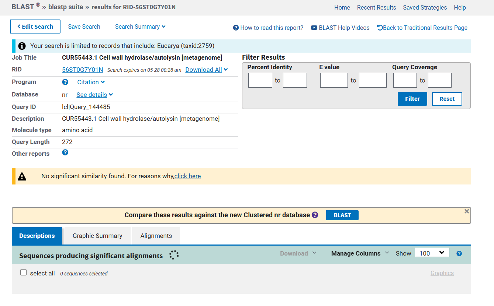. Nadaljeval sem v UniProtu, kjer sem iskal zaporedja preko identičnosti UniRef100, UniRef90 in UniRef50. Pri zadnjem sem dobil kar 584 rezultatov, vendar niti eden ni pripadal evkariontskemu organizmu 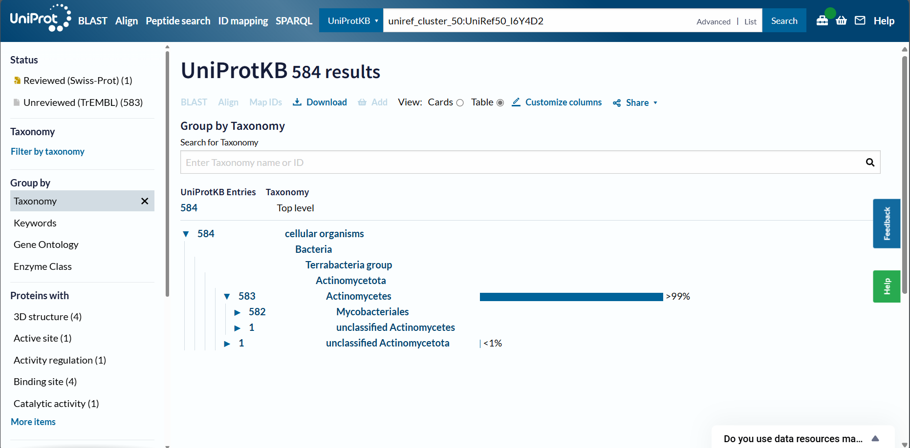. Za sestavo filogenetskega drevesa sem izpisal 16 zaporedij v Notepad, iz tega sem navedel dve zaporedji iz UniProta, lastno zaporedje ter 14 zaporedij, ki so bila homologna mojemu po analizi z blastx po neredundančnih zbirkah. Zaporedja sem ustrezno poimenoval ter jih prekopiral v program Clustal Omega, iz katerega sem zapis za filogenetsko drevo prenesel v Phylo.io 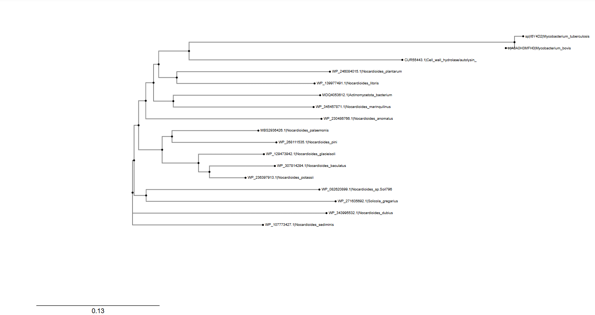. Iz drevesa vidimo, da je naš protein z oznako CUR55443.1|Cell_wall_hydrolase/autolysin na filogenetskem drevesu najbližje N-acetilmuramoil-L-alanin amidazam iz naslednjih dveh vrst: Nocardioides plantarum in Nocardioides litoris. Te dve vrsti se nahajata na isti veji kot analiziran protein, kar pomeni, da imajo najbližji sorodstveni odnos. To kaže, da je naš protein bolj soroden proteinom teh dveh vrst Nocardioides kot katerim koli drugim vključenim vrstam na drevesu.

### Analiza interakcij proteina in sestavljanje strukture
Za analizo interakcij sem uporabil program STRING, v katerem sem izbral najbližji protein analiziranemu proteinu, in sicer N-acetilmuramoil-L-alanin amidazo iz Mycobacterium tuberculosis 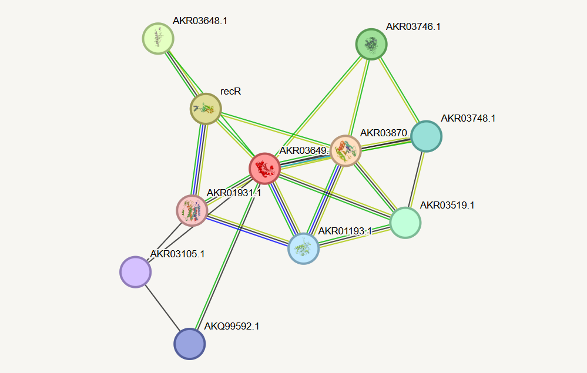. Iz mreže lahko vidimo, da je znana samo ena interakcija s hidrolazo. Ostale so zgolj predvidene na osnovi sosedstva genov (rekombinantni protein RecR, z nukleoidom povezan protein), skupnega izražanja genov (domnevna oksidoreduktaza; proten, bogat s prolini in treonini) in sočasne pojavitve (peptidoglikanska endopeptidaza RipA). Pri sestavljanju strukture sem dobil sledeči rezultat z uporabo AlphaFold3 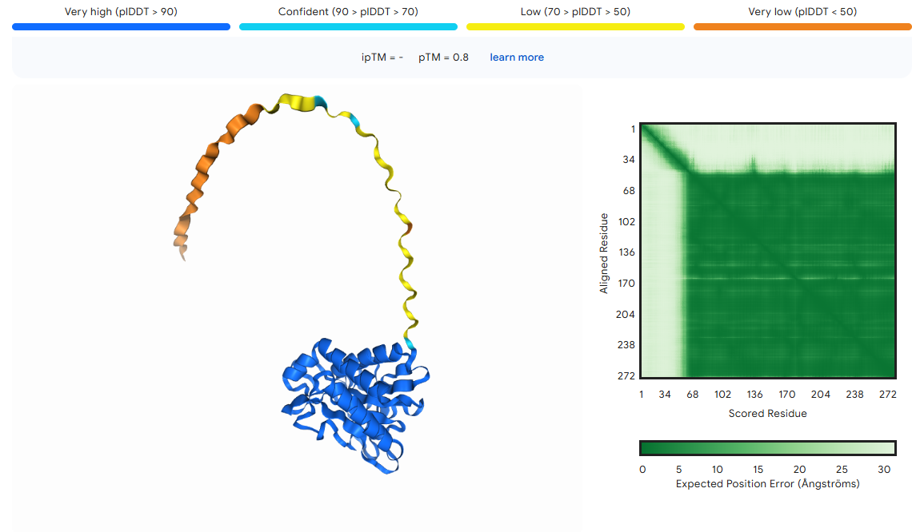. V grobem lahko opazimo, da je struktura proteina pretežno iz alfa vijačnic, kar tudi potrdi njegovo lokacijo v periplazmi. Dolg rep je nenatačno določen, domnevno gre za kako interakcijo z drugimi molekulami, zato ne moremo zagotovo reči, da je to del strukture. Po izvedbi superpozicije z N-acetilmuramoil-L-alanin amidazo iz Mycobacterium tuberculosis 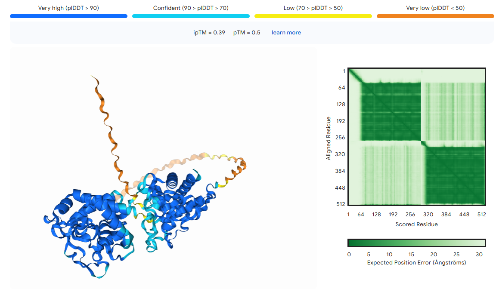 lahko rečemo, da sta proteina strukturno zelo podobna, ker imata oba v strukturi 4 alfa vijačnice.