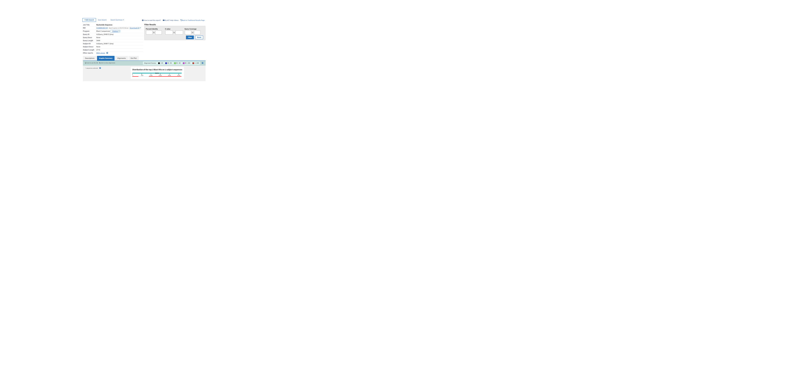
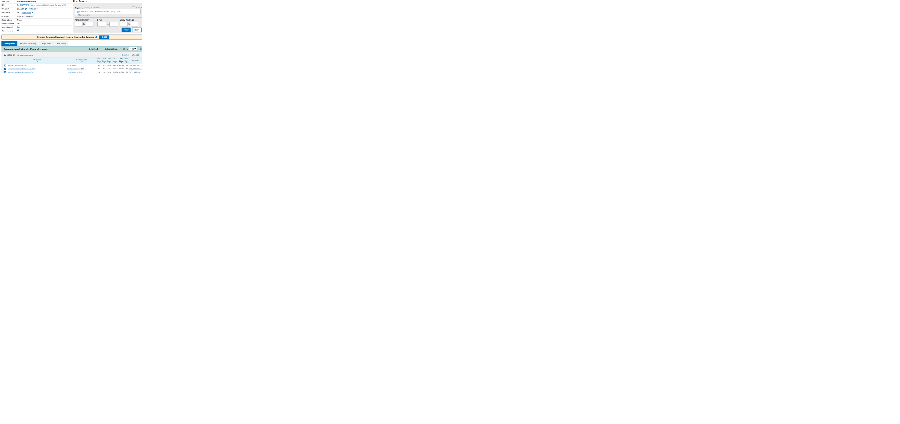
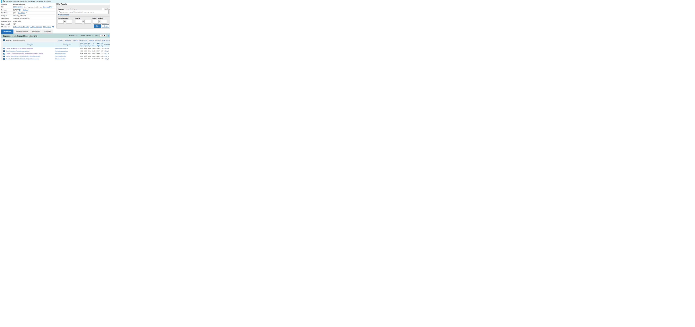
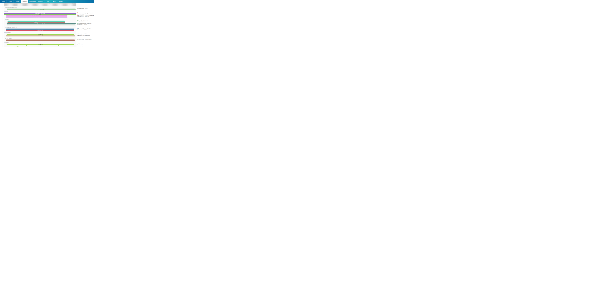
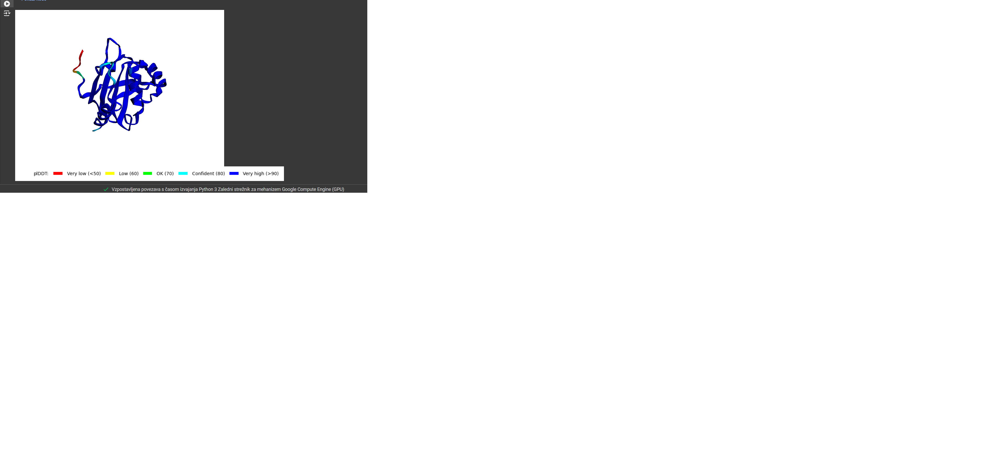
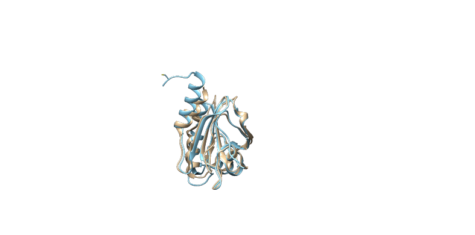
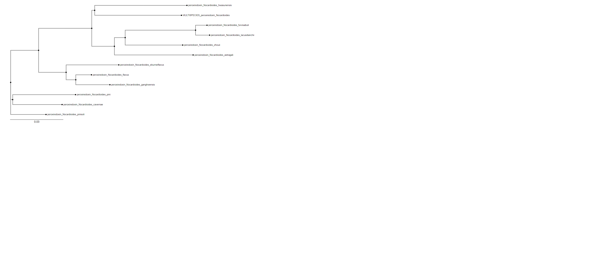

# S23

- **Avtor**: Nik Matek
- **Datum izdelave**: 2024-05-24
- **Koda seminarja**: S23

---
## Vhodni podatek

Povezava do datoteke z vhodnim podatkom: [S23](naloge/s23-input.md)

---
## Rezultati analiz
### Iskanje aminokislinskega zaporedja
Po primerjavi vhodnega podatka z nukleotidnim zaporedjem plazmida pUC57 s programom blastn smo dobili sledeče nukleotidno zaporedje:
GCTGCCGCGCAACGCCACGGGGAAGATCCTCAAGCGCGAGCTCGCCCAGCTGGATCGGACACAGCAGGAGAGCGAGGGCGAGTCGTGAACGGGCCGGGCCTGTGCATCGGTGACGAGGCACCCGACTTCACCCTGCGCGACCAGTTCGGGCAGGACGTGCGCCTCAGCGACTTCCGCGGGCGCAAGGCGGTGGCGCTGATCTTCTTCCCCTTCGCCTTCACCGGCGTCTGCACCGGCGAGCTGTCGGCGGTCCGCAACCGGCTCGACGAGTTCCTCAGCTTCGACACCGAGGTGCTCGCCCTGTCGTGCGACTCCGTCTACGCCCTGCGGTCCTTCGCCGAGGCCGAGGGCCTGAACTTCCCGCTGCTCTCCGACTACTGGCCCCACGGGGCGGTGGCCTCGGCCTACGAGGTGTTCGACAGCGTGAAGGGCGCCCCGCGCCGGTCGTCGTACGTCGTGGACCTGCAGGGGCGGCTGCGGTGGTCGGTGCACAACGCCAACCCCGACGGTCGTGACCTCGACGAGCACCTGCGCGAGCTCCACGCGGCCCTGTCCTGAGCCCGGTGGAGCGCAGTGGTCTAGACCGGCTGCGAGAAATCTCGGATTCCTCGGACAGGCTTGGGTGGCGGTGTAATCTTGTACTTGTTGAGCCGCTGGTGACCCGAGACGCCAGCGGCTCGACTCATTTCATTTCCGCCCGGTTGCGGGCGTGAGCGGGATTCCGGGCCTGCCG

Na tej sliki je prikazana poravnava vhodnega podatka s plazmidom pUC57. Del zaporedja, ki ni označen z rdečo je naš vključek.
To zaporedje smo uporabili za iskanje s programom blastx, pri čemer smo dobili visoko ujemanje s proteinom peroksiredoksinom iz organizmov *Nocardioides*.  Na tej sliki so vidni rezultati iskanja. 
Na Uniprot-u smo poiskali ta protein in z njegovim [aminokislinskim zaporedjem](https://rest.uniprot.org/uniprotkb/A0A0Q6V790.fasta) izvajali nadaljnje analize. 

### Iskanje podobnega evkariontskega proteina
Ker na Uniprot-u ta protein ni anotiran in o njem ni znanih veliko informacij, smo iskali sorodne proteine s programom blastp, kjer smo iskali po pdb bazah (zanimali so nas proteini, ki so imeli že določeno strukturo), iskanje pa smo omejili na evkarionte. Takšno iskanje nam je prikazalo 10 zadetkov, kar je prikazano na naslednji sliki. . Izbrali smo zadetek z največjim odstotkom identičnosti. V našem primeru je to veriga A od tioredoksina odvisnega peroksiredoksina organizma *Ancylostoma ceylanicum* (po slovensko parazitski okrogli črv).

### Analiza z InterPro
Analiza s programom InterPro je pokazala, da ima protein tioredoksinsko domeno. Spada v družino peroksiredoksinov, natančneje tiolne peroksidaze. Dimer vezavno mesto je na aminokislinskih ostankih S28, D29 in R31, iz česar sklepamo, da protein tvori dimere. Aminokislinski ostanki T46, C49 in R120 tvorijo katalitično triado. Aminokislinski ostanek C49 služi kot vezavno mesto za Cu kation in aktivno mesto za cistein-sulfonsko kislinski intermediat.  Rezultati analize z InterPro so prikazani na tej sliki.

### Splošne lastnosti proteina
Protein je dolg 157 aminokislinskih ostankov in opravlja peroksidazno funkcijo. Glede na evkariontski protein iz organizma *Ancylostoma ceylanicum* sklepamo, da katalizira redukcijo vodikovega peroksida in organskih hidroperoksidov v vodo in alkohole. Evkariontski protein ima dve posttranslacijski modifikaciji in sicer dve disulfidne vezi, ki jih tvori z drugimi monomeri. Od teh je C49 ohranjen tudi pri našem proteinu. Naš protein ima ohranjeno tioredoksinsko domeno med aminokislinskimi ostanki 6-157.

### Poravnava z evkariontskim peroksiredoksinom
S programom AlphaFold2 smo izrisali model strukture našega proteina, kar vidimo na spodnji sliki: 

Iz slike je razvidno, da je PIDDT odstotek visok vsepovsod, razen na N-koncu proteina. Nizek odstotek pomeni strukturno neurejeno regijo proteina. Protein je sestavljen iz devetih beta trakov in šestih alfa vijačnic. Beta trakova 1 in 2 sta antiparalelna, sledi jima alfa vijačnica 1. Beta trakovi 3, 4 in 5 tvorijo paralelno beta ravnino, beta trakova 6 in 7 sta antiparalelna, prav tako sta antiparalelna beta trakova 8 in 9. Protein vsebuje tudi c-končno alfa vijačnico.
Ta model smo nato v programu Chimera poravnali z verigo A peroksiredoksina iz organizma *Ancylostoma ceylanicum*. Poravnavo vidimo na spodnji sliki: 
Z rjavo je označen naš protein, s turkizno pa evkariontski protein. Proteina se ujemata v tioredoksinski domeni, kar je razvidno iz superpozicije.

### Filogenetsko drevo
S programom PSI-blast smo opravili več iteracij iskanja. Iz rezultatov iskanja smo vzeli 13 proteinov in naredili poravnavo v Clustal Omega. Filogenetsko drevo, narejeno s tem programom smo skopirali v program Phylo.io. Izrisano filogenetsko drevo je prikazano na spodnji sliki:

Iz drevesa razberemo, da je naš protein najbolj podoben proteinu iz organizmov *Nocardioides hwasunensis*. Ker so vsi proteini v drevesu peroksiredoksini, sklepamo, da naš protein opravlja isto funkcijo. Ti proteini iz organizmov na drevesu niso anotirani, zato rezultati niso zanesljivi.
