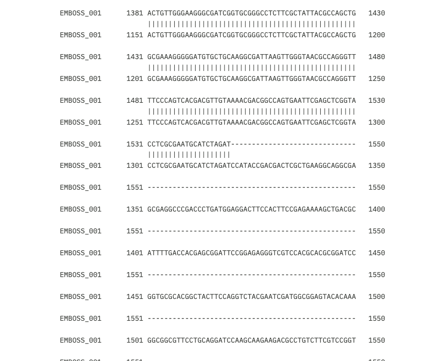
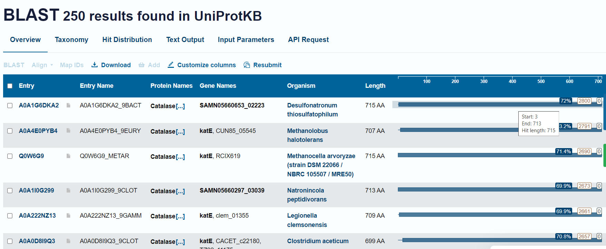
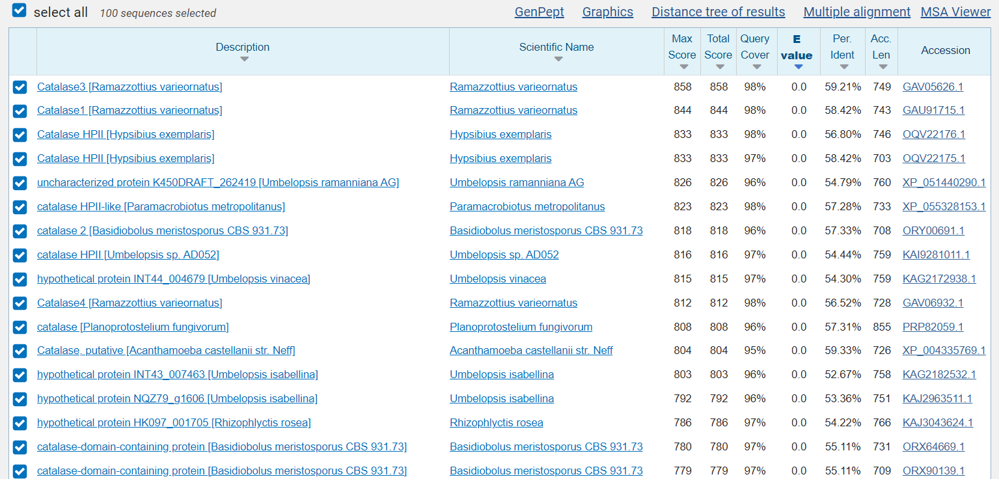
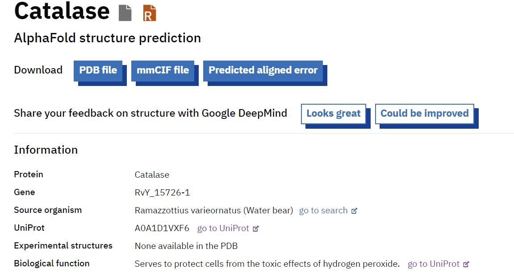
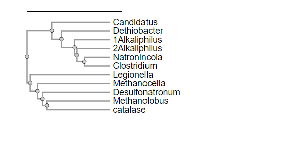
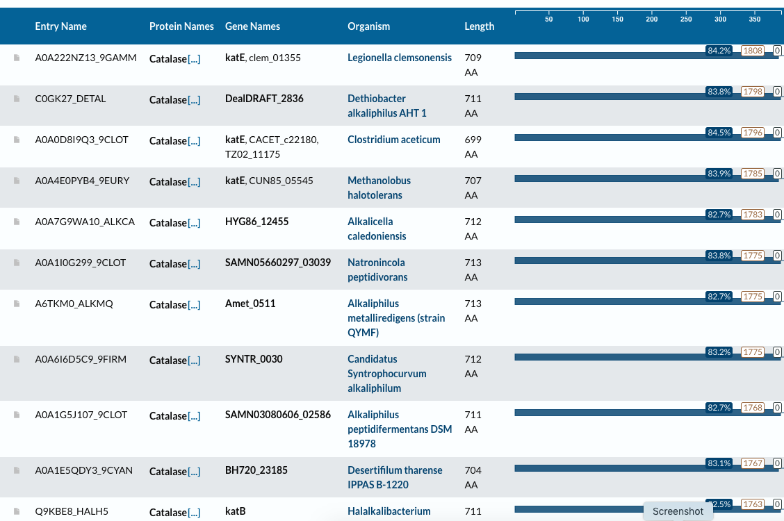
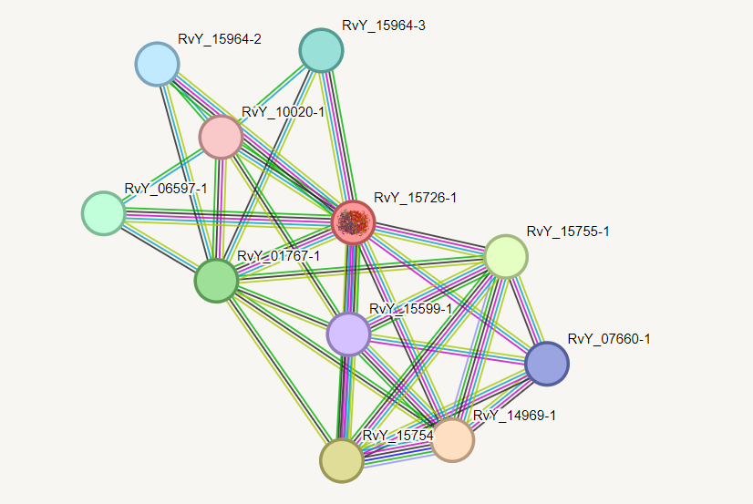
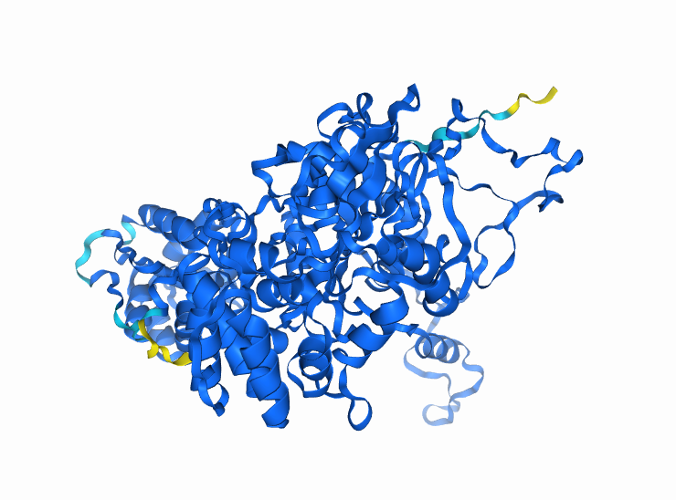
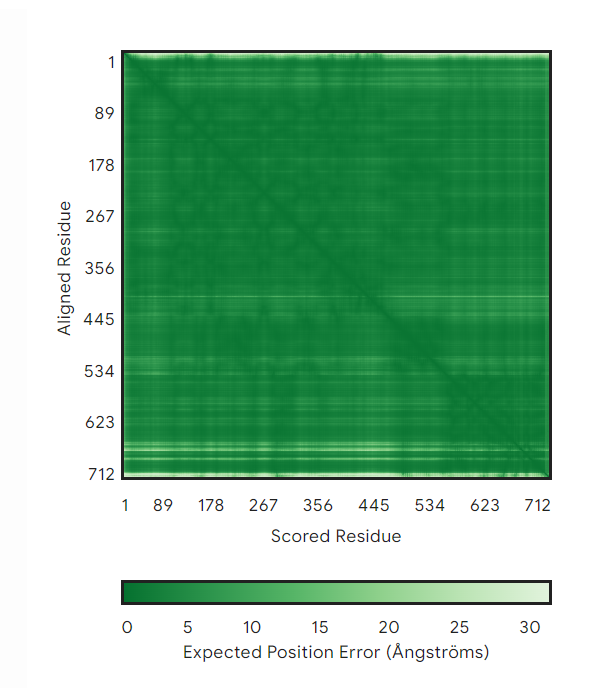
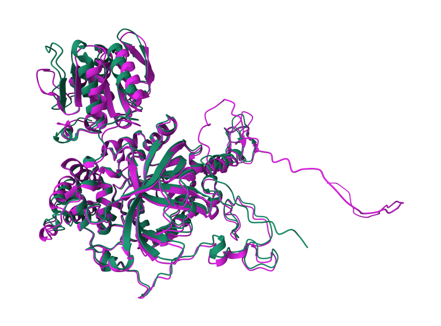

# S24

- **Avtor**: Amber Bervar
- **Datum izdelave**: 2024-05-26
- **Koda seminarja**: S24

---
## Vhodni podatek

Povezava do datoteke z vhodnim podatkom: [S24](naloge/s24-input.md)

---
## Rezultati analiz

### **Postopek iskanja**

#### Poravnava izhodnega in dodeljenega zaporedja
* Na Genbanku sem našla nukleotidno zaporedje za klonirni vektor pUC57.
* Zaporedje tega sem nato primerjala z dodeljenim nukleotidnim zaporedjem. S tem sem identificirala insert.
* Za poravnavo sem uporabila orodje EMBOSS Water, saj me je zanimala lokalna poravnava. Na priloženi sliki opazimo identificiran insert na podlagi lokalne poravnave  

#### Identifikacija inserta
* Uporabila sem orodje blastx, ki na podlagi nukleotidnega zaporedja identificira protein, ki ustreza poravnavi. Na priloženi sliki so vidni zadetki iskanja (prvi je najbolj ustrezen, tega sem uporabila tudi za nadaljne raziskave).

* Ker pod zadetkom blasta nisem našla proteina v UniProtu, sem z aminokislinskim zaporedjem za ta protein (iz Genbanka) v Alphafoldu našla protein, ki se je 100 % ujemal, zraven pa je imel naveden še UniProt ID.

#### Iskanje homologov
* Homologe sem iskala z blast funkcijo na UniProtu (za zadetke glej ).
* Prvih 10 zadetkov, katerih ujemanje s preiskovanim proteinom je bilo povprečno 70 %, sem vnesla v program Clustal Omega za poravnavo več aminokislinskih zaporedij.

* Program Clustal Omega nudi tudi izris filogenetskega drevesa za poravnavo zaporedij.

#### Najbolj in najmanj ohranjene regije
* Glede na ALphaFold strukturo podano v UniProtu sem identificirala strukture, ki so določene z največjo gotovostjo (to nam pove obarvanost dela proteina, glej ).
* strukturo, ki je bila določena z največjo gotovostjo (katalitična domena), sem poravnala (blast v UniProtu) z drugimi strukturami. (Predvidevala sem, da bo ta domena zaradi svoje funkcijske vloge tudi evolucijsko dobro ohranjena.)
* Da bi ugotovila, kateri aminokislinski ostanki so najbolj ohranjeni znotraj strukture, sem zaporedja homolognih proteinov in analiziranega proteina poravnala v programu Web logo, ki mi je izrisal tudi ohranjenost posameznih aminokislinskih ostankov znotraj aminokislinskega zaporedja.

#### Podobni evkariontski proteini
* V pblastu sem iskala poravnave z aminokislinskim zaporedjem analiziranega proteina, s tem da sem za iskani organizem izbrala domeno evkariontov.

* Ostalih algoritmov nisem spreminjala, .
* Aminokislinsko zaporedje za evkariontski protein sem našla na Genbanku. Tega sem vnesla v AlphaFold (ki nudi to možnost, glej ) in identificirala protein še v UniProtu.

#### Funkcijska povezanost z drugimi proteini
* Analize sem izvedla pod zavihkom Interaction na UniProtu, ki predstavi interaktom danega proteina.

#### Struktura
* Za model strukture sem uporabila program AlphaFold 3, ki je na podlagi aminokislinskega zaporedja analiziranega proteina podal predlagano strukturo, hkrati pa je predstavil še zanesljivost določbe.
* v program sem vnesla Fasta datoteko aminokislinskega zaporedja analiziranega proteina z UniProta.
* Da bi predstavila superpozicijo analiziranega proteina in njemu podobnega evkariontskega, sem v programu Molstar odprla obe AlphaFold strukturi. AlphaFold strukturo analiziranega proteina sem zgenerirala sama v AlphaFold 3 programu, katalazo 3 organizma Ramazzottius varieornatus pa sem prav tako našla v programu AlphaFold, vendar sem do nje prišla na drugačen način (glej  (prek aminokislinskega zaporedja, program pa je v svoji bazi našel protein, ki se je 100 % ujemal).  

### **Zbrani rezultati**

#### Ime proteina in izvorni organizem (v [ ])
* xblast zadetek: katalaza [Methanomicrobiaceae archaeon], Genbank ID: MDD5418901.1

* AlphaFold zadetek: katalaza [hydrocarbon metagenome], UniProt ID:  A0A0W8FKE9

* Pozor! Pri izvornem organizmu gre za družino organizmov (arhej) iz družine Methanomicrobiaceae (vir: wikipedia.org/wiki/Methanomicrobiaceae) oz. za metagenom iz ekosistemov, kjer poteka razgradnja ogljikovih hidratov v metan. 

#### Lokalizacija
* ni podatkov (vir: UniProt)

#### Velikost proteina
* Dolžina: 713 aminokislinskih ostankov (vir: UniProt)
* Masa: 80,772 Da (vir: UniProt)

#### Domenska zgradba
* katalazna domena (katalazno jedro; "catalase core", vir: UniProt)

#### Post-translacijske modifikacije
* ni podatkov (vir: UniProt)

#### Funkcija proteina
* katalazna funkcija, vezava hema, vezava kovinskih ionov (Fe), deluje v katabolnih procesih H2O2 (je peroksidaza), odziva se na oksidativni stres (je oksidoreduktaza) (vir: UniProt)

#### Sorodni proteini
* Sorodni proteini (sorodne katalaze) izvirajo iz mikroorganizmov, ki so večinoma tudi ekstremofilni (alkalofilni, metanogeni).
* Predvidevam, da je priotnost katalaze v teh organizmih povezana z njihovim preživetjem v ekstremnih okoljih, ki zahteva tudi posebne metabolizme.
* Na  je prikazano filogenetsko drevo sorodnih katalaz iz različnih organizmov.

#### Najbolj in najmanj ohranjene regije:
* Najbolj ohranjena regija je kar katalazno jedro, torej katalazna domena, ki je tudi katalitična. Predvidevanja se torej ujemajo z izsledki. To je razvidno iz , kjer je blast poravnava našla proteine, katerih zaporedje se je dobro ujemalo z zaporedjem katalazne domene (v povprečju 83 %).
* Ker za protein ni bilo podatkov za aktivno mesto, sem iz web logota želela videti, kateri aminokislinski ostanki so najbolj ohranjeni v zaporedju znotraj katalazne domene. Na  sta rdeče podčrtani dve mesti; 1) 295-299: dobro ohranjenih je več glutamatov, 2) 305: dobro ohranjen je aspartat.
* Iz analize ne morem trditi, da gre za aktivno mesto.
* Najmanj ohranjene regije so bile v mojem primeru tudi regije z najnižjo gotovostjo določitve strukture () in se nahajajo pri N-koncu proteina. 

#### Podobni evkariontski proteini
* 59,21 % identičnost: **katalaza 3 [Ramazzottius varieornatus]**, UniProt ID: A0A1D1VXF6; gre za nevretenčarja, ki je prilagojen na življenje pod ekstremnimi pogoji (visok tlak, sevanje, območja brez vode). To naj bi mu omogočal protein Dsup ("damage suppressor protein"), katerega vezava na nukleosome prepreči poškodbe DNA zaradi sevanja ali kisikovih radikalov (vir: wikipedia.org/wiki/Ramazzottius). Funkcija same katalaze 3 v organizmu je identična kot pri družini arhej Methanomicrobiaceae, tj. katalazna aktivnost, vezava hema, vezava kovinskih ionov, deluje v katabolnih procesih H2O2 in se odziva na oksidativni stres (vir: UniProt).
* 56,80 % identičnost: **katalaza HPII [Hypsibius exemplaris]**, UniProt ID: A0A1W0X3V9; gre za organizem, ki je soroden zgoraj opisanemu Ramazzottius varieornatus. Najdemo ga v vodnih sistemih po celem svetu, njegovo DNA varuje pred poškodbami ortolog proteina Dsup (vir: wikipedia.org/wiki/Hypsibius_dujardini). Funkcija katalaze HPII je katalazna aktivnost, vezava hema, vezava kovinskih ionov, deluje v katabolnih procesih H2O2 in se odziva na oksidativni stres (vir: Uniprot).
* Obe katalazi naj bi se pojavili pri skoraj vseh aerobnih organizmih za zaščito celic pred toksičnimi efekti vodikovega peroksida (vir: Uniprot).
* Ta ugotovitev je zanimiva iz dveh stališč: **(1)** Analiza je pokazala, da se podobne katalaze nahajajo večinoma pri ekstremofilnih mikroorganizmih. **(2)** Splošna razširitev podobnih katalaz med evkarionte bi lahko v preteklosti pomenila evolucijsko prednost za določene organizme.

#### Funkcijska povezanost z drugimi proteini
* Zavihka Interaction pri analiziranem proteinu ni bilo, sklepam, da so potrebne nadaljne raziskave.
* Za analizo sem zato uporabila podatke za katalazo 3 organizma Ramazzottius varieornatus. Predvidevam, da je kompleksnost samih povezav pri evkariontskem organizmu večja, vendar sem se odločila, da podatke predstavim zaradi funkcijske podobnosti obeh proteinov.
* Na  je v rdečem krogu prikazan iskani protein (katalaza 3). Nam najzanimivejša interakcija je interakcija katalaze 3 s superoksidno dizmutazo, ki uničuje toksične radikale v celici in je v interaktomu prikazana v olivno-zelenem krogu. Barva povezave pove, da se zapisa za oba proteina nahajata na istem genu, da se izražata hkrati in da je bila interakcija med njima tudi eksperimentalno potrjena.

#### Model strukture:
* Opazim, da je večina strukture obarvana temno-modro, kar nakazuje, da je faktor zanesljivosti večji od 90, to pa pomeni zelo visoko zanesljivost. Nekatere zanke na obrobju strukture so obarvane svetlo-modro in rumeno. Pričakovano je, da bo struktura teh manj zanesljiva, vendar je zanesljivost tistih obarvanih s svetlo-modro še vedno dobra, medtem ko je zanesljivost tistih obarvanih z rumeno slabša.

* O zelo dobri zanesljivosti strukture nam govori tudi graf PAE ("Predicted aligned error"). Poravnava zaporedja predvidene strukture z vnesenim zaporedjem je zelo dobra (nakazuje zelena barva). Predvidevam lahko, da naj bi bil odmik predvidene pozicije aminokislinskega ostanka od prave velikosti največ 10 angstremov, v zelo redkih primerih pa 30 angstremov.
 
* Superpozicija kaže dobro ujemanje z nekaj pričakovanimi odstopanji (glej ). Katalaza 3 je obarvana z magenta barvo, analizirani protein pa s temno-zeleno. Pri katalazi 3 opazimo dolgo zanko, ki je pri analiziranem proteinu ni. Gre sicer za strukturo, ki je določena z nizko gotovostjo. Najboljše ujemanje opazimo v centru proteinov, v jedru (glej ). Gre za aminokislinske ostanke 50-400 (okvirno). Glede na prejšnje analize, ki povezujejo funkcionalnost z evolucijsko ohranjenostjo, sklepam, da je to jedro v obeh primerih katalazna domena. To potrjujejo tudi podatki: katalazna domena analiziranega proteina (34-422), katalazna domena katalaze 3 (74-463) (vir: UniProt).

