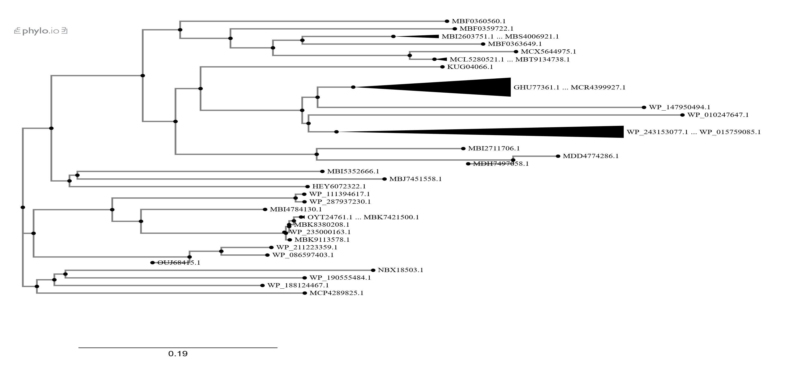

# S27

- **Avtor**: Nina Cankar
- **Datum izdelave**: 2024-05-17
- **Koda seminarja**: S27

---
## Vhodni podatek

Povezava do datoteke z vhodnim podatkom: [S27](naloge/s27-input.md)

---
## Rezultati analiz
###Ime in izvorni organizem
**ime**: hipotetični protein ASZ90_018512, predlagano ime copper amine oxidase-like N-terminal domain-containing protein

**izvor**: hydrocarbon metagenomes (ekološki metagenomi)

Del podanega plazmida, ki ni že v osnovi del vektorja pUC57, zapisuje za hipotetični protein ASZ90_018512, ki ga pod tem imenom najdemo v zbirkah Genbank(pod kodo [KUG04066.1](https://www.ncbi.nlm.nih.gov/protein/KUG04066.1?report=genbank&log$=prottop&blast_rank=1&RID=4DZ67GBD013)) in Uniprot (pod kodo [A0A0W8E627](https://www.uniprot.org/uniprotkb/A0A0W8E627/entry)). Zapis ni pridobljen iz določenega organizma, ampak z analizo ekoloških metagenomov.

Na podlagi poravnav z drugimi proteini v zbirki non-redundant protein sequences z orodjem BLAST sem sklepala, da gre za bakterijski protein, ni pa mi uspelo enoznačno določiti izvornega organizma. Precej verjetno je, da gre za bakterijo iz razreda Clostridia, saj je protein z najvišjim ujemanjem (69,09 %) *Copper amine oxidase N-terminal domain-containing protein* iz bakterije *Desulfofarcimen acetoxidans*, med rezultati pa najdemo tudi več drugih hipotetičnih proteinov iz sorodnih bakterij. Lahko pa bi protein pripadal tudi bakteriji iz rodu *Deltaproteobacteria* ali *Oligoflexia*, saj je pri teh proteinih kljub nižjemu ujemanju E vrednost primerno nižja.

###Velikost proteina
**dolžina:** 662

Tako iz zapisa v zbirki Genbank kot Uniprot je razvidno, da je protein sestavljen iz 662 aminokislinskih ostankov.

###Lokalizacija in topologija
Z orodjem blastp nisem našla anotiranih proteinov s signifikantno podobnostjo glede na delež ujemanja, query cover in E vrednost. Pri iskanju sem pri podatkovnih zbirkah izbrala swissprot, saj ta vsebuje le anotirane proteine. Na podlagi rezultatov nisem uspela sklepati na lokacijo proteina v celici.

###Domenska zgradba
S pomočjo anotacij v zbirkah Genbank in Uniprot sem identificirala naslednje domene:
- Copper amine oxidase-like N-terminal domain (ak 46 - 138, anotirana v Uniprot in Genbank),
- uncharacterized conserved protein (ak 150 - 216, anotirana v Genbank),
- LGFP repeat-containing protein (ak 238 - 439, anotirana v Genbank),
- peptidaza C1 (ak 458 - 660, anotirana v Genbank).

Nato sem si protein ogledala še v Interpro, kjer sta označeni tudi domeni MORN4 repeat containing protein 4 (ak 154-227) in papainu podobna cisteinska peptidaza (ak 458-660), kar ustreza peptidazi C1.

###Postranslacijske modifikacije
Z orodjem blastp nisem našla anotiranih proteinov s signifikantno podobnostjo glede na delež ujemanja, query cover in E vrednost. Pri iskanju sem pri podatkovnih zbirkah izbrala swissprot, saj ta vsebuje le anotirane proteine. Na podlagi rezultatov nisem uspela sklepati na morebitne posttranslacijske modifikacije proteina.

###Funkcija proteina in substrat
Glede na anotirane domene je protein [papainska peptidaza](https://www.ncbi.nlm.nih.gov/Structure/cdd/cddsrv.cgi?uid=451520), ki spada med cisteinske peptidaze. Ker dodatnih podatkov ni, gre lahko za endo- ali eksopeptidazo, prav tako specifičen substrat ni znan. V zbirki Genbank je anotirano aktivno mesto, kot lahko vidimo na spodnji sliki pod razdelkom Site, in sicer gre za aminokisline 465, 472, 609 in 632.

###Sorodni proteini in filogenetsko drevo
Pri iskanju z aminokislinskim zaporedjem po zbirki non-redundant protein sequences z orodjem blastp sem našla same bakterijske proteine, od tega veliko večino hipotetičnih proteinov. Preostali vsebujejo bakrovo aminooksidazno ali tej podobno N-končno domeno. Med prvimi sto zadetki ni bilo anotiranih ali evkariontskih proteinov. Na podlagi prvih 50 rezultatov (glede na čim nižjo E vrednost) sem z orodjem Clustal Omega izdelala poravnavo celotnih zaporedij in podatke za vizualizacijo filogenetskega drevesa kopirala v orodje phylo.io za lažjo vizualizacijo.

[Zaporedja, uporabljena pri poravnavi](s27-zaporedja_filo_drevo_50.txt)

[Rezultat poravnave z orodjem Clustal Omega](s27-clustalo_poravnava.aln-clustal_num)

Glede na filogenetsko drevo je protein ASZ90_018512 najbolj soroden hipotetičnemu proteinu iz bakterije *Clostridia bacterium*, kar potrjuje eno od začetnih hipotez za izvorni organizem proteina. Enako evolucijsko oddaljeni so tudi hipotetični proteini iz vrst *Acetivibrio cellulolyticus*, *Sporotomaculum syntrophicum* in *Paenibacillus sp.*

###Ohranjenenost regij
Sorodni proteini v filogenetskem drevesu niso peptidaze, saj je sorodna predvsem N-končna domena, zato ni mogoče povezati funkcije proteina z ohranjenostjo aminokislinskih ostankov v aktivnem mestu.

[Poravnava Clustal Omega, uporabljena za weblogo](s27-clustalo_poravnava_fasta_format.fa)

Vizualizacija poravnave (orodje Clustal Omega) z weblogo ne da posebnih rezultatov - vidimo lahko ohranjenost aminokislinskih ostankov, vendar ne v aktivnem mestu.

###Podobni evkariontski in prokariontski proteini
Z iskanjem po blastp s filtrom Eukaryotae pri organizmih nisem našla evkariontskih proteinov s signifikantno podobnostjo. Največje ujemanje ima hipotetični protein ASZ90_018512 s hipotetičnim proteinom [EHS25_002249](https://www.ncbi.nlm.nih.gov/protein/RSH89698.1?report=genbank&log$=prottop&blast_rank=1&RID=50W49CF8016) iz kvasovke Saitozyma podzolica, a to nima signifikantnega pomena (gre za 50% ujemanje z le 30% query cover in visoko E vrednostjo).

Podobni prokariontski proteini so bakterijski hipotetični proteini iz razreda Clostridia (WP_015759085.1) ter rodov Deltaproteobacteria (MBI2603751.1) in  Oligoflexia (MBF0360560.1), kar lahko vidimo že iz iskanj po blastp, iz katerih sem sklepala na potencialni izvorni organizem.

###Povezava funkcije z drugimi proteini in interakcije
Hipotetični protein ASZ90_018512 je peptidaza, vendar njeni substrati niso znani. Zaradi pomanjkanja anotacij pri tem in sorodnih proteinih nisem mogla sklepati na morebitne interakcije z drugimi proteini. Sklepamo lahko edino, da kot cisteinska peptidaza cepi oziroma razgrajuje zaenkrat še neznane proteinske substrate.

###Model strukture
Z orodjem AlphaFold3 sem izdelala model strukture proteina ter ga vizualizirala v ChimeriX. Na spodnjih slikah je prikazana le ena od možnih konformacij proteina (ena od petih cif datotek, ki so rezultat predikcije strukture z orodjem AlphaFold).

Zgornja slika prikazuje eno od predpostavljenih struktur hipotetičnega proteina, pobarvano glede na potek polipeptidne verige. Na drugi sliki pa je ista struktura pobarvana po B faktorju, ki v predvidenih strukturah v resnici predstavlja pLDDT. Tako lahko vidimo zanesljivost napovedi strukture v posameznih delih proteina. Ta je v glavnem precej nizka, saj niso znani zelo podobni ali sorodni proteini z eksperimentalno določeno strukturo. 