# S28

- **Avtor**: Jasna Čarman
- **Datum izdelave**: 2024-05-17
- **Koda seminarja**: S28

---
# Vhodni podatek

Povezava do datoteke z vhodnim podatkom: [S28](naloge/s28-input.md)

---
# Rezultati analiz

## IME, VELIKOST IN IZVORNI ORGANIZEM PROTEINA

**ime**: hipotetični protein ASZ90_018747, hidrolaza iz HAD naddružine (GenBank: KUG03850, UniProt: A0A0W8E5A1)

**velikost**: 274 aminokislinskih ostankov

**izvorni organizem**: ogljikovodični metagenom (hydrocarbon metagenome), podobne proteine - fosfataze najdemo v bakteriji *Escherichia coli* in v organizmu *Thermotoga maritima*

### Potek analize:
Nukleotidno zaporedje plazmidnega konstrukta, ki je dolgo 3558 nukleotidov, sem razdelila na 10 krajših fragmentov. Za vsak fragment posebej sem nato s spletnim orodjem BlastX poiskala proteine s podobnimi nukleotidnimi zaporedji. Ker se raziskovalna skupina ukvarja z metagenomiko, sem podobne proteine iskala po zbirki *Metagenomic proteins(env_nr)*. Med najdenimi podobnimi proteini, sem v več regijah našla neimenovane proteinske produkte iz metagenomov morskih sedmentov. Nekatere regije so pokazale podobnost s proteinom betalaktamazo, ki omogoča odpornost na antibiotike. Zapis za ta protein je primarno del klonirnega vektorja pUC57, zato ga nisem obravnavala kot vključek. Nekje v sredini zapisa za plazmidni konstrukt pa najdemo visoko (100,00 %) identičnost in daljši odsek ujemajočega se zaporedja (99 %).

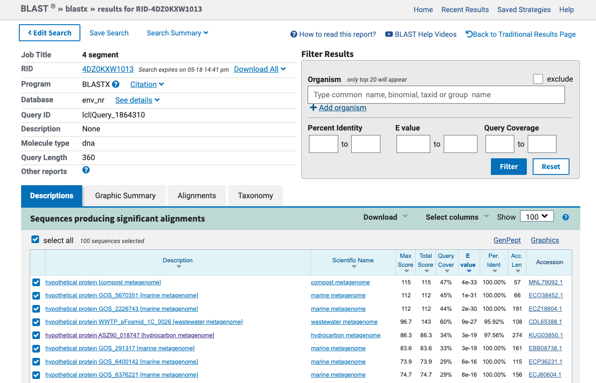

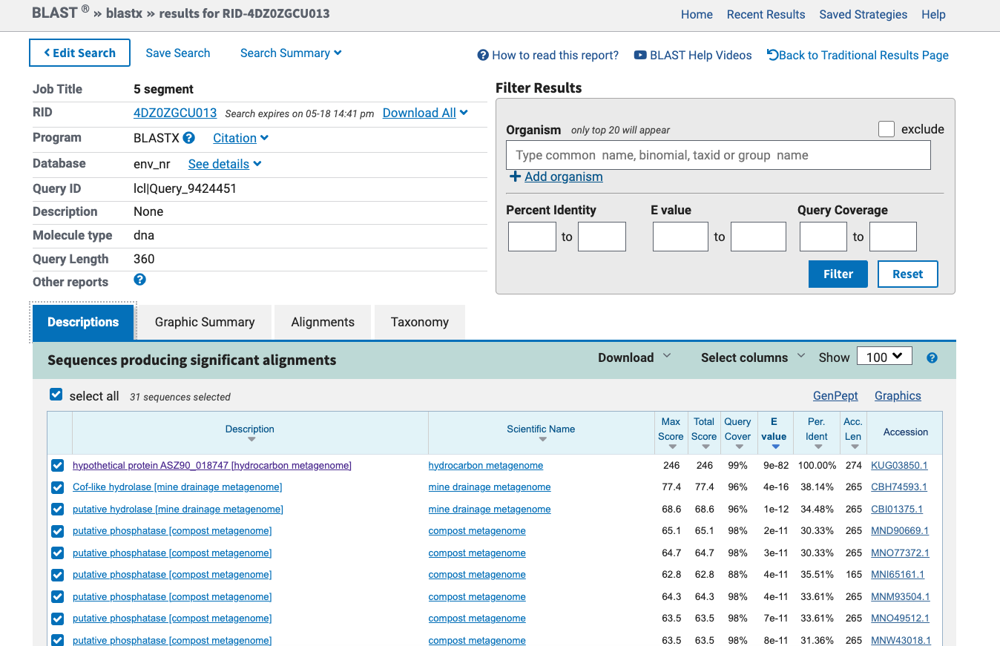

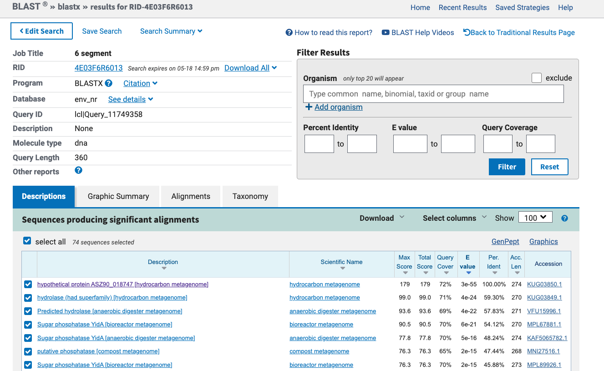

Ta fragment plazmidnega konstrukta se ujema z zapisom za hipotetični protein ASZ90_018747, ki je del ogljikovodičnega metagenoma, ki so ga izolirali iz jarka, onesnaženega z ogljikovodiki. Na GenBanku preberemo, da se podobni proteini nahajajo v bakteriji *Escherichia coli* (protein Cof) in v organizmu *Thermotoga maritima* (protein TM0651). Iz podatkov v GenBanku pa preberemo še, da je protein dolg 274 aminokislinskih ostankov.

---
## LOKALIZACIJA

**lokacija**: citosol (predvidena lokacija glede na nahajanje podobnih proteinov)

### Potek analize:
Informacije o proteinih, kot je lokacija proteina v celici, se navadno nahajajo v zbirki UniProt. Vendar pa ima hipotetični protein ASZ90_018747 v tej zbirki zelo malo anotacij. Informacijo o tem, kje v celici se nahaja, lahko dobimo le tako, da ugotovimo, kje se nahajajo podobni proteini. Nekaj podobnih proteinov najdemo že v UniProt na dnu zapisa (50 % identičnost), vendar so tudi anotacije teh proteinov tako pomanjkljive, da moramo poiskati podobne proteine z anotiranimi zapisi v Uniprot.

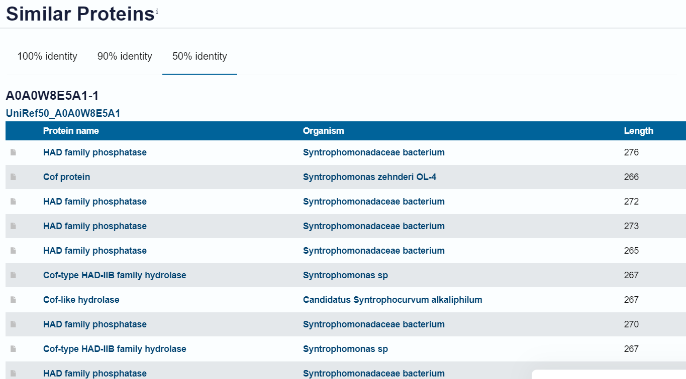

Za to iskanje uporabimo orodje BlastP. Iščemo torej aminokislinska zaoredja, ki so podobna hipotetičnemu proteinu ASZ90_018747. Iz zbirke UniProt prenesemo aminokislinsko zaporedje preiskovanega proteina v fasta formatu v orodje BlastP. Preden zaženemo iskanje, nastavimo iskanje po zbirki UniProtKB/Swiss-Prot, ki vsebuje le pregledane, bolje anotirane zapise.

Kot rezultat dobimo več proteinov, s sicer manjšim deležem identičnosti, ki pa imajo v zbirki UniProt zapisano lokacijo nahajanja v celici (večina ima zapis za lokacijo, ne pa vsi). Ko s pomočjo zbirke UniProt pregledamo nekaj zadetkov, ugotovimo, da se večina teh proteinov nahaja v citosolu celice. Iz tega lahko sklepamo, da se bo tudi raziskovani protein, ki je tem podoben, nahajal v citosolu.

---
## ZGRADBA PROTEINA, FUNKCIJE IN OHRANJENOST REGIJ

**domenska zgradba**: HAD Pase domena, ki spada v družino HAD podobnih hidrolaz oziroma med halogenokislinski dehalogenazi podobnih hidrolaz; domena je fosfatazna, podobna Cof proteinu bakterije *Escherichia coli* in proteinu TM0651 iz organizma *Thermotoga maritima*

**funkcija encima, kofaktor in substrat**: defosforilacija (protein je fosfataza), je hidrolaza, ker za odcep fosfatne skupine porabi molekulo vode, kofaktor: magnezijev kation, substrat: najverjetneje sladkorni fosfat (glede na podobne proteine, ki so bolje anotirni)

**aktivno mesto in vezavna mesta za substrat in kofaktor**:
(s številkami so označeni aminokislinski ostanki na Cof proteinu):

- aktivno mesto: D9
- vezavno mesto z substrat: T43, G44, K197, N223
- vezavno mesto za magnezijev kation: D9, D11, D220

Na hipotetičnem proteinu ASZ90_018747 so ti aminokislinski ostanki ohranjeni, kar potrjuje poravnava zaporedja hipotetičnega proteina ASZ90_018747 in proteina Cof iz bakterije *Escherichia coli*.

**ohranjenost regij**: Iz poravnave zaporedja hipotetičnega proteina ASZ90_018747 s konsenznim zaporedjem tovrstne domene v podobnih proteinih ugotovimo, da so ohranjeni aminokislinski ostanki, ki so odgovorni za vezavo substrata in kofaktorja pri podobnem proteinu Cof bakterije *Escherichia coli*.

Na mestih 40 in 42 v konsenznem zaporedju sta ohranjena dva aspartatna aminokislinska ostanka. Ohranjena sta tudi treonin in glicin na mestih 74 in 75. Na 250. mestu konsenznega zaporedja je ohranjen lizinski aminokislinski ostanek. Na mestu 274 v konsenznem zaporedju je ohranjen še en aspartatni aminokislinski ostanek in za tem na mestu 277 še asparaginski. Vsi ti aminokislinski ostanki se nahajajo v aktivnem mestu dobro anotiranega proteina Cof bakterije *Escherichia coli* in so glede na poravnavo tega proteina s preiskovanim proteinom ohranjeni tudi v preiskovanem proteinu ASZ90_018747.

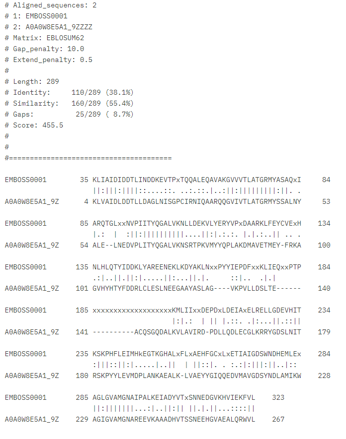

Manj ohranjene regije so na začetne neurejene regije in vmesne regije, ki glede na strukturo preiskovanega proteina sestavljajo zanke in neurejene regije na zunanjosti proteina. Primer take regije  je regija med ostanki 15 do 30 (ostanki proteina) oziroma 46 do 61 v konsenznem zaporedju, regija med ostanki 74 in 102 oziroma 107 do 136 v konsenznem zaporedju.

Opomba: V konsenznem zaporedju je več manj ohranjenih regij, a se te pri preiskovanem proteinu ne pojavljajo. Na teh mestih bi lahko v preteklosti prišlo do delecije in so se izgubila. Manj ohranjena mesta se torej nanašajo na regije, ki so prisotne v preiskovanem proteinu.

### Potek analize:
Informacije o domenski zgradbi proteina lahko najdemo v zbirki UniProt, kjer se nahaja povezava do zbirke InterPro, ki skrbi za analizo in klasifikacijo proteinskih domen. Tu ugotovimo, da je protein verjetno hidrolaza iz HAD naddružine in družine Cof. Ugotovimo tudi, da je zgrajen iz ene same večje domene HAD Pase.

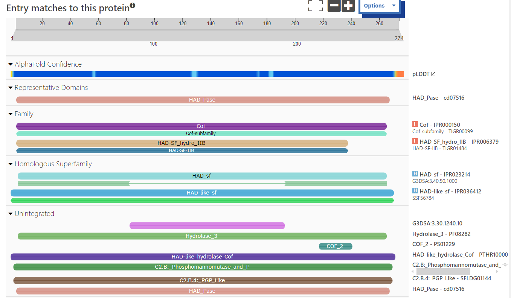

Ta domena pa je podobna Cof proteinu bakterije *Escherichia coli* in proteinu TM0651 iz organizma *Thermotoga maritima* ter spada med halogenokislinski dehalogenazi podobne hidrolze. Poleg tega pa je zapisano tudi, da gre za fosfatazo.

Da bi ugotovili še funkcijo proteina, moramo ponovno uporabiti informacije o sorodnih proteinih. Iz identifikacije domene vemo, da gre verjetno za fosfatazo. Kot kofaktor encim verjetno uprablja magnezijev kation, saj je ta v UniProtu zapisan kot kofaktor več podobnih proteinov. Substrat tovrstnih encimov pa je navadno sladkorni fosfat, kar prav tako razberemo iz zapisa na InterPro.

Če protein poravnamo s Cof proteinom iz bakterije *Escherichia coli* (postopek poravnave v naslednjem poglavju), ugotovimo, da so ohranjena vsa (razen enega) vezavnega mesta za substrat in kofaktor magnezijev kation, ohranjeno pa je tudi aktivno mesto. Seveda pa je pomembno tudi dejstvo, da zgolj s primerjavo z enim proteinom, ne moremo potrditi, da so ta mesta v preiskovanem proteinu dejansko vezavna mesta oziroma aktivno mesto.

Nazadnje sem določala še ohranjenost regij v tem proteinu. Da bi to ugotovila, sem primerjala, kateri aminokislinski ostanki so ohranjeni pri podobnih proteinih, ki imajo enako domeno kot hipotetični protein ASZ90_018747. Odločila sem se, da bom zaporedje hipotetičnega proteina ASZ90_018747 primerjala s konsenznim zaporedjem tovrstne domene. Z orodjem PsiBlast sem najprej poiskala več zaporedij, ki so podobna zaporedju hipotetičnega proteina ASZ90_018747. PsiBlast ustvari lastno matriko za iskanje zaporedij (glede na najdena podobna zaporedja). S tem lahko delno zagotovimo, da bodo imeli tudi proteini, ki jih program najde, podobna ohranjena mesta kot protein ASZ90_018747.

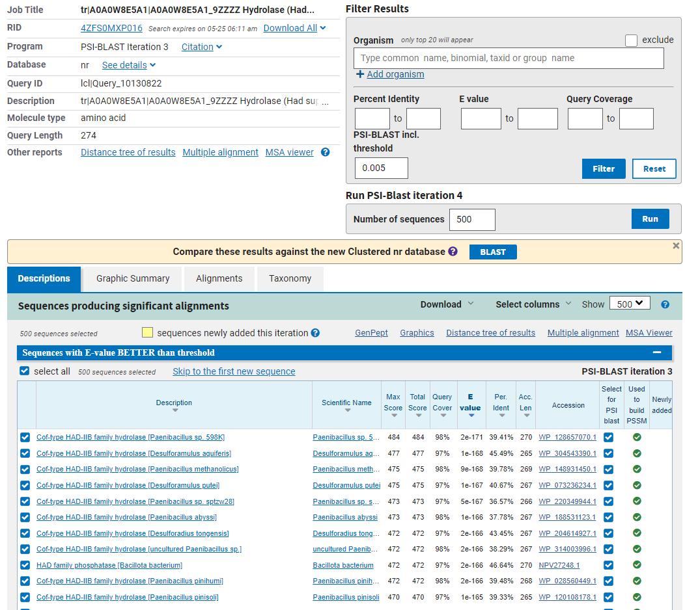

V PsiBlastu sem izvedla 3 iteracije, nato pa zaporedja najdenih proteinov prenesla v orodje Cobalt in tam naredila poravnavo večih zaporedij.

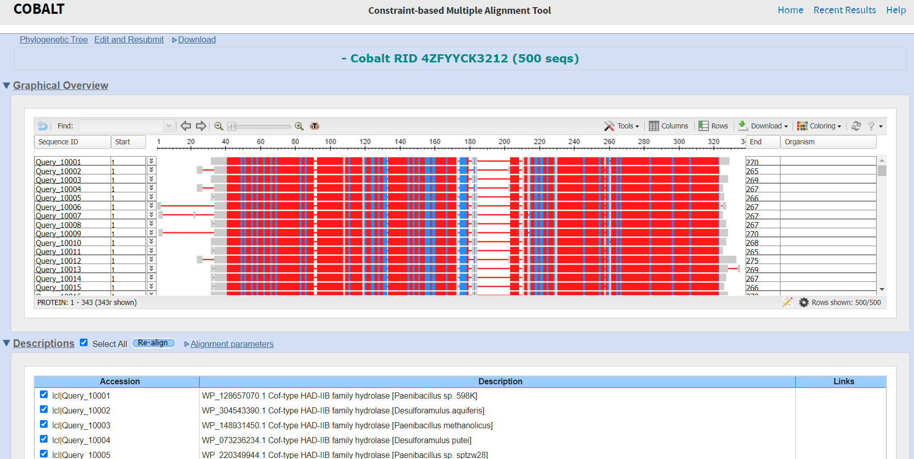

To poravnavo sem nato uporabila za izdelavo logotipa sekvenc, za kar sem uporabila orodje WebLogo. Ohranjenost regij in ostankov v teh podobnih proteinih pa sem nato želela direktno primerjati s hipotetičnim proteinom ASZ90_018747.

Iz poravnave, ki jo je izračunal program Cobalt, sem v orodje EMBOSS Cons prenesla datoteko fasta plus gaps, orodje pa je iz poravnave večih zaporedij ustvarilo konsenzno zaporedje.

To konsenzno zaporedje sem nato z EMBOSS Water poravnala z zaporedjem hipotetičnega proteina ASZ90_018747. In primerjala ohranjene regije. Ugotovila sem, da so dobro ohranjena prav mesta, za katere sem domnevala, da so aktivno in vezavna mesta.

---
## POST-TRANSLACIJSKE MODIFIKACIJE

**post-translacijske modifikacije**: niso bile najdene (tudi ne pri sorodnih proteinih)

### Potek analize:
V večini primerov proteini, ki so podobni hipotetičnemu proteinu ASZ90_018747 nimajo posebnih post-translacijskih modifikacij, ali pa te vsaj še niso raziskane in zapisane v zbirki UniProt. Med pregledovanjem teh podobnih proteinov sem pri nekaterih zasledila posamezen disulfidni mostiček (na primer pri proteinu TM0651 iz organizma *Thermotoga maritima*), a večina ni imela niti tega. Vseeno sem se odločila preveriti ohranjenost tega disulfidnega mostička. Poravnala sem protein ASZ90_018747 in proteinu TM0651 in ugotovila, da cisteina (C35 in C265 na TM0651) v proteinu ASZ90_018747 nista ohranjena. (prikaz poravnave - v naslednjem poglavju)

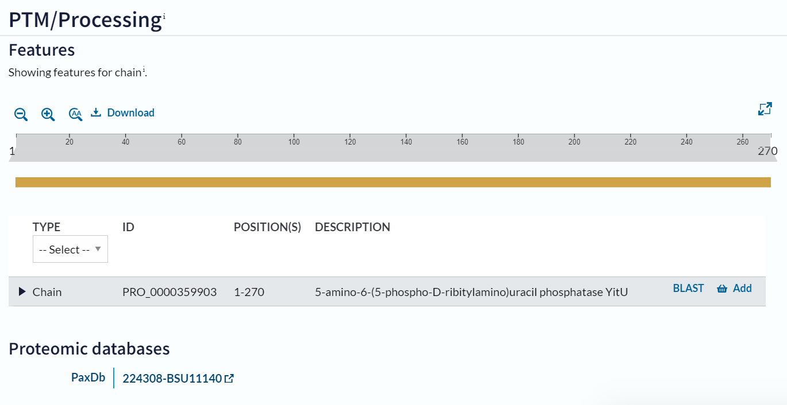

---
## SORODNI PROTEINI

**sorodni proteini**: protein iz družine HAD fosfataz iz *Syntrophomonadaceae bacterium* (največji odstotek identičnosti), Cof protein bakterije *Escherichia coli* in protein TM0651 iz organizma *Thermotoga maritima* (najbolj podobna pregledana proteina, verjetno podobna tudi funkcijsko, v GenBanku sta omenjena kot podobna proteina)

**poravnave s sorodnimi proteini**:

- poravnava s proteinom iz družine HAD fosfataz *Syntrophomonadaceae bacterium*:

- poravnava s Cof proteinom bakterije *Escherichia coli*:

- poravnava s proteinom TM0651 iz organizma *Thermotoga maritima*:

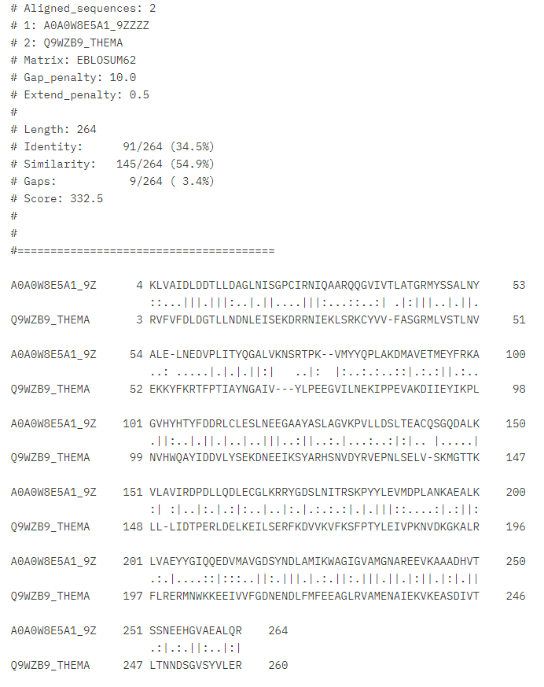

**filogenetsko drevo**:

Filogenetsko drevo prikazuje povezavo med proteini, ki so podobni hipotetičnemu proteinu ASZ90_018747. Protein, ki ga raziskujem je označen z velikimi tiskanimi črkami in je najbolj soroden proteinom iz družine HAD fosfataz.

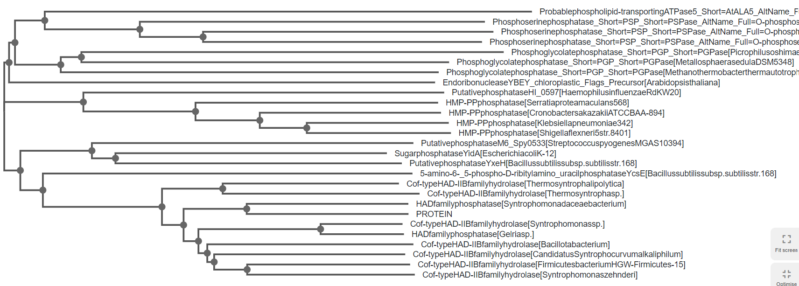

**podobni evkariontski proteini**:
- nekateri primeri: sladkorna fosfataza YidA iz žuželke *Culicoides impunctatus*, hipotetični protein BSKO_11483 iz rodu zelenih alg *Bryopsis* in domnevna fosfataza M6_Spy0533 iz spužve *Geodia barretti*
- nekateri bolje anotirani primeri: predvidena fosfoserin fosfataza iz kvasovke *Schizosaccharomyces pombe*, fosfolipid transportna ATPaza dnf2 iz kvasovke *Schizosaccharomyces pombe*, fosfolipid transportna ATPaza iz črva *Caenorhabditis elegans*

### Potek analize:
Sorodne proteine sem našla s pomočjo orodja BlastP, v katerega sem vnesla zaporedje hipotetičnega proteina ASZ90_018747. Največji odstotek identičnosti (71,59 %) sem dobila pri proteinu HAD fosfatazne družine iz *Syntrophomonadaceae bacterium*.

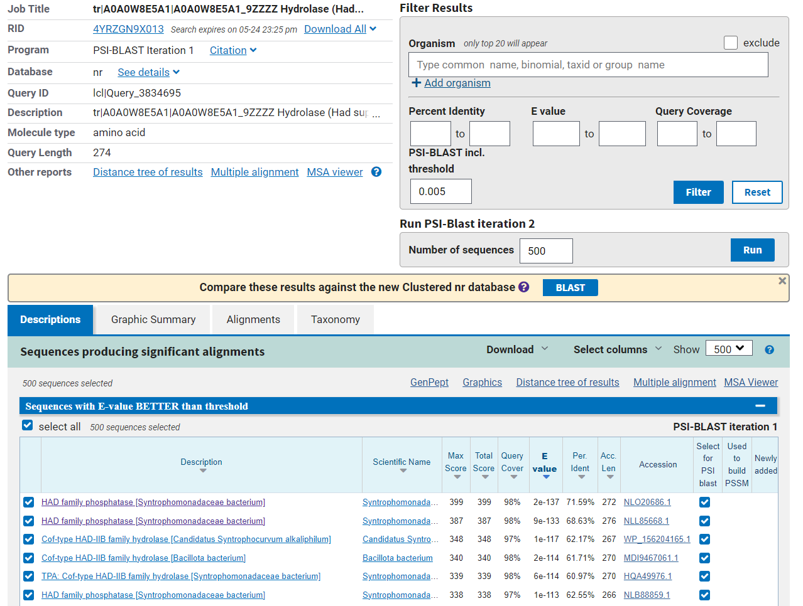

Podobne proteine, ki pa so v zbirkah pregledani in vsebujejo enako domeno, pa sem pri našla z orodjem BlastP, ko sem iskala po zbirki UniProtKB/Swiss-Prot, ki vsebuje le pregledane, dobro anotirane zapise. Kot podobne proteine je program našel več domnevnih fosfataz in protein YidA (Cof protein bakterije *Escherichia coli*).

Z orodjem EMBOSS Water lahko naredimo lokalno poravnavo zaporedij. Program je izračunal poravnave zaporedja preiskovanega proteina s proteinom Cof, proteinom TM0651 in s proteinom iz družine HAD fosfataz.

Z orodjem Clustal Omega sem izvedla poravnavo večih zaporedij. Pri tem sem uporabila zaporedja nekaj podobnih proteinov iz različnih organizmov v fasta formatu. Vključila sem tako najbolj podobne proteine, kot tudi tiste, ki so podobni in imajo hkrati pregledane zapise v UniProt.

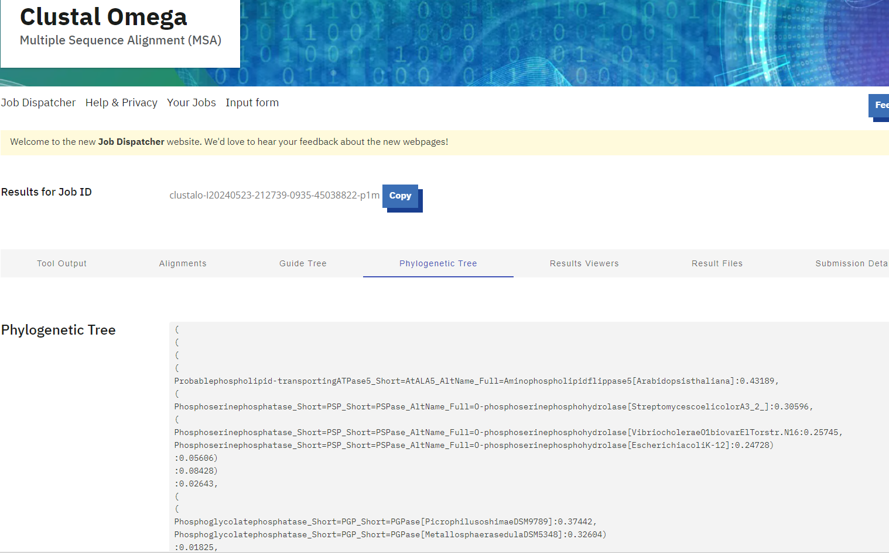

Iz rezultatov poravnave sem prenesla podatke za izris filogenetskega drevesa v orodje beta.phylo.io, ki je izrisalo filogenetsko drevo. Kot najbolj podoben oziroma najbolj soroden se je izkazal protein iz družine HAD fosfataz.

Da bi našla podobne evkariontske proteine, sem ponovno uporabila BlastP. Podobno kot prej, sem vnesla aminokislinsko zaporedje hipotetičnega proteina ASZ90_018747, le da sem tokrat nastavila iskanje med evkariontskimi proteini (organism: *Eucaryotes* (taxid:2759)).

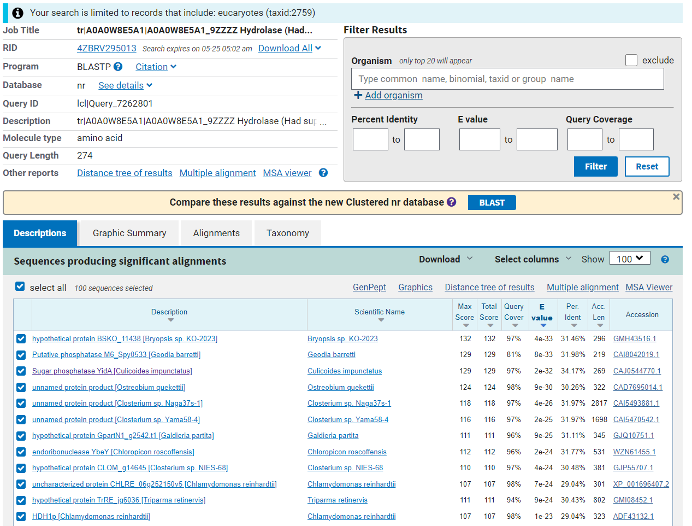

Za najbolj podobne evkariontske proteine so se izkazali sladkorna fosfataza YidA iz žuželke *Culicoides impunctatus*, hipotetični protein BSKO_11483 iz rodu zelenih alg *Bryopsis* in domnevna fosfataza M6_Spy0533 iz spužve *Geodia barretti*.

Ker o teh proteinih ni veliko znanih informacij, sem analizo izvedla ponovno in tokrat med evkariontskimi proteini iskala tiste, ki imajo pregledane zapise (zbirka UniProtKB/Swiss-Prot). Pri tem sem prag nastavila na 100, sicer sem dobila le 1 rezultat.

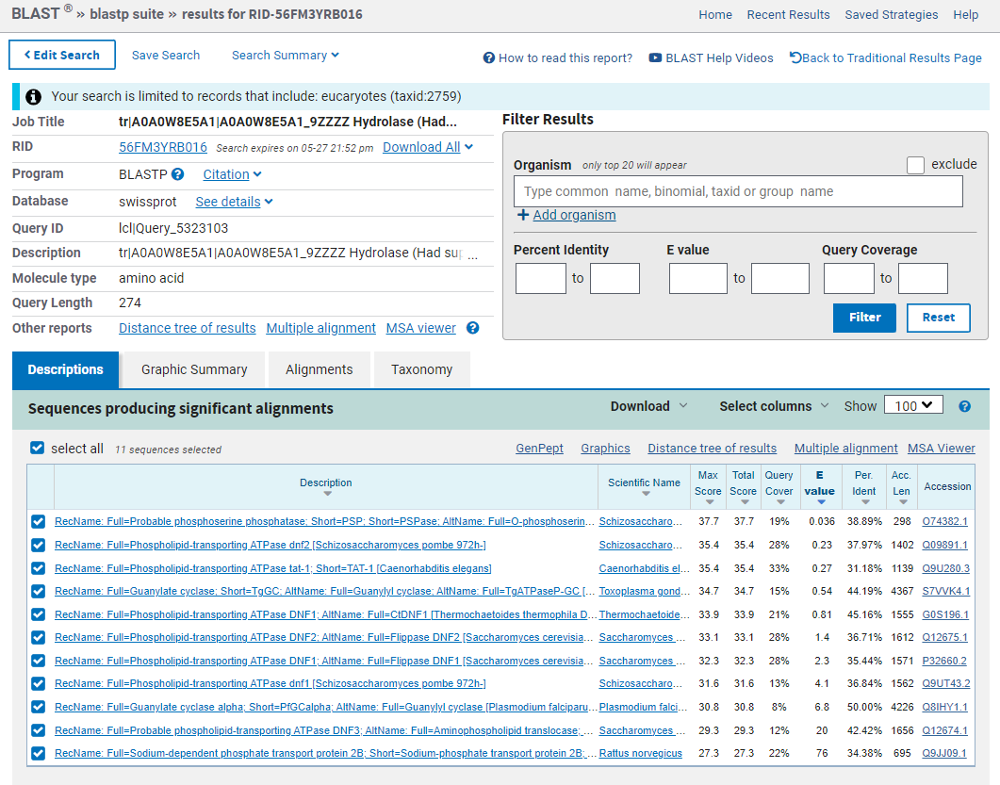

---
## INTERAKCIJE

**interakcije**: glede na interakcije podobnih proteinov in njegovo potencialno funkcijo verjetno tvori interakcije z drugimi encimi, ki sodelujejo v presnovi sladkorjev

### Potek analize:
Ker je protein ASZ90_018747 slabo anotiran in nima zapisov o interakcijah, sem si pri obravnavi interakcij pomagala z njemu najbolj podobnim anotiranim proteinom, ki pa je protein Cof iz bakterije *Escherichia coli*. Preko zbirke UniProt sem pri opisu njegovih interakcij našla povezavo do zbirke proteinskih in drugih interakcij med molekulemi BioGRID.

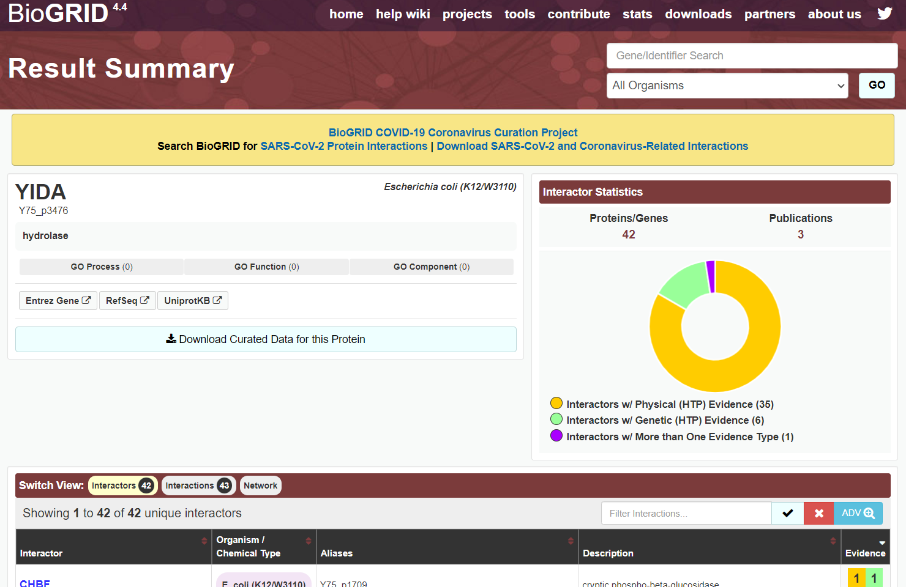

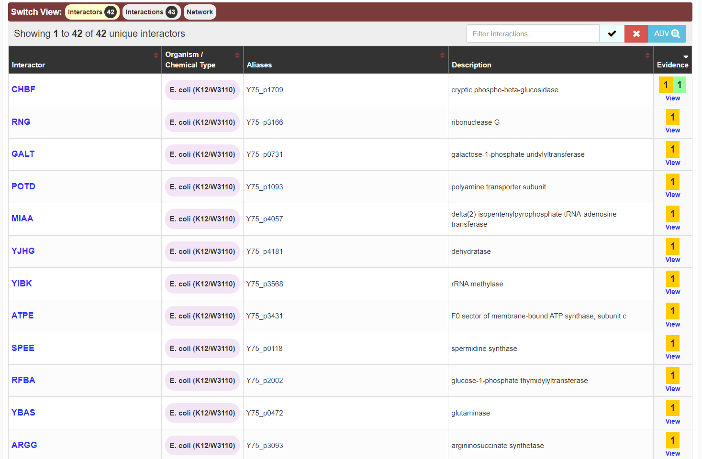

Ugotovila sem, da protein Cof v bakteriji *Escherichia coli* tvori interakcije s kriptično fosfobetaglukozidazo, ribonukleazo G, galaktoza-1-fosfat uridililtransferazo, s podenoto poliamin transporterja, dehidratazo, rRNA metilazo in več drugimi. Ker ima ta protein funkcijo defosforilacije sladkorja, sem predvidevala, da bi morda tudi preiskovani protein lahko imel to funkcijo in posledično interagiral s kakšnim drugim encimom, ki sodeluje v metabolizmu sladkorjev.

Podobni evkariontski proteini, ki imajo v zbirkah pripisane informacije o interakcijah z drugimi molekulami, imajo funkcije, ki so med drugim povezane s transportom fosfolipidov. Temu ustrezno so tudi njihove interakcije drugačne. Povezujejo se z drugimi kinazami in transporterji.

---
## MODEL STRUKTURE

**model strukture**:

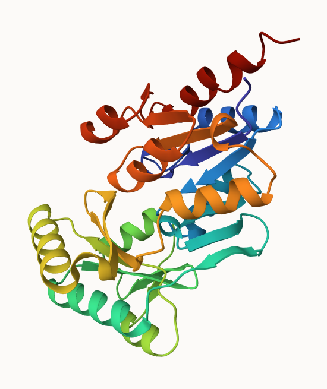

**model strukture s prikazanim aktivnim mestom**:
- rdeča: aktivno mesto
- vijolična: vezavna mesta za kofaktor magnezijev kation
- rumena: vezavna mesta za substrat

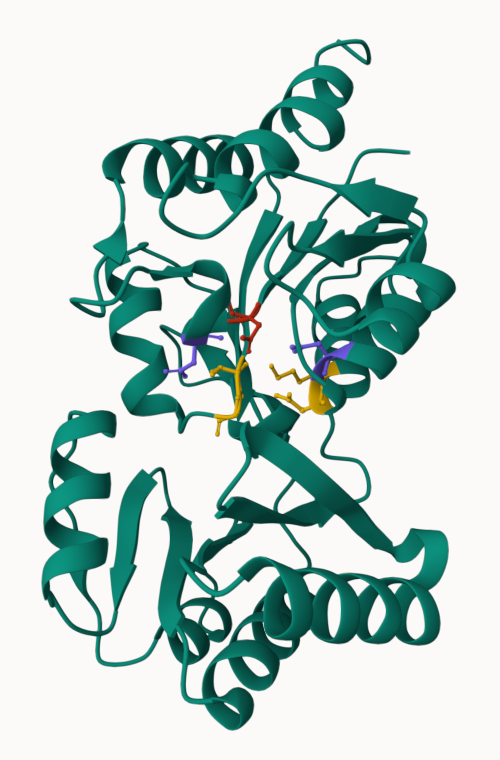

**superpozicija s podobnimi proteini**:

***superpozicija s proteinom Cof bakterije *Escherichia coli*:***
- vijolično: z X-žarkovno kristalografijo določen model strukture proteina Cof
- zeleno: AlphaFold model strukture hipotetičnega proteina ASZ90_018747

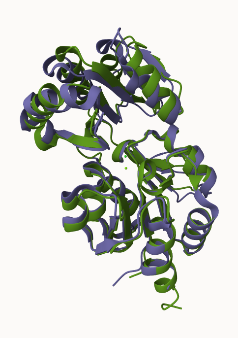

Modela struktur teh dveh proteinov se zelo dobro ujemata, iz česar lahko sklepamo, da imata podobno funkcijo (defosforilacija) in podobno aktivno mesto. Prav tako pa bi lahko imela proteina podoben substrat (sladkorni fosfat). Pri tem pa ne smemo pozabiti, da je struktura protein, ki ga preučujemo le računalniško napovedana in ne eksperimentalno potrjena.

***superpozicija s proteinom TM0651 iz organizma *Thermotoga maritima*:***
- rumeno: z X-žarkovno kristalografijo določen model strukture proteina TM0651
- zeleno: AlphaFold model strukture hipotetičnega proteina ASZ90_018747

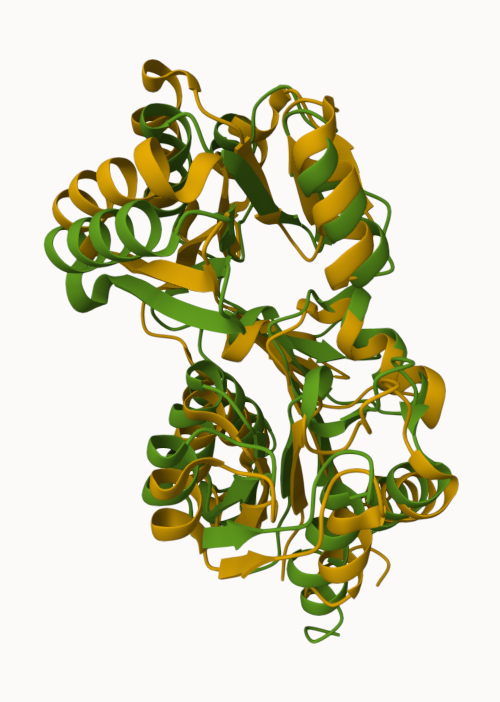

Proteina sta si sicer strukturno zelo podobna, a so ponekod nekatere zanke na drugačnih mestih. Proteina zavzemata nekoliko drugačno konformacijo in razdalje med posameznimi deli strukture so različne.

***superpozicija s proteinom BSKO_11438 iz rodu zelenih alg *Bryopsis*:***
- rumeno: AlphaFold model strukture hipotetičnega proteina BSKO_11438
- zeleno: AlphaFold model strukture hipotetičnega proteina ASZ90_018747

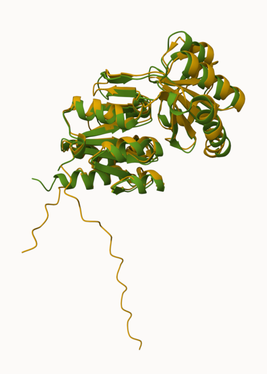

Strukturi proteinov sta si sicer podobni, vendar glede na to, da sta si proteina že v osnovi podobna (zato sem ju izbrala za superpozicijo) in glede na to, da sta oba modela struktur narejena s pomočjo orodja AlphaFold3, smo to lahko tudi že prej predvidevali. V modelih opazimo, da se sekundarne strukture precej ujemajo, morda so le nekoliko razmaknjene. Več razlik pa je v končnih neurejenih regijah.

### Potek analize:
Model strukture hipotetičnega proteina ASZ90_018747 ni eksperimentalno določen. Strukturo lahko predvidimo le z uporabo orodij kot je AlphaFold. Model strukture program AlphaFold3 izdela na podlagi aminokislinskega zaporedja proteina in že poznanih, eksperimentalno določenih modelov struktur.

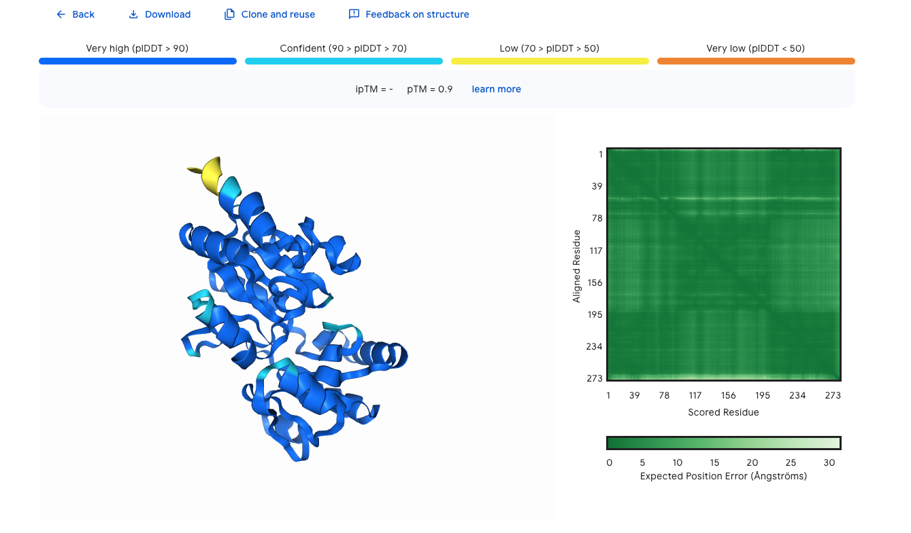

Sicer pa se z AlphaFoldom predviden model strukture nahaja že v zbirki UniProt.

Model strukture, ki ga je predvidil program AlphaFold3, sem prenesla in odprla v orodju MolStar Viewer. Tam sem protein obarvala glede na potek polipeptidne verige (N-->C), nato pa na njem označila še aktivno mesto, vezavna mesta za magnezijev kation in vezavna mesta za substrat.

Za poravnavo preiskovanega proteina s podobnimi proteini sem uporabila orodje MolStar Viewer, ki omogoča, da v programu odpremo več kot eno strukturo in ju nato z ukazom *superpose* strukturno poravnamo. Tovrstno poravnavo sem naredila z več podobnimi proteini, in sicer s TM0651, s proteinom Cof in še z evkariontskim hipotetičnim proteinom BSKO_11483 iz rodu zelenih alg *Bryopsis*. Strukturo za ta protein sem morala določiti z uporabo programa AlphaFold3, ker nisem našla dovolj podobnega proteina, ki bi imel eksperimentalno določeno strukturo.