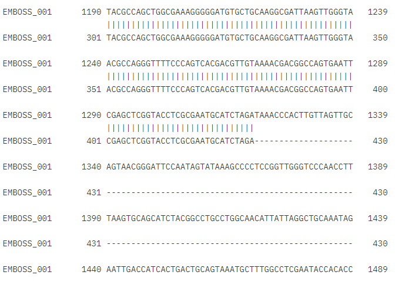
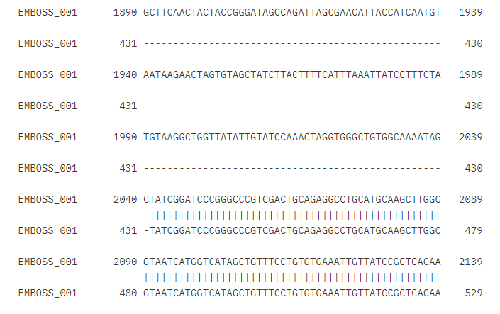
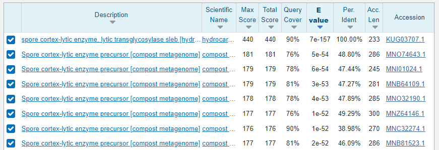
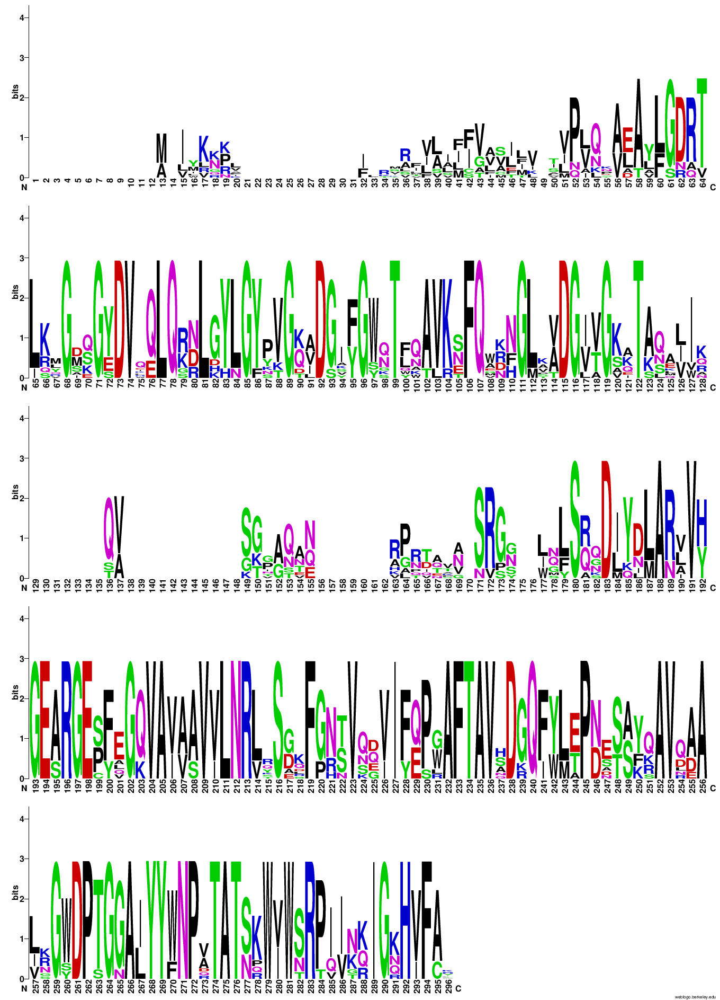
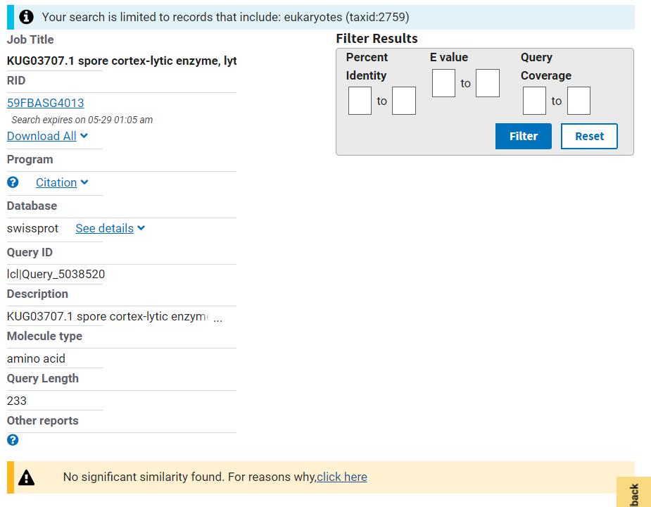
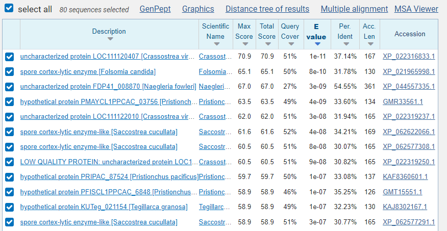
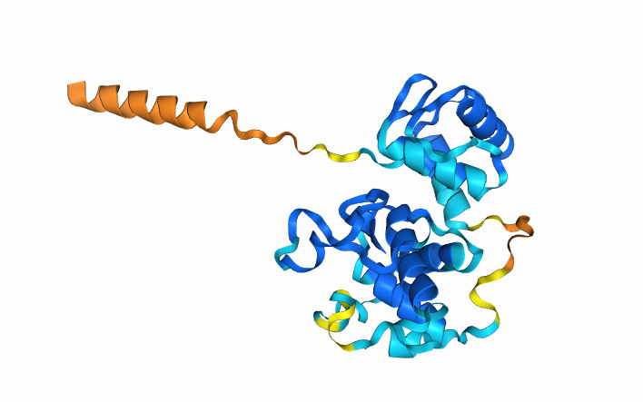

# S29

- **Avtor**: Blaž Čerenak
- **Datum izdelave**: 2024-05-27
- **Koda seminarja**: S29

---
## Vhodni podatek

Povezava do datoteke z vhodnim podatkom: [S29](naloge/s29-input.md)

---
## Rezultati analiz

### Iskanje in značilnosti

#### Iskanje vstavljenega fragmenta

Z uporabo orodja EMBOSS Water sem primerjal dano zaporedje (torej zaporedje plazmida pUC57 z vstavljenim fragmentom) z zaporedjem plazmida pUC57. Spodaj sta prikazani sliki, kjer je jasno viden začetek in tudi konec vstavljenega fragmenta, ki sem ga kasneje uporabil za nadaljno analizo.

Prikazani začetni del vstavljenega fragmenta:

Ter prikazan še končni del vstavljenega fragmenta:

#### Iskanje proteina z blastx

Fragment zaporedja sem z orodjem blastx iskal po bazi, da bi našel ustrezen protein za ta fragment. Pri database sem izbral metagenonim proteins. Del rezultatov, ki se je najbolje ujemal, je prikazan tudi na spodnji sliki. Dobil sem 100 % ujemanje za spore cortex-lytic encim. Dolžina zapisa je bila 233 aminokislinskih ostankov.

#### Iskanje z blastx po non-redundant bazi

Ker z blastx nisem našel vseh podatkov za iskani protein, sem zaporedja ponovno vstavil v blastx, le da sem sedaj iskal po bazi non-redundant. Največje ujemanje sem dobil za zapis za protein TPA: spore cortex-lytic enzyme [*Syntrophomonas sp.*].  Tukaj je bilo razvidno, da je zapis za protein iz *Syntrophomonas sp*, dolžina zaporedja pa je 249 aminokislinskih ostankov.

#### Podobni proteini v UniProtu

Ker za zgoraj napisani protein nisem našel dobre anotacije sem v UniProtu poiskal podobne proteine iz ostalih organizmov, s katerimi sem lahko predvideval na podobno (oziroma enako) funkcijo kot za svoje zaporedje.

Dobro anotirano zaporedje sem našel za spore cortex-lytic encim iz organizma *Baccilus cereus* - [Uniprot povezava](https://www.uniprot.org/uniprotkb/P0A3V1/entry). Tukaj je razvidno, da gre verjetno za N-acetilmuramil-L-alanin amidazo, ki je potrebna pri hidrolizi korteksa spore. Izrazi se v prekurzorju spore (*angl. forespore*), nato pa preide notranjo membrano in se tam tudi potem nahaja.

Protein nima post-translacijskih modifikacij.

#### Domenska zgradba proteina

Zaporedje v fasta formatu prvotnega zaporedja sem obdelal z orodjem InterPro, ki je prikazal spodaj predstavljeno domensko zgradbo.

### Primerjave

#### Primerjava s podobnimi proteini in filogenetsko drevo

Z uporabo psi-blasta sem izbral zapise za protein, ki so bili najbolj podobni našemu (oziroma najbolj podobni aminokislinskemu zaporedju proteina *Syntrophomonasa sp.*). Z uporabo ClustalOmega in Phylo.io sem primerjal in ustvaril zapise za 10 proteinov iz različnih organizmov.

Zaporedja, ki so bila uporabljena za filogenetsko drevo sem uporabil tudi pri izdelavi WebLoga, vendar bi iz njega težko sklepal na skupne dele zaporedij. V sredini je edino vidno, da so si zaporedja med seboj različna in da tam ni velike podobnosti.

#### Primerjava z evkariontskimi organizmi

V blastp sem prilepil fasta zaporedje aminokislinskega zaporedja vključka in iskal po bazi Swissprot ter kot pogoj dal, da je organizem evkariont. Rezultati niso prikazali podobnega proteina pri evkariontih.

Poleg Swissprott baze sem iskal tudi v non-redundant bazi, vendar so bila vsa zelo nizka, zato sem zaključil, da proteina, za katerega bi lahko dejali, da je podoben našemu, pri evkariontih ni.

### Struktura proteina

Zaporedje vključka sem vstavil tudi v AlphaFold3, ki je predvidel spodaj prikazano strukturo:

Iz barv je razvidno, da je najmanjša zanesljivost na začetku N' konca, ostali deli strukture pa so kar zanesljivi.

