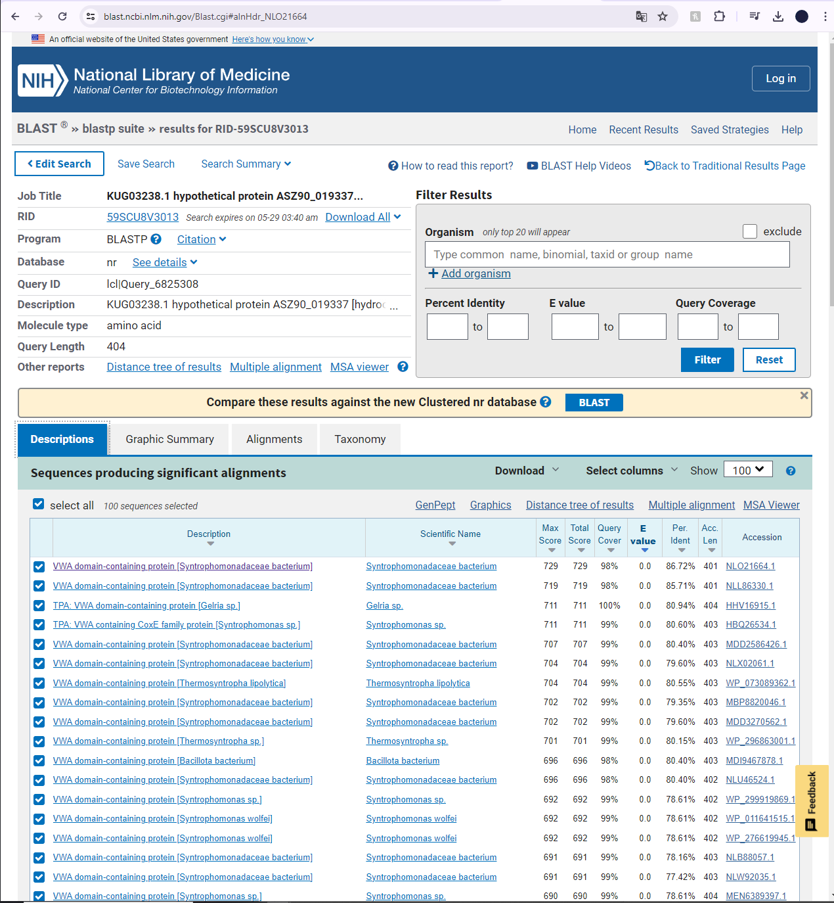
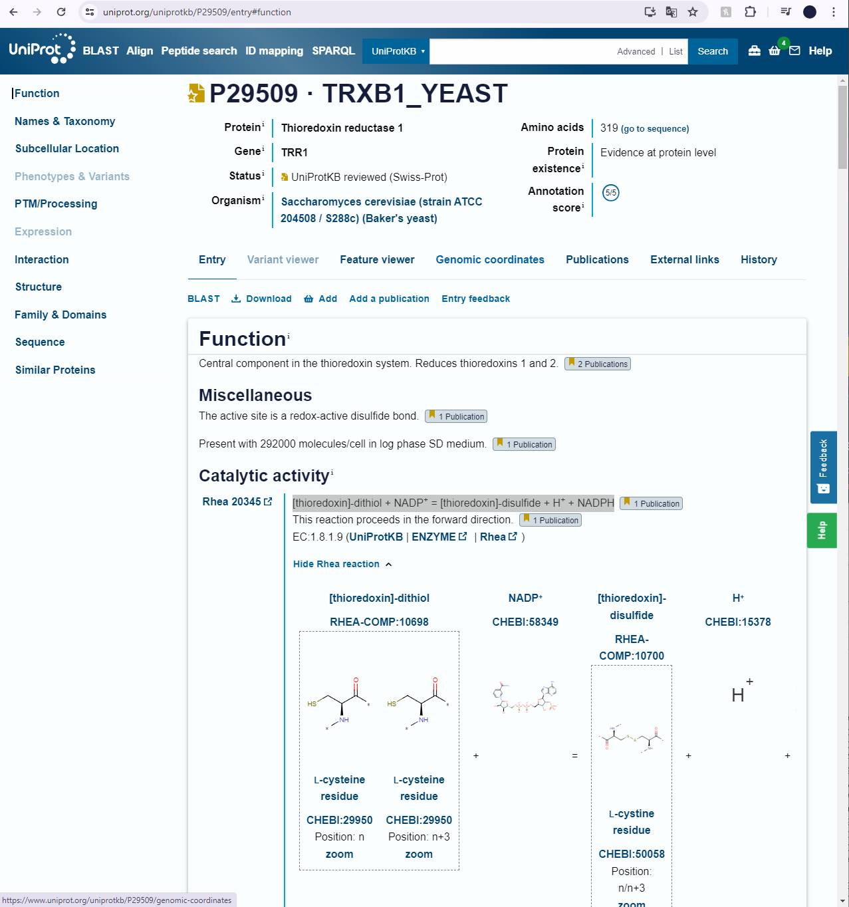
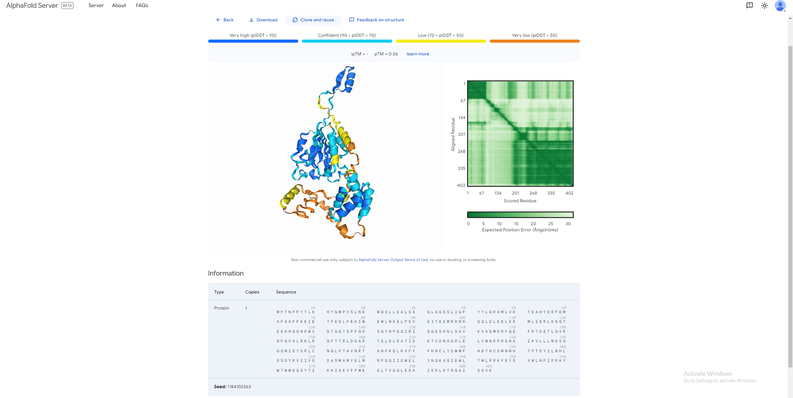
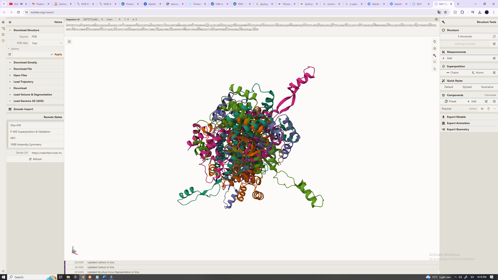

# S30

- **Avtor**: Maj Dular
- **Datum izdelave**: 25.5.2024
- **Koda seminarja**: S30

---
## Vhodni podatek

Povezava do datoteke z vhodnim podatkom: [S30](naloge/s30-input.md)
---
## Rezultati analiz

### Identifikacija
Identicikacijo sem naredil z uporabo NCBI Blast, blastx (metagenomska zbirka) in sicer tako, da sem poravnav, da se obe nukleotidni zaporedji zacnejo na enakem mestu, jih poravnal, in dal del zaporedja, ki ni bil del vektorja, v blastx.
Dobil sem zadetek z 100% identičnostjo, zato sklepam, da je to moj protein. Identificiran protein se nahaja v ogljikovodikovem metagenomu, ki so ga vzeli iz biološkega vzorca SAMN04260313, dolg je 404 aminokislin

**Protein**: Thioredoxin reduktaza
>KUG03238.1 hypothetical protein ASZ90_019337 [hydrocarbon metagenome]
MFTNFFYTLKHYGMPVSLNEWQSLLEALEAGLAGSSLIGFYYLGRAMLVKTEAHYDRFDMAFAAFFKEIE
TPEGLPEKIWEWLNKELPEVEITEEMRRNHQQLDLDELKRMLEERLKQQTEEHHGGNRWVGTGGTSPFGH
SGYHPGGIRIGGESRNLSAVKVAGMRRFQEFRTDETLGVRQFQVALRKLRQFTTRLDGARTELDLDATID
KTCDNAGRLELVWNRPRENAIKVLLLMDSGGSMISYSRLCNQLFTAVNRTAHFKDLKVFYFHNCLYDWMF
HDTHCSMNNHTPTDYILNHLSSDYRVIIVGDASMAMYELMRPGGIIDWELYNQKAGIEWLTMLRRKFEYS
VWLNPIPRKYWTWMDGSYTIKKIAEVFPMEELTVDGLERAIKRLKTRQAISAVK

Ko z BlastP iščem podobne proteine iz baze podatkov swissprot, mi ta vrže ven, da ni nobenih podobnih proteinov mojemu proteinu. Zato sem ponastavil "expected threshold" parameter iz 0.05 na 0.1 in dobil, da je najpodobnejši protein 86% identicen in dolg 401 AK:

>NLO21664.1 MAG: VWA domain-containing protein [Syntrophomonadaceae bacterium]
MFTNFFYTLKNYGLPVSLNEWQSLLEALEAGLAGSSLIGFYYLGRAMLVKTEAHYDRYDMAFAAFFKDIE
TPEGLPEKIWEWLNKELPELEVTDEMRRNHRQLDLDELKRMLDERLAEQNEEHHGGNRWVGTGGTSPFGH
SGYHPGGIRIGGMGRNHSAVKVAGMRRFQEFRTDETLGVRQFQVALRKLRQFTTRLDGARTELDLDATID
KTCDNAGRLELIWNRPRENAIKVLLLMDAGGSMVSYSRLCNQLFTAVNRANHFKDLKVFYFHNCIYDWLY
HEPQCNLNNYTPTEHILNTLSSDYRLIIVGDASMAIYELMRVGGVVDWDLYNDRPGIEWLNRLRRKFEYS
VWLNPVPKQYWTWTDGAYTINKISEVFPMEELTVDGLDRAIKSLKNRQAAM

Od podobnih proteinov ni niti 1 imel anotacije vec kot 1/5 na uniprotu.

**Protein**: VWA domain-containing protein

**Organizem**: Syntrophomonadaceae bacterium

###Funkcija

Za moj določen protein funkcija ni znana, prav tako tudi za proteine, ki so mu najbolj identicni, vendar glede na to, da gre za Tioredoxin reduktazo lahko sklepam iz drugih Tioreduxin reduktaz. Najbolj anotirana tioredoxin reduktaza za "anaerobe" je ta iz kvasovk. Ta jih ima v različnih organelih celice kot so mitohondrij, citoplazma.

>sp|P29509|TRXB1_YEAST Thioredoxin reductase 1 OS=Saccharomyces cerevisiae (strain ATCC 204508 / S288c) OX=559292 GN=TRR1 PE=1 SV=3
MVHNKVTIIGSGPAAHTAAIYLARAEIKPILYEGMMANGIAAGGQLTTTTEIENFPGFPD
GLTGSELMDRMREQSTKFGTEIITETVSKVDLSSKPFKLWTEFNEDAEPVTTDAIILATG
ASAKRMHLPGEETYWQKGISACAVCDGAVPIFRNKPLAVIGGGDSACEEAQFLTKYGSKV
FMLVRKDHLRASTIMQKRAEKNEKIEILYNTVALEAKGDGKLLNALRIKNTKKNEETDLP
VSGLFYAIGHTPATKIVAGQVDTDEAGYIKTVPGSSLTSVPGFFAAGDVQDSKYRQAITS
AGSGCMAALDAEKYLTSLE

**Protein**: Tioredoxin reduktaza 1

**Organizem**: Saccharomyces cerevisiae (strain ATCC 204508 / S288c) (Baker's yeast)

Protein je osrednja komponenta v sistemu tioredoksina. Reducira tioredoksine 1 in 2. Aktivno mesto je redoks-aktivna disulfidna vez. Katalizira reakcijo:[thioredoxin]-dithiol + NADP+ ---> [thioredoxin]-disulfide + H+ + NADPH
z FAD kot kofaktorjem.

**Alphafold**

Pri modeliranju z Alphafoldom ne vidimo kaj dosti, samo da je protein sestavljen iz 13 vijačnic, katerih obstoj večina sploh ni prepričljiva

Ko to datoteko prenesem v Molstar dobim pa še manj razvidno in uporabno sliko modela

