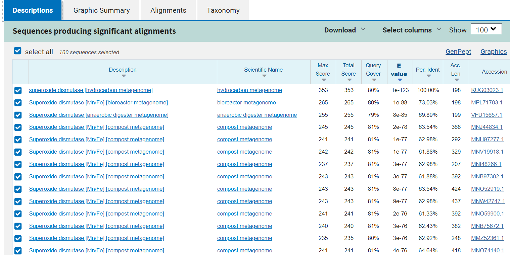
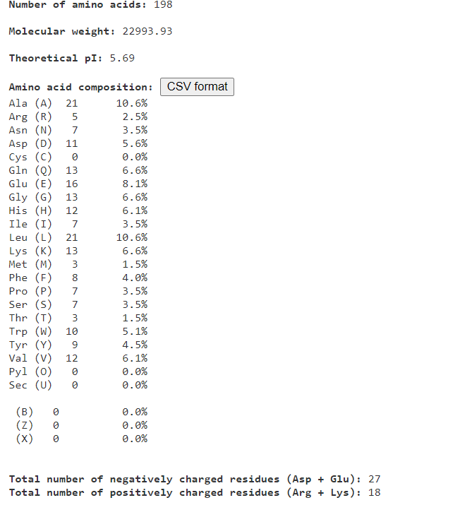
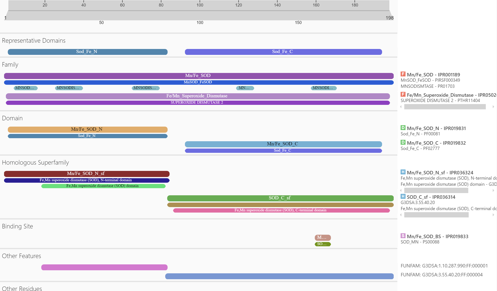
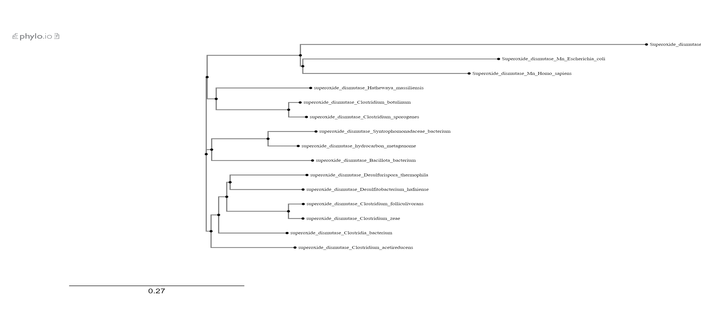
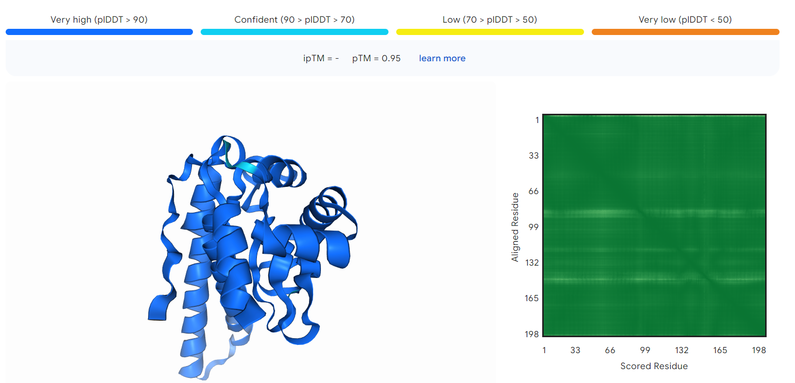
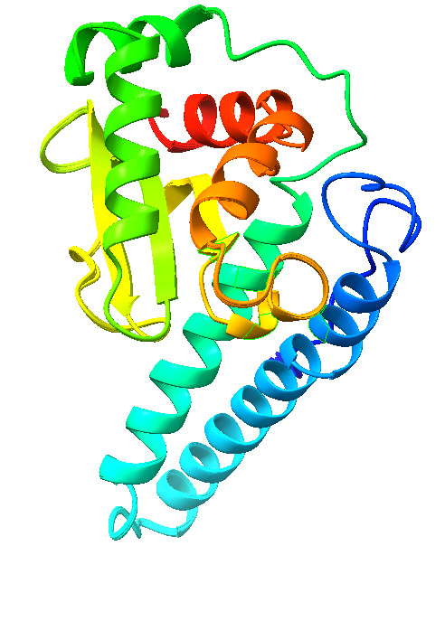
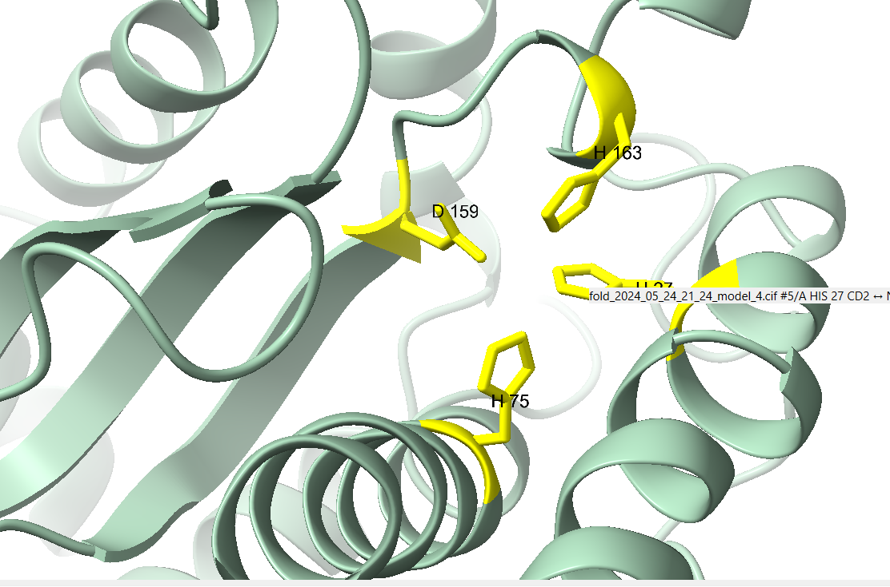
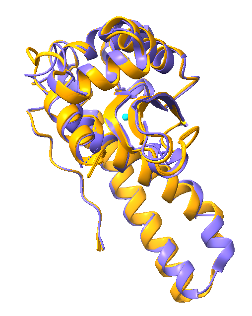

# S31

- **Avtor**: Mark Frantar 
- **Datum izdelave**: 2024-05-22
- **Koda seminarja**: S31

---
## Vhodni podatek
Povezava do datoteke z vhodnim podatkom: [S31](naloge/s31-input.md)

## Rezultati analiz

Najprej sem vhodni podatek (nukleotidno zaporedje) vstavil v blastn. Med rezultati sem izbral vektor s celotnim nukleotidni zaporedjem. Nato 
sem izvedel lokalno(water) poravnavo med vektorjem in mojim zaporedjem. Neporavnano regijo sem vnesel v blastx in iskal po metagenmoski bazi podatkov.
Protein, ki sem ga dobil se imenuje superoksid dismutaza(hydrocarbon metagenome), E vrednost je bila 7e-123, identičnost pa 100%. 
Izvorni organizem sem dobil iz Genbanka (koda: KUG03023.1) in sicer je zaporedje pridobljeno iz bakterije Syntrophomonas(družina Syntrophomonadaceae).
Po analizi aminokislinskega zaporedja v orodju ProtParam ter TMHMM sklepam, da protein ni membranski. Iz funkcije proteina, pa tud iz primerjave s človeškim
homologom, sklepam, da je protein mitohondrijski.
Protein je sestavljen iz 198 aminokislin, velik je ~23 kDa in ima teoretični pI pri 5,69.

Na post-translacijske modifikacije sem sklepal glede na to kakšne so te pri SOD-2 proteinih z anotiranimi PTM v Uniprot. pogledal sem si PTM pri mišjem, podganjem,človeškem in govejem proteinu SOD(Mn). Pri teh proteinih je prisotna odstranitev signalnega peptida (1-24), ter mnogi modificirani ostanki (predvsem N6 acetilizacija in N6-sukcinilizacija lizinov 68, 75, 114, 122 in 130)

Protein ima katalitsko funkcijo, uničuje za celico toksične radikale (superoksidne radikale),ki nastajajo v biokemijskih reakcijah. Primer reakcije je:2 H+ + 2 superoksida = H2O2 + O2
Superoksid dismutaze (SOD) so metaloencimi. Obstajajo 3 oblike, SOD-1, ki ima v aktivnem mestu baker in cink, ter SOD-2, ki ima mangan ali železo (ta tip SOD-2 se nahaja v mitohondrijih)SOD-3 pa je ekstracelularna in ima v aktivnem mestu tako kot SOD-1 Cu ali Zn.  Superoksid dismutaza v mojem primeru spada v skupino SOD-2, kar potrjuje, da se nahaja v mitohondriju. Vse SOD deluje po podobnem mehanizmu, in sicer se kovina v aktivnem mestu najprej reducira s prvim O2−, nato pa reoksidira z naslednjim O2−. Kovina v aktivnem mestu ima vlogo mediatorja, ki prenese elektron iz enega O2− na drugega, in se s tem izogne elektrostatsekmu odboju med njima.
Encimi tipa SOD-2 kažejo visoko podobnost zaporedja, kar podpira endosimbiontsko teorijo izvora mitohondrijev. Bakterijski encim je ponavadi homodimeren, medtem ko je mitohondrijski (evkariontski)encim homotetrameren. 

Domenska zgradba je kot že omenjeno zelo dobro ohranjena. Analiza v InterPro kaže, da so v proteinu mangan/železo N- in C-terminalni domeni ter mangan superoksid dismutazna alfa lasnična domena. 

Superoksid dismutaza je prisotna pri večini aerobov, medtem ko anaerobi uporabljajo drugačne mehanizme uničevanja superoksidnih radikalov. Poiskal sem podobne proteine pri evkariontih. Pričakovano sem kot rezultat dobil mangan superoksid dismutaze pri različnih evkariontih, procent identičnosti je med 40 do 60%.
Tako pri prokariontih kot evkariontih je superoksid dismutaza prisotna in njena funkcija je pri obeh enaka. Naredil sem tudi poravnavo nekaterih zaporedij iz bakterij, evkariontov in mojim zappredjem v Clustal Omega ter na phylo.io izrisal filogenetsko drevo. Iz slike je razvidno, da je izhodnemu proteinu najbolj sorodna SOD iz Syntrophomonadaceae bakterije, in pa tudi SOD iz Bacilloa bakterije. 

Za SOD-2 bakterij družine Syntrophomonadaceae nisem našel specifičnih interakcij z drugimi proteini, je pa ta encim ponavadi povezan s katalazo ali GSH peroksidazo, ki pretvorita vodikov peroksid, ki nastane pri dismutazi superoksida, v vodo in kisik. Interakcije človeške mitohondijske SOD-2 pa sem preveril na Biogridu, ki je našel 97 molekul, ki interagirajo! s tem proteininom.
Z drugimi evkariontskimi superoksid dismutazami ni večje sorodstvene povezave. 

Nazadnje sem aminokislinsko zaporedje proteina vstavil še v AlphaFold 3. .Razen nekaj manjših regij, kjer je zanesljivost(pLDDT-predvidena razlika lokalnih razdalj)med 70 in 90, je zanesljivost zelo visoka. Model sem prikazal v Chimerix.. Prikazal sem tudi vezavni žep, ki ga tvorijo H27,H75,H163 in D159.. Aminokisline v vezavnem mestu sem dobil iz superoksdne dismutaze Syntrophomonadaceae bakterije, preveril pa sem jih tudi s poravnovo s človeško Mn-SOD v Uniprotu. Nato sem prikazal še superpozicijo AlphaFold proteina z verigo A človeške Mn-SOD(pdb koda 7KLB). . Iz poravnave je razvidno, da sta proteina zelo podobna.

