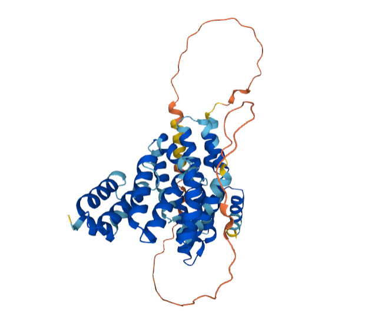

- **Avtor**: Katarina Gomiršek
- **Datum izdelave**: 2024-05-26
- **Koda seminarja**: S32

---
## Vhodni podatek

### Povezava do datoteke z vhodnim podatkom: [S32](naloge/s32-input.md)
---
# Rezultati analiz

Vhodno zaporedje sem vstavila v blastx in izbrala zbirko Metagenomic proteins. Nato sem izbrala prvi protein (98,79 % identičnost, vrednost E 0,0). Poskušala sem tudi z globalno poravnavo nukleotidnega zaporedja za vektor pUC57, ki sem ga poiskala na GenBank, in vhodnega podatka in nato izbrisala dele zaporedja, ki so se med sabo ujemali. Če sem preostanek zaporedja vstavila v blastx, sem dobila na prvem mestu isti zadetek, le da je tokrat identičnosti bila 100 %. Poiskala sem njegovo aminokislinsko zaporedje na GenBank, ki je sledeče:

>KUG02923.1 hypothetical protein ASZ90_019700 [hydrocarbon metagenome]
MGNGANWSINWQTALEKIQEHNLSAALEIILETVGYEPENMALINLLADCYYYLGEFDRAKACWEEVLRL
NPANQEAKNKIGRYKTPSFQSWLKRYKHALYNIEQKNYEAALGSLRELLGENDGFVSVYQFLGLCYMACA
EYDQARIVWQKGLERDIGNETLSDYLNMISDKNEKTLDATVEEKQVSKRKVGTNLPIQKAALALTAAACL
LLLFKTGVTPDQGKAFQNQDATLSGQVAAHEAIDEKAAEDSPVSSNNLLIEEERSRGGSDYDLEKEKVYY
REGYNAYQEGNLKKATSNLGVVVSMNTGNYLNREALYYLARSCYLQKNYEEAEAYYLQYLEQFPGTNYYD
DSLFYLGVVYDATGQEEKAVEALTEMQRISPNCGYESSDFFKSVMKDK

Gre za hipotetični protein, katerega obstoj še ni znan (je samo predviden), zato sem poskušala poiskati najbolj podoben protein iz nekega organizma. Zaporedje za hipotetični protein sem vstavila v orodje BLAST in iskala z blastp. Med zadetki sem izbrala protein z najvišjo stopnjo identičnosti (62,03 % identičnost in vrednost E 7e-167). Preko tega sem prišla do aminokislinskega zaporedja za ta protein na GenBank.

Aminokislinsko zaporedje iz GenBank:
>NLL86276.1 MAG: tetratricopeptide repeat protein [Syntrophomonadaceae bacterium]
MDNEAKSSISWQSALDYIQEQNLSGALEILLEMVGYDPDNIALINLLSDCYYYLGEFDRAKACWDEILRL
NPANQEAKSKLGRYRTPSFQSWLKRYKQALYNIEQKNYELALRILRDLMEENDGFVSVYQFLGLCYMAQS
EFEQARLVWQKGLGRDRGNATLVHYLQMLAETQPAPEPVTAPVVQEKAGSNRKASALPGLPLAGALLLAV
CLLLVIKFTGGPELPSSNKTLPAAPNQSSSTGSPPDLVSDEIPVFSEGLLSSENSQGGAEYDSEQESTYY
REGFQAYREGNFKQAENNLRVVVAMQSDSYLNREALYYLARSCYLQKDYDAAEQYYLQYLEQFPGTNYHD
DSLFYLGVVYHITGQSEKAVAALKEMQKVSPNCGYESSDMFKRIMNDS

Zaporedji iz GenBank za hipotetični protein in njemu podoben protein sem z NW poravnavo primerjala:

Identity:     256/404 (63.4%)

Similarity:   306/404 (75.7%)

Gaps:          14/404 (3.5%)

Score: 1285.0

Iz tega je videti, da je protein iz vhodnih podatkov podoben proteinu s tetratrikopeptidnimi ponovitvami.

### Ime in izvorni organizem proteina
Iz vhodnih podatkov dobljenemu proteinu je najbolj podoben protein s tetratrikopeptidnimi ponovitvami iz bakterije *Syntrophomonadaceae bacterium*.

### Lokalizacija, topologija
Protein, ki je najbolj podoben tistemu, ki sem ga dobila iz vhodnih podatkov, sem poiskala v UniProt s pomočjo naprednega iskanja, kjer sem poleg imena proteina podala tudi organizem. Izbrala sem protein A0A7X8LN77, ki ima enako aminokislinsko zaporedje kot protein iz GenBank. UniProt navaja, da gre za membranski protein. Njegova transmembranska regija zajema aminokislinske ostanke od 196 do 216 in ima vijačno strukturo z zaporedjem ALPGLPLAGALLLAVCLLLVI.

### Velikost proteina
Zaporedje za hipotetični protein, dobljen iz vhodnih podatkov, je dolgo 398 aminokislinskih ostankov. Vstavila sem ga v orodje ProtParam, ki je izračunalo njegove parametre, med drugim tudi molsko maso. Ta znaša 45,2 kDa.

### Domenska zgradba
Domene sem poiskala pri proteinu A0A7X8LN77 v UniProtu in sem preko njega sklepala na podobno domensko zgradbo pri obravnavanem proteinu. Protein ima dve TPR (tetratricopeptide repeat) domeni, in sicer od 41. do 47. aminokislinskega ostanka in od 350. do 383. aminokislinskega ostanka. Ima še neurejeno (disordered) regijo od 226. do 248. aminokislinskega ostanka in regijo, bogato s polarnimi aminokislinami (compositional bias) od 226. do 246. aminokislinskega ostanka. Ta protein je v UniProtu zelo slabo anotiran (annotation score 1/5) in domenska zgradba je avtomatsko pripisana, ni pa eksperimentalno dokazana. Če ta isti protein preko UniProta poiščem v InterPro, vidim, da je v podatkovni bazi SMART proteinu pripisanih 5 TPR domen. Poleg prej omenjenih dveh še od 126. do 159., od 276. do 309. in od 313. do 346. aminokislinskega ostanka.

### Post-translacijske modifikacije
V UniProtu za najbolj podoben protein in vse njemu podobne proteine ni podatkov o post-translacijskih modifikacijah.

### Funkcija proteina
UniProt za proteine, ki vsebujejo TPR domeno, navaja, da sodelujejo v interakcijah protein-protein. Za protein, ki je najbolj podoben tistemu, ki sem ga dobila s pomočjo vhodnih podatkov, v UniProtu o funkciji ni podatkov.
InterPro za ta protein navaja protein vezavno (protein binding) funkcijo.
Ker je ta protein slabo anotiran, sem možne funkcije iskala še med drugimi podobnimi proteini, ki vsebujejo TPR domene. InterPro za to skupino proteinov navaja več različnih možnih funkcij, med katerimi so sodelovanje v regulaciji celičnega cikla, kontroli transkripcije, mitihondrijski in peroksisomski transport proteinov, nevrogeneza in zvijanje proteinov.
Aminokislinsko zaporedje hipotetičnega proteina, ki sem ga dobila iz vhodnih podatkov, sem vstavila v orodje Conserved Domain Search, ki išče ohranjene domene proteina. To orodje pri določanju ohranjenih domen uporablja RPS BLAST, ki je različica orodja PSI BLAST. Rezultat je dal dva zadetka. Prvi je aminokislinskim ostankom 284-382 pripisal domeno CpoB (vrednost E je 7,34e-15), ki ima vlogo pri celični delitvi, natančneje pri biosintezi peptidoglikanov in kontroli celičnega cikla. Drugi zadetek je aminokislinskim ostankom 14-265 pripisal domeno, ki spada v Spy naddružino (vrednost E je v tem primeru 5,14e-12). Proteini, ki spadajo v to naddružino, imajo N-acetilglukozamin transferazno aktivnost.

### Sorodni proteini (poravnava, filogenetsko drevo)

V tekstovno datoteko sem dodala aminokislinski FASTA zaporedji proteina, ki sem ga dobila iz vhodnih podatkov in njemu najbolj podobnega proteina. Dodala sem še 13 zaporedij proteinov, ki sem jih z blastp določila kot vhodnemu proteinu podobne. Vse to sem vključila v poravnavo z orodjem Clustal Omega, nato pa sem z orodjem phylo.io vizualizirala filogenetsko drevo.

Na sliki je videti, da sta si protein, ki sem ga dobila iz vhodnih podatkov in njemu najbolj podoben protein tudi po izvoru najbolj sorodna. Preostali proteini, ki izhajajo iz iste bakterije kot najbolj podoben protein pa mu niso nujno tudi najbolj blizu po izvoru.

### Najbolj in najmanj ohranjene regije

Zaporedje hipotetičnega proteina sem vstavila v PSI BLAST. Parametrov nisem dodatno spreminjala. Napravila sem 8 iteracij. Iz rezultatov je bilo vidno, da vsebujejo vsi proteini tetratrikopeptidne ponovitve. Nato sem naključno izbrala 10 proteinov iz različnih organizmov, njihova zaporedja v FASTA formatu sem zbrala v tekstovni datoteki, ki sem jo nato uporabila za poravnavo proteinov s pomočjo Clustal Omega, kamor sem vključila še obravnavani protein.

Iz slike je razvidno, da so nekateri aminokislinski ostanki dobro ohranjeni v prav vseh proteinih, ker pa so si proteini s TPR domenami lahko precej raznoliki po funkciji, je tem regijam težko pripisati eno skupno funkcijo za vse proteine.

#### Podobni evkariontski proteini

Zaporedje za hipotetični protein, dobljen iz vhodnih podatkov, sem vstavila v orodje blastp, kjer sem kot dodatni parameter navedla evkarionte. 

Dobila sem 6 zadetkov, od katerih ima najvišjo stopnjo identičnosti (40,30 %) hipotetični protein iz alge *Dunaliella salina*, vsi preostali proteini pa imajo z njim še manj podobnosti. Že iz imen določenih proteinov je razvidno, da jim je skupna TPR domena. Proteine sem poiskala v GenBanku preko povezav, ki so bile navedene poleg zadetkov iskanja z BLAST. Ugotovila sem, da so vsem tem proteinom skupne TPR domene. Zaporedja vseh šestih proteinov v FASTA formatu sem zbrala v skupno datoteko, ki sem ji dodala še zaporedje proteina, ki sem ga dobila z vhodnimi podatki, in jih z orodjem Clustal Omega poravnala. Poravnana zaporedja niso imela ne istih in ne podobnih aminokislinskih ostankov na istih mestih v poravnavi z izjemo zaporedja, ki ustreza aminokislinskim ostankom 39-74 v obravnavanem proteinu. Tam ima vseh 7 proteinov v poravnavi ohranjene aminokislinske ostanke. Ti so v proteinu, ki sem ga dobila z vhodnimi podatki, prolin na mestu 39, alanin na mestu 60, in asparagin na mestu 74. 

V spodnji tabeli so zbrani nekateri osnovni podatki evkariontskih proteinov, ki so podobni obravnavanemu (prokariontskemu) proteinu.

|ime proteina|organizem|domene|pripisane funkcije|
|:---|:---|:---|:---|
|hipotetični protein DUNSARDRAFT|*Dunaliella salina*|6 TPR domen, C-terminalna domena, ki veže kovinske ione|biogeneza celične stene in membrane|
|protein, ki vsebuje TPR domeno|*Tritrichomonas foetus*|6 TPR domen, C-terminalna domena, ki veže kovinske ione, protein-vezavna domena|biogeneza celične stene in membrane|
|nepoimenovan proteinski produkt|*Ostreobium quekettii*|1 TPR domena, ena M48 domena|biogeneza celične stene in membrane, posttranslacijske modifikacije, šaperon|
|protein s tetratrikopeptidnimi ponovitvami|*Saccoglossus kowalewskii*|3 TPR domene|ni podatka|
|protein s tetratrikopeptidnimi ponovitvami|*Tetrahymena termophilia* SB210|6 TPR domen, M48 domena, protein-vezavna domena, C-terminalna domena, ki veže kovinske ione|biogeneza celične stene in membrane, šaperon|
|nekarakterizirani protein LALA0_S02e05578g|*Lachancea lanzarotensis*|6 TPR domen, protein-vezavna domena, C-terminalna domena, ki veže kovinske ione|biogeneza celične stene in membrane|

### Potencialna funkcijska povezanost z drugimi proteini
Kot komponenta celične membrane bi lahko sodeloval v interakcijah z drugimi membranskimi proteini in proteini, ki sodelujejo pri izgradnji bakterijske celične stene oziroma sintezi peptidoglikanov, kot so na primer proteini v kompleksu divisoma in elongasoma.

### Model strukture
Struktura proteina, ki sem ga dobila z vhodnimi podatki še ni bila določena eksperimentalno, enako velja za njemu najbolj podoben protein. Za slednjega se na UniProtu najde predvidena struktura, izrisana z orodjem AlphaFold 2.

Za obravnavani protein, ki sem ga dobila iz vhodnih podatkov, sem aminokislinsko zaporedje vstavila v orodje AlphaFold 3, ki je izrisal njegovo predvideno strukturo.

Deli, ki so modro obarvani, imajo bolj zanesljivo določeno strukturo od regij, ki so obarvane rumeno oziroma oranžno. Slednje so verjetno bolj gibljive od preostanka (najverjetneje gre za konce) in jim je zato težje določiti zanesljivo strukturo.