# S33

- **Avtor**: Peter Gričar Vintar
- **Datum izdelave**: 2024-05-27
- **Koda seminarja**: S33

---
## Vhodni podatek

Povezava do datoteke z vhodnim podatkom: [S33](naloge/s33-input.md)

---
## Rezultati analiz

### Nukleotidno zaporedje vključka

S pomočjo uporabe progama EMBOSS sem naredil lokalno poravnavo dveh nukleotidnih zaporedij. Za odsek, ki se ni popolnoma ujemal, sem predvidel, da je to moj vključek. 

**Nukleotidno zaporedje:**

TGGTGATGACCCTATTAGGACAGGGCAGCGATGTTTCCAACCTGGTAATCTGGAATATTCGCTTACCCCGGGTGCTGGCTGCTATAATTGCGGGGGCTGGTTTATCGGTGGCCGGTTGTGTGATGCAGAATAATTTACGCAATCCACTGGCTTCTCCTTCGACCATGGGGATATCAAACGCAGCAGCCTTCGGTGCCAATATTGCTATTATTTTCTTGGGTGCAGGAAGCGTTCATTGTAGCGGTGCTGTTTCAGTCATTATTAATAATCCCTATATCGTTACCATATGTGCATTCCTTTGCTCGATGGTGGCTACCATGGTGATCTTATTTTTAGCCCGGCTGCGTAATTTTTCACCGGAGTCTATGGTGTTAGCCGGTGTAGCACTGGGTTCGCTGTTTGCGGCAGGGACGATTCTTATGCAGTATTTTGCTCAGGATATTCAGCTGGCCTCAGTTGTGTTCTGGACCTTTGGTGATGTGAGTCGTGCTTCCTGGACGGAAGTGGTCATTATGGCAGTCGTAATTATGTTGTCAATAATATATTTTTTGATAAAGAGGTGGGATTATAATGCTCTTAACAGCGGGGAAGAAACTGCGTTGGGATTAGGAGTTAATGTCAGGAGAGTACGTCTGACCGGGATGTTTGTTGCCTGTATGATGACAGCCGTTTCAGTATCGTTTCTAGGAATTATTGGTTTTATTGGACTGGTTGCTCCTCATATCATGCGCAGAATTGTTGGCAACGACCATAGATATCTGATTACGGCATCTATGGTGATGGGTGCTTTGCTGCTGCTGGTGTCAGATACCATTGCCAGGACCATTATTTCACCAGTCGTACTGCCGGTAGGAGCGATAACTTCGTTCATGGGGGCACCGTTATTTCTTTATATACTTGCGAGGGGGAATATTAGATCATGATCATGTCGGCCAAGGGATTAAGATTTAAATATTCAAGTCGTTCGGTTCTAAATGGTGTGGATTTTTCGTTGAGAAAAGGAGAGTGTGCTGCAGTACTGGGAACCAATG

---
### Iskanje proteina

Dobljeno nukleotidno zaporedje sem vstavil v program BLAST. Uporabil sem opcijo blastx, ker je bil moj vhodni podatek nukleotidno zaporedje in sem hotel iskati po bazi z aminokislinskimi zaporedji. Za podatkovno bazo sem izbral metagenomsko zbirko, saj se je raziskovalna skupina ukvarjala s metagenomiko. Rezultat analize, ki je imel najboljše parametre to je E value 0.0 in Per. indentifier 100% je bil iron(iii) dicitrate transport system permease protein [hydrocarbon metagenome]. Aminokislinsko zaporedje sem pridobil iz Genbanka z identifikacijsko šifro pridobljeno v Blastu. 

**Aminokislinsko zaporedje:** 

MEMKNIFPGRIKQEQNSYPFHYKKNQFILLSLILLTFIMAVFAINAGSTDLNIHQVVMTLLGQGSDVSNLVIWNIRLPRVLAAIIAGAGLSVAGCVMQNNLRNPLASPSTMGISNAAAFGANIAIIFLGAGSVHCSGAVSVIINNPYIVT ICAFLCSMVATMVILFLARLRNFSPESMVLAGVALGSLFAAGTILMQYFAQDIQLASVVFWTFGDVSRASWTEVVIMAVVIMLSIIYFLIKRWDYNALNSGEETALGLGVNVRRVRLTGMFVACMMTAVSVSFLGIIGFIGLVAPHIMRRIVGNDHRYLITASMVMGALLLLVSDTIARTIISPVVLPVGAITSFMGAPLFLYILARGNIRS

Rezultati iskanja blastx: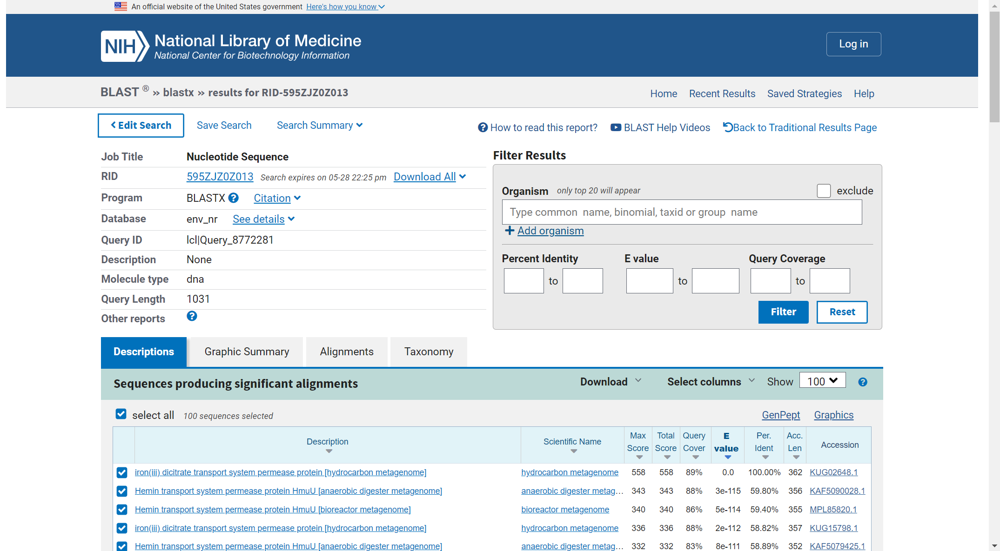

To zaporedje sem nato uporabil v programu BLAST, tokrat sem izbral opcijo blastp in izbral podatkovno bazo za non-redundant protein sequences. Protein z najboljšim ujemanjem je bil iron ABC transporter permease [Thermincola sp.]. Protein sem poiskal na Uniprotu.

**Aminokislinsko zaporedje:**
MFKRQGQPDCTTAYQQYKGRKNVIILLLVILTVFLAAFAINAGSTDLNLYQVLITILGQGSSISNVVIWNIRLPRVLAGIIAGTGLSVAGCVMQNNLRNPLASPSTLGIANAAAFGANMAIIVFGAGSVQSANADAVIINNPYMVTVSAFIWSMVAALAVLLLAKFRGFSPEAMILAGVAIGSLFSAGTILIQYFAQDVQVAAVVFWTFGDLGRASWKEVIIMACLIILSIIYFMLRRWDYNALDSGEETAKGLGVNVETVRLGGMFVSSLITAVTVSFLGIIGFIGLVGPQIMRRIIGEDHRFLIPASALMGALLLLVSDTMARTIIAPVVLPVGAITSFLGAPLFLYLLARGHQKR

Rezultati iskanja blastp: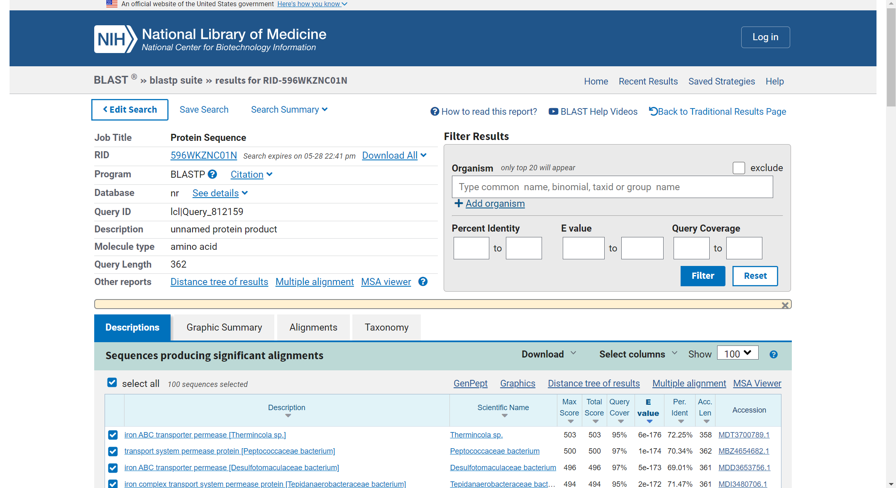

---
### Lastnosti proteina

**Ime in izvorni organizem proteina:** Fe(3+) dicitrate transport system permease protein FecD [Thermincola sp.]

**Lokalizacija, topologija:** Protein je anotiran in se nahaja v notranji membrani celice.

Lokacija in anotacija: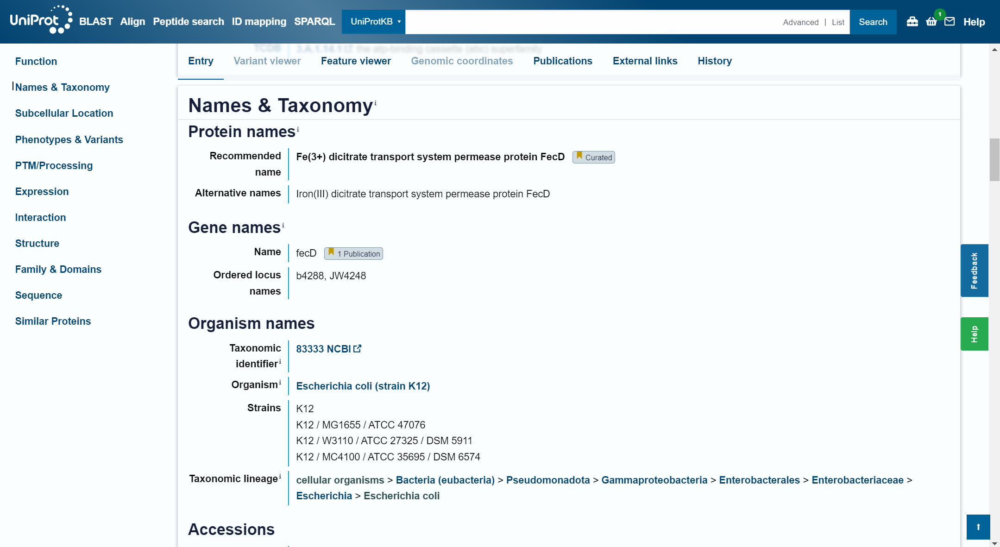

**Velikost proteina:** 318 aminokislinskih ostankov

Lastnosti proteina:

**Domenska zgradba:** Ima 9 topoloških domen na mestih 1-2, 24-55, 77-105, 127-137, 159-179, 201-225, 247-269, 291-294 in 316-318.
ima tudi 8 transmembranskih regij na mestih 3-23, 56-76, 106-126, 138-158, 180-200, 226-246, 270-290 in 295-315

Prikaz Topoloških domen:

Prikaz Transmembranskih regij: 

**Post-translacijske modifikacije:** Protein je označen z ID PRO_0000139411 in obsega aminokislinke položaje 1-284. Opisan je kot verjetno 3-merkatnopiruvatna sulfurtransferaza. Oranžna vrstica predstavlja to verigo brez specifičnih PTM-jev, kar pomeni, da jih najverjetneje ni oz. ni specifičnih informacij o njih. 

Rezultat iskanja PTM:
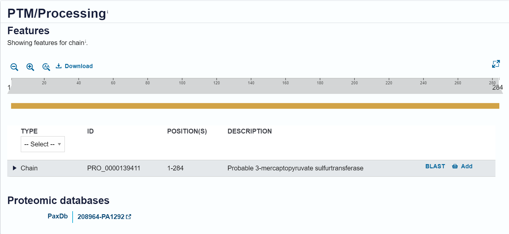

---
### Funkcija proteina

FecD, je del specializiranega transportnega sistema, ki omogoča bakterijam vnos železa v obliki Fe(3+)-dicitrata. Ta protein je ključni sestavni del večkomponentnega sistema, ki vključuje tudi druge proteine, kot so FecA, FecB, FecC, in FecE.

**Transmembranski transport:** 

FecD je transmembranski protein, ki omogoča prehod Fe(3+)-dicitrata skozi notranjo membrano bakterijske celice. Deluje kot permeaza, kar pomeni, da omogoča specifičen in reguliran transport železa v kompleksu z dicitratom preko celične membrane.

**Sodelovanje z drugimi proteini:**

FecD sodeluje z drugimi komponentami Fec transportnega sistema. FecA deluje kot receptor na zunanji membrani, ki veže Fe(3+)-dicitrat iz zunajceličnega okolja. FecB je periplazemski protein, ki prenaša vezani Fe(3+)-dicitrat od FecA do FecC-FecD kompleksa v notranji membrani. FecE, ATP-aza, zagotavlja energijo za transport s hidrolizo ATP.
---
### Sorodni proteini

Sorodne proteine sem poiskal s programom BLASTp. Dobljena zaporedja (prvih 50) sem vnesel v Clustal Omega, kjer se je izvedla poravnava. Zaporedja pa nato predstavil še kot filogenetsko drevo.

Sorodni proteini: 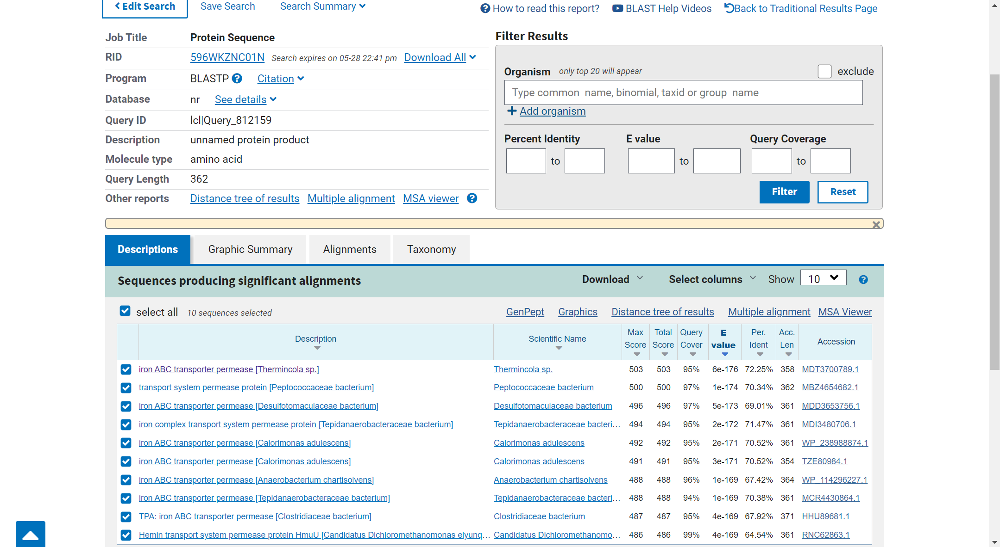

Poravnava ClustalOmega: 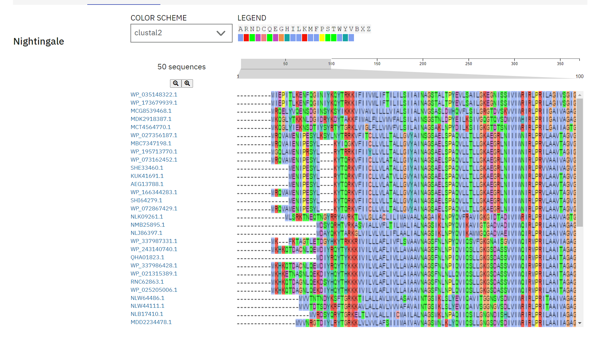

Filogenetsko drevo: 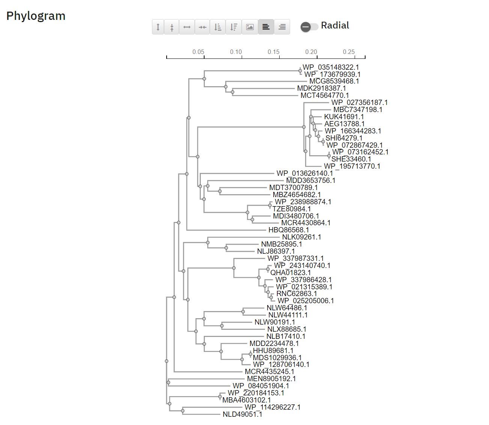

---
### Najbolj ohranjene regije

Izvedel sem 5 iteracij PSI BLAST po bazi non-redundant protein sequences in jih poravnal (multiple alignment). Za boljšo predstavo bi lahko uporabili tudi opcijo prikaza z WebLogo.

Rezultati Cobalt:
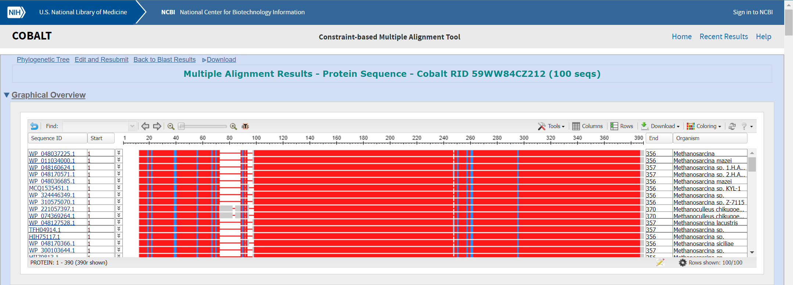

---
### Podobni evkarionti

Uporabila sem blastp, podatkovno bazo Uniprot/Swiss-prot, pod organizem sem vnesel Eucarya in izvedla iskanje. Rezultat je vrnil "No significant similarity found."

Rezultati iskanja blastp:
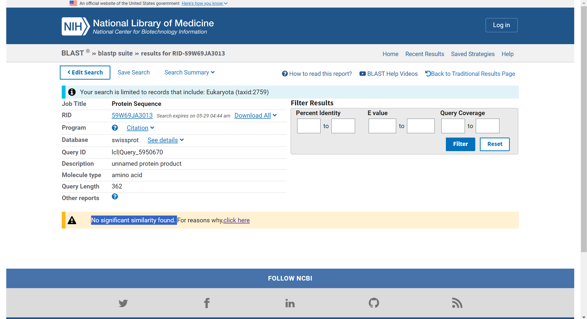

---
### Medproteinske interakcije

Kompleks je sestavljen iz dveh ATP-vezavnih proteinov (FecE), dveh transmembranskih proteinov (FecC in FecD) in solute-vezavnega proteina (FecB)

Predlagani podobni proteini:
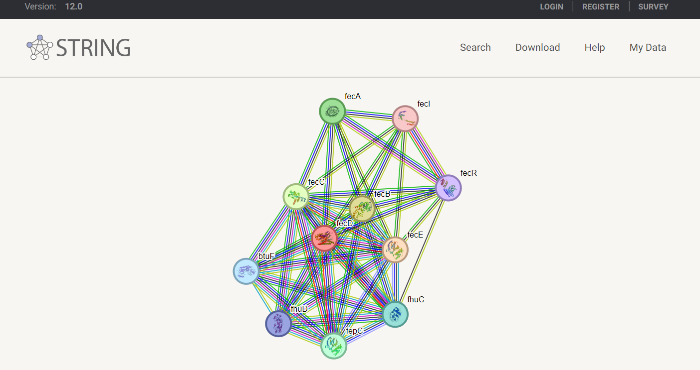

---
### Struktura oz. model sturkture

Napoved strukture sem pridobil z Alfafoldom. Struktura je modre barve (pLDDT>90), kar po barvanju pomeni, da je napovedana struktura zanesljiva.

Rezultati napovedi:

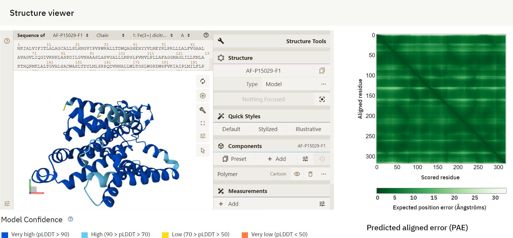

Izvedel sem superpozicijo z najbolj podobnim prokariontskim in evkariontskim proteinom, ki sej jih pridobil s pomočjo PDB. Verige so pobarvane po pLDDT.

Struktura v Molstaru: 
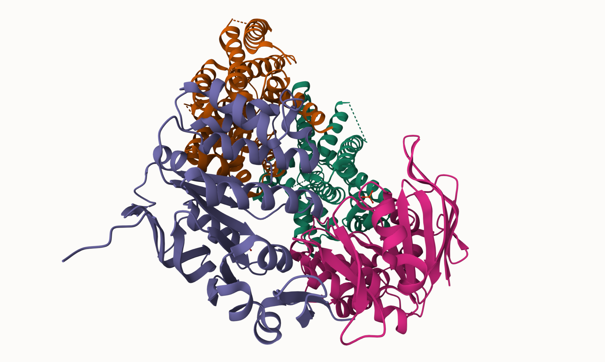

