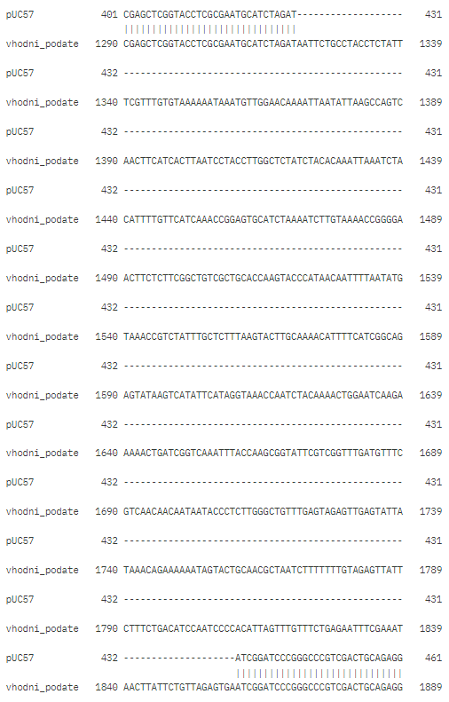
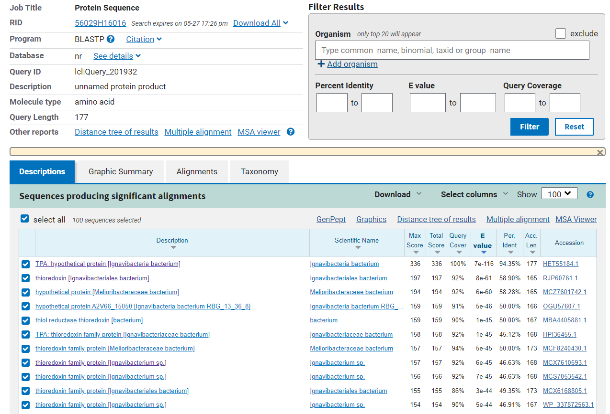
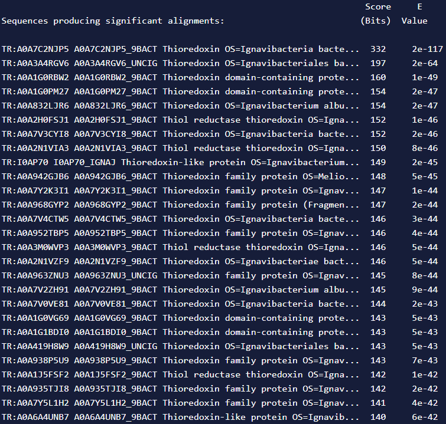
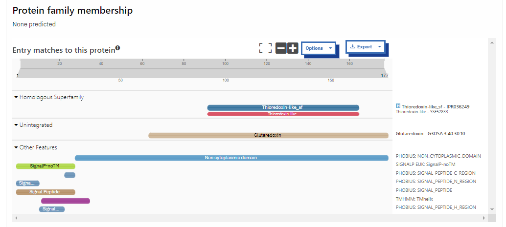
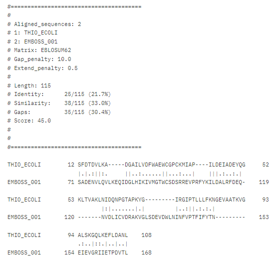
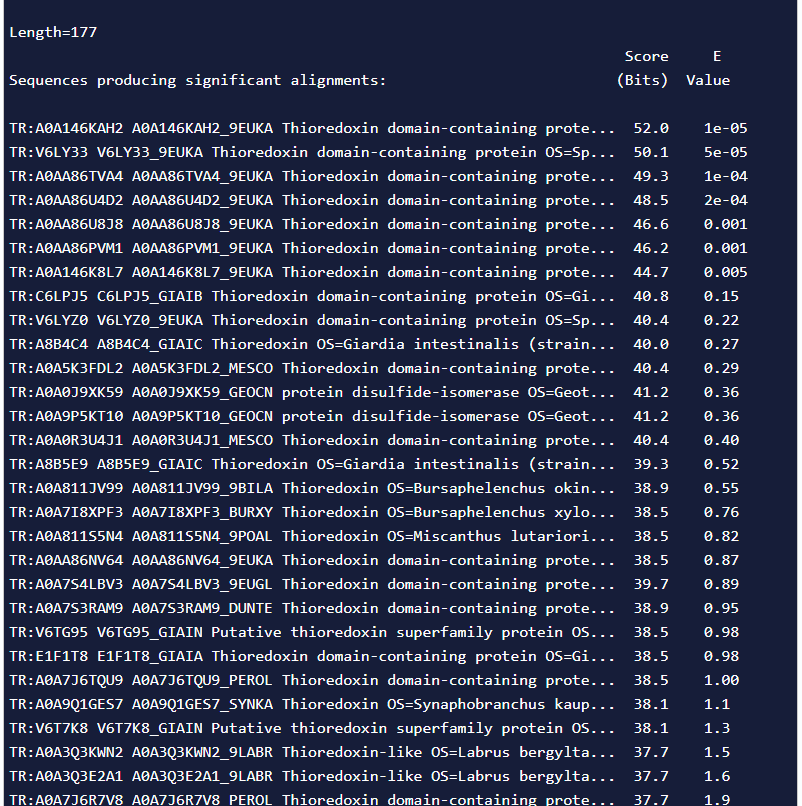
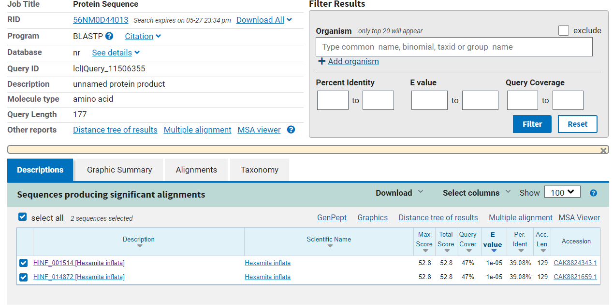

# S34
- **Avtor**: Jan Hvalec
- **Datum izdelave**: 2024-05-27
- **Koda seminarja**: S34

## Vhodni podatek
Povezava do datoteke z vhodnim podatkom: [S34](naloge/s34-input.md)

## Rezultati analiz
###Ime in izvorni organizem proteina
V plazmid pUC57 je bil vstavljen neznan fragment na neznano mesto, zato sem najprej naredil lokalno poravnavo sekvence praznega plazmida [pUC57](https://www.genscript.com/vector/SD1176-pUC57_plasmid_DNA.html) in vhodnega podatka s [Smith-Watermanovim algoritmom](https://www.ebi.ac.uk/jdispatcher/psa/emboss_water). Zaporedji se popolno poravnata povsod, razen na mestu našega vstavljenega zaporedja in ugotovimo, da se nahaja med nukleotidi 1321-1859. Poravnavo vidimo na naslednji sliki:

Nukleotidno zaporedje tega zaporedja je:

>AATTCTGCCTACCTCTATTTCGTTTGTGTAAAAAATAAATGTTGGAACAAAATTAATATTAAGCCAGTCAACTTCATCACTTAATCCTACCTTGGCTCTATCTACACAAATTAAATCTACATTTTGTTCATCAAACCGGAGTGCATCTAAAATCTTGTAAAACCGGGGAACTTCTCTTCGGCTGTCGCTGCACCAAGTACCCATAACAATTTTAATATGTAAACCGTCTATTTGCTCTTTAAGTACTTGCAAAACATTTTCATCGGCAGAGTATAAGTCATATTCATAGGTAAACCAATCTACAAAACTGGAATCAAGAAAAACTGATCGGTCAAATTTACCAAGCGGTATTCGTCGGTTTGATGTTTCGTCAACAACAATAATACCCTCTTGGGCTGTTTGAGTAGAGTTGAGTATTATAAACAGAAAAAATAGTACTGCAACGCTAATCTTTTTTTGTAGAGTTATTCTTTCTGACATCCAATCCCCACATTAGTTTGTTTCTGAGAATTTCGAAATAACTTATTCTGTTAGAGTGA

Z [Blastx](https://blast.ncbi.nlm.nih.gov/Blast.cgi?PROGRAM=blastx&PAGE_TYPE=BlastSearch&LINK_LOC=blasthome) iščemo po "Metagenomic proteins" in dobimo 100 % podobnost s hipotetičnim proteinom [ASZ90_003842](https://www.ncbi.nlm.nih.gov/protein/KUG26322.1?report=genbank&log$=protalign&blast_rank=1&RID=4E21E9PS016). To je celoten zapis za naš protein in od tu dobimo aminokislinsko zaporedje našega proteina. Sodeč po oznaki bi protein naj izviral iz družine *Melioribacter*, ki je del redu *Ignavibacteriales*.

Aminokislinsko zaporedje našega proteina je:

>MSERITLQKKISVAVLFFLFIILNSTQTAQEGIIVVDETSNRRIPLGKFDRSVFLDSSFVDWFTYEYDLYSADENVLQVLKEQIDGLHIKIVMGTWCSDSRREVPRFYKILDALRFDEQNVDLICVDRAKVGLSDEVDWLNINFVPTFIFYTNEIEVGRIIETPDVTLEIDFESILK

Iskanje podobnih bolje anotiranih aminokislinskih zaporedij z [Blastp](https://blast.ncbi.nlm.nih.gov/Blast.cgi?PAGE=Proteins&PROGRAM=blastp&PAGE_TYPE=BlastSearch&BLAST_SPEC=) po zbirki "non-redundant" nam najde proteine družine tioredoksinov iz reda bakterij *Ignavibacteriales*, zato lahko po podobnosti sklepamo, da je naš protein tudi tioredoksin in izvira iz reda *Ignavibacteriales*. Rezultati iskanja so prikazani na naslednji sliki:

###Lokalizacija in topologija
Iskanje z [Blastp](https://blast.ncbi.nlm.nih.gov/Blast.cgi?PAGE=Proteins&PROGRAM=blastp&PAGE_TYPE=BlastSearch&BLAST_SPEC=) po zbirki "non-reduntant" je vrnilo slabo anotirane rezultate, iskanje po zbirki "swiss-prot" pa ni vrnilo ustreznih rezultatov, saj so imeli preveliko E-vrednost. Za iskanje podobnih, bolje anotiranih zaporedij sem uporabil [UniProt BLAST](https://www.uniprot.org/blast). Rezultate sem omejil na deblo [*Ignavibacteriota*](https://lpsn.dsmz.de/phylum/ignavibacteriota-1). To deblo se imenuje tudi *Chlorobiota*. Rezultati iskanja so na naslednji sliki:

Rezultati so anotirani, ampak so samo vstavljeni v UniProt iz EMBL/GenBank/DDBJ WGS (whole genome shotugn), podatki pa prihajajo, tako kot naš protein, iz metagenomskih podatkov. Primer takega proteina, ki je zelo podoben našemu je [A0A7C2NJP5](https://www.uniprot.org/uniprotkb/A0A7C2NJP5/entry). Anotacije teh proteinov niso zanesljive in o lastnostih našega proteina ne moremo sklepati. V [UniProt](https://www.uniprot.org/) sem poiskal tioredoxine iz debla *Chlorobiota*, ki so bili bolje anotirani in jih primerjal z našim proteinom z [algoritmom Smith-Waterman](https://www.ebi.ac.uk/jdispatcher/psa/emboss_water). Naš protein sem primerjal z proteini [Q8KBN8](https://www.uniprot.org/uniprotkb/Q8KBN8/entry), [Q8KED5](https://www.uniprot.org/uniprotkb/Q8KED5/entry), [P10472](https://www.uniprot.org/uniprotkb/P10472/entry), [Q8KE49](https://www.uniprot.org/uniprotkb/Q8KE49/entry) in [Q8KEA4](https://www.uniprot.org/uniprotkb/Q8KEA4/entry). Primerjava s temi proteini je pokazala nizko podobnost in neohranjenost aktivnega mesta. Naš protein in našemu podobni proteini najdeni z [UniProt BLAST](https://www.uniprot.org/blast), so verjetno napačno avtomatsko anotirani kot tioredoksini. Lokalizacije na podlagi podobnosti ne moremo določiti.

Protein [A0A7C2NJP5](https://www.uniprot.org/uniprotkb/A0A7C2NJP5/entry) ima anotiran signalni peptid. Začetno zaporedje je na našem proteinu dobro ohranjeno, zato sem z orodjem [SignalP-6.0](https://services.healthtech.dtu.dk/services/SignalP-6.0/) preveril prisotnost signalnega peptida. Glede na rezultat je visoka verjetnost, da se signalni peptid nahaja med ostanki 1-29. Rezultat je prikazan na sliki:

Pri topologiji sem si pomagal z orodjem [AlphaFold](https://golgi.sandbox.google.com/). Rezultat je prikazan na naslednji sliki:

Na sliki vidimo visoko zanesljivost strukture, razen na N-koncu proteina, kjer se nahaja signalni peptid. V preostalem delu strukture najdemo motiv podoben motivu [tioredoksinskega pregiba](https://www.sciencedirect.com/science/article/pii/S096921260100154X). Primerjava struktur [tioredoksina 1](https://www.uniprot.org/uniprotkb/P0AA25/entry#structure) iz *E. coli* in našega proteina kaže strukturno podobnost, ampak neohranjeno aktivno mesto CGPC, ki se nahaja na tioredoksinu 1 na mestih 33-36. Slika superpozicije teh proteinov je na naslednji sliki:

###Velikost proteina
Velikost sem preprosto izračunal z uporabo aminokislinskega zaporedja za naš protein in orodja [ProtParam](https://web.expasy.org/cgi-bin/protparam/protparam). Masa proteina meri 20616 Daltona.

###Domenska zgradba
Domenske zgradbe ne moremo zanesljivo določiti. Po podobnosti s proteini, ki sem jih dobil pri iskanju z UniProt BLAST, po strukturni podobnosti s [tioredoksinom 1](https://www.uniprot.org/uniprotkb/P0AA25/entry#structure) in s pomočjo rezultatov iz orodja [InterPro](https://www.ebi.ac.uk/interpro/) bi lahko sklepal, da naš protein vsebuje tioredoksin-like domeno. Nasprotno nam [iskalnik ohranjenih domen NCBI](https://www.ncbi.nlm.nih.gov/Structure/cdd/wrpsb.cgi) ne najde ohranjene domene. Prav tako lokalne aminokislinske poravnave znanih tioredoksinov in našega proteina ne kažejo na večjo podobnost. Rezultat uporabe InterPro je na naslednji sliki:

###Funkcija proteina
Protein zaradi neohranjenosti aktivnega mesta v primerjavi z dobro anotiranimi tioredoksini nima katalitične funkcije, zmožnosti vezave kakšnega drugega substrata pa samo iz sekvence ni možno določiti. Te lastnosti bi morali določiti eksperimentalno. Lokalna poravnava tioredoksina 1 in našega proteina je prikazana na naslednji sliki. Opazimo, da aktivno mesto CGPC ni ohranjeno:

###Sorodni proteini
Podatke za filogenetsko drevo sem pridobil s pomočjo [UniProt BLAST](). Iskal sem našemu podobna zaporedja in iskanje omejil na *Ignavibacteriales*. Izbral sem prvih 20 zadetkov razvrščenih po padajočih točkah. Seznamu teh zaporedij sem dodal še naše zaporedje in jih poravnal z v UniProt vgrajeno funkcijo za poravnavo večih zaporedij, kjer se nam tudi izriše filogenetsko drevo. V nadaljevanju so slike rezultatov UniProt BLAST, orodja za poravnavo in samega filogenetskega drevesa:

###Ohranjene regije
V našem proteinu ni ohranjenih regij. Zaradi neohranjenosti aktivnega mesta, sklepam, da so našemu podobna zaporedja in naše zaporedje napačno anotirana kot tioredoksin in ne nosijo nobene funkcije. Ker je protein strukturno podoben [tioredoksinu 1](https://www.uniprot.org/uniprotkb/P0AA25/entry#structure), ampak nima ohrnajenega aktivnega mesta, dvomim, da je tak protein funkcionalen in se verjetno ne sintetizira.

###Podobni evkariontski proteini
Podobne evkariontske proteine sem iskal z [UniProt BLAST](https://www.uniprot.org/blast) in [blastp](https://blast.ncbi.nlm.nih.gov/Blast.cgi?PAGE=Proteins&PROGRAM=blastp&PAGE_TYPE=BlastSearch&BLAST_SPEC=). Iskanje sem omejil na zbirko UniProtKB pri UniProt BLAST in "non-redundant" pri blastp, ter pri obeh omejil rezultate na domeno *Eukaryota*. Rezultati UniProtBLAST nam pokažejo nezanesljivo anotirane proteine in proteine z visoko E-vrednostjo. Rezultata blastp nam pokažeta nepodobna proteina, ki tudi nista dobro anotirana. Podobnih evkariontskih proteinov ne morem določiti. Rezultati so na naslednjih dveh slikah:

###Potencialna funkcijska povezanost z drugimi proteini
Zaradi neuspešnega iskanja za podobnimi, bolje anotiranimi proteini in slabo anotiranega začetnega zaporedja, povezanosti z drugimi proteini ni mogoče določiti. Če sklepamo, da je naš protein navsezadnje tioredoksin, interagira z večimi proteini, najpomembneje z [tioredoksin reduktazo](https://www.ncbi.nlm.nih.gov/pmc/articles/PMC1220815/), ki skrbi, da je tioredoksin v svojem reduciranem stanju. Naloga tioredoksinov je redukcija cisteinskih aminokislinskih ostankov.

###Modeli struktur
Model strukture našega proteina sem naredil s pomočjo AlphaFold, kot je že bilo prikazano, in prikazal v programu ChimeraX. Model strukture je prikazan na naslednji sliki:

Ker nisem uspel določiti podobnih, bolje anotiranih proteinov, sem sklepal, da je naš protein navsezadnje tioredoksin in naredil superpozicijo s [tioredoksinom 1](https://www.uniprot.org/uniprotkb/P0AA25/entry#structure) [(PDB: 1SL1)](https://www.rcsb.org/structure/1sl1) iz *E. coli*. Superpozicija struktur je prikazana na naslednji sliki s programom ChimeraX:

Z enakim sklepom sem naredil tudi superpozicijo našega proteina in [tioredoksina 1](https://www.uniprot.org/uniprotkb/P22217/entry#structure) [(PDB: 3F3Q)](https://www.rcsb.org/structure/3f3q) iz *Saccharomyces cerevisiae*. Superpozicija je bila prikazana s programom ChimeraX:

