# S35
- **Avtor**: Tina Kosovel
- **Datum izdelave**: 2024-05-18
- **Koda seminarja**: S35

---
## Vhodni podatek

Povezava do datoteke z vhodnim podatkom: [S35](naloge/s35-input.md)

---
## Rezultati analiz

### 1. Identifikacija vključka
Za identifikacijo vključka sem poiskala zaporedje plazmida brez vključka (je splošno znano in dobro raziskano, plazmid [pUC57](https://www.ncbi.nlm.nih.gov/nuccore/Y14837.1) na GenBank). To zaporedje brez vključka sem z EMBOSS Water poravnala s podanim zaporedjem plazmida z vključkom in tako dobila del, ki se ni poravnal, kar predstavlja vključek. 

Vključek: TCACCTGCTGCCCCCCGTGCTGTCCGAGGTGGAACGGGCCGGGGCCGTGCGCACGGAACGCTTCGGCCGGGAATGTACGGATGGGGAGATCGAACGCCTGCTTGCCCTGGCGCGGGAGTTCGGAGCCCGGACCGTGACCGGCATGGGCGGCGGCAAGACCCTGGACGCGGCCAAGGCCGTGGCCGCCAGGGCCGGTCTGCCCGTGGCCGTGGTGCCCACCATCGCCTCCACGGACGCGCCGTGCAGTTCCGTCTGCGTGGTCTATTCCCCGGACGGGGTGTTTTTGCGGGCGGACGTGTTGCCGCGCAACCCGGACGTGGTGATCGTGGACACCGAGGTCATGGCCCGGGCTCCGGCCCGGTTCCTGGTAGCGGGCATGGGCGACGCCCTGGCCACCTGGTTCGAGGCCGACTCCTGCCGCACAAGCCGGGGCCGCAACATCGCGGGCGACGCGGGTTCCATGACGGCCCTGGCCCTGGCCCGGTTGTGTTATGAAACCGTCCGGGACTGGGGGGTGTCCGCCCGCACGGCCTGCGAGGCCGGGGTGGTCACGCCCGCCCTGGAGCGGGTGGTGGAGGCCAACACCCTCTTAAGCGGCCTGGGATTTGAAAGCGGGGGCCTGGGCGCGGCCCATTCCATCCATAACGGCCTCACGGCCCTGCCCGCCGTCCAGGGCCTGTTCCACGGCGAGAAGGTGGCCTTCGGCGTGCTGGCCTCGCTTTTTCTCACGGACCCGCCCCTGGCCGTTGTGGACGAGGTCTACGCCCTGTGCGCCAGCCTCGGCCTGCCCACCACCTGTGCCGATCTGGGCCTTGCGGGGGTCACGGACGAGGAACTGCTGCGCGTGGCGGAAAAAAGCTGTACCCCGGGCGAAAGCATTCATAACGAGCCGGTGGAGATTTCCCCGCCACGGGTCTTCGCCGCGCTCAAGGCCGCCGATGCCGAGGGACGCCGCCGCGTCCGGGCCAGCGCCGGGGGGGAGCCCGCCGGTTCTTTTCCCCGATAACCGCCGCCGCGAATGG

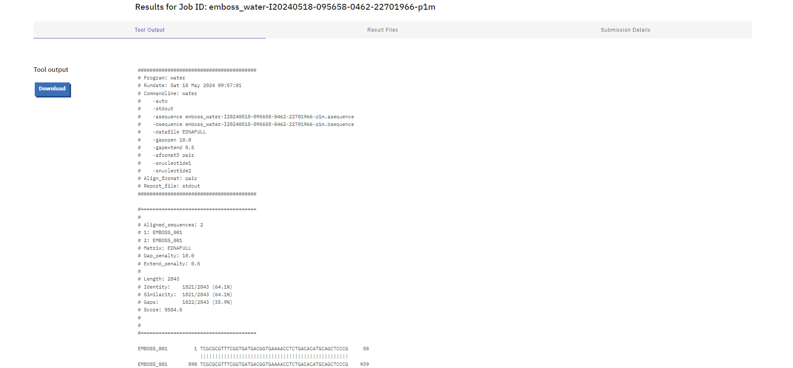

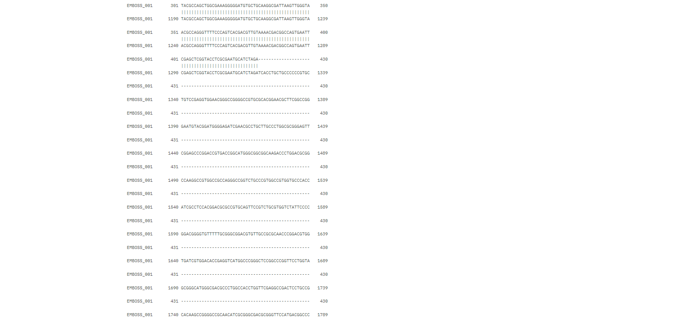 

Tega sem nato vnesla v BLASTx in z iskanjem po zbirki Metagenomic proteins našla protein s 100% procentnim ujemanjem identitete s kodo v genbank [KUG28848](https://www.ncbi.nlm.nih.gov/protein/KUG28848.1?report=genbank&log$=prottop&blast_rank=1&RID=538NXD1J013). 

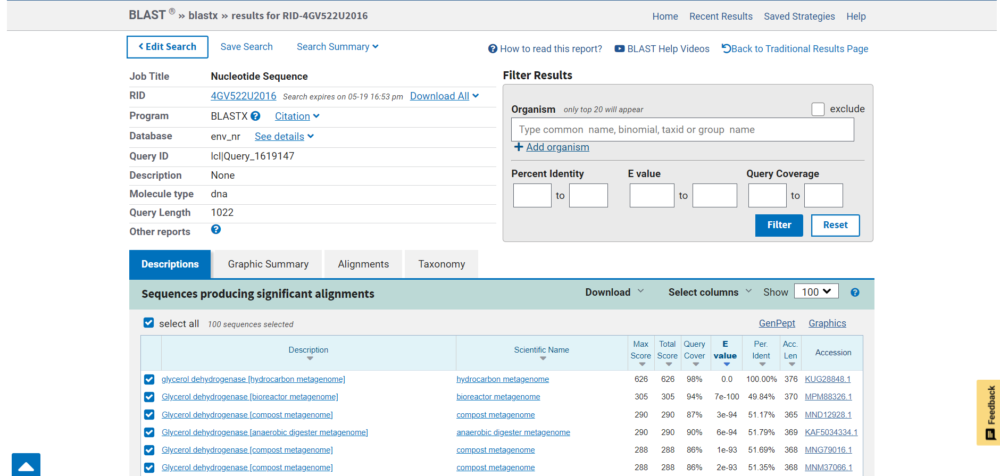

V genbank zapisu sem ugotovila, da je protein glicerol dehidrogenaza. Izvorni organizem je hydrocarbon metagenome. Zaporedje torej izvira iz skupine mikroorganizmov, ki živijo v okolju bogatem z ogljikovodiki. Natančneje iz družine bakterij Desulfovibrio (Desulfolutivibrio sulfodismutans, Desulfolutivibrio sp.).

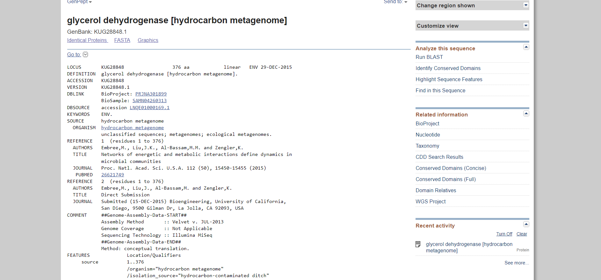

### 2. Lastnosti proteina
Iz vnosa v genbanku sem razbrala, da je zaporedje dolgo 376 aminokislin.

Ker je iskanje proteina iz družine Desulfovibrio v UniProtu podalo le neanotirane in nepopolne rezultate, sem iskanje razširila na sorodne proteine v drugih organizmih, ki so bolje anotirani. Najbolj soroden in veliko bolje raziskan protein je iz organizma Thermotoga maritima (UniProt: [Q9WYQ4](https://www.uniprot.org/uniprotkb/Q9WYQ4/entry)). Našla sem ga pod odstavkom sorodni proteini vnosa za organizem [Desulfolutivibrio sulfodismutans](https://www.uniprot.org/uniprotkb/A0A7K3NQJ0/entry#similar_proteins) na Uniprotu.

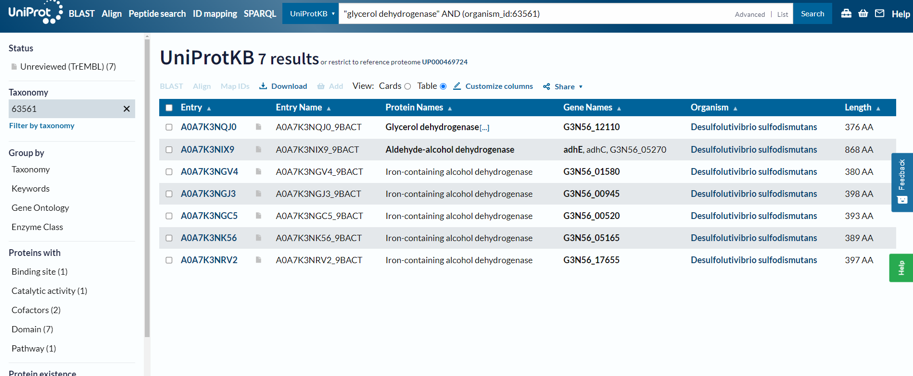

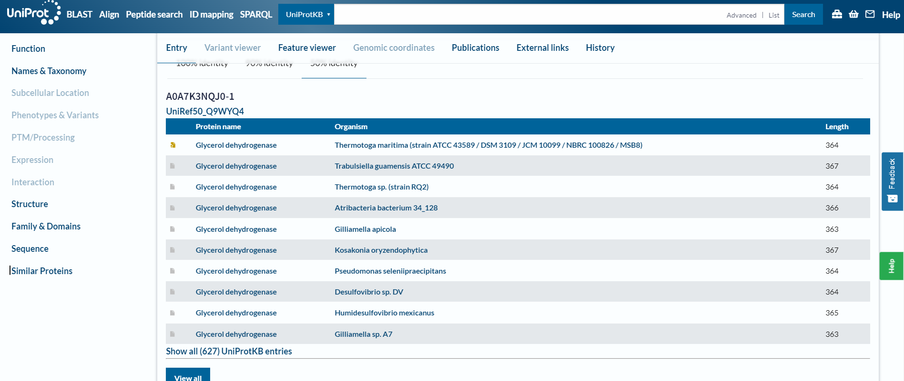

Ugotovila sem, da se protein iz organizma Thermotoga maritima nahaja v citosolu. Ima eno domeno in sicer alkohol dehidrogenazo z koodriniranim železovim ionom (pridobljeno iz InterPro). Protein nima postranslacijskih modifikacij. Zaradi visoke podobnosti med glicerol dehidrogenazami (primerjano še z E.Coli) te lastnosti verjetno veljajo tudi za protein iz družine bakterij Desulfovibrio. 

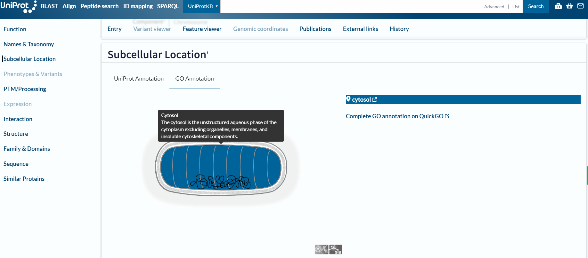

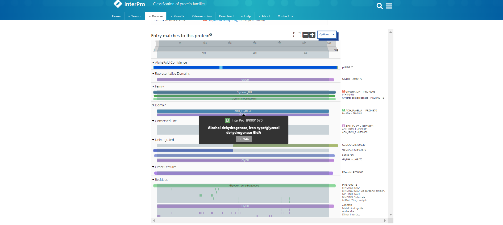

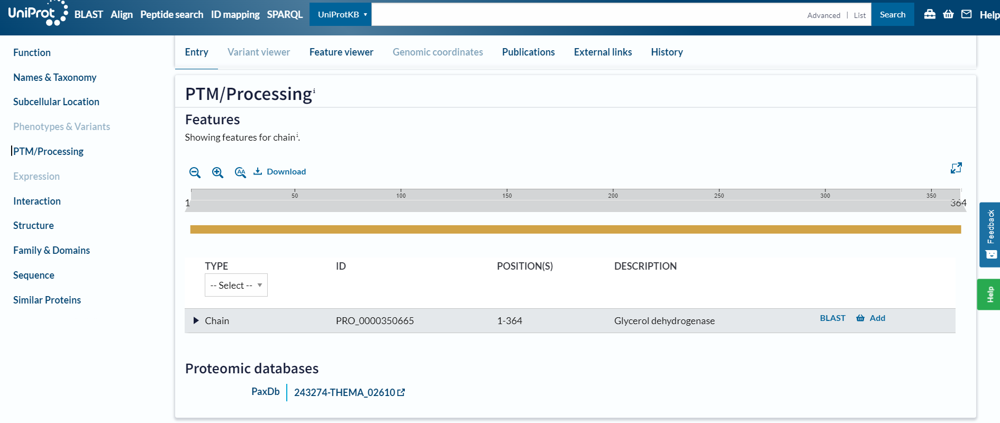

### 3. Funkcija proteina in funkcijska povezanost z drugimi proteini
Funkcija proteina je, da katalizira od NAD odvisno oksidacijo glicerola v dihidroksiaceton. Reakcija: glicerol + NAD+ = dihidroksiaceton + H+ + NADH

Kot kofaktor potrebuje Zn2+. 

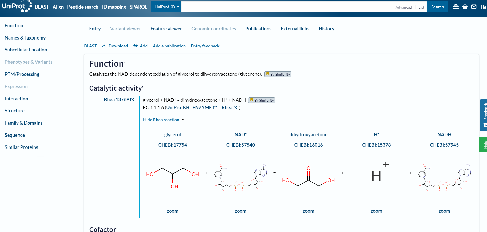

Sodeluje tudi z drugimi proteini v metabolizmu poliolov, fermentaciji glicerola in v oksidacijski poti nastanka gliceron fosfata iz glicerola (1. korak od dveh). Pridobljeno iz organizma Thermotoga maritima.

Za natančnejše interakcije sem sledila linku iz UniProta do STRING baze podatkov. Tako sem ugotovila, da protein sodeluje s proteini: Metilglioksal sintaza, Glicerol kinaza 1, Glicerol kinaza 2, protein podoben GB:AE000782, Alkohol dehidrogenaza, nagD protein, Oksidoreduktaza, PHT4-sorodni protein, protein podoben GB:L77117. Pridobljeno iz organizma Thermotoga maritima.

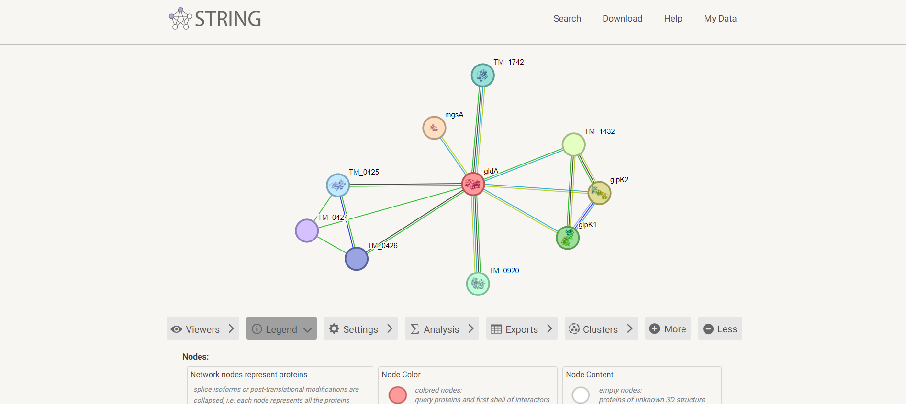

Raziskala sem tudi interakcije sorodnih evkariontskih proteionov. Na UniProtu sem podatke za interakcije našla za organizem Trypanosoma theileri. To so parazitske praživali, ki se hranijo na sesalcih. Protein tega evkarionta interagira z: Alkohol dehidrogenazo, Dihidroksiaceton kinazo 1, Glicerol-3-fosfat dehidrogenazo, Sintaksinom, proteinom, ki vsebuje piruvat-redoks-2 domeno, 4-hidroksibenzoat polipreniltransferazo, 2-hidroksiglutarat dehidrogenazo, od NADPodvisno alkohol dehidrogenazo.

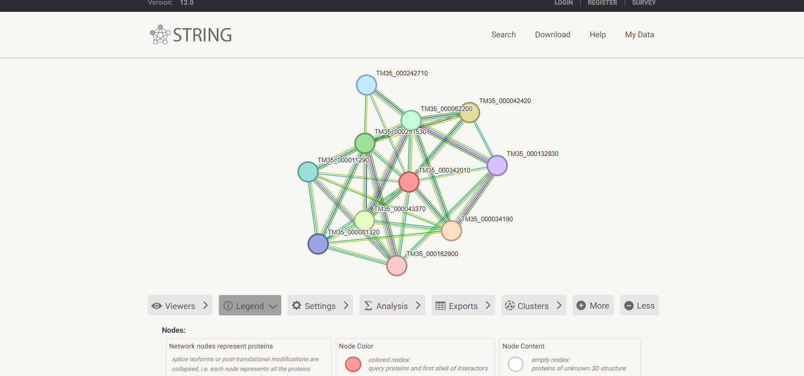

### 4. Sorodni proteini
Z pBLAST-om sem poiskala sorodna zaporedja proteinu iz Desulfolutivibrio sulfodismutans. Prvih 32 zadetkov sem v fasta aligned formatu vnesla v orodje Clustal omega. Navodila za izris drevesa sem nato vnesla v Phylo.io. (Zaporedja sem preimenovala v imena organizmov in dodala zaporedje iz Desulfolutivibrio sulfodismutans.)  

Ugotovila sem, da je protein glicerol dehidrogenaza iz družine bakterij Desulfolutivibrio najbolj soroden istoimenskemu proteinu iz družine bakterij Thermanaerothrix.

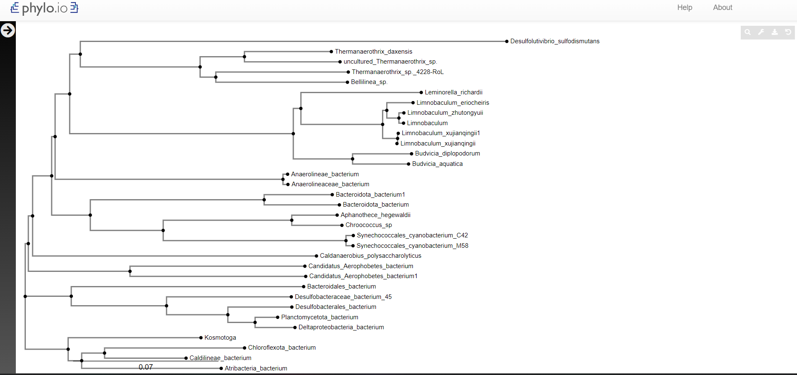

### 5. Identifikacija ohranjenih domen
Za identifikacijo ohranjenih domen sem z zaporedjem iz hydrocarbon metagenome 3x pognala psiBlast. Prvih 500 zaporedij sem v fasta aligned formatu vnesla v orodje Cobalt, ki je izvedlo poravnavo. Iz rezultatov sem razbrala, da je zelo ohranjeno celotno zaporedje. To je ključno, saj ima protein veliko vezavnih mest, ki so razpršena po celotni dolžini verige. Manj ohranjeni sta le regiji 43-61, 80-89 ter naključni aminoksilsinki ostanki na celotni verigi. Nobena od teh mutacij ni vezavno mesto. Lokacije vezavnih mest sem razbrala iz UniProt zapisa za protein iz družine Desulfolutivibrio (UniProt: [A0A7K3NQJ0](https://www.uniprot.org/uniprotkb/A0A7K3NQJ0/entry)). 

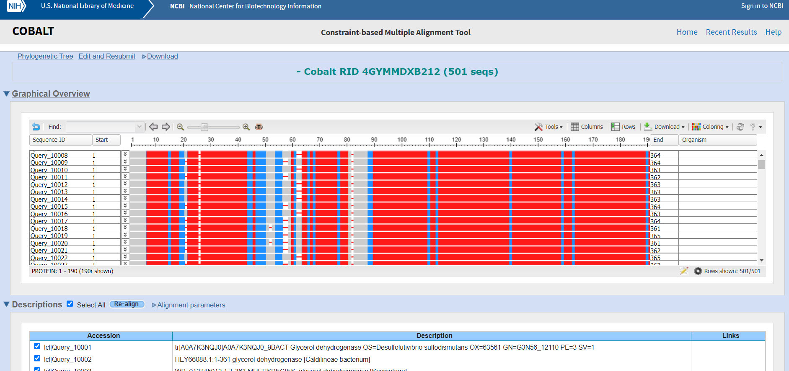

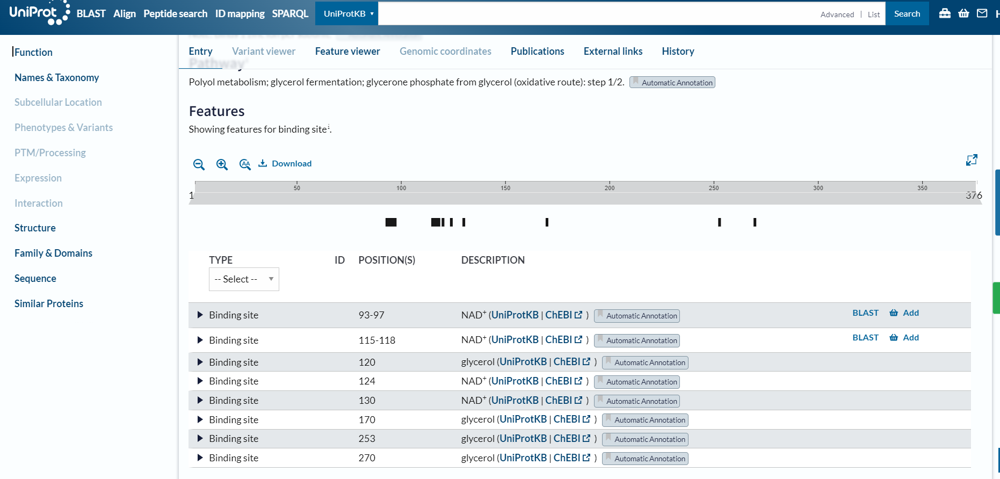

### 6. Podobni evkariontski proteini
Iskanje sorodnih evkariontskih proteinov sem opravila z pBLAST. Za organizem sem vnesla Eukaryotes in iskala z zaporedjem iz hydrocarbon metagenome. Protein je prisoten v določenih vrstah gliv, kvasovk, rastlin in alg. Ti organizmi uporabljajo glicerol kot vir energije. Glicerol dehidrogenaza torej v evkariontih opravlja enako funkcijo kot v prokariontih.

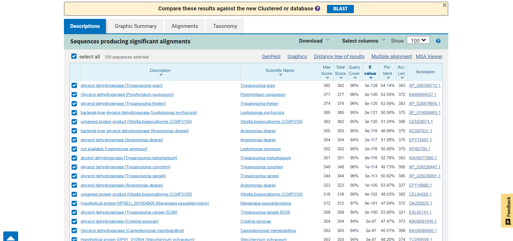

### 7. Struktura proteina
Zaporedje iz hydrocarbon metagenome sem vnesla v AlphaFold3, ki je ustvaril model. Tega sem oblikovala v ChimeriX.

Zanesljivost modela je zelo dobra. Le v dveh krajših regijah, ki sta bolj neurejeni, je nižja.

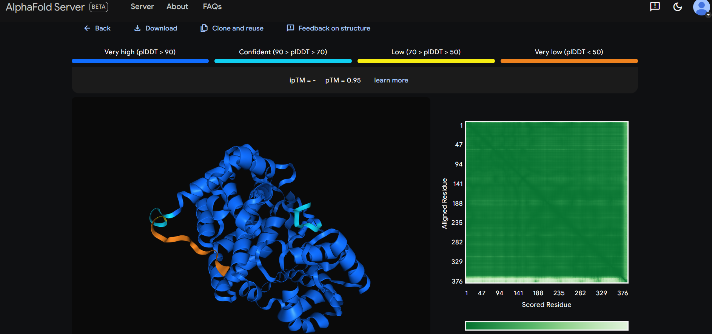

Rdeče obarvana so vezavna mesta, ki oblikujejo vezavni žep, vijola pobarvani sta neurejeni regiji, kjer je model strukture manj zanesljiv, zeleni sta slabše ohranjeni domeni proteina.

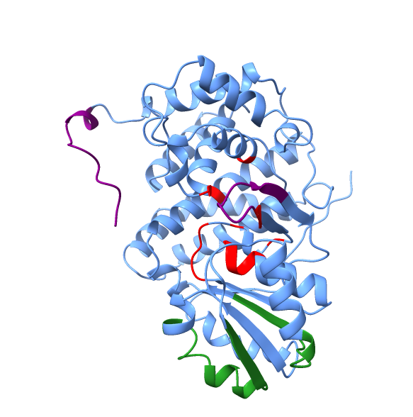

Naredila sem še superpozicijo evkariontskega proteina iz organizma Porphyridium purpureum (alga, UniProt: [A0A5J4YVW0](https://www.uniprot.org/uniprotkb/A0A5J4YVW0/entry#function)). Ujemanje strukture proteinov je visoko. Evkariontski protein je nekoliko krajši na C-koncu. Tudi slabše ohranjene regije imajo načeloma ohranjeno strukturo.

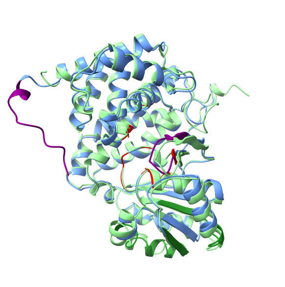

---
## Viri in orodja
- [UniProt](https://www.uniprot.org/)
- [EMBOSS](https://www.ebi.ac.uk/jdispatcher/psa/emboss_water)
- [GenBank](https://www.ncbi.nlm.nih.gov/genbank/)
- [Phylo.io](https://phylo.io/)
- [COBALT](https://www.ncbi.nlm.nih.gov/tools/cobalt/re_cobalt.cgi)
- [AlphaFold3](https://golgi.sandbox.google.com/about)
- [ChimeraX](https://www.cgl.ucsf.edu/chimerax/)
- [BLAST](https://blast.ncbi.nlm.nih.gov/Blast.cgi?PROGRAM=blastp&PAGE_TYPE=BlastSearch&LINK_LOC=blasthome)
- [Clustal Omega](https://www.ebi.ac.uk/jdispatcher/msa/clustalo)
- [STRING](https://string-db.org/)
- [InterPro](https://www.ebi.ac.uk/interpro/)
