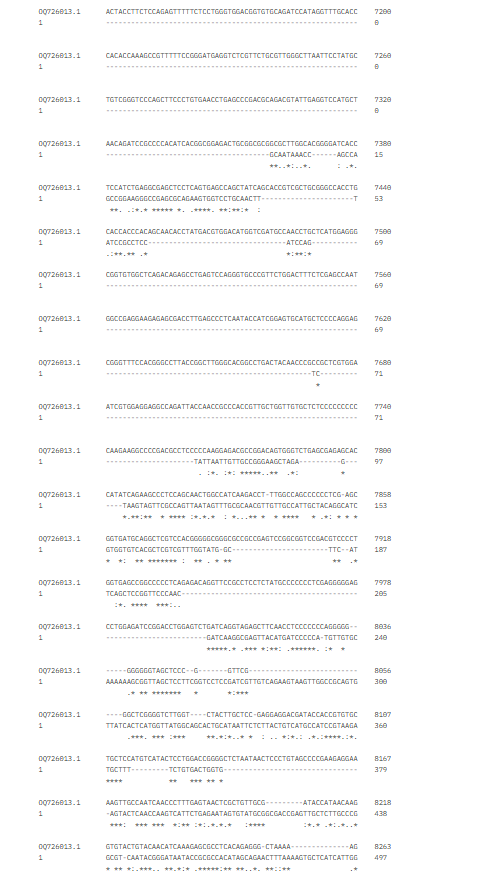
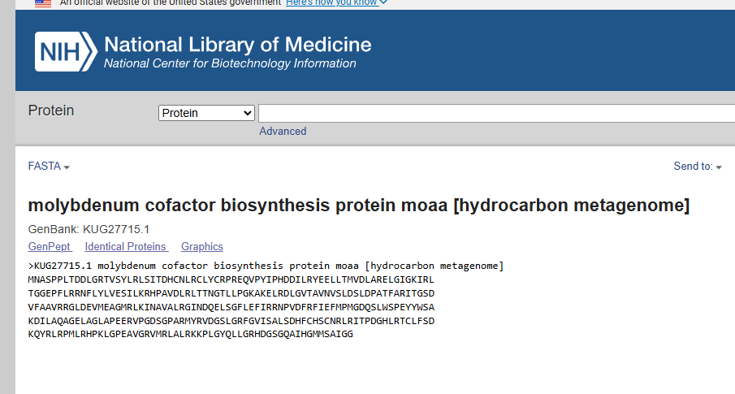
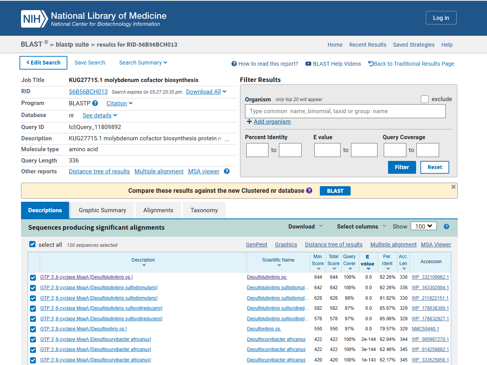
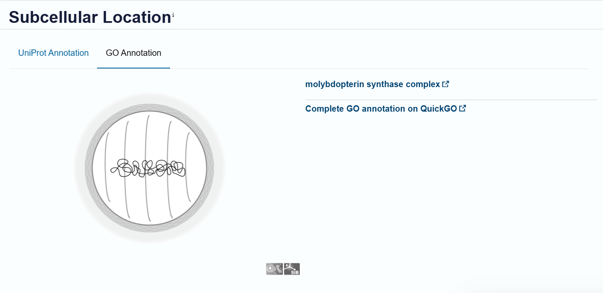
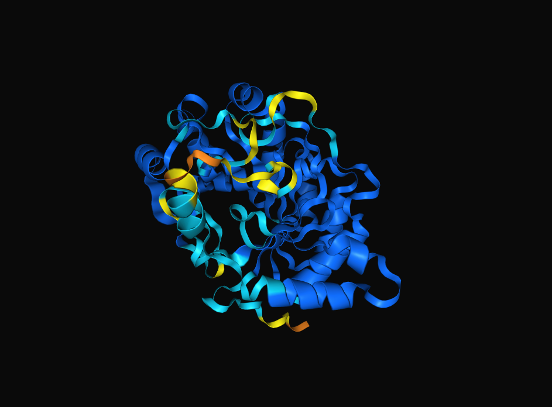
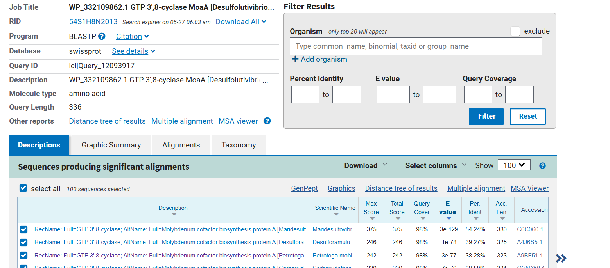
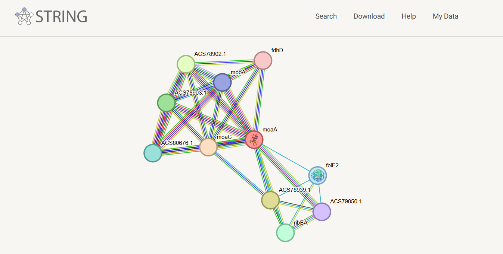
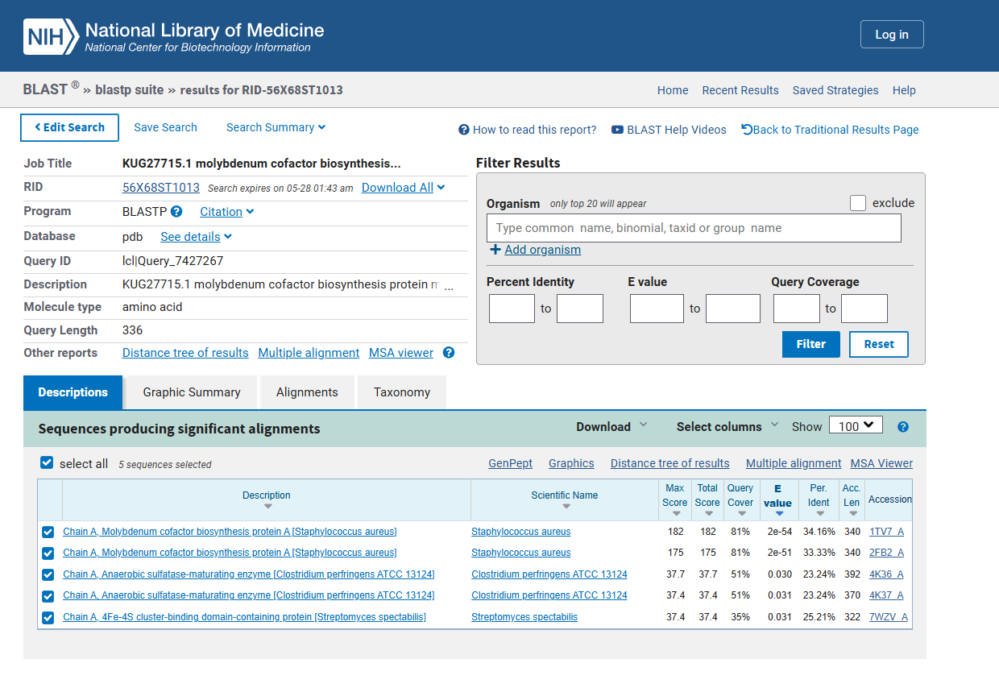
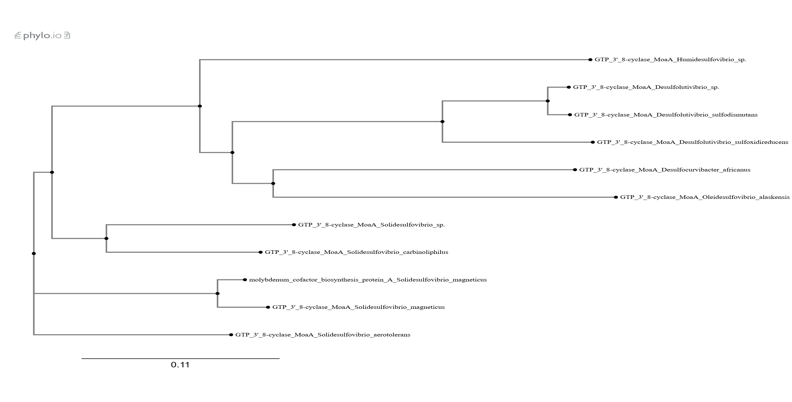
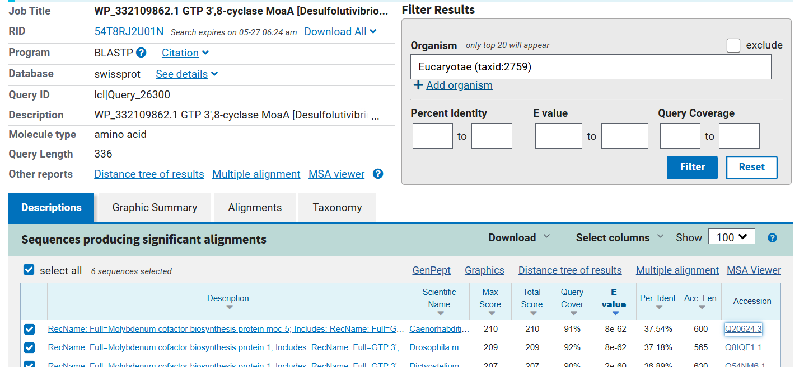

# S36

- **Avtor**: Vid Kozel
- **Datum izdelave**: 2024-05-25
- **Koda seminarja**: S36

---
## Vhodni podatek

Povezava do datoteke z vhodnim podatkom: [S36](naloge/s36-input.md)

---
## Rezultati analiz
### Iskanje zaporedja

Zaporedje svojega neznanega proteina sem dobil tako, da sem poiskal zaporedje vektorja pUC57, v katerega je bil naš vključek vstavljen. Nato sem na ClustalOmega izvedel poravnavo vključka in vektorja ter odstranil ujemajoče se dele in dele zapisa, ki so se ujemali z MCS mestom na vektorju. Tako mi je na koncu ostal samo zapis za moj protein.

*Na sliki je začetek zapisa mojega vklučka (označen s številko 1).

Ostanek zaporedja sem venesel v Blastn, bazo nastavil na metagenome in dobil zadetek molybdenum cofactor biosynthesis protein moaa [hydrocarbon metagenome] s 100% ujemanjem.

O tem zaporedju nisem našel veliko podatkov, zato sem metagenom vstavil v Blastx z bazo podatkov non-redundant in izbral najboljši zadetek, ki je imel E-vrednost enako nič; GTP 3',8-cyclase MoaA [Desulfolutivibrio sp.], identifikacijska številka: WP_332109862.1

S pomočjo tega zadetka sem lahko na spletni strani GenBank določil izvorni organizem, Desulfolutivibrio sp., ter velikost proteina, ki je 336 aminokislinskih ostankov. Ta protein katalizira ciklizacijo GTP do (8S)-3',8-ciklo-7,8-dihidrogvanozin 5'-trifosfata.

### Lokalizacija, topologija:
Na UniProt-u sem pri iskanju mojega proteina in njemu podobnih zasledil, da se nahaja v citosolu celice. Enako je pisalo za kompleks, katrerega del je moj protein, zato sem sklepal, da je podatek pravilen.

### Značilnosti proteina
V InterPro sem vnesel moj protein in si ogledal nekatere njegove značilnosti. Spada v družino 'Molybdenum cofactor biosynthesis protein', vsebuje domeno Radical SAM ter MoaA twitch domeno. Protein je lahko v obliki monomera, tvori pa lahko tudi homodimer.

Da sem pridobil strukturo mojega proteina (slika spodaj), sem v AlphaFold3 vnesel njegovo zaporedje. 

Iz strukture je razvidno, da sta tako N- kot C- konec predvidena z nekoliko slabšo stopnjo zanesljivosti, od okoli 50 do 310 pa je struktura predvidena z visoko stopjo zanesljivosti (izjema okoli 220. ostanka).

Interakcij z ostalimi proteini neposredno nisem našel, zato sem s pomočjo blastp-ja v bazi SwissProt poiskal najbolj podoben protein, pri katerem bi lahko izvedel kaj o le-teh. Našel sem protein, ki se ujema z mojim v 54,24%, ter na spletni strani String poiskal s katerimi proteini interagira. Največ interakcij ima moj protein z moaC, kar je pričakovani, saj gre za proteina, ki si delita skupno funkcijo.

### Primerjava s podobnimi proteini
Strukturo, ki sem jo predvidel z AlphaFoldom3 sem odprl v ChiemraX ter jo s superpozicijo primerjal s strukturo proteina, ki sem ga našel preko blastp-ja ter z iskanjem samo po PDB podatkovni bazi in se je z mojim proteinom najbolj ujemal ('Chain A, Molybdenum cofactor biosynthesis protein A' iz oragnizma Staphylococcus aureus). Po superpoziciji sem lahko opazil, da se proteina po strukturi dobro ujemata, kljub temu da je ujemanje zaporedij znašalo le 34,16%. Na druge značilnosti mojega proteina glede na primerjavo nisem sklepal, saj sta si zaporedji proteinov premalo podobni. Evkariontskega proteina, ki bi bil podoben mojemu v bazi PDB nisem našel.

### Sorodni proteini
S pomočjo iskanja po UniProt-u sem poiskal 10 zapisov mojega proteina iz različnih organizmov ter se lotil izdelave filogenetskega drevesa. Pomagal sem si s ClustalOmega, kjer sem zaporedja poravnal, ter Phylo.io. Proteine sem označil z imenom in organizmom iz katerega izhajajo.

#### Ohranjene regije:
10 zaporedij, s katerimi sem tvoril filogenetsko drevo sem potem uporavil še za WebLogo, iz katerega pa tudi s pomočjo nekaterih podatkov iz UniProta nisem mogel določiti aktivenga mesta, sklepal sem lahko samo na 3 disulfidne mostičke, saj sem opazil po dvakrat dobro ohranjene 3 cisteinske ostanke.

### Podobni evkariontski proteini:
Iskal sem s pomočjo blasta ter izbral samo iskanj evkraiontskih organizmov. Našel sem nekaj proteinov, podobnih mojemu, ki izhajajo iz evkariontov. Najbolj podoben je bil protein iz organizma Caenorhabditis elegans, ki se je z mojim ujemal v 37,54%. Zanj sem na UniProt-u poiskal funkcijo in izvedel, da verjetno tvori kompleks s svojo drugo izoformo , ki katalizira pretvorbo 5'-GTP v ciklični piranopterin monofosfat (cPMP), katalizira ciklizacijo GTP v (8S)-3',8-ciklo-7,8-dihidroguanozin 5'-trifosfat in mocs1b, katalizira kasnejšo pretvorbo (8S)-3',8-ciklo-7,8-dihidroguanozin 5'-trifosfata v cPMP. Sicer je ujemanje dokaj nizko, zato ju glede tega težje primerjamo.

!slika totega proteina uniprot

### Post-translacijske modifikacije
Za moj protein niso znane nobene post-translacijske modifikcaije.