# S37
- **Avtor**: Zala Kramar
- **Datum izdelave**: 2024-05-17
- **Koda seminarja**: S37

---
## Vhodni podatek
Povezava do datoteke z vhodnim podatkom: [S37](naloge/s37-input.md)

---
## Rezultati analiz
### 1. Identifikacija zapisa na vključku
S pomočjo znanega zaporedja za prazen plazmid pUC57 ([zaporedje praznega plazmida](https://www.genscript.com/vector/SD1176-pUC57_plasmid_DNA.html)), sem vhodno zaporedje najprej uredila tako, da se je začetek vhodnega zaporedja ujemal z začetkom plazmida pUC57.
Tako urejeno vhodno zaporedje in zaporedje praznega plazmida pUC57 sem lokalno poravnala z uporabo programa [Pairwise Sequence Alignment](https://www.ebi.ac.uk/jdispatcher/psa), algoritem Smith-Waterman. 
Iz poravnave plazmida pUC57 brez in z vključkom lahko vidimo, da se na plazmidu z vključkom nahajan 563 bp dolg vključek (bazni pari 432-994). 

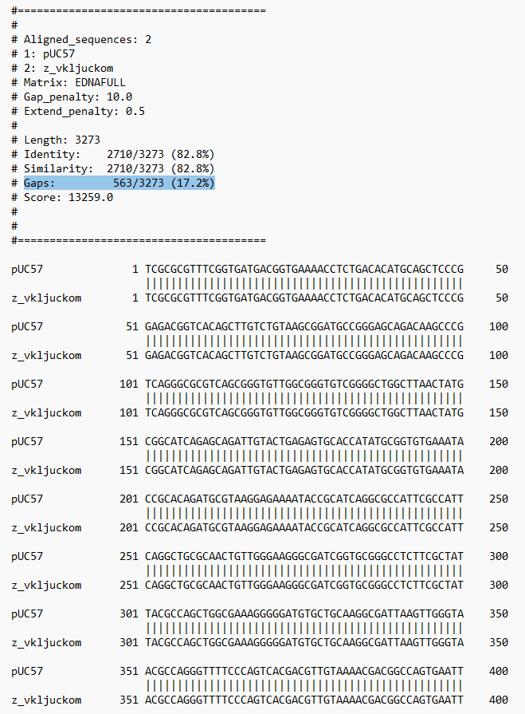 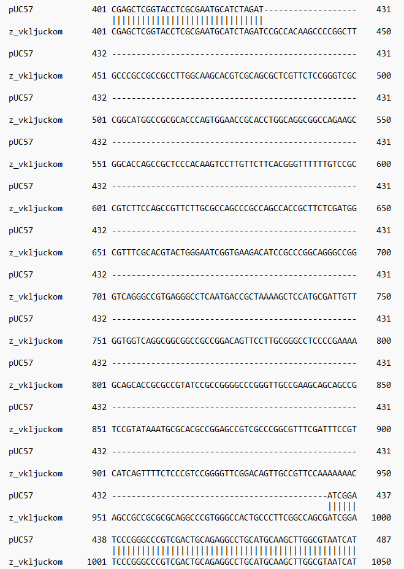

Za identifikacijo proteina, zapisanega na vključku, sem nukleotidno zaporedje vključka vnesla v program BLASTX in iskala po bazi *Metagenomic proteins*. Rezultati so pokazali, da je na vključku zapis za protein [ribonukleazo HI](https://www.ncbi.nlm.nih.gov/protein/KUG28060.1?report=genbank&log$=prottop&blast_rank=1&RID=4W0PUC0R016) iz okoljskega vzorca.

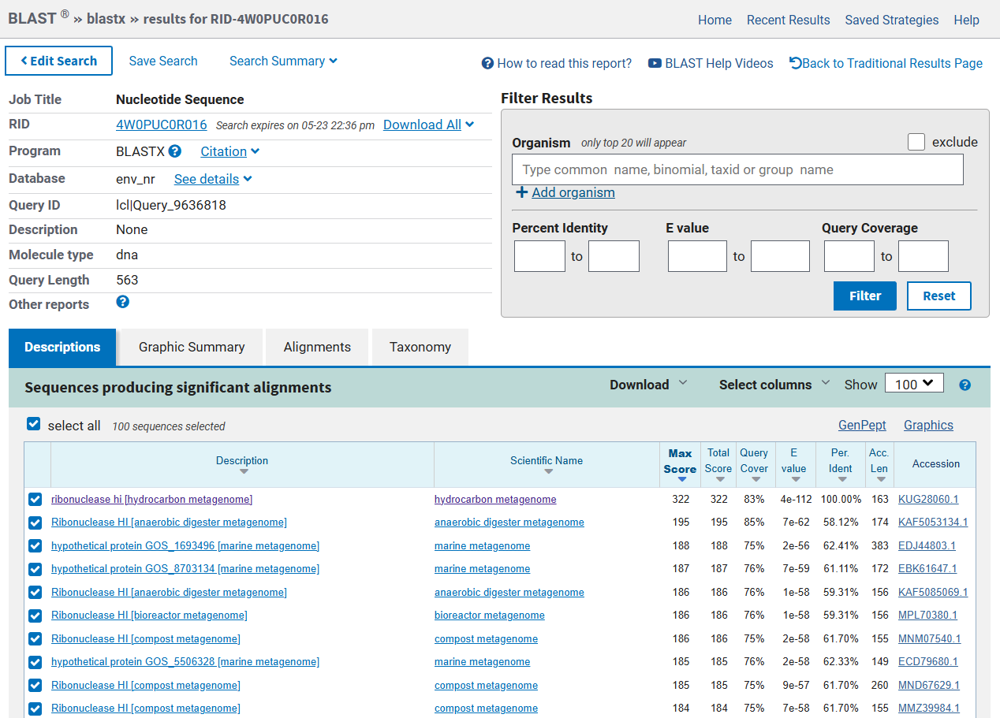

Iz globalne poravnave (algoritem Needleman-Wunsch) nukleotidnega zapisa na vključku in celotnega zapisa za identificirano ribonukleazo lahko vidimo, da na 5' koncu vključka manjka prvih 20 nukleotidov zapisa za ribonukleazo HI, na 3' koncu pa vključek vsebuje del zaporedja, ki ne kodira za ribonukleazo HI. 

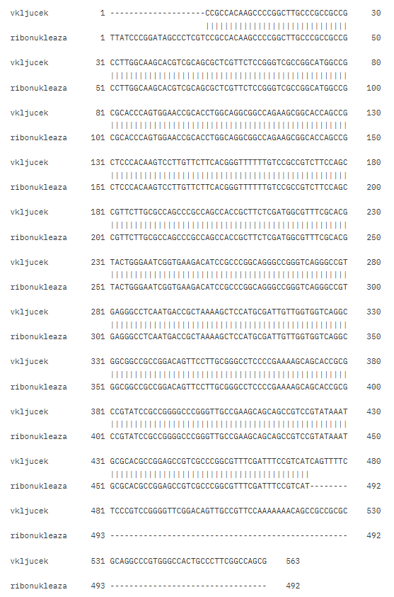

### 2. Lastnosti proteina

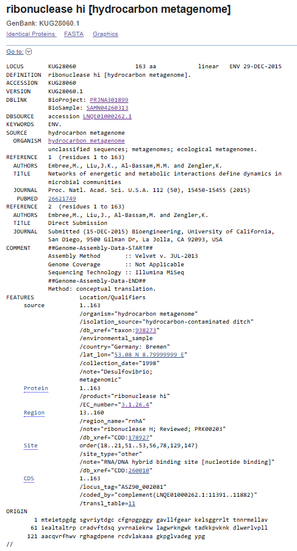

Najdena ribonukleaza se nahaja v UniProt-u pod kodo [A0A0W8G4V6](https://www.uniprot.org/uniprotkb/A0A0W8G4V6/entry). Ker je le ta slabo anotirana, sem s programom BLASTP, v bazi UniProtKB/Swiss-Prot poiskala anotiran protein, ki se je najbolje ujemal z identificirano ribonukleazo HI. Na lokacijo proteina v celici in post-translacijske modifikacije proteina (oziroma odsotnost teh) sem sklepala na osnovi ribonukleaze H iz bakterije *Desulfovibrio vulgaris* - [B8DIU7](https://www.uniprot.org/uniprotkb/B8DIU7/entry).

* Ime: ribonukleaza HI
* Izvorni organizem: ni znan, protein je bil najden v okoljsekm vzorcu
* Velikost proteina: 163 ak
* Lokalizacija: citoplazma
* Post-translacijske modifikacije: /
* Domenska zgradba: RNazna H domena tipa-1 med aminokislinskimi ostanki 9-151

### 3. Funkcija proteina
Ribonukleaza HI je endonukleaza, ki specifično cepi RNA v RNA-DNA hibridih. Je monomerni protein, za delovanje pa potrebuje magnezijeve ione. Veže en magnezijev ion na podenoto, lahko pa veže še en kovinski ion na regulatornem mestu ali po vezavi substrata.

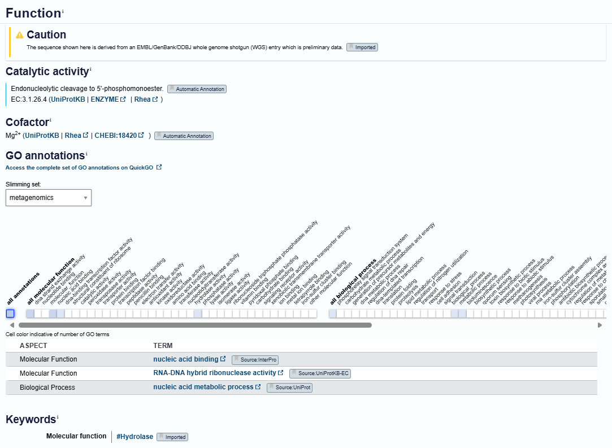

### 4. Sorodni proteini
Na spodnjih dveh slikah lahko vidimo najdene sorodne ribonukleaze pri različnih prokariontskih organizmih. Protein, ki je najbolj podoben temu z vključka, se nahaja pri bakteriji *Desulfolutivibrio sulfodismutans*. Na drugi sliki lahko vidimo rezultate iskanja sorodnih prokariontskih ribonukleaz pri prokariontskih organizmih pri iskanju po bazi Uniprot/Swiss-prot. Vidimo lahko, da so vse ribonukleaze HI prokariontskih organizmov podobne dolžine.

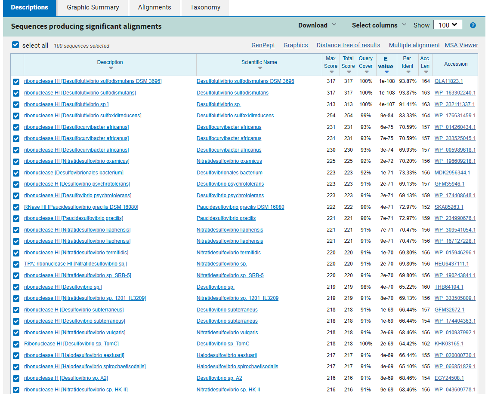
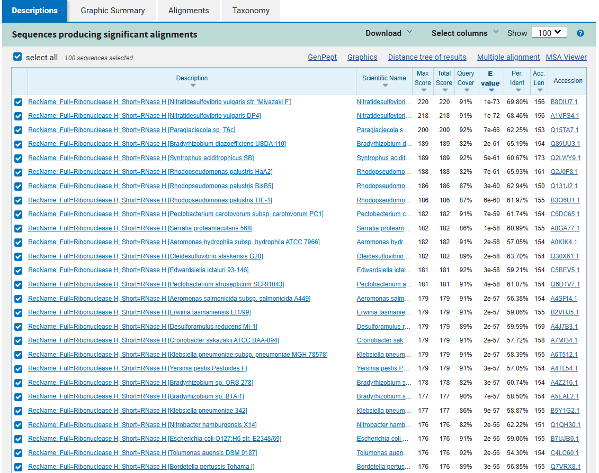

Podobne proteini najdemo tudi pri evkariontskih organizmih. Te sem poiskala tako, da sem v pBLAST-u iskala po orgnaizmih *Eukaryota* (prikazano na prvi od spodnjih slik). Vidimo lahko, da prvi zadetki pokažejo ribonukleazo HI pri preprostejših evkariontih, kot so spužve (*Geodia barretti*) in členonožci (*Culicoides impunctatus, Idotea baltica*). Iskanje sem nato ponovila, le da sem iskala po bazi UniProt/Swiss-prot, in našla ribonukleazo HI tudi pri najbolj razvitih evkariontskih organizmih, in sicer pri dveh vrstah kvasovk, podgani, miši in človeku (prikazano na drugi od spodnjih slik). Tudi v evkariontskih organizmih se protein imenuje ribonukleaza HI in ima enako funkcijo kot pri prokariontih. Glavna razlika med ribonukleazo HI pri preprostejših in kompleksnejših evkariontih je, da imajo kompleksnejši evkarionti daljši protein ribonukleazo, saj so poleg RNazne domene tipa-1 pristone še druge domene.

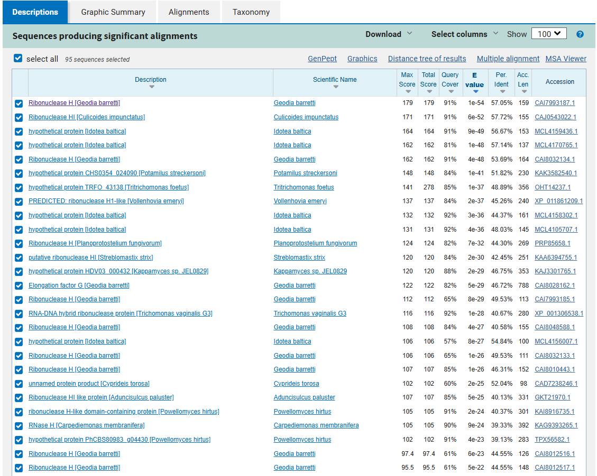
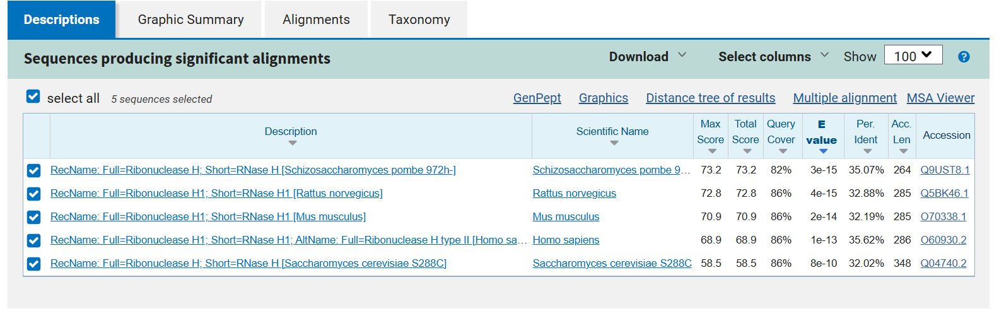

### 5. Filogenetsko drevo
Na spodnji sliki je prikazano filogenetsko drevo ribonukleaz HI iz različnih prokariontskih in evkariontskih organizmov. Kot smo ugotovili že pri iskanju podobnih proteinov z BLAST-om, je ribonukleaza HI z vključka najbolj sorodna ribonukleazi HI iz rodu bakterij *Desulfolutivibrio*. 
(Ribonukleazo HI z vključka lahko na sliki najdemo spodaj desno, pod oznako [hydrocarbon metagenome]).

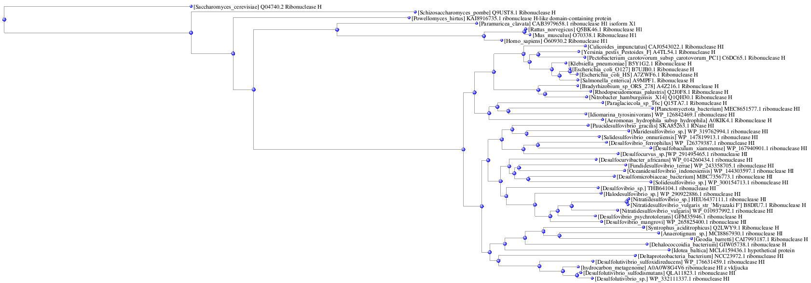

### 4. Domenska zgradba proteina in ohranjenost domen 
Ribonukleaza HI (A0A0W8G4V6, protein z vključka) ima v UniProt-u anotirano RNazno H domeno tipa-1 med aminokislinskimi ostanki 9-151. Za primerjavo te domene z enakimi domenami iz sorodnih prokariontskih ribonukleaz HI in človeške ribonukleaze HI, sem naredila poravnavo teh domen v Cobaltu, nato pa izrisala WebLogo. Na prvi od spodnjih sliki lahko vidimo veliko ohranjenost aminokislinskih ostankov med RNaznimi H domenami tipa-1 v različnih proteinih, na drugi pa je prikazana poravnava zaporedji v Cobaltu.

Na spodnji sliki lahko opazimo verzeli med mesti 43-45 in 64-65. To je posledica dodatnih aminokislinskih ostankov na teh mestih pri človeški ribonukleazi HI.

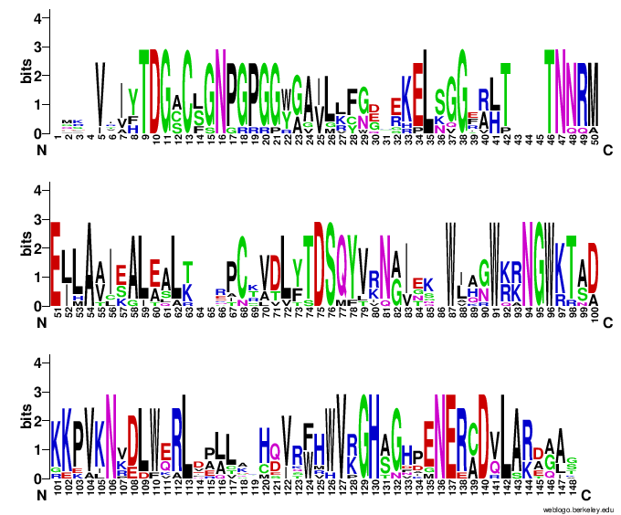
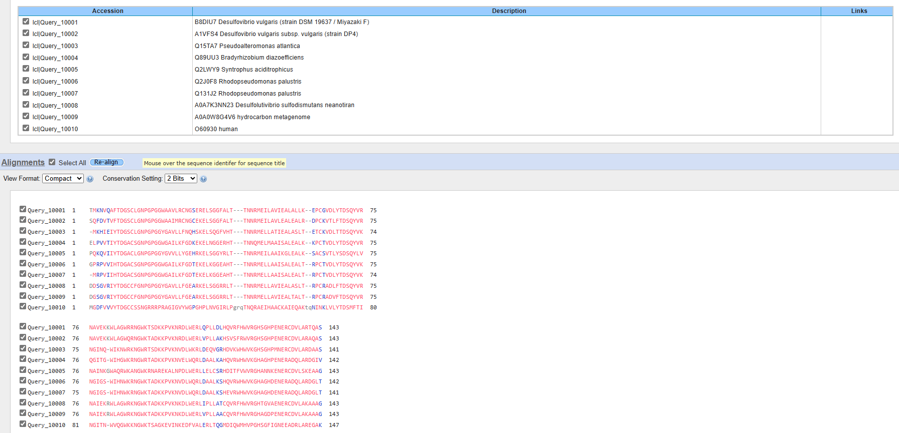

V podobnih proteinih lahko znotraj RNazne domene tipa-1 najdemo 5 aminokislinskih ostankov, ki so pomembni za vezavo magnezija. Za identifikacijo teh aminokislinskih ostankov v analizirani ribonukleazi HI (A0A0W8G4V6), sem jo v UniProt-u poravnala z najbolj sorodno anotirano ribonukleazo H (B8DIU7). Na prvi sliki sta z vijolično označeni RNazni domeni v obeh proteinih, na drugi sliki pa so s črnimi kvadratki označena vezavna mesta obeh proteinov. Iz poravnave lahko vezavna mesta za magnezijeve ione v analizirani ribonukleazi HI identificiramo na aminokislinskih ostankih: Asp18 (vezavno mesto za 2 Mg2+ iona), Glu56, Asp78 in Asp143. Na zgornji sliki WebLogo lahko na mestih 10, 51, 75 in 140 vidimo, da so vsa vezavna mesta med sorodnimi proteini ohranjena.

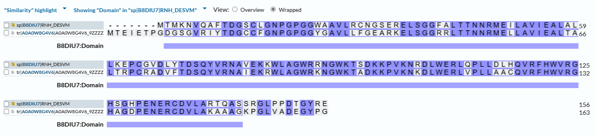
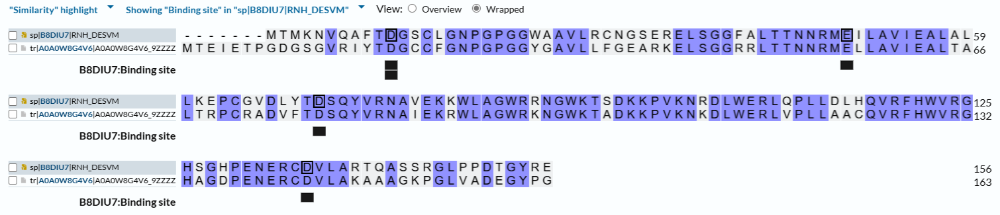

### 5. Medproteinske interakcije
O medproteinskih interakcije proteina sem sklepala na osnovi medproteinskih interakcij proteina ribonukleaze H iz bakterije *Desulfovibrio vulgaris* (B8DIU7). Podatke o medproteinskih interakcijah sem našla v programu STRING, povezava do tega pa je bila  UniProtu-u pri proteinu B8DIU7.

Vidimo lahko, da ribonukleaza H večinoma interagira s proteini, ki so pomembni pri interakciji z DNA kot so topoizomeraza I, DNA polimeraza I, pirolin-5-karboksilat reduktaza,...

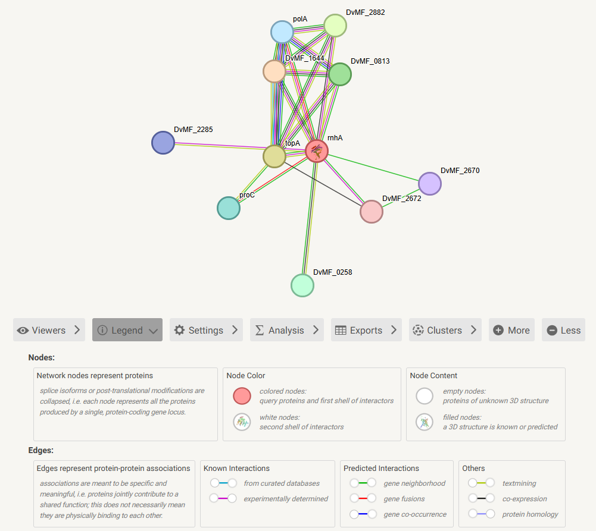
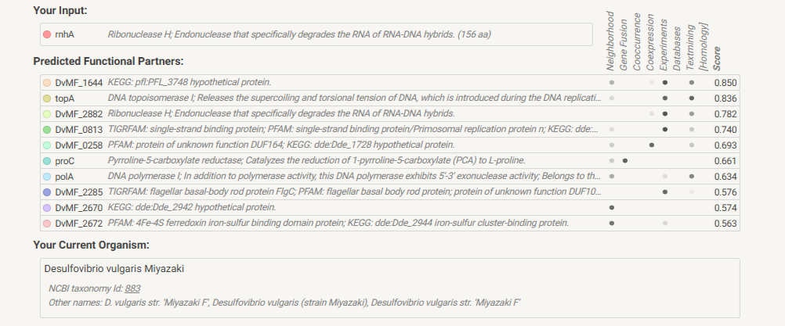

Podobne interakcije ribonukleaze HI s proteini, ki interagirajo z DNA, lahko najdemo tudi pri ribonukleazi HI iz *E. Coli*, medtem ko človeška ribonukleaza HI interagira še z dodatnimi proteini.

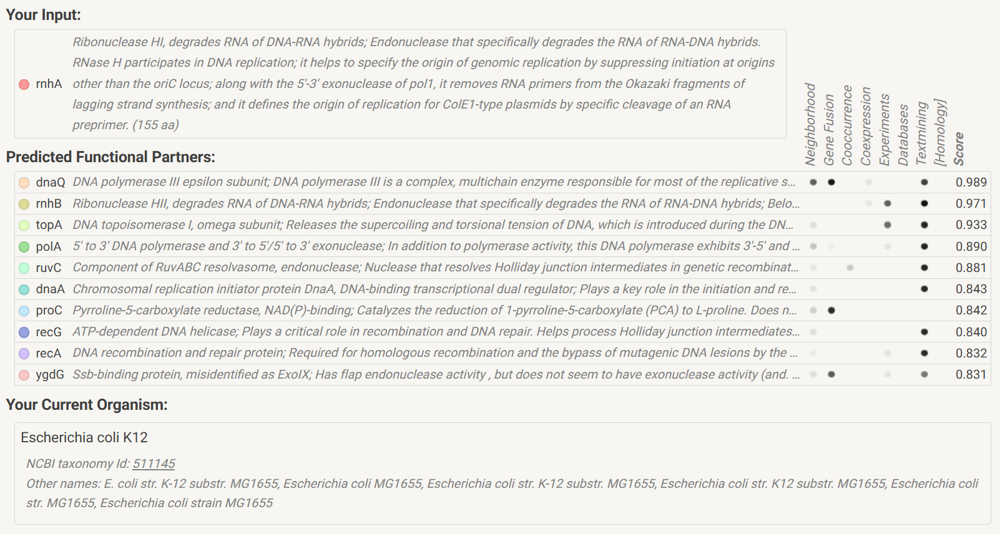 
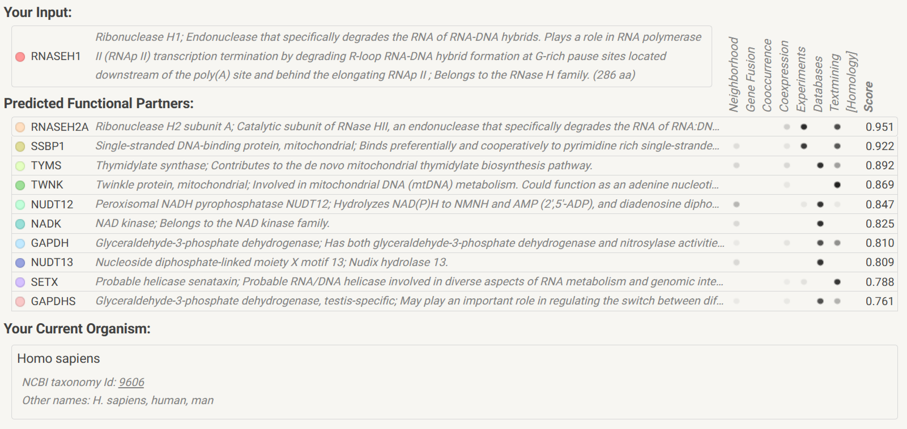

### Struktura proteina
Za pripravo modela strukture ribonukleaze HI sem uporabila AlphaFold2. Spodnji sliki prikazujeta predviden model struktrue. Na prvi sliki je protein pobarvan od N proti C koncu, na drugi pa po pLDDT faktorju. Z druge slike lahko vidimo, da je model strukture zanesljivo napovedan, z izjemo nestrukturiranih N in C končnih regij.

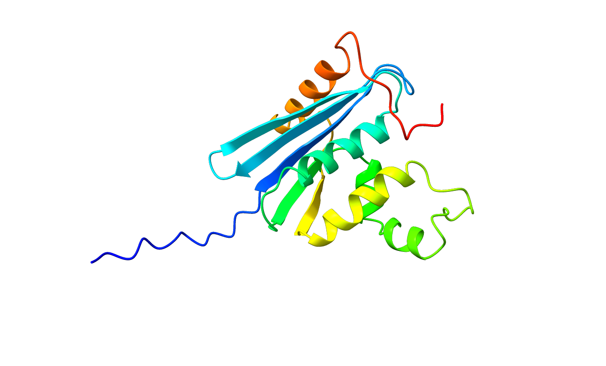
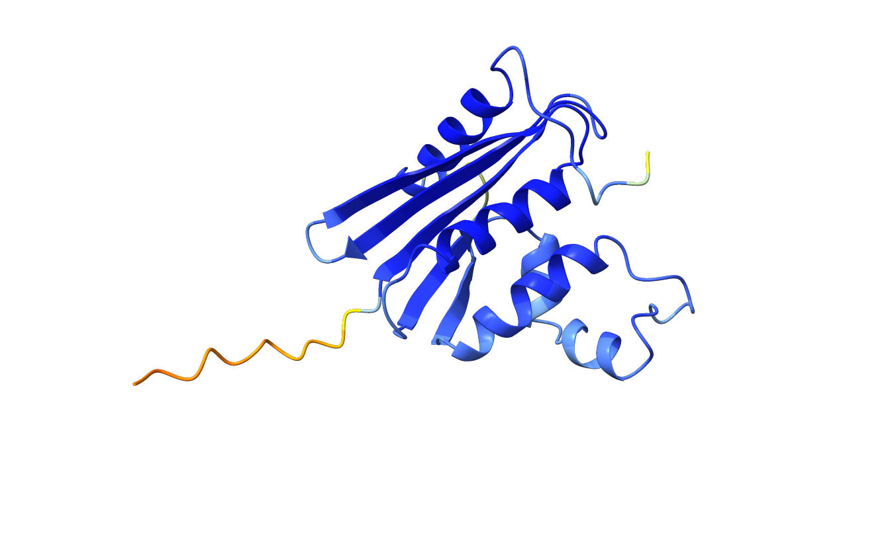

Na spodnji sliki je prikazana superpozicija naslednjih struktur: analizirana ribonukleaza HI (zelena), ribonukleaza HI iz *E. Coli* (modra, PDB 1GOC) in človeške ribonukleaze HI (roza, PDB 2QK9) (prvih 133 aminokislinskih ostankov pri strukturi človeške ribonukleaze HI ni prikazanih). Vidimo, da se strukture, z izjemo nestrukturiranih končnih verig in vmesnih zavojev, dobro ujemajo.

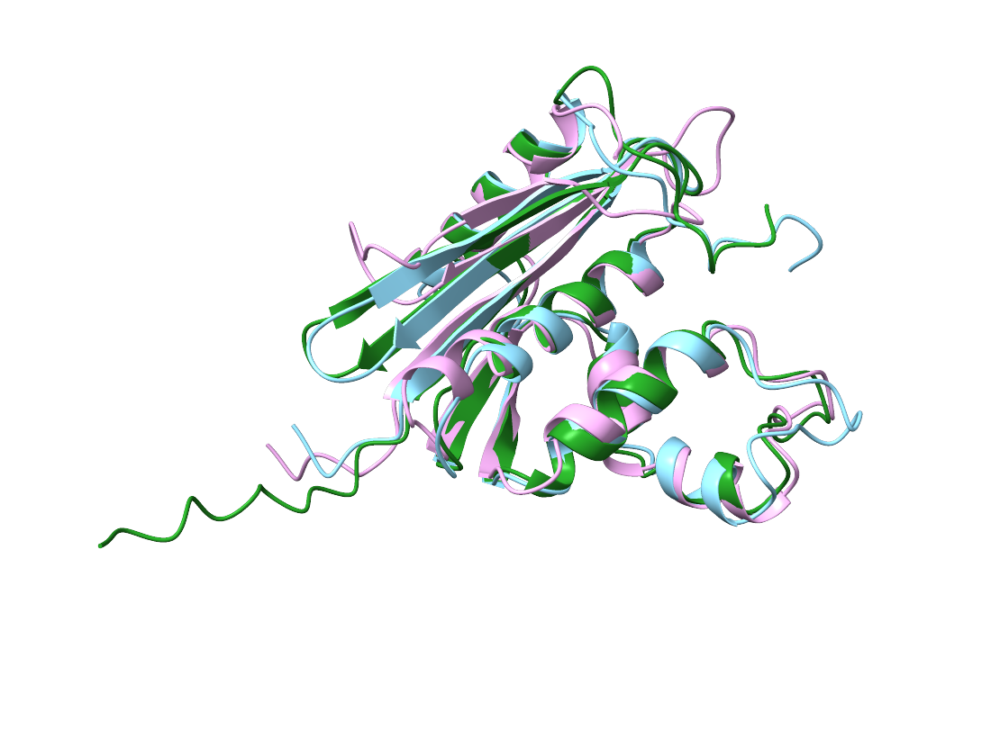