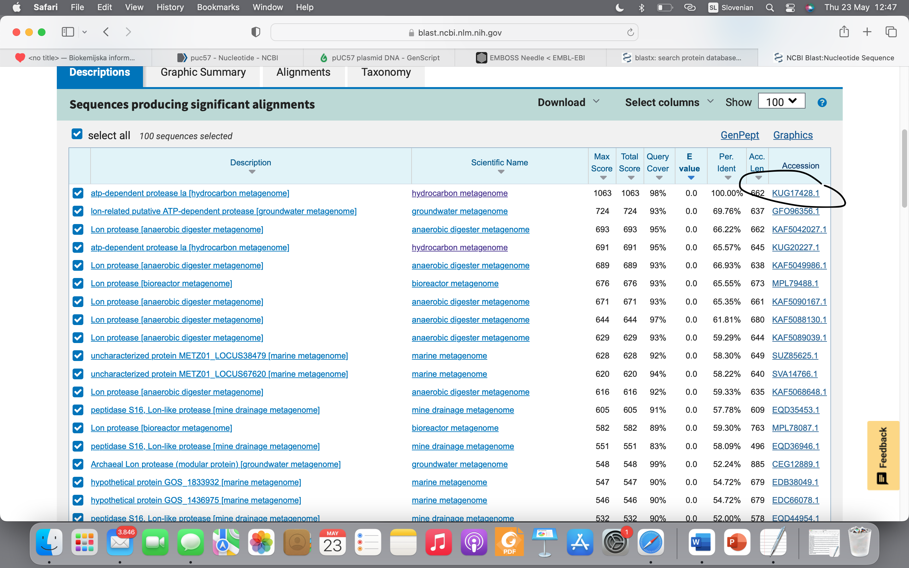
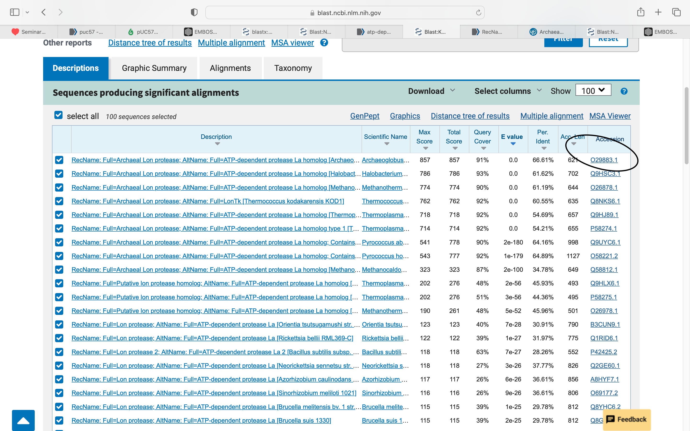
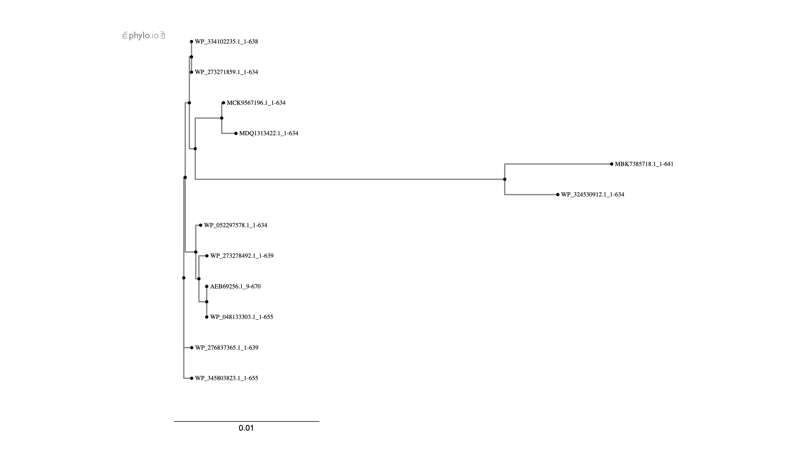
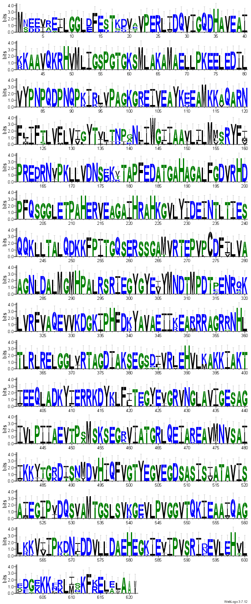
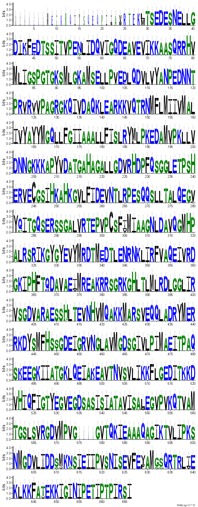
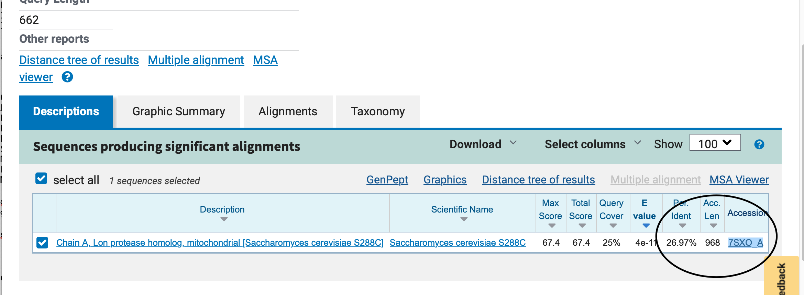
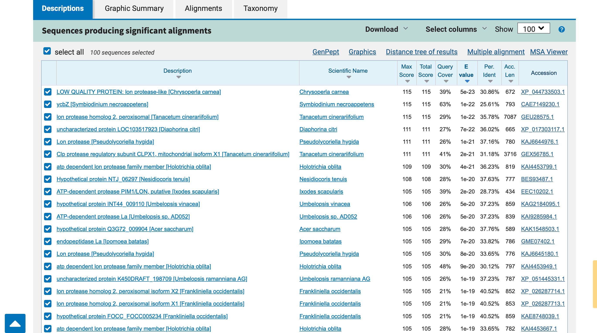
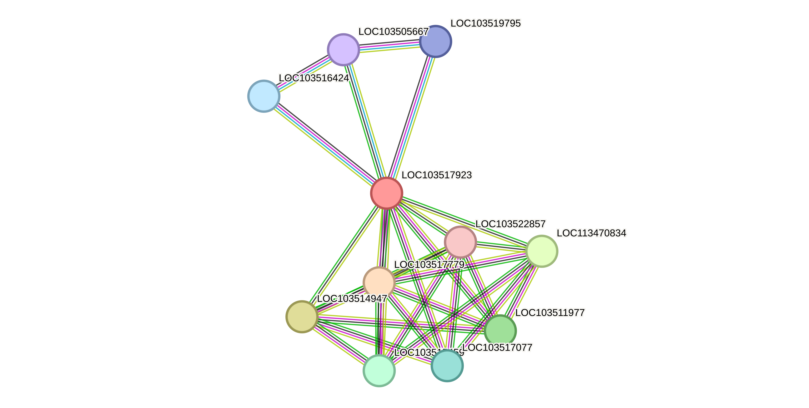
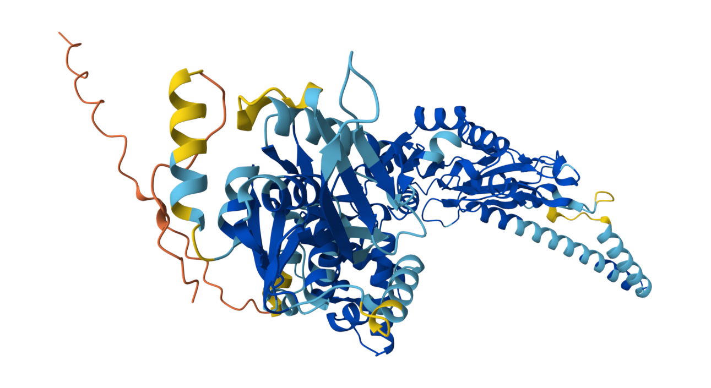
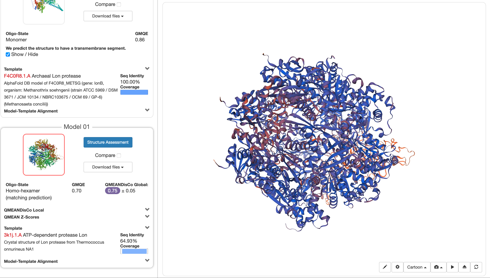

{\rtf1\ansi\ansicpg1252\cocoartf2639
\cocoatextscaling0\cocoaplatform0{\fonttbl\f0\fmodern\fcharset0 Courier;\f1\fnil\fcharset0 Menlo-Regular;}
{\colortbl;\red255\green255\blue255;\red255\green255\blue255;\red0\green0\blue0;\red12\green12\blue12;
}
{\*\expandedcolortbl;;\cssrgb\c100000\c100000\c100000;\cssrgb\c0\c0\c0;\cssrgb\c5098\c5098\c5098;
}
\paperw11900\paperh16840\margl1440\margr1440\vieww16640\viewh14020\viewkind0
\deftab720
\pard\pardeftab720\partightenfactor0

\f0\fs26 \cf0 \expnd0\expndtw0\kerning0
# S41\
\
- **Avtor**: Anita Mulali\uc0\u263 \
- **Datum izdelave**: 2024-05-22\
- **Koda seminarja**: S41\
\
---\
## Vhodni podatek\
\
Povezava do datoteke z vhodnim podatkom: [S41](naloge/s41-input.md)\
\
---\
## Rezultati analiz\
\
### Poravnava \
\
Za za\uc0\u269 etek identifikacije je bila potrebna poravnava nukleotidnega zaporedja vektorja pUC57 in na\'9aega plazmidnega konstrukta. Poravnava je bila izvedena z EMBOSS Needle programom. Pred tem se je bilo treba prepri\u269 ati, da je bilo nukelotidno zaporedje na\'9aega konstrukta na za\u269 etku enako kot pri samem izvornem plazmidu (\u269 e ni bilo temu tako, smo morali sam kontrukt preurediti). S poravnavo smo \'9eeleli identificirati na\'9a vklju\u269 ek, ki smo ga lahko prepoznali, saj se naj ne bi nahajal v zaporedju izvornega plazmida. Z identificiranim vklju\u269 kom sem nadaljevala z identifikacijo proteina.\
\
\
### Identifikacija\
Identifikacija je bila narejena z uporabo NCBI BLAST, blastx (baza podatkov: metagenomski proteini). Dobila sem protein s 100% identi\uc0\u269 nostjo:\
\
\pard\pardeftab720\partightenfactor0

\f1 \cf0 \cb2 >KUG17428.1 atp-dependent protease la [hydrocarbon metagenome]\
MIWKEKSMETKHQIYSQEQPIIAVRTEKLTSEDESNELLGDIKFEDTSSITVPENLIDQVIGQDEAVEVI\
KKAASQRRHVMLIGSPGTGKSMLGKAMSELLPVEDLQDVLVYANPEDNNTPRVRVVPAGRGKQIVDAQKL\
EARKKVQTRNMFLMIIVMALIVYAYYMGQLLFGIIAAALLFISLRYMLPKEDAMVPKLLVDNNGKKKAPY\
VDATGAHAGALLGDVRHDPFQSGGLETPSHERVECGSIHKAHKGVLFIDEVNTLRPESQQSLLTALQEGV\
YQITGQSERSSGALVRTEPVPCSFIMIAAGNLDAVQGMHPALRSRIKGYGYEVYMRDTMEDTLENRNKLI\
RFVAQEIVRDGKIPHFTQDAVAEIMREAKRRSGRKGHLTLMLRDLGGLIRVSGDVARAESSHLTEVNHVM\
QAKKMARSVEQQLADRYMERRKDYSMFHSSGDEIGRVNGLAVMGDSGIVLPIMAEITPAQSKEEGKIIAT\
GKLQEIAKEAVTNVSVLIKKFLGEDITKKDVHIQFIGTYEGVEGDSASISIATAVISALEGVPVKQTVAM\
TGSLSVRGDVMPVGGVTQKIEAAAQAGIKTVLIPKSNMGDVLIDDSMKNSIEIIPVSNISEVFEFAMGSQ\
RTRLIEKLKKFATEKKIGINIPETIPTPIRSI\
\
\pard\pardeftab720\partightenfactor0

\f0 \cf0 \cb1 
\f1 \cb2 \
\
Protein, ki ga dobim z blastp (baza podatkov: swissprot) s 66% identi\uc0\u269 nostjo:  \
\
>sp|O29883.1|LONB_ARCFU RecName: Full=Archaeal Lon protease; AltName: Full=ATP-dependent protease La homolog\
MNEEVREILGGLDFESTKDVAVPERLIDQVIGQDHAVEAIKKAAVQKRHVMLIGSPGTGKSMLAKAMAEL\
LPKEELEDILVYPNPQDPNQPKIRLVPAGKGREIVEAYKEEAMKKAQARNFLIFTLVFLVIGYTVLTNPG\
NLIWGIIAAVLILMMSRYFIPREDRNVPKLLVDNSDKVTAPFEDATGAHAGALFGDVRHDPFQSGGLETP\
AHERVEAGAIHRAHKGVLYIDEINTLTIESQQKLLTALQDKKFPITGQSERSSGAMVRTEPVPCDFILVA\
AGNLDALMGMHPALRSRIEGYGYEVYMNDTMPDTPENRQKLVRFVAQEVVKDGKIPHFDKYAVAEIIKEA\
RRRAGRRNHLTLRLRELGGLVRTAGDIAKSEGSDIVRLEHVLKAKKIAKTIEEQLADKYIERRKDYKLFI\
TEGYEVGRVNGLAVIGESAGIVLPIIAEVTPSMSKSEGRVIATGRLQEIAREAVMNVSAIIKKYTGRDIS\
NMDVHIQFVGTYEGVEGDSASISIATAVISAIEGIPVDQSVAMTGSLSVKGEVLPVGGVTQKIEAAIQAG\
LKKVIIPKDNIDDVLLDAEHEGKIEVIPVSRINEVLEHVLEDGKKKNRLMSKFKELELAAV\
\

\f0 \cb1 \
\
Podatki anotiranega proteina z identifikacijsko kodo \'93O29833\'94 v UniProt-u:\
\pard\pardeftab720\partightenfactor0

\f1 \cf0 \cb2 \
\pard\pardeftab720\partightenfactor0

\f0 \cf0 \cb1 **Protein*: arhealna lon proteaza \
**Organizem**: Archaeoglobus fulgidus (ekstremofilna arheja)\
\
LOKACIJA: Celi\uc0\u269 na membrana (transmembranski protein)\
VELIKOST IDENTIFICIRANEGA PROTEINA: 662 AK\
DOMENSKA ZGRADBA: \
* citoplazemska domena: 1-117 aa\
* transmembranska domena: 118-136\
* zunajceli\uc0\u269 na domena: 137-141\
* transmembranska domena: 142-160\
* citoplazmeska domena: 161-621\
(* proteolitska domena : 432-602 aa)\
\
\
\
POST-TRANSLACIJSKE MODIFIKACIJE: ni podatka\
AKTIVNO MESTO: 509 aa-S; 552 aa-K\
KOFAKTOR: ni anotiran\
FUNKCIJA PROTEINA: ATP-odvisna serinska proteaza, ki posreduje pri selektivni razgradnji mutantnih in abnormalnih proteinih ter dolo\uc0\u269 enih kratko\'9eive\u269 ih regulatornih proteinih. Postopno razgrajuje polipeptide.\
\
### Sorodni proteini\
\pard\pardeftab720\partightenfactor0

\f1 \cf0 \cb2 \

\f0 Pri izdelavi filogenetskega drevesa je bilo najprej potrebno zaporedje proteina vstaviti v blastp (PSI-BLAST) ter vzeti nekaj sorodnih proteinov (12), jih prenesti in vstaviti v Clustal Omega ter dobljeno datoteko vnesti v phylo.io.
\f1 \
\
\pard\pardeftab720\partightenfactor0

\f0 \cf0 \cb1 \
\pard\pardeftab720\partightenfactor0

\f1 \cf0 \cb2 \
\pard\pardeftab720\partightenfactor0

\f0 \cf0 \cb1 ### Ohranjene regije\
\
Pri ugotavljanju ohranjenih regij proteina je bilo potrebno uporabiti blastp, Cobalt ter Weblogo.\
Pri\uc0\u269 akujemo, da bo pri anotiranem proteinu ohranjen serin na 509. mestu, saj je to serinska proteaza; rezultati se tudi skladajo s pri\u269 akovanji. Najmanj pa so ohranjena mesta na za\u269 etku ter koncu aminokislinksega zaporedja. \
\
\
\
\
### Podobni evkariontski proteini\
\
Identificiranemu proteinu je v PDB zbirki najbolj podoben protein s 27% identiteto; identifikacijska koda v PDB \'937sxo\'94. V zbirki \'93nr\'94 pa je najbolj podoben protein s 30% identiteto.\
\
\
\
\
### Funkcijska povezanost s proteini\
\
Za analizo funkcijske povezanosti z drugimi proteini sem uporabila program STRING, v katerega sem vnesla aminokislinsko zaporedje identificiranega proteina. Analiza poka\'9ee, da so razli\uc0\u269 no izra\'9eeni geni vklju\u269 eni v znane predvidene interakcije protein-protein. Vozli\'9a\u269 a predstavljajo gene, razli\u269 ne barvne \u269 rte pa napovedi povezav. Vne\'9aen protein je ozna\u269 en z vozli\'9a\u269 em rde\u269 e barve. \
\
\
\
### Strukturna karakterizacija\
\
Do modela strukture identificiranega proteina pridemo s pomo\uc0\u269 jo AlphaFold. Program napove 3D strukturo proteina glede na njegovo aminokislinsko zaporedje. pLDDT \cf4 je merilo zanesljivosti napovedane tridimenzionalne strukture proteinov na ravni posameznih aminokislin.\cf0  Temno modri deli imajo najvi\'9aji pLDDT, za razliko od oran\'9enih, ki imajo najmanj\'9ao zanesljivost napovedane strukture. \
\
\
\
### Superpozicija\
\
Superpozicijo pripravim s pomo\uc0\u269 jo izrisa modela v Swiss-Model. Model odprem v programu Chimera in poravnam verigi modelov podobnih proteinov (za model podobnega proteina uporabim strukturo s PDB kodo \'937SXO\'94). Moj protein je obarvan vijoli\u269 no, veriga podobnega proteina pa je obarvana modro. \
Rmsd pri ujemanju \cf4 najbolj reprezentativnih delov za primerjavo dveh struktur je 0,994, kar ka\'9ee na dobro ujemanje med temi deli struktur. \
\cf0 \
\
\
\
}