# S42

- **Avtor**: Tonja Oman Sušnik
- **Datum izdelave**: 2024-05-17
- **Koda seminarja**: S42

---
## Vhodni podatek

Povezava do datoteke z vhodnim podatkom: [S42](naloge/s42-input.md)

-**Zaporedje vključka**:
TCCCTGCTGCCTGTATGAACCGGGGGTGGCACCGGTATGCTAACGGGTGCGACGCCTGACGGGATGGATCTGCGGATTCTCAACGCCCTGCAGGACGATATCCCGCTGGTCCCCCGGCCCTATGCGGTACTCGCAGAGCGATTGGGCATCTCCGAGCAGGTGTTTCTCGAACGGGTGCAGTGTCTCCGGGAGGCGGGCATCGTGCGGAGCATTGCTCCCACCCTTGAACCCCATGTCATGGGGCTTGCTGCTTCAACCCTGGTCGCCCTCCGTGTTCCCGAGGGAAGGGTACACGAGGTTGCAGCCATCATCAGCAGCTACCCCCAGGTCTCCCACAATTTCCGGCGGGACCACCCCTTCACGCTCTGGTTCACCCTCGCCGGTACGAGCGAAGAGGAGATACAGGATGTGCTGCGTGAGATCCTCCAGAGGACAGGAATTCCGGATACGGATGTCCTGGACCTCCCGACGGTACGGAAGCTGAAGGTCGATGTGCGGTTCTCATTTTTCATGGACGACGATGGGGGGGGCAGGGATGGACCCGCTTGACCTTCAGTTGCTCGCTCTCCTTGAGGAGGGGCTCCCTTTTGTCAGCGAACCCTACGACGAGATCGGAAAGCAGTTGAACCTTACCGGCAGCGAGGTTCTCGAGAGGATCC

-**AK zaporedje**
MDLRILNALQDDIPLVPRPYAVLAERLGISEQVFLERVQCLREAGIVRSIAPTLEPHVMGLAASTLVALRVPEGRVHEVAAIISSYPQVSHNFRRDHPFTLWFTLAGTSEEEIQDVLREILQRTGIPDTDVLDLPTVRKLKVDVRFSFFMDDDGGGRDGPA

---
## Rezultati analiz
### Zporedje vključka:
Nukleotidno zaporedje vključka smo določili tako, da smo z EMBOSS Water izvedli lokalno poravnavo zaporedja plazmida z vključkom in brez. Ker gre za dobro poznan plazmid pUC57, njegovega zaporednja na spletu ni bilo težko poiskati. Obe zaproedji smo prekopirali v za to namenjen prostor in pognali poravnavo.

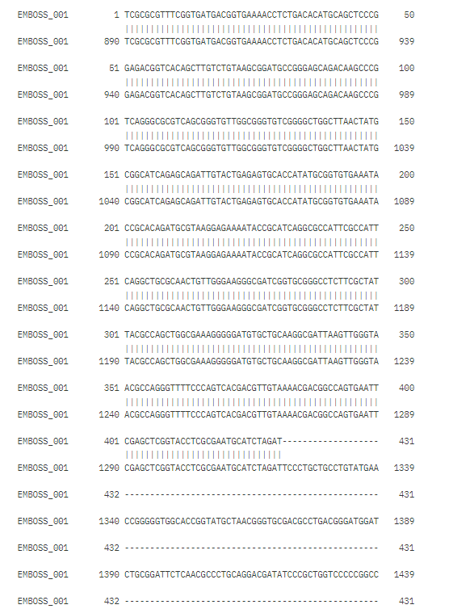
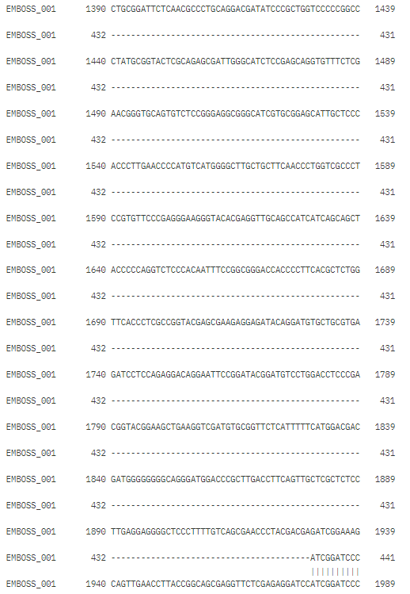

Dobljeno nukleotidno zaporedje smo nato vstavili v BLASTx in iskali po zbirki *Metagenomic proteins*. Našli zadetek s 100% ujemanjem.

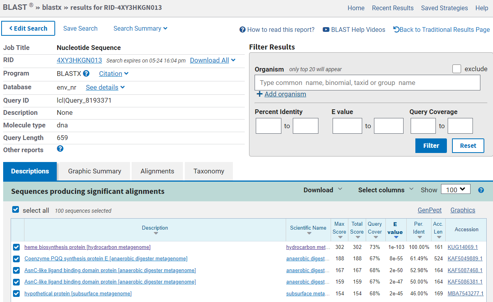 

### Lastnosti in velikost proteina:
 S klikom na kodo KUG14069.1 pod razdelkom *accession* v BLAST-u, nas povezava vodi neposredno do podatkovne zbirke Genbank, kjer lahko najdemo dodatne podatke o proteinu.  Gre za protein, ki sodeluje pri biosintezi hema in izhaja iz hidrokarbonskega genoma. Protein je dolg 161 aminokislinskih ostankov.

 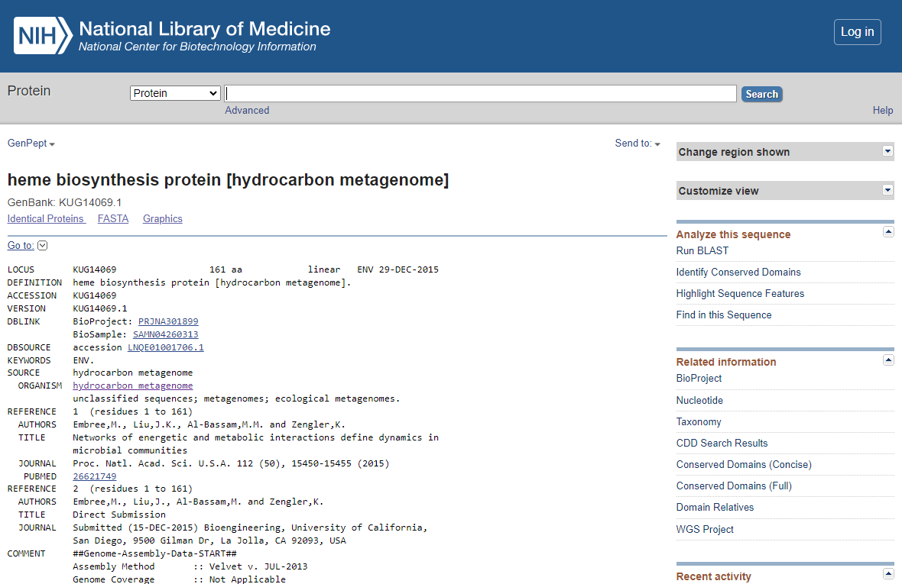

 Pod razdelkom CDS v Genbank poleg doližine zaporedja, najdemo tudi opombo, ki navaja, da je naš protein soroden nirD in nirG. Oba ta dva proteina sta podenoti sirohem dekarboksilaze in tako sodelujeta v sintezi porfirinov iz sirohema. V nekaterih vrstah bekterij najdemo obe podenoti, medtem ko v drugih zgolj eno. Kot že omenjeno, ima enako vlogo tudi naša "preiskovana" hem dekarboksilaza.

 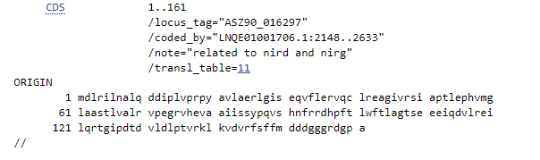

Da smo zaporedje še dodatno preverili in potrdili naša predvidevanja, smo ga vstavili v Uniprot, kjer smo v iskalno okno *Peptide search* vnesli aminokislinsko zaporedje našega proteina, ki smo pridobili iz Genbank. Kot edini zadetek nam je program našel idetntičen protein, kot smo ga že prej našli z BLASTx. Kot vidimo na [povezavi](https://www.uniprot.org/uniprotkb/A0A0W8EZK7/entry), je najdeni protein zares sirohem dekarboksilaza iz 161ak. 

 ### Sorodni proteini:
V nadaljnjem "raziskovanju" smo se oprli na dejstvo, da je naš protein podoben nirD in nirG ter iskali sorodnost s proteini, ki opravljajo podobno funkcijo. Kljub temu, da smo protein našli v Uniprotu, je bil slabo anotiran, zato smo si pri nadaljnji analizi želeli pomagati še z drugimi proteini. Aminokislinsko zaporedje našega proteina smo vnesli še v BLASTp, da bi poiskali sorodne proteine. Kot najustreznejša oziroma najbolj ujemajoča zaporedja smo našli različne transkripcijske regulatorje, ki pa se seveda po funkciji ne ujemajo z našim proteinom in zato niso ustrezni zadetki. Z nekoliko nižjim ujemanjem (61,22%) pa smo našli zatetek za podenoto alfa sirohem dekarboksilaze iz organizma Methanosphaerula palustris. Ta protein je po funkciji enak našemu proteinu, vendar pa ujemanje zaporedij ni ravno optimalno. Tudi zaporadja z nižjim odstotkom ujemanja so bila slabo anotirana, zato smo se v nadaljevanju raziskovanja lastnosti našega vključka, osredotočili predvsem na ta protein.

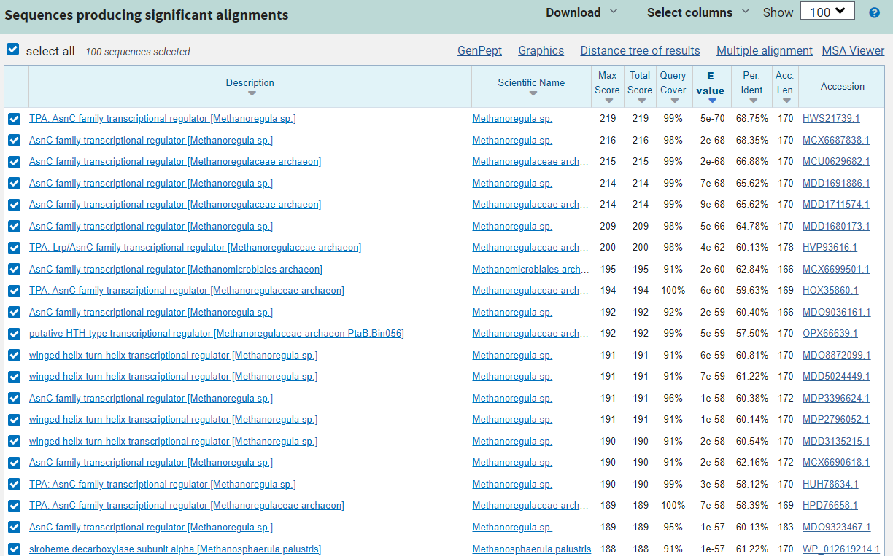 

### Lokalizacja, topologija:
 Noben izmed soorodnih proteinov nam ni podal odgovara na vprašanje lokalizacije proteina, vendar lahko glede na njegovo funkcijo sklepamo, da ta encim lahko najdemo v citoplazmi bakterijskih celic. 
 
 ### Domenska zgradba:
 Domensko zgradbo smo po drugi strani lahko razbrali že iz podatkov za osnovni protein na Uniprotu. Setstavljen je iz domene tipa HTH asnC in sirohem decarboksilazne AsnC-podobne ligand vezavne domene. 

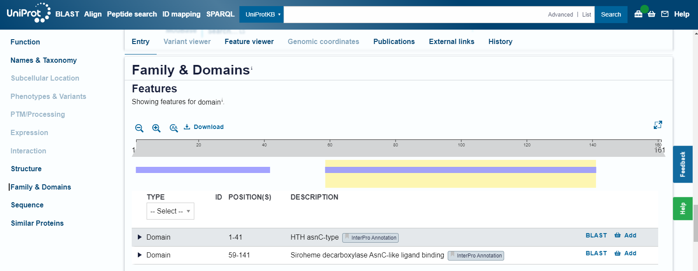

S tem smo si odgovorili tudi na vprašanje, zakaj je bila tolikšna podobnost najdena s transkripcijskimi faktorji, ki nimajo nobene povezave s sirohem dekarboksilazo. Podobne domene namreč najdemo tudi  prej omenjenih transkripcijskih faktojih, zaradi česar je bilo ujemanje z njimi celo večje kot z dejansko podobnimi proteini, ki sicer pravtako imajo takšni domeni ali pa vsaj eno izmed njih. 

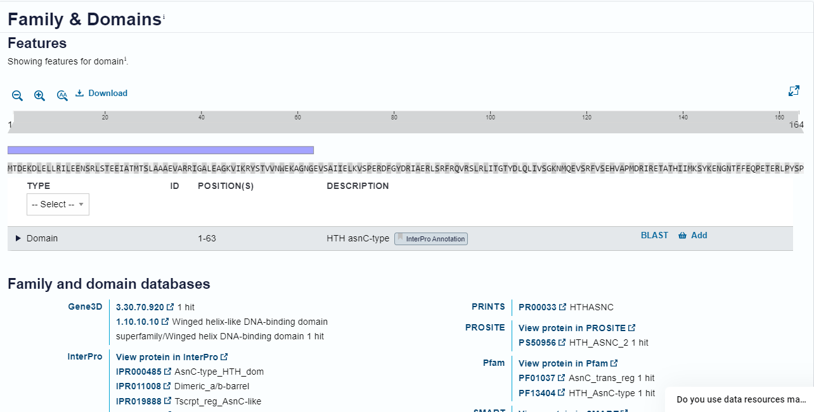

### Postranslacijske mosifikacije
Posttranslacijske modifikacije hem dekarboksilaze niso znane, niti niso poznane pri njemu sorodnih proteinih. To smo ugotovili tako, da na Uniprot pod zavihkom *PTM/processing*, kjer je možno izbrati *TYPE*, ni bilo mogoče izbrati drugega kot pa *Chain*. 

### Funkcija proteina:
Encim sodeluje v metabolizmu profirinov in s tem sintezi hema. Substrat sirohem se ob prisotnosti vodikovih protonov veže na encim, ki sirohem pretvori v 12,18-didecarboxysiroheme, kot stranski produkt pa nastaja ogljikov dioksid.

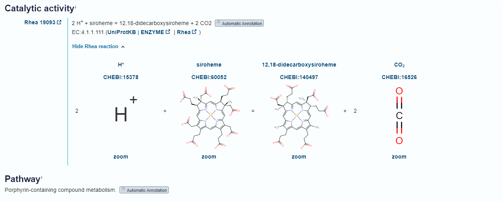

### Aktivno mesto:
Da bi ugotovili, kje je ima dekarboksilaza aktivno mesto, smo poravnavo izvedli z edinim priblžno podobnim proteinom (38,61%), ki je imel določeno aktivno mesto, s sirohem dekarboksilazo iz Hydrogenobacter thermophilus. H.thermophilus ima aktivno mesto na His93, ki se ob poravnavi sklada tudi z našim proteinom. V primeru proteina, ki ga analiziramo, je to His91, ki ga najdemo na sirohem decarboksilazni AsnC-podobni ligand vezavni domeni. Takšen odgovor je smiseln,daj nam že samo ime domene pove, da je na to domeno veže substrat.

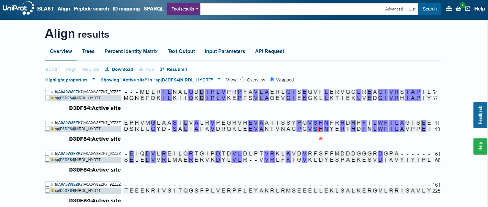

### Poravnava več zaporedij:
Kot že omenjeno so ene izmed najbolj sorodnih zaporedij proteinske podenote nirG in nirD. Izvedli poravnavo, kjer smo vključili nekatere izmed teh proteinov ter dodatne sirohem dekarboksilaze, ki jih najdemo v bakterijah,vključno s tisto, ki smo jo označili za najboljše ujemanje. Ob poravnavi vseh zaporedji smo opazili, da se zaporedja med seboj precej razlikujejo. Od tega pa izstopa mesto, ki po predvidevanjih v vseh zaporedjih predstavlja aktivno mesto. Glede na našo hem dekarboksilazo je to His91 iz AsnC podobne domene. To je najbolj ohranjena regija. Poravnavo smo izvedli s  Clustral Omega in izrisali filogenetsko drevo, vendar kar preko spletne strani Uniprot.

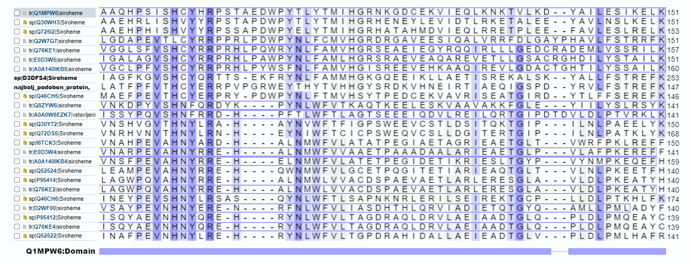

### Filogenetsko drevo:
Ko izrišemo filogenetsko drevo, vidimo, da si je naš protein najbolj soroden z proteinom iz Methanosarcine barkeri. Razlog, da nam že prej ni našlo takšnega ujemanja je, da smo za izris filogenetskega drevesa uporabili le dele proteinov, oziroma posamezne podenote ali domene, pred tem pa smo iskali po podobnosti celotnega zaoredja. Ko smo primerjai lastnosti našega proteina s tem iz M. barkeri, ki je sicer bolje anotiran, nismo našli nobenih dodatnih podatkov o proteinu, že obstoječi pa se niso razlikovali. Aktivnega mesta, posttranslacijskih modifikacij in celične lokalzacije niti ta protein ni imel določenih.

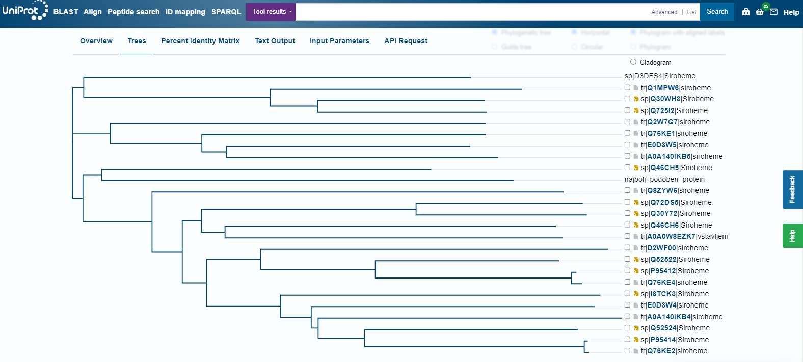

### Evkariontski protein:
Iskanje podobnega proteina v evkariontih ni bilo uspešno. Kljub iskanju po katerikoli izmed baz podatkov in spremenjennih vrednostih E, nam iskanje s pblast ni vrnilo nobenih relavantnih zadetkov. Po nadaljnjem raziskovanju smo ugotovili da ima podobno funkcijo v evkariontih encim uroporfirinogen dekarboksilaza, ki prav tako sodeluje v metabolizmu porfirinov. Podobnost ob poravnavi z vključkom in človeško uroporfirinogen dekarboksilazo je bila zelo majhna.

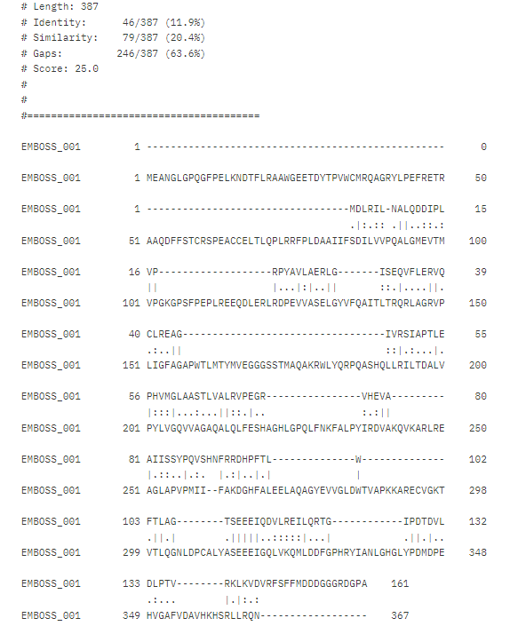

### Povezave z ostalimi proteini:
Povezanosti z drugimi proteini ali interakcij nismo našli opisanih pri nobenem izmed proteinov s podobno aktivnostjo, evkariontski sorodni protein pa se je od našega preveč razlikoval, da bi bilo smiselno uporabiti podatke za ta protein. Kljub temu spodnja slika prikazuje interakcije UROD z ostalimi proteini.

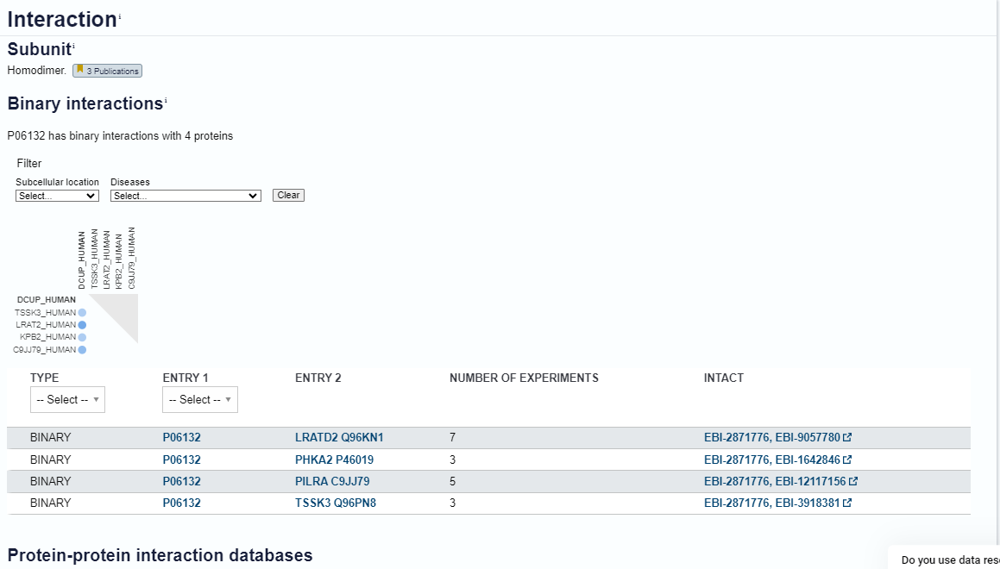

### Alphafold:
Aminokislinsko zaporedje smo vnesli v server AlphaFold3. Dobili smo strukturo, ki je bila pobarvana glede na zanesljivost. Modro obarvani deli so najbolj zanesljivi, najmanj zanesljivi pa so rdeči. Datoteko smo prenesli, da smo si protein lahko ogledali še v Chimeri.

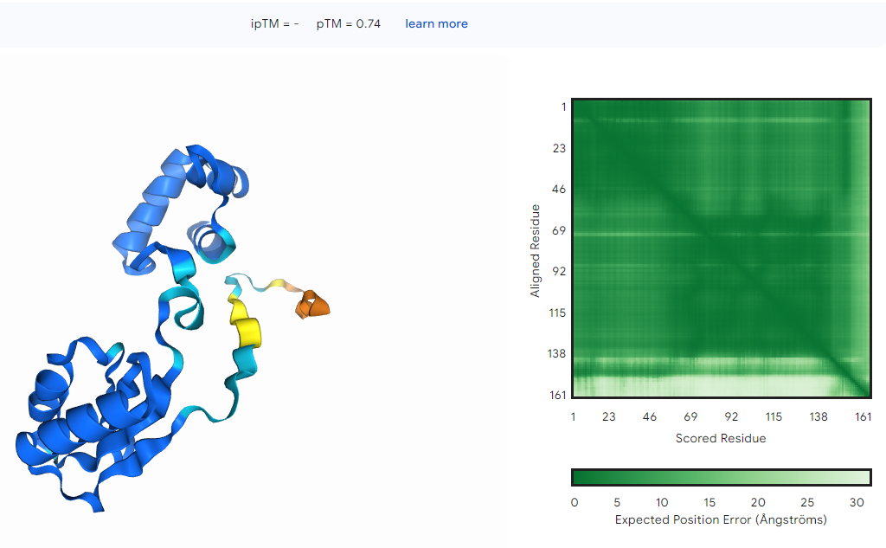

### Chimera:
Iz strukture proteina smo že takoj lahko razbrali, da protein sestavljata 2 domeni. Sestavljen je iz alfa-heliksov (oranžna) in beta plošč (modra). Vmesni predeli so obarvani cyan.

